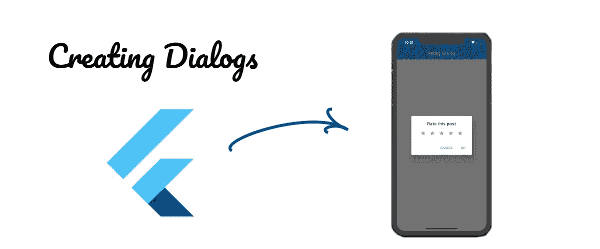
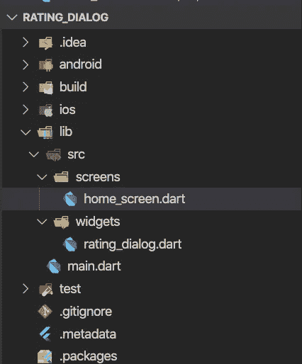

# 在 Flutter 中创建分级对话框

> 原文：<https://medium.com/analytics-vidhya/creating-a-rating-dialog-in-flutter-233da88c946b?source=collection_archive---------4----------------------->



向用户展示一些信息是一个很棒的想法，为此我们最常见的是使用对话框。在 Flutter 这个令人惊叹的 UI 工具包中，我们有一些构建对话框的方法。

在这篇文章中，我将向你展示如何使用 **AlertDialog** 小部件创建对话。我们将构建一个返回评级的评级对话框。

# **第一步:准备你的项目**

首先，您将使用命令创建一个 flutter 项目

**颤振创建**额定值 _ 对话框

正如你已经知道的，上面的命令将在名为 **rating_dialog** 的文件夹中创建一个 Flutter 项目。

让我们构建我们的项目。在 **lib** 文件夹内，我们将创建一个名为 src 的文件夹，在 src 内，我们将创建另外两个文件夹，第一个是 **widgets** ，第二个是 **screens** 。

我们的文件夹结构如下所示。



图 1 —文件夹结构

如你所见，我们在屏幕内创建了一个名为 **home_screen.dart** 的文件，在小部件内创建了一个名为 **rating_dialog.dart** 的文件。

主屏幕的内容如下所示。

注意第 20 行中的 onPressed 方法。我们使用 showDialog 函数向用户显示一个对话框，内容是一个名为 **RatingDialog()** 的小部件。

我们将在下一步实现这个小部件，并解释 showDialog()是如何工作的，但在此之前，让我向您展示我们的 **main.dart** 文件的内容。

现在我们可以专注于 RatingDialog 小部件。所以我们开始吧！

# 步骤 2:实现 RatingDialog 小部件

这个小部件将是有状态的，因为我们需要管理选择了多少星星的状态，

为此，我们将使用 AlertDialog 小部件。这个小部件创建一个预定义的对话框。在本教程中，我们将使用它们的一些属性。因此，在我们的 RatingDialog 小部件中，我们有:

```
@override
Widget build(BuildContext context) {
  return AlertDialog(
    title: Center(child: Text('Rate this post'),),
    content: Row(
      mainAxisAlignment: MainAxisAlignment.spaceEvenly,
      children: <Widget>[
        **_buildStar**(1),
        **_buildStar**(2),
        **_buildStar**(3),
        **_buildStar**(4),
        **_buildStar**(5),
      ],
  ),
    actions: <Widget>[
    FlatButton(
      child: Text('CANCEL'),
      onPressed: **Navigator.of(context).pop**,
    ), FlatButton(
      child: Text('OK'),
      onPressed: () {
        **Navigator.of(context).pop(_stars)**;
      },
     )
    ],
  );
}
```

我们使用了属性**标题**、**上下文**和**内容**。上下文将是对话框的当前上下文，标题是对话框的标题，内容是对话框的内容。

在内容中，我们添加了一个带有五个按钮的**行()**，它由一个带有**图标**子图标的**油墨池**组成。这给了我们一个类似于**开始按钮**的行为。

每个按钮都有许多星星，当点击某个按钮时，星星会改变颜色。

因此，如果用户点击第四颗星，四颗星被激活，以此类推。正如你在 **_buildStar()** 方法中看到的。

```
Widget _buildStar(int starCount) {
  return **InkWell**(
    child: Icon(
      Icons.star,
      **color: _stars >= starCount ? Colors.orange : Colors.grey**,
    ),
    **onTap**: () {
      **setState(() {
        _stars = starCount;
      });
 **   },
  );
}
```

最后，我们有一个 actions 属性，其中放置了两个按钮，一个 CANCEL 按钮和一个 OK 按钮。

在这两个按钮中，我们添加了一个 Navigator.pop。唯一不同的是，在 **OK** 按钮中，我们传递了作为 Navigator.pop 参数选择的星星数。

下面你可以看到我们的小工具的全部内容:

# **第三步:使用我们的小工具**

现在我们的小部件已经创建好了，让我们看看 **home_screen.dart** 文件中 RaisedButton 的 onPressed 方法。如果你不记得，回到第一步去看。

**showDialog** 是在 app 内容上方显示素材对话框的功能。它需要一些参数，但出于本教程的目的，我们将只使用两个。

第一个是 BuildContext，第二个是返回对话框小部件的生成器函数。查看代码片段

```
**showDialog**(
  context: context,
  builder: (_) => RatingDialog()
);
```

但是在报纸上我们有更多的信息。请注意，我们的函数是一个**异步**函数，我们在 showDialog 之前添加了一个 **await** ，并将其赋给了一个变量。

这对于得到被选中的星星的数量是很重要的。还记得 OK 按钮吗？Navigator.pop 中的参数将返回到这里。

但是取消按钮是怎么回事呢？在取消中，我们没有参数，所以返回值为空。

最后，我们对返回值进行验证，如果该值为空，则函数会停止，并返回一条指令。否则，如果验证不为空，我们将在控制台中打印星的数量。

# 摘要

我们完了。我们的评级对话框太棒了！制作和使用非常有用的内容非常简单，比如一些小部件、对话框、从对话框传递数据等等。

如您所见，我们使用 setState 来管理状态。嘿，也许你有更好的选择，比如 MobX 或 BLoC。所以，试试吧。改变这段代码，使用另一种状态管理，这将是惊人的！

就这样，再见。

# 参考

*   alert dialog—[https://API . flutter . dev/flutter/material/alert dialog-class . html](https://api.flutter.dev/flutter/material/AlertDialog-class.html)
*   有状态 vs 无状态—[https://flutter.dev/docs/development/ui/interactive](https://flutter.dev/docs/development/ui/interactive)