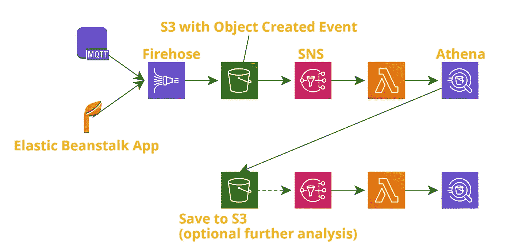

# 创建一个无服务器(几乎免费)的事件驱动的数据分析管道

> 原文：<https://medium.com/analytics-vidhya/creating-a-serverless-almost-free-event-driven-data-analytics-pipeline-with-aws-athena-s3-sns-a0815fe872eb?source=collection_archive---------16----------------------->

## 与 AWS 雅典娜，S3，SNS 和 Lambda

“大数据”分析现在风靡一时，但以如此微不足道的成本分析大量数据从未如此容易。

AWS Athena 是亚马逊的“无服务器交互式查询服务”——使用标准 SQL，数据科学家可以对存储在 S3 的大量数据进行查询(存储如此大量数据的地方非常便宜)。

有几十篇文章介绍如何开始使用 Athena 和 Glue 表(本质上是数据的模式),所以我在这里就不再赘述了。本文的重点是设计和解释一个事件驱动的、持续的分析管道，它可以随您的数据而扩展。

*先不说:我存储胶合表模式的首选格式是编写* [*协议缓冲区*](https://developers.google.com/protocol-buffers) *，并从这些缓冲区生成胶合模式。这对于在服务/语言之间传递数据非常有用。*

我将要描述的架构概述如下:

事件驱动的 Athena 分析架构

# 数据源

在本例中，我使用的数据源是一个弹性 Beanstalk 应用程序和原始 IoT MQTT 数据。

这里需要注意的重要部分是，两个服务都将它们的信息发布到支持[数据转换](https://docs.aws.amazon.com/firehose/latest/dev/data-transformation.html)的**消防软管**。这非常方便，因为它允许将不同的数据源预先格式化成符合 Glue 模式的标准化格式。还有其他几种方法可以实现这一点，但我发现一个连接到消防水管的 Lambda 是最具成本效益和最实时的。

# 数据存储

在转换成标准化格式后，数据被存储在 S3。对于中小型数据量，压缩的(GZIP) JSON 文件应该足够了，但是如果您愿意，Firehose 也支持输出到 Parquet。

S3 的定价是可笑的便宜(在我看来)，但雅典娜收费每 GB 的数据扫描，所以较小的文件(GZIP)是首选。如果数据中有大量不经常查询的列/JSON 键，那么使用 Parquet 输出格式会更有意义(因为它是列格式的，会限制扫描的数据量)。

# 事件驱动的数据分析

S3 有一个很棒的特性，它能够通知许多其他 AWS 服务各种事件，其中之一是“对象创建”。

当 Firehose 将数据“刷新”到 S3 时，该事件可以直接触发 Lambda、SNS 主题和各种其他事件。直接调用 Lambda 可能有点限制(因为只能触发一个 Lambda ),所以我推荐一个 Lambda 订阅的 SNS 主题。

Lambda 然后调用 Athena 查询。SNS 通知将包含关于添加了什么文件的信息，因此这个密钥前缀可以用来告诉 Lambda 在 Athena 中运行哪个/哪些查询。

示例:

1.  一个文件从 Firehose 添加到`raw/v0/deviceping`(来自物联网设备的心跳消息)—由于数据已在 Firehose 中缓冲，这将不是单个物联网设备，而是在缓冲间隔[最长 15 分钟]内接收的所有新心跳消息的串联
2.  Lambda 对该前缀执行查找，并知道执行查询，从而创建所有物联网设备当前电池电量的报告。
3.  该查询的输出被输出到另一个 S3 文件，例如`processed/v0/devicebattery`

# 第二层分析

这是事件驱动架构真正开始脱颖而出的地方。使用另一个**对象创建** S3 事件，上面输出的报告可用于进一步分析。

*令人恼火的是，Athena 输出了一个 CSV 文件，我发现这个文件有些局限。作为中间步骤，我调用另一个 Lambda 将 CSV 转换成 GZIPed JSON，因为 CSV 不能很好地与 Athena/Glue 的模式兼容。*

# 雅典娜双人舞

让我们假设高层喜欢图表，并希望看到上周所有物联网设备的电池电量变化的时间序列图。

为了使该图表尽可能实时，只要 Athena 输出新的设备电池报告，就可以重新生成该图表。因此，不需要每小时手动(或使用 cron)重新计算设备电池图表，如果(且仅如果)有新数据可用，图表可以重新生成！这保持了所显示数据的实时正确性，并防止在底层数据没有改变时进行无用的重新查询。

# 请给我 Python！

Athena 是一个了不起的工具，但它仅限于您可能需要的数据源的一小部分(尽管[联邦查询](https://aws.amazon.com/blogs/big-data/query-any-data-source-with-amazon-athenas-new-federated-query/)的发布可能会解决这个问题)。有时可能需要另一种工具(如 Python)来进行进一步分析。

幸运的是，这种事件驱动的架构可以轻松处理这种情况。第二层 Lambda 不是通过 Athena 调用另一个 SQL 查询，而是调用 Python Lambda 来执行任何所需的处理。

# 包扎

这篇文章仅仅强调了一个被提议的架构，我发现它非常有用而且便宜。对于那些对真实代码示例更感兴趣的人，我很乐意分享一个为上述架构生成 CloudFormation 模板的 [AWS CDK](https://github.com/aws/aws-cdk) 项目。

感谢阅读！