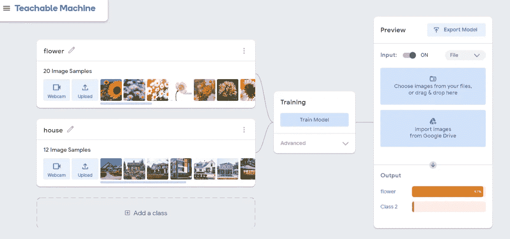
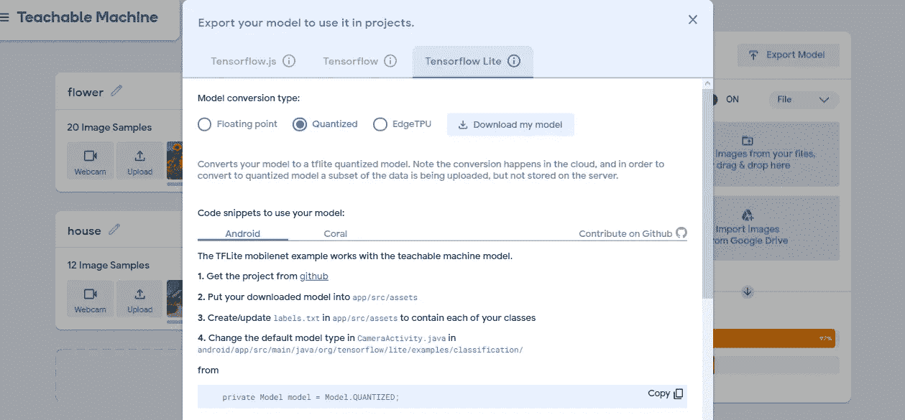

# 创建一个简单的图像分类 Android 应用程序

> 原文：<https://medium.com/analytics-vidhya/creating-a-simple-image-classification-android-app-c663b4212ce5?source=collection_archive---------4----------------------->

不知道如何编写 android 应用程序以及如何开发高端 Tensorflow 模型？别担心，我们已经帮你解决了，只要按照下面的步骤做就行了。Android 应用程序开发利用了两种主要的开发工具:

1.Tensorflow lite

2.安卓工作室

下面是任何人都可以开发这个应用程序的详细描述。开发影像分类应用程序的步骤:

**步骤 1** 准备数据集，选择至少 20 张你想要分类的物体类别的图像，然后放入不同的文件夹，你的定制数据集就准备好了。

**第二步**是去机器学习技术链接(https://teachablemachine.withgoogle.com)这是由谷歌赞助的，提供了一个简单的 GUI 方式来创建我们的 ML 模型，而不需要编写代码下一步选择图像项目，并添加您的数据集文件夹作为不同的类到其中。

**第三步**是训练机器，等待它显示模型的预览。然后选择导出模型，并在提供的 3 个选项中选择 Tensorflow Lite，然后选择浮点和量化并下载模型。

**第四步**现在要从 Github 获取 Android 代码，点击这个链接([https://Github . com/tensor flow/examples/tree/master/lite/examples/image _ classification/Android](https://github.com/tensorflow/examples/tree/master/lite/examples/image_classification/android))，克隆你想要的 app 风格。

**步骤 5** :到达此位置 [**示例**](https://github.com/tensorflow/examples)**/**[**lite**](https://github.com/tensorflow/examples/tree/master/lite)**/**[**示例**](https://github.com/tensorflow/examples/tree/master/lite/examples) **/** [**图片 _ 分类**](https://github.com/tensorflow/examples/tree/master/lite/examples/image_classification) **/** [**安卓**](https://github.com/tensorflow/examples/tree/master/lite/examples/image_classification/android)**/**[**app**](https://github.com/tensorflow/examples/tree/master/lite/examples/image_classification/android/app)

**步骤 6** 按照以下格式对齐 lables.txt 文件中的标签:

**步骤 7** 在 android studio 中打开 app 代码，在 **CameraActivity** 文件的第 101 行将返回值更改为**型号。浮点 _ 高效**。

在**分类器 FLOAT MOBILENET** 文件的第 55 行将返回值改为 **'model_unquant.tflite'**

在**分类器中。FLOAT_EFFICIENT** 文件第 53 行返回值到‘model _ un quant . TF lite’并在第 57 行返回 lables.txt。

在文件**中，分类器量化移动网络**和分类器量化定义客户端网络将返回值更改为“模型. tflite ”, 2md 返回到“标签. txt”

这就完成了我们的任务，现在要么使用模拟器或你自己的手机运行应用程序，并尝试用不同的图像和测试你的模型的准确性。这是我的结果的屏幕截图。

房屋分类

给树分类

花卉分类

这是我的应用程序的基本版本，是我开源贡献之旅的一部分，更多的变化和升级正在进行中。你可以参考这个代码作为我对项目链接的贡献的一部分:

 [## bhanvimenghani/使用英特尔 NCS-2 的盲人图像识别和分类设备

### 学生代码是一个全球性的项目，帮助学生用开源软件成长。这是一个 2 个月长的开源…

github.com](https://github.com/bhanvimenghani/Image-Recognition-and-Classification-Device-for-Blind-People-Using-Intel-NCS-2.git)