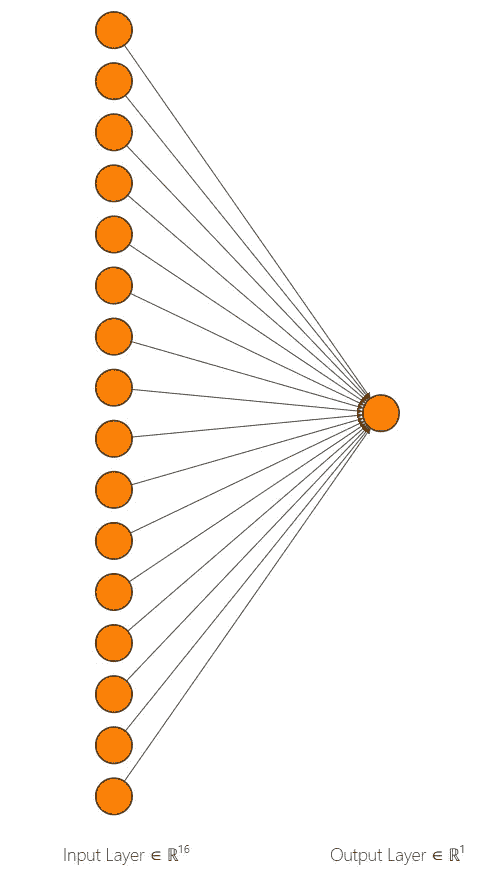

# 使用 Keras 为二元分类任务创建简单的神经网络

> 原文：<https://medium.com/analytics-vidhya/creating-a-simple-neural-network-using-keras-for-a-binary-classification-task-545757bb07a5?source=collection_archive---------4----------------------->

Keras 标志。

在本文中，我将展示如何使用 [**Keras**](https://keras.io/) **实现一个基本的**神经网络**。**

Keras 是一个非常用户友好的深度学习库，允许简单快速的原型制作。它提供了一致而简单的 API，最大限度地减少了常见用例所需的用户操作数量，并在用户出错时提供了清晰而可行的反馈。

> 对于二元分类任务，我将使用' [**皮马印第安人糖尿病数据集**](https://raw.githubusercontent.com/jbrownlee/Datasets/master/pima-indians-diabetes.csv) '。数据集的目的是基于数据集中包含的某些诊断测量结果，诊断性地预测患者是否患有糖尿病。有 768 个观察值，8 个输入变量和 1 个输出变量。

我们将首先从。txt 文件并将其转换为 NumPy 数组。这通过以下方式完成:

导入“皮马印第安人糖尿病数据集”

导入数据集后，我们必须在通过模型运行它之前做一些数据预处理。前八列存储为 **X_data，**，最后一列存储为**Y _ data。**

**X_data** 包含不同样本的八个特征， **Y_data** 包含目标变量。使用 sci-kit-learn 库中的[**train _ test _ split**](https://scikit-learn.org/stable/modules/generated/sklearn.model_selection.train_test_split.html)函数将这些变量进一步拆分为 **X_train、X_test、y_train、y_test** 。

数据预处理。

预处理之后，数据就准备好了。

现在，我们将使用 Keras 构建一个简单的神经网络。这里我使用了顺序模型。

神经网络的表示。

> 该模型的第一层包含 16 个神经元，它们从数据中获取输入，并应用 **sigmoid** 激活。第二层包含单个神经元，该神经元接收来自前一层的输入，应用**硬 s 形**激活，并给出分类输出 0 或 1。

创建顺序模型。

现在模型已经准备好了；我们会编译它。这里我用了**‘二元交叉熵损失’**和 **SGD (** [随机梯度下降](https://en.wikipedia.org/wiki/Stochastic_gradient_descent))优化器进行编译。新币的学习率为 0.5，动量为 0.9。

编译模型。

现在，我们使用 **X_train** 和 **y_train** 来训练模型并运行 100 个时期。训练完成后，在 **X_test** 和 **y_test 上对模型进行评估。**

训练和测试模型。

当评估模型时，我们得到**损失= 0.57** 和**准确度= 0.73**

> 预测最普遍类别的基准性能是大约 65%的分类准确度。最高结果实现了大约 77%的分类准确度。

与该数据集的平均结果相比，我们已经用简单的神经网络实现了相对更好的效率。更深的网络可以获得更好的精度。

> 笔记本的 Github 链接:[Intro _ to _ Keras _ basic . ipynb](https://github.com/Kaustubh-Atey/Keras-Codes-/blob/master/Intro_to_Keras_Basic.ipynb)

由 Kaustubh Atey(Kaustubh . Atey @ students . iiser Pune . AC . in)在 Google Colab 中制作