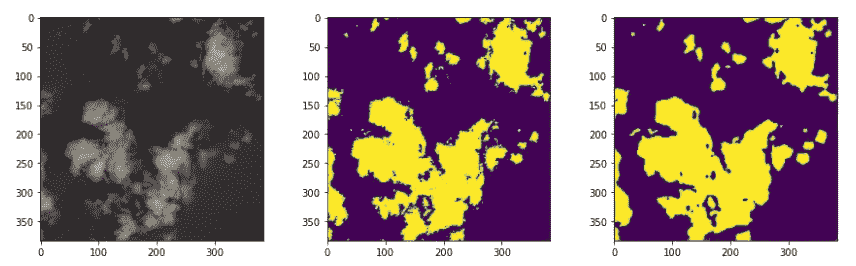

# 用 PyTorch 创建一个非常简单的 U-Net 模型用于卫星图像的语义分割

> 原文：<https://medium.com/analytics-vidhya/creating-a-very-simple-u-net-model-with-pytorch-for-semantic-segmentation-of-satellite-images-223aa216e705?source=collection_archive---------0----------------------->

云分割:RGB 图像(左)，地面真相(中)和我们的模型预测(右)。

# 介绍

在我之前的故事中([这里](/analytics-vidhya/how-to-create-a-custom-dataset-loader-in-pytorch-from-scratch-for-multi-band-satellite-images-c5924e908edf)，我展示了如何从零开始为卫星图像创建一个多通道数据集，而不使用**火炬视觉**模块。

现在，我们将继续创建一个简单的深度学习模型，用于卫星图像的语义分割和…