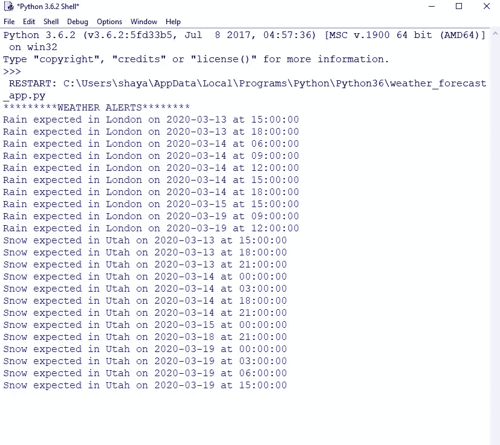
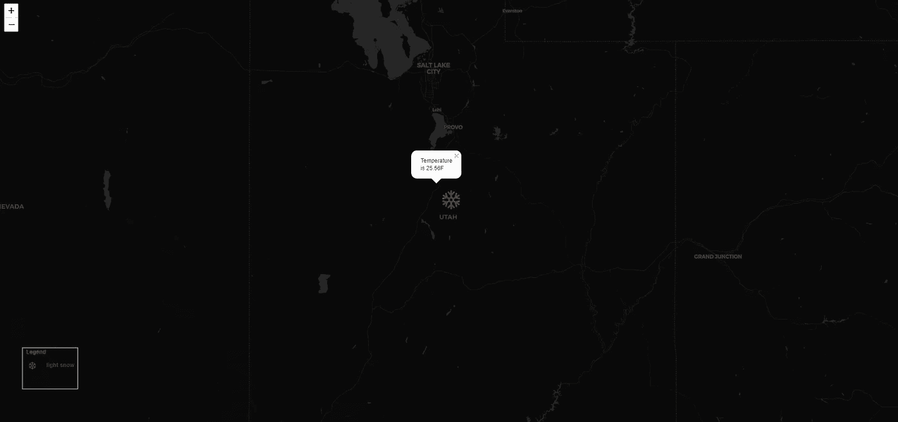
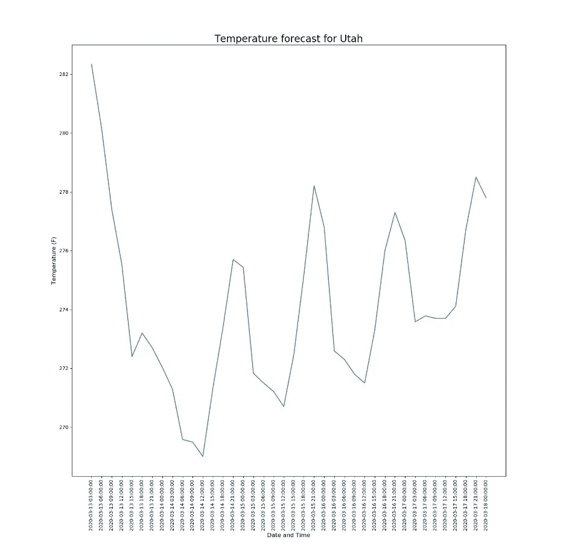
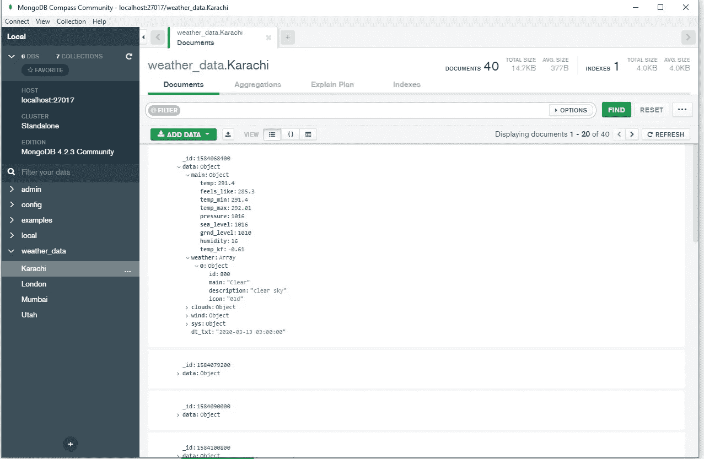

# 使用 Python 和 Openweathermap 和 MongoDB 创建天气预报应用程序

> 原文：<https://medium.com/analytics-vidhya/creating-a-weather-forecast-app-with-python-using-openweathermap-and-mongodb-d6e5858a4f69?source=collection_archive---------4----------------------->

穆罕默德·马哈茂德·哈桑拍摄于 https://www.publicdomainpictures.net/en/view-image.php?的天气预报图片 image=269235 &图片=天气预报

# 介绍

关于天气的信息是非常重要的，特别是如果你想预测天气的变化会影响到商业，如街头小贩，农业，航空，娱乐等。事先掌握天气信息可以帮助人们做好准备以避免损失。

为此，重要的是要有一个应用程序，它可以让我们了解天气警报，并可能将天气数据存储在数据库中进行分析。

在本文中，我介绍了我使用 Openweathermaps API 和 MongoDB 用 Python 编程语言创建天气预报应用程序的工作。这个应用程序下载定义的城市 5 天-3 小时的天气预报数据，在这种情况下，卡拉奇，伦敦，孟买和犹他州。它将预测数据存储在 MongoDB 中，并显示天气警报，如雪、雨或冰冻温度，如果这些城市的预测中有这些警报的话。它还为每个预报创建一个天气图，并在地图上显示天气预报。

以下是这个应用程序的重要组成部分。

**开放气象地图**

OpenWeatherMap 是一项在线服务，为分析提供当前、历史和天气预报数据。为了交流天气数据，用户必须在 https://openweathermap.org/[订阅 Openweathermap 网站，然后用户可以获得 API 访问密钥。只需从服务器 API 端点请求数据，就可以下载天气数据。数据是 JSON 格式的。](https://openweathermap.org/)

**MongoDB**

MongoDB 是一个 NoSQL 数据库，使用灵活的模式将数据存储在类似 JSON 的文档中。在这个项目中，我使用 MongoDB 来存储数据。Pymongo 是用于连接 Mongodb 和 Python 代码的库。

**叶子**

follow 构建在 Python 生态系统的数据优势和 fleet . js 库的映射优势之上。它可用于在 Python 中操作您的数据，然后通过 leav 将其可视化在活页地图上。我用它在地图上显示天气标记。

# 程序

在这个项目中，我完成了以下任务:

1.  在 https://openweathermap.org/api[创建账户](https://openweathermap.org/api)
2.  通过订阅 OpenWeatherMap 网站获取 API 访问密钥
3.  做一个多线程程序连接 API。要监控的位置应放在配置文件中
4.  一个线程下载 5 天/3 小时预报
5.  下载天气图的一个线程
6.  所有的数据应该存储在数据库(mongodb)作为单独的集合/表
7.  一个线程打开最新的天气地图，并在窗口中显示地图(应显示最后一个时间戳的最后一个图像)
8.  如果有雨/雪或冰冻温度(<2 degree Fahrenheit) in any of forecast period
9.  Display forecast/previous data from database as a graph

The following code snippet shows how to download Openweathermap API data and store it in MongoDB database and show weather alerts.

The following code snippet shows how to create a weather map with appropriate weather symbol on top of city location on map.

# **结果**)，预测线程应打印出警报

首先，我们看到的是 5 天预报中的天气警报。如果指定城市的天气预报有雨、雪或冰冻天气(【https://www.youtube.com/watch?v=8rV9k2tVWWI】T2&t = 36s

完整的代码可以在 GitHub 上找到，网址是[https://GitHub . com/shayanalibhatti/Weather _ forecast _ using _ Python _ Openweathermap _ and _ MongoDB](https://github.com/shayanalibhatti/Weather_forecast_using_Python_Openweathermap_and_MongoDB)

希望你喜欢这个项目或发现它有帮助:)

Weather Map for Utah for 19th March, 5pm

Following image shows the plot of all the weathers for Utah present in database with temperature in Fahrenheit w.r.t date and time.

Temperature forecast plot with Temperature (F) on y-axis and Date-time on x-axis

Here is how the data in MongoDB looks like. We get temperature info, weather description, wind and timestamps separated by 3 hours since it is 5 day/3-hour separated weather forecast data. For the database, timestamp is made primary key to avoid duplicate records.

# Conclusion:

In this project, I learnt to interface Mongo DB with Openweathermap API to visualize past, present and future weather forecast for analytics. I hope it will be useful to people learning about interfacing Python with Openweathermaps API and MongoDB.

A detailed explanation video of this project can be viewed on YouTube at [https://www.youtube.com/watch?v=8rV9k2tVWWI&t=36s](https://www.youtube.com/watch?v=8rV9k2tVWWI&t=36s)

Complete code is available on GitHub at [https://github.com/shayanalibhatti/Weather_forecast_using_Python_Openweathermap_and_MongoDB](https://github.com/shayanalibhatti/Weather_forecast_using_Python_Openweathermap_and_MongoDB)

Hope you liked this project or found it helpful :)