# 使用 Flutter、Java 和 AWS S3 创建相册照片应用程序

> 原文：<https://medium.com/analytics-vidhya/creating-an-album-photo-application-using-flutter-java-and-aws-s3-1d421c432b0d?source=collection_archive---------10----------------------->

这篇文章是使用 Spring Boot 的 Java 的 AWS S3 的延续。要做到这一点，你需要先阅读它，如果你不想写 Java 代码，你可以从 Github 下载该项目，下载链接在本系列的第一篇文章中。

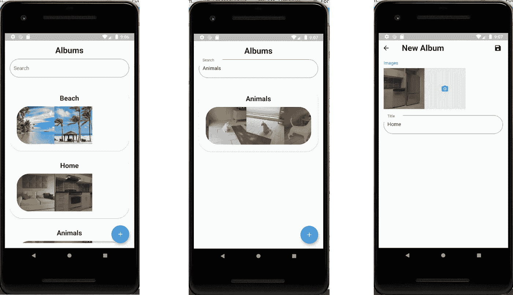

完成申请。

## 应用程序可用性

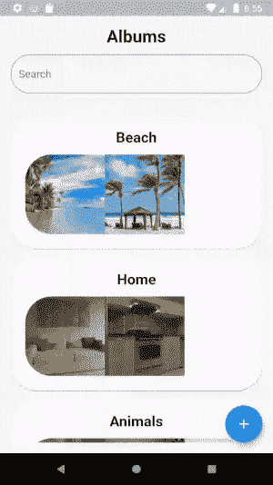

相册页面。

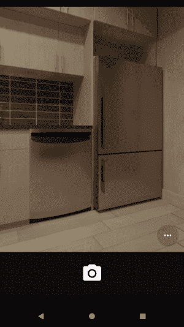

插入相册页面。

要完成此应用程序，您需要:

1.  颤振的初步知识。
2.  阅读 [AWS S3 与 Java 使用 Spring Boot](/analytics-vidhya/aws-s3-with-java-using-spring-boot-7f6fcf734aec) 和 API 运行。
3.  30 分钟编码。

**本项目使用的技术**

1.  Slidy
2.  mobx(1 . 1 . 1 版)
3.  颤振模块(1.0.0 版)
4.  Json 可序列化(3.3.0 版)
5.  颤振模型生成器(3.8.2 版)
6.  图像裁剪器(1.2.1 版)
7.  图像拾取器(v0.6.4)

## Slidy

对于这个项目，我们使用 [Slidy](https://pub.dev/packages/slidy) 。

Slidy 是一个 Flutter 的 CLI，可以很容易地从它创建项目模式，并且它包含了许多实用的依赖。

## 安装滑块

要安装它，你可以按照 pub 上的项目页面上的教程，[点击这里！](https://pub.dev/packages/slidy)

## 创建项目

首先，启动在第一篇文章中创建的 API。开始了？**好吧！**

我们去看代码。我向您展示了当我使用 Slidy，soo 编写代码时我会做什么，在 Flutter 中创建一个干净的项目运行命令:

```
flutter create photos_app
```

在你自己的 IDE 上打开项目，在我的例子中，我将使用 IntelliJ IDEA。并运行命令:

```
slidy start -f
```

对于提供商，选择默认值“颤振 _ 模块化”:

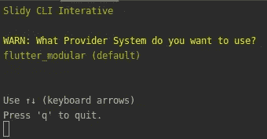

提供商选择。

状态管理器，选择 Mobx:

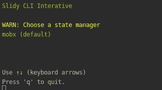

状态管理器选择。

运行:

```
flutter packages get
```

现在，Slidy 正在为我们创建项目的基本结构，运行这个之后，你的项目是这样的:

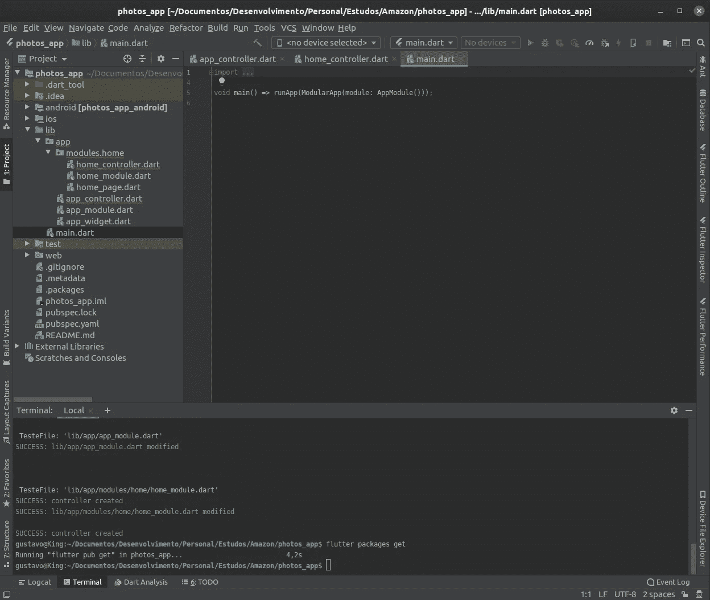

Slidy CLI 生成的项目模式。

现在你的控制器里有错误，对吗？这是因为 Mobx 需要 [flutter 构建运行器](https://dart.dev/tools/build_runner)来为我们生成代码。

但是，Slidy 为我们安装了它，现在我们需要在终端上调用命令:

```
flutter pub run build_runner watch
```

等待构建运行程序完成您的操作并发出“哔”的一声，错误就被销毁了。

## 安装依赖项

运行这些命令:

```
slidy install json_serializable
slidy install flutter_form_builder
slidy install transparent_image
slidy install image_picker
```

之后，运行:

```
flutter packages get
```

更新依赖关系。

## 对 Slidy 的理解

如果你是一个谷歌爱好者，你可以规范一下这个项目的结构，它与 Angular 最相似，你有一个 *AppModule* ，你有一个*控制器*和*视图/页面。*

Slidy 上的 Modules 是一个具有提供单例和组织代码能力的类，例如，big AppModule 是 us 应用程序上的主要模块，因为 main 方法调用它来启动 playground。

Slidy 正在考虑 **Flutter Web，**因为这种结构使用命名的路径，而不是传统的 Flutter 导航。

所以，按照这个结构，main 调用 AppModule，AppModule 上的第一个路由(“/”)调用 HomeModule，在 HomeModule 上，我们有一个页面，主页是从 HomeModule 上的路由“/”调用的。

简单不？

## 颤振知识库

是的，Slidy 使用类似于 **MVC** (模型视图控制器)的结构工作，但是它有一个特殊性，即**存储库**层。

Flutter 中的仓库是一个类，我们可以在其中调用 APIs 存储，或者更简单的，数据库。

每个数据都是从存储库中操作的，控制器有一些业务逻辑来控制视图。

## 该项目

这个项目很简单:

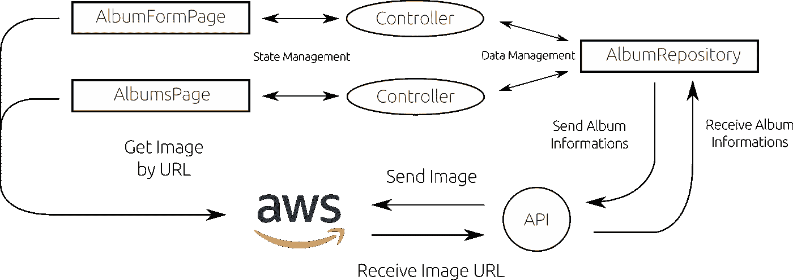

arquiteture 项目。

好吧，跟我来创造基础生活。

首先，我们需要一个相册类，这是后端为我们表示相同的类。

为此，我们需要先创建 AmazonImage 类，因为相册中有它的列表。

```
import 'package:json_annotation/json_annotation.dart';

part 'amazon_image_model.g.dart';

@JsonSerializable()
class AmazonImageModel {
  AmazonImageModel({
    this.amazonUserImageId,
    this.imageUrl
  });

  String amazonUserImageId;
  String imageUrl;

  factory AmazonImageModel.fromJson(Map<String, dynamic> json) => _$AmazonImageModelFromJson(json);
  Map<String, dynamic> toJson() => _$AmazonImageModelToJson(this);
}
```

现在，我们可以创建相册类。

```
import 'package:json_annotation/json_annotation.dart';
import 'package:photos_app/app/modules/shared/models/amazon/amazon_image_model.dart';

part 'album_model.g.dart';

@JsonSerializable()
class AlbumModel {
  AlbumModel({
    this.albumId,
    this.title,
    this.images
  });

  String albumId;
  String title;
  List<AmazonImageModel> images;

  factory AlbumModel.fromJson(Map<String, dynamic> json) => _$AlbumModelFromJson(json);
  Map<String, dynamic> toJson() => _$AlbumModelToJson(this);
}
```

现在，我们需要做存储库类，来调用后端，为此，我们需要配置 API url。

Slidy 默认使用 Dio 进行请求，Dio 有很多 util 配置给我们，比如 API 的基础 url。

为了给 Dio 提供基本的选项，我们需要在 AppModule 的绑定列表中编写一个 Dio 实例，其基本配置如下:

```
import 'package:dio/dio.dart';
import 'package:photos_app/app/app_controller.dart';
import 'package:flutter_modular/flutter_modular.dart';
import 'package:flutter/material.dart';
import 'package:photos_app/app/app_widget.dart';
import 'package:photos_app/app/modules/home/home_module.dart';

class AppModule extends MainModule {
  @override
  List<Bind> get binds => [
        Bind((i) => AppController()),
        Bind((i) => Dio(BaseOptions(
          baseUrl: 'http://{api_url}:{api_port}'
        )))
      ];

  @override
  List<Router> get routers => [
        Router('/', module: HomeModule()),
      ];

  @override
  Widget get bootstrap => AppWidget();

  static Inject get *to* => Inject<AppModule>.of();
}
```

> **记住！颤振运行在你的仿真器/电话设备上，在设备上，URL 是你的机器的精确 IP，因为你的设备上的“本地主机”调用设备。所以，当你升级你的后台时，记得在你的本地网站上公开它。(一般是)**

在我的例子中，url 是这样的:“base URL:' http://192 . 168 . 0 . 106:8080 '”

酷，现在我们需要创建一个存储库来调用 API。Slidy 有一个为我们创建基本的命令:

```
slidy generate repository modules/shared/repository/album
```

> 如果你在测试文件夹中发现错误，请删除所有错误，Slidy 会自动为我们生成测试，这不是本教程的重点。

Slidy 在提供的路径上生成一个存储库，用下面的代码修改这个存储库:

```
import 'dart:io';
import 'package:path/path.dart';

import 'package:dio/dio.dart';
import 'package:flutter_modular/flutter_modular.dart';
import 'package:photos_app/app/modules/shared/models/album/album_model.dart';
import 'package:photos_app/app/modules/shared/models/amazon/amazon_image_model.dart';

class AlbumRepository extends Disposable {
  final Dio dio;

  AlbumRepository({
    this.dio
  });

  // FindAllAlbums on Maker Resource in the backend.
  // This calls is one put because your filter, these request receive
  // an Album.class on backend to do an filter. :)
  Future<List<AlbumModel>> findAllAlbums(AlbumModel filter) async {
    // Call the backend, this method are asyncronous, than, await.
    // If any error throws an DioError. But these errors are responsibility of
    // controller to manipulate the screen state.
    Response<List> response = await dio.put('/album/search', data: filter);

    // Case success.
    if (_successResponse(response)) {
      return response.data.map<AlbumModel>((json) => AlbumModel.fromJson(json)).toList();
    } else {

      // Case error, return null.
      return null;
    }
  }

  // uploadImage send image to backend to send AWS S3.
  // This method receive an List of Images, because the
  // backend can receive an List of MultipartFile.
  Future<List<AmazonImageModel>> uploadImages(List<File> images) async {
    // Create the FormData from Dio.
    var formData = FormData();

    // Populate the formData files with the field "images"
    // Thats images for Dio is a MapEntry of String, MultipartFile,
    // easl'y no? If you builded the backend, it receive an MultipartFile like Dio can send!
    formData.files.addAll(images.map<MapEntry<String, MultipartFile>>((image) => _createMapEntryFromFile(image)));

    // Now, is easy. Call the API.
    Response<List> response = await dio.post<List>(
        '/amazon/images',
        data: formData,
        options: Options(
          headers: {
            'Content-Type': 'application/x-www-form-urlencoded'
          }
        )
    );

    // Case success.
    if (_successResponse(response)) {
      return response.data.map<AmazonImageModel>((json) => AmazonImageModel.fromJson(json)).toList();
    } else {

      // Case error, return null.
      return null;
    }

  }

  // Insert the Album.
  Future<AlbumModel> insertAlbum(AlbumModel albumModel) async {
      Response<Map> response = await dio.post('/album', data: albumModel);

      // Case success.
      if (_successResponse(response)) {
        return AlbumModel.fromJson(response.data);
      } else {

        // Case error, return null.
        return null;
      }
  }

  MapEntry<String, MultipartFile> _createMapEntryFromFile(File image) {
    return MapEntry<String, MultipartFile>('images', MultipartFile
            .*fromFileSync*(image.path, filename: basename(image.path)));
  }

  @override
  void dispose() { }

  bool _successResponse(Response response) => response.statusCode >= 200 && response.statusCode < 300;
}
```

> 我对代码进行了注释，解释我在方法上做了什么。

现在我们需要创建屏幕。

为此，请运行以下命令:

```
slidy generate module modules/album -c
```

在模块内部，生成一个附加页面:

```
slidy generate page modules/album/album_form
```

实际上，这是我的项目模式:

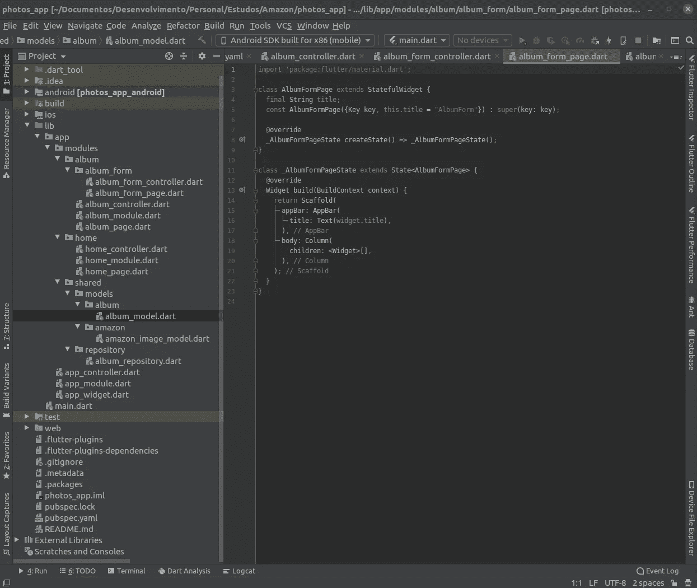

项目模式。

现在，您可以从源代码中删除 HomeModule，并将 AppModule 的主要路由更改为调用 AlbumModule。

```
import 'package:photos_app/app/modules/album/album_module.dart';
import 'package:photos_app/app/modules/shared/repository/album_repository.dart';
import 'package:dio/dio.dart';
import 'package:photos_app/app/app_controller.dart';
import 'package:flutter_modular/flutter_modular.dart';
import 'package:flutter/material.dart';
import 'package:photos_app/app/app_widget.dart';

class AppModule extends MainModule {
  @override
  List<Bind> get binds => [
        // Inject to AlbumRepository the Dio instance.
        Bind((i) => AlbumRepository(
          dio: i.get()
        )),
        Bind((i) => AppController()),
        Bind((i) => Dio(BaseOptions(baseUrl: 'http://192.168.0.106:8080')))
      ];

  @override
  List<Router> get routers => [
        Router('/', module: AlbumModule()),
      ];

  @override
  Widget get bootstrap => AppWidget();

  static Inject get *to* => Inject<AppModule>.of();
}
```

## 从基本概念开始！

为了建立这个页面，我们需要知道:“现在专辑信息在哪里？”在 arquiteture 项目之后，跟我来创建控制器，第一个控制器，AlbumController:

```
import 'package:flutter_modular/flutter_modular.dart';
import 'package:mobx/mobx.dart';
import 'package:photos_app/app/modules/shared/models/album/album_model.dart';
import 'package:photos_app/app/modules/shared/repository/album_repository.dart';

part 'album_controller.g.dart';

class AlbumController = _AlbumBase with _$AlbumController;

abstract class _AlbumBase with Store {

  AlbumRepository _albumRepository = Modular.*get*();

  List<AlbumModel> albums = [];

  // Create an enumeraiton to easl'y manage the page state.
  @observable
  AlbumState albumState = AlbumState.LOADING;

  @action
  fetchAlbums(AlbumModel filter) async {
    albumState = AlbumState.LOADING;

    albums = [];
    albums.addAll(await _albumRepository.findAllAlbums(filter));

    if (albums.length > 0) {
      albumState = AlbumState.IDLE;
    } else {
      albumState = AlbumState.NOITENS;
    }

  }

}

enum AlbumState { IDLE, LOADING, NOITENS }
```

现在，让我们为这个页面建立一个很酷的布局。

```
import 'package:flutter/material.dart';
import 'package:flutter_form_builder/flutter_form_builder.dart';
import 'package:flutter_mobx/flutter_mobx.dart';
import 'package:flutter_modular/flutter_modular.dart';
import 'package:photos_app/app/modules/album/album_controller.dart';
import 'package:photos_app/app/modules/shared/models/album/album_model.dart';
import 'package:photos_app/app/modules/shared/models/amazon/amazon_image_model.dart';
import 'package:transparent_image/transparent_image.dart';

class AlbumPage extends StatefulWidget {
  final String title;

  const AlbumPage({Key key, this.title = "Album"}) : super(key: key);

  @override
  _AlbumPageState createState() => _AlbumPageState();
}

class _AlbumPageState extends ModularState<AlbumPage, AlbumController> {

  final GlobalKey<RefreshIndicatorState> _refreshIndicatorKey = new GlobalKey<RefreshIndicatorState>();
  final GlobalKey<FormBuilderState> _searchFormBuilderKey = new GlobalKey<FormBuilderState>();

  @override
  void initState() {
    super.initState();

    controller.fetchAlbums(AlbumModel());
  }

  @override
  Widget build(BuildContext context) {
    return Scaffold(
      floatingActionButton: FloatingActionButton(
        child: Icon(Icons.*add*),
        onPressed: () async {
          await Modular.*to*.pushNamed('/form');
          controller.fetchAlbums(AlbumModel());
        },
      ),
      body: SafeArea(
        child: Column(
          children: <Widget>[
            Container(
              padding: const EdgeInsets.all(16),
              child: Column(
                children: <Widget>[
                  Text('Albums', style: TextStyle(fontWeight: FontWeight.*bold*, fontSize: 26),),
                  SizedBox(height: 12,),
                  FormBuilder(
                    onChanged: (_) {
                      controller.fetchAlbums(AlbumModel.fromJson(_searchFormBuilderKey.currentState.value));
                    },
                    key: _searchFormBuilderKey,
                    initialValue: {
                      'title': null
                    },
                    child: Column(
                      children: <Widget>[
                        FormBuilderTextField(
                          attribute: 'title',
                          maxLines: 1,
                          decoration: InputDecoration(
                            labelText: 'Search',
                            border: OutlineInputBorder(
                              borderRadius: BorderRadius.circular(40)
                            )
                          ),
                        )
                      ],
                    ),
                  )
                ],
              ),
            ),
            Expanded(
              child: Padding(
                padding: const EdgeInsets.all(16),
                child: Observer(builder: (_) {
                  if (controller.albumState == AlbumState.LOADING) {
                    return Center(
                      child: CircularProgressIndicator(),
                    );
                  } else if (controller.albumState == AlbumState.IDLE) {
                    return RefreshIndicator(
                      key: _refreshIndicatorKey,
                      onRefresh: () async {
                        _searchFormBuilderKey.currentState.reset();
                        await controller.fetchAlbums(AlbumModel());
                      },
                      child: ListView.builder(
                          itemCount: controller.albums.length, itemBuilder: (_, i) => _buildAlbumTile(controller.albums[i])),
                    );
                  } else {
                    return Container();
                  }
                }),
              ),
            ),
          ],
        ),
      ),
    );
  }

  Widget _buildAlbumTile(AlbumModel albumModel) {
    return GestureDetector(
      onTap: () {
        Modular.*to*.pushNamed('/form', arguments: albumModel);
      },
      child: Card(
        margin: EdgeInsets.only(bottom: 12),
        shape: RoundedRectangleBorder(borderRadius: BorderRadius.circular(40)),
        child: Padding(
          padding: const EdgeInsets.all(22.0),
          child: Column(
            children: <Widget>[
              Text(
                albumModel.title,
                style: TextStyle(fontSize: 22, fontWeight: FontWeight.*bold*),
              ),
              SizedBox(
                height: 12,
              ),
              Container(
                height: 120,
                child: ClipRRect(
                  borderRadius: BorderRadius.circular(40),
                  child: ListView.builder(
                    scrollDirection: Axis.horizontal,
                    itemCount: albumModel.images.length,
                    itemBuilder: (_, i) => _buildImage(albumModel.images[i]),
                  ),
                ),
              )
            ],
          ),
        ),
      ),
    );
  }

  Widget _buildImage(AmazonImageModel amazonImageModel) {
    return ClipRRect(
      child: FadeInImage.memoryNetwork(
        placeholder: kTransparentImage,
        image: amazonImageModel.imageUrl,
        fit: BoxFit.cover,
        width: 120,
        height: 120,
      ),
    );
  }
}
```

简单的美妆页面！

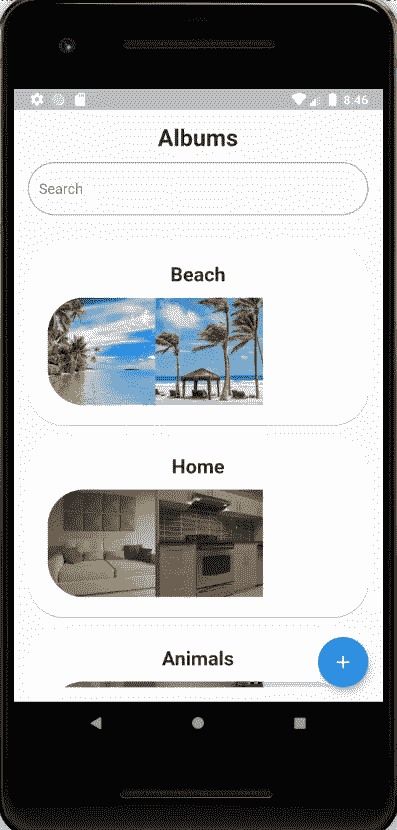

AlgumPage 小部件。

现在，让我们创建 AlbumFormController。

```
import 'dart:io';

import 'package:flutter_modular/flutter_modular.dart';
import 'package:mobx/mobx.dart';
import 'package:photos_app/app/modules/shared/models/album/album_model.dart';
import 'package:photos_app/app/modules/shared/repository/album_repository.dart';

part 'album_form_controller.g.dart';

class AlbumFormController = _AlbumFormBase with _$AlbumFormController;

abstract class _AlbumFormBase with Store {

  // Get Repository Instance
  AlbumRepository _albumRepository = Modular.*get*();

  // Simple logic to check if is editing or is insert new Album.
  AlbumModel savedAlbum;
  setSavedAlbum(AlbumModel albumModel) => savedAlbum = albumModel;

  // State Management
  @observable
  AlbumFormState albumFormState = AlbumFormState.IDLE;

  // Save Album
  @action
  saveAlbum(Map<String, dynamic> form) async {
    // Set state to Loading to disable form and save button.
    albumFormState = AlbumFormState.LOADING;

    // Capture typed fields from form.
    List images = form['images'] as List;
    String title = form['title'] as String;

    // Get images to send to Amazon.
    List<File> imageNotSaved = images.where((image) => image is File).whereType<File>().toList();
    if (savedAlbum == null) {

      // New Album
      AlbumModel albumModel = AlbumModel(
        // First, upload images to Amazon.
        images: await _albumRepository.uploadImages(imageNotSaved),
        title: title
      );

      // Save Album
      await _albumRepository.insertAlbum(albumModel);
      Modular.*to*.pop();
      albumFormState = AlbumFormState.IDLE;
    } else {
      // *TODO: Update Album Here* }
    albumFormState = AlbumFormState.IDLE;
  }

}

enum AlbumFormState { IDLE, LOADING }
```

太棒了，现在，我们需要为图像创建一个 CustomFormBuilderField。

创建一个名为 ImageSourceSheet 的小部件，如下所示:

```
import 'dart:io';

import 'package:flutter/material.dart';
import 'package:image_picker/image_picker.dart';

class ImageSourceSheet extends StatelessWidget {

  final Function(File) onImageSelected;

  ImageSourceSheet({ @required this.onImageSelected });

  void imageSelected(File image) async {
    if (image != null) {
      onImageSelected(image);
    }
  }

  @override
  Widget build(BuildContext context) {
    return Container(
      child: Wrap(
        children: <Widget>[
          ListTile(
            leading: Icon(Icons.*camera_enhance*),
            title: Text('Camera'),
            onTap: () async {
              File image = await ImagePicker.*pickImage*(source: ImageSource.camera);
              imageSelected(image);
            },
          ),
          ListTile(
            leading: Icon(Icons.*image*),
            title: Text('Gallery'),
            onTap: () async {
              File image = await ImagePicker.*pickImage*(source: ImageSource.gallery);
              imageSelected(image);
            },
          )
        ],
      ),
    );
  }
}
```

有了这个小部件，我们就有了这个很酷的“图像拾取器”:

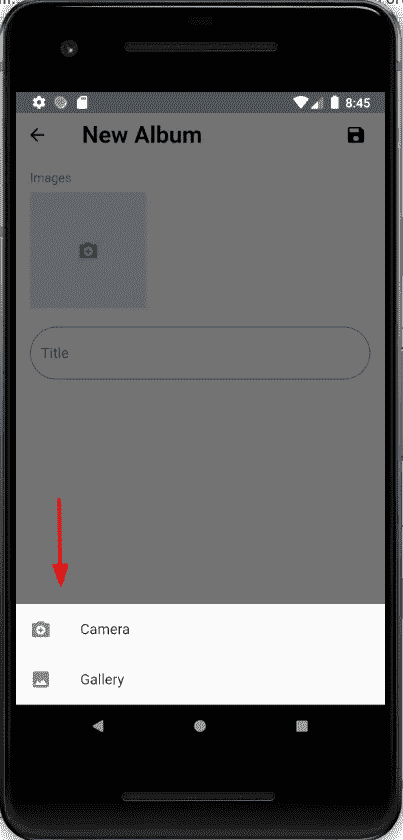

ImageSourceSheet 小工具。

现在，创建一个 FormBuilderImageField，如下所示:

```
import 'package:flutter/material.dart';
import 'package:flutter_form_builder/flutter_form_builder.dart';
import 'package:photos_app/app/modules/album/album_form/image_source_sheet.dart';

class FormBuilderImageField extends StatefulWidget {
  final String attribute;
  final List<FormFieldValidator> validators;
  final List initialValue;
  final bool readOnly;
  final String labelText;
  final ValueTransformer valueTransformer;
  final ValueChanged onChanged;

  final double imageWidth;
  final double imageHeight;
  final EdgeInsets imageMargin;
  final FormFieldSetter onSaved;

  const FormBuilderImageField({
    Key key,
    @required this.attribute,
    this.initialValue,
    this.validators = const [],
    this.valueTransformer,
    this.labelText,
    this.onChanged,
    this.imageWidth = 130,
    this.imageHeight = 130,
    this.imageMargin,
    this.readOnly = false,
    this.onSaved
  }) : super(key: key);

  @override
  _FormBuilderImageFieldState createState() => _FormBuilderImageFieldState();
}

class _FormBuilderImageFieldState extends State<FormBuilderImageField> {
  bool _readOnly = false;
  List _initialValue;
  final GlobalKey<FormFieldState> _fieldKey = GlobalKey<FormFieldState>();
  FormBuilderState _formState;

  @override
  void initState() {
    _formState = FormBuilder.*of*(context);
    _formState?.registerFieldKey(widget.attribute, _fieldKey);
    _initialValue = List.of(widget.initialValue ??
        (_formState.initialValue.containsKey(widget.attribute)
            ? _formState.initialValue[widget.attribute]
            : []));
    super.initState();
  }

  @override
  void dispose() {
    _formState?.unregisterFieldKey(widget.attribute);
    super.dispose();
  }

  @override
  Widget build(BuildContext context) {
    _readOnly = (_formState?.readOnly == true) ? true : widget.readOnly;

    return FormField<List>(
      key: _fieldKey,
      enabled: !_readOnly,
      initialValue: _initialValue,
      validator: (val) {
        for (int i = 0; i < widget.validators.length; i++) {
          if (widget.validators[i](val) != null)
            return widget.validators[i](val);
        }
        return null;
      },
      onSaved: (val) {
        var transformed;
        if (widget.valueTransformer != null) {
          transformed = widget.valueTransformer(val);
          _formState?.setAttributeValue(widget.attribute, transformed);
        } else
          _formState?.setAttributeValue(widget.attribute, val);
        if (widget.onSaved != null) {
          widget.onSaved(transformed ?? val);
        }
      },
      builder: (state) => Column(
        crossAxisAlignment: CrossAxisAlignment.start,
        children: <Widget>[
          Text(
            widget.labelText != null ? widget.labelText : 'Images',
            style: TextStyle(
              color: Theme.*of*(context).primaryColor
            ),
          ),
          SizedBox(
            height: 8,
          ),
          Container(
            height: widget.imageHeight,
            child: ListView(
              scrollDirection: Axis.horizontal,
              children: state.value.map<Widget>((item) {
                return Container(
                  width: widget.imageWidth,
                  height: widget.imageHeight,
                  margin: widget.imageMargin,
                  child: GestureDetector(
                    child: item is String ?
                      Image.network(item, fit: BoxFit.cover) :
                      Image.file(item, fit: BoxFit.cover),
                    onLongPress: () {
                      state.didChange(state.value..remove(item));
                    },
                  ),
                );
              }).toList()
                ..add(
                  GestureDetector(
                    child: Container(
                      width: widget.imageWidth,
                      height: widget.imageHeight,
                      child: Icon(
                        Icons.*camera_enhance*,
                        color: Theme.*of*(context).primaryColor,
                      ),
                      color: Theme.*of*(context).primaryColor.withAlpha(50),
                    ),
                    onTap: () {
                      showModalBottomSheet(context: context, builder: (_) {
                        return ImageSourceSheet(
                          onImageSelected: (image) {
                            state.didChange(state.value..add(image));
                            Navigator.*of*(context).pop();
                          },
                        );
                      });
                    },
                  )
                )
            ),
          ),
          state.hasError
              ? Text(
            state.errorText,
            style: TextStyle(color: Colors.*red*, fontSize: 12),
          ) : Container()
        ],
      ),
    );
  }
}
```

很好，就是这个组件:

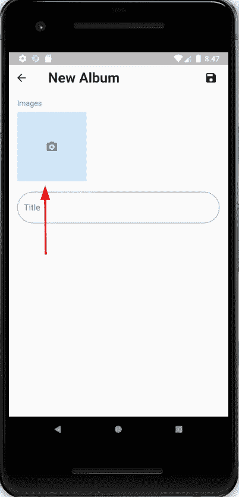

FormBuilderImageField 小部件。

现在，像这样创建您的相册表单页面:

```
import 'package:flutter/material.dart';
import 'package:flutter_form_builder/flutter_form_builder.dart';
import 'package:flutter_mobx/flutter_mobx.dart';
import 'package:flutter_modular/flutter_modular.dart';
import 'package:photos_app/app/modules/album/album_form/album_form_controller.dart';
import 'package:photos_app/app/modules/album/album_form/form_builder_image_field.dart';
import 'package:photos_app/app/modules/shared/models/album/album_model.dart';

class AlbumFormPage extends StatefulWidget {
  final AlbumModel savedAlbum;

  const AlbumFormPage({Key key, this.savedAlbum}) : super(key: key);

  @override
  _AlbumFormPageState createState() => _AlbumFormPageState();
}

class _AlbumFormPageState extends ModularState<AlbumFormPage, AlbumFormController> {
  AlbumModel _value;
  Map<String, dynamic> _initialValue;

  final GlobalKey<FormBuilderState> _albumFormBuilderKey = new GlobalKey<FormBuilderState>();

  @override
  void initState() {
    _value = widget.savedAlbum;
    controller.setSavedAlbum(_value);

    if (_value != null) {
      _initialValue = {
        'albumId': _value.albumId,
        'images': _value.images.map<String>((image) => image.imageUrl).toList(),
        'title': _value.title
      };
    } else {
      _initialValue = {
        'albumId': null,
        'title': null,
        'images': []
      };
    }

    super.initState();
  }

  @override
  Widget build(BuildContext context) {
    return Scaffold(
      body: SafeArea(
        child: Column(
          children: <Widget>[
            Row(
              children: <Widget>[
                IconButton(
                  icon: Icon(Icons.*arrow_back*),
                  onPressed: () {
                    Modular.*to*.pop();
                  },
                ),
                Padding(
                  padding: const EdgeInsets.only(left: 26),
                  child: Text(
                    'New Album',
                    style: TextStyle(fontWeight: FontWeight.*bold*, fontSize: 26),
                  ),
                ),
                Expanded(
                  child: Padding(
                    padding: const EdgeInsets.only(right: 8.0),
                    child: Observer(
                      builder: (_) => Align(
                        alignment: Alignment.*centerRight*,
                        child: IconButton(
                          icon: Icon(Icons.*save*),
                          onPressed: controller.albumFormState == AlbumFormState.LOADING ? null : () {
                            if (_albumFormBuilderKey.currentState.saveAndValidate()) {
                              controller.saveAlbum(_albumFormBuilderKey.currentState.value);
                            }
                          },
                        ),
                      ),
                    ),
                  ),
                )
              ],
            ),
            Expanded(
              child: ListView(
                padding: const EdgeInsets.all(16),
                children: <Widget>[
                  Observer(
                    builder: (_) => FormBuilder(
                      readOnly: controller.albumFormState == AlbumFormState.LOADING,
                      key: _albumFormBuilderKey,
                      initialValue: _initialValue,
                      child: Column(
                        children: <Widget>[
                          FormBuilderImageField(
                            attribute: 'images',
                            validators: [
                              (images) {
                                if (images is List) {
                                  if (images.isEmpty) {
                                    return 'Images are required.';
                                  }
                                }
                                return null;
                              }
                            ],
                          ),
                          SizedBox(
                            height: 20,
                          ),
                          FormBuilderTextField(
                            maxLines: 1,
                            attribute: 'title',
                            decoration: InputDecoration(
                                labelText: 'Title',
                                border: OutlineInputBorder(
                                    borderRadius: BorderRadius.circular(40)
                                )
                            ),
                            validators: [
                              FormBuilderValidators.*required*(),
                              FormBuilderValidators.*maxLength*(64)
                            ],
                          ),
                        ],
                      ),
                    ),
                  )
                ],
              ),
            )
          ],
        ),
      ),
    );
  }
}
```

我写了控制器来解释这个屏幕的状态管理，但是很简单。

这是我现在的项目模式:

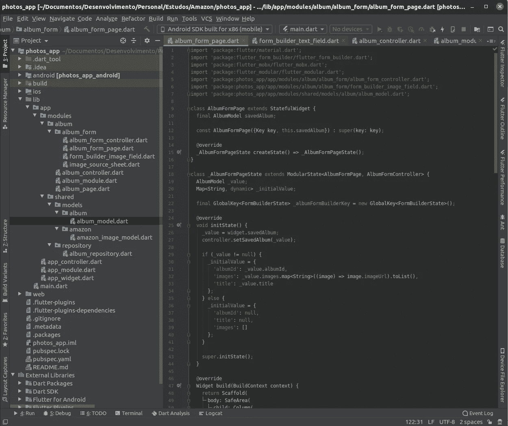

项目模式。

酷！
申请完成。

但是我有一个挑战给你。我没有在这个项目中实现用户更新你的相册的可能性，这是你的挑战。

你需要更换控制器，因为我做了一个错误的编辑行为。

**该项目的链接:**[https://github.com/gustavovitor/photo_app](https://github.com/gustavovitor/photo_app)

如果您对此有任何疑问，请在我的 [LinkedIn](https://www.linkedin.com/in/gustavo-m-369a3011b/) 上发表评论或发送私信。

如果您发起挑战，请在 GitHub 上发送:)