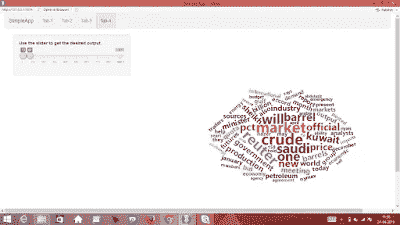

# 使用 R-Shiny 创建应用程序

> 原文：<https://medium.com/analytics-vidhya/creating-an-app-using-r-shiny-587f925f487f?source=collection_archive---------0----------------------->

# 使用 R-shiny 创建应用程序。

在直接创建应用程序之前，让我们看看如何在 R 中安装和包含包。你可以从[这里](https://www.rstudio.com/products/rstudio/download/)下载 R-studio。

# 在 R:中安装软件包

您可以在两个 was 中安装软件包:

1.  通过编写***install . packages(" name _ of _ the _ package ")***例如:如果你想安装 wordcloud2 软件包，那么你必须编写**install . packages(" word cloud 2 ")**。
2.  打开 R-studio，进入工具->安装包。

我们将使用基本功能创建一个非常基本的应用程序，只是为了了解 Rshiny 的工作原理。

让我们从安装一些包开始。我不是我

## install.packages("闪亮")

## install . packages(" shiny dashboard ")

## install.packages("shinyWidgets ")

## install.packages("shinythemes ")

## install.packages("htmlwidgets ")

## install.packages("wordcloud2 ")

## install.packages("ggplot2 ")

既然您已经成功地安装了软件包，让我们将它们包含在代码中以供将来使用。

记住仅仅安装软件包是不行的。你必须使用 ***【包名】*** 或者 ***require(包名)。***

图书馆(闪亮)

图书馆(仪表板)

库(shinyWidgets)

图书馆(shinythemes)

库(html 小部件)

图书馆(wordcloud2)

库(ggplot2)

图书馆(大众)

编码时间到了！

创建一个闪亮的应用程序需要三个功能:

> **ui < - shinyUI( )**
> 
> **服务器=功能(输入，输出){ }**
> 
> **shinyApp(ui，服务器)**

让我们首先创建大纲:

*   我们想要 4 个标签。
*   我们想包括一些单选按钮。
*   我们想添加一些图像。
*   我们想要一些情节。
*   我们想要 wordcloud。
*   我们可能也想改进它的外观和感觉。

首先，让我们给我们的应用程序一个名字，即简单应用程序。 **shinyUI ()** 基本上是为了让我们的 app 好看。你可以插入主题，改变背景颜色，添加按钮等。

> **ui<-shinyUI(navbarPage(title = " simple app "))**

navbarPage()用于创建一个导航栏。它可以包含多个选项卡。我们将在其中插入 4 个选项卡。

> **ui<-shinyUI(navbarPage(title = " simple app "，**
> 
> **tabPanel("Tab-1 ")，**
> 
> **选项卡面板(" Tab-2 ")，**
> 
> **选项卡面板(" Tab-3 ")，**
> 
> **Tab panel(" ta B- 4 "))**

现在让我们关注 Tab-1，它也是我们应用程序的主页。

> **tabPanel("Tab-1 "，fluidRow(h1("欢迎来到 SimpleApp 的主页")**

> **tabPanel("Tab-1 "，**
> 
> **fluidRow(h1("欢迎来到 SimpleApp 的主页")，**
> 
> **框(title="SimpleApp left box "，width= 6，**
> 
> **p("这部分主页包含文本格式的数据。这个文本数据完全是随机的。”)**

我在 **p()中添加了一些额外的文本。现在看起来很乱。让我们通过添加以下内容来证明它**

> **p("这部分主页包含文本格式的数据。这个文本数据完全是随机的。”，style = "text-align : justify")**

你一定想知道为什么它只占了页面的一半。那是因为我们使用了**箱(…..宽度=6，……).**您可以根据需要更改文本的宽度。我选择宽度=6，因为我将在下半年添加一些图像。

> **框(title = "SimpleApp 右框"，**
> 
> **img(src='pizza.jpg '，align = "center "，width="100% "，height ="450px ")，**
> 
> **img(src='burger.jpg '，align = "center "，width="100% "，height ="350px"))**

在 R 脚本所在的目录下创建一个文件夹“www”。把所有的图像都放进去。

因此，Tab-1 的完整代码将如下所示:

> **tabPanel("Tab-1 "，fluidRow(h1("欢迎来到 SimpleApp 的主页")，**
> 
> **框(title="SimpleApp left box "，width= 6，**
> 
> **p("这部分主页包含文本格式的数据。这个文本数据完全是随机的。”，style = "text-align : justify "))，**
> 
> **框(title = "SimpleApp 右框"，**
> 
> **img(src='pizza.jpg '，align = "center "，width="100% "，height ="450px ")，**
> 
> **img(src='burger.jpg '，align = "center "，width="100% "，height ="350px")**
> 
> **)))，**

同样，我们想在 **Tab-2 中展示一些情节。**

为此，我使用了已经在 R-studio 中预置的三个数据集(我们将在应用程序的服务器部分看到它们)。您可以通过导入**库(MASS)** ，然后输入**数据()来检查更多数据集。**您将能够看到数据集列表。

> **tabPanel("Tab-2 "，
> br()，
> sidebar layout(sidebar panel(
> radio buttons(" radio 2 "，" Select the food category "，
> list("Indian"="ind "，" Chinese"="chi "，" Japanese " = " jap))))，
> main panel(verbatimTextOutput(" text 2 ")
> ))，**

***单选 2*** 是单选按钮的用户自定义 id。

***【verbatimTextOutput()****是预定义的，用来在页面上显示文本。*

****text2*** 也是用户自定义 id。*

> ***选项卡面板(" Tab-3 "，***
> 
> ***br()，***
> 
> ***sidebar layout(sidebar panel(***
> 
> ***单选按钮(" radio3 "，"选择您想要查看绘图的类别"，列表(" Cars data"= "cd "，***
> 
> ***"航空乘客数据" ="ap "，***
> 
> ***“Co2 摄取量”=“co”))，***
> 
> ***主面板(plotOutput("plot3"))***
> 
> ***))，***

*标签用于在标签标题后留出一点垂直空间。**list(" item _ name " = " item _ id ")**用于给物品一个唯一的标识。今后，我们将只使用 id，而不是整个项目名称。在上面的代码中，“Cars data”是项目名称，“cd”是其 id，“radio3”是 radioButtons()的 id*

**radio3* 是单选按钮的用户定义 id。*

**plotOutput( )* 是预定义的，用于显示图表、直方图等。*

**plot3* 是 plotOutput()的用户定义 id*

> ***选项卡面板(" Tab-4 "，***
> 
> ***边栏面板(***
> 
> ***sliderInput("slider4 "，"使用滑块获得想要的输出"，min =1，max = nrow(demoFreq)，value=c(10，80)))，***
> 
> ***mainPanel(column(12，wordcloud2Output("word4 "，height="700px "，width = " 950 px "))***
> 
> ***)***

*在 **Tab-4 中，**我们包含了一个单词云(字面意思是单词云)。Ans 这里使用的数据是 demoFreq(已经存在于 R-studio 中)。*

**slider4* 是 sliderInput 的用户定义 id*

**wourdcloud2Output( )* 是预定义的，用于显示词云。*

**word4* 是 wordcloud 的用户自定义 id*

*我们已经完成了应用程序的用户界面部分。*

*让我们转到服务器部分。server( ) 就像任何闪亮应用的大脑。所有的计算都在服务器( )中完成。它进行计算，并将计算结果返回给 shinyUI()，后者在页面上显示输出。server( input，output)意味着它有两个参数，接受输入并返回输出。正如我们之前所讨论的，我们将在以后的操作中使用唯一的 id。*

> ***服务器=功能(输入，输出){***
> 
> ***输出$text2 < - renderPrint({***
> 
> ***if(input $ radio 2 = = " ind "){***
> 
> ***打印(“您选择了第一选择，即印度菜”)***
> 
> ***}***
> 
> ***if(input $ radio 2 = = " chi "){***
> 
> ***打印(“您选择了第二选择，即中餐”)***
> 
> ***}***
> 
> ***if(input $ radio 2 = = " jap "){***
> 
> ***打印(“您选择了第三选择，即日本料理”)***
> 
> ***}***
> 
> ***})***

*让我们看看上面的代码告诉我们什么。*

**output $ text2<-renderPrint({ })*意味着我们要在 render print()中做的任何计算都将被分配为“text 2”的输出。现在，您可能还记得“text2”是我们在 UI 部件中提供的用于显示文本的惟一 id。*

*我们在单选按钮中有三个选项——“印度”、“中国”、“日本”，分别带有它们各自的 id——“ind”、“chi”、“jap”。*

*我们已经知道“radio2”是 Tab-2 中单选按钮的 id*

**if(input$radio2 =="ind")**

*上面的 *if* 条件是检查我们是否选择了第一个单选按钮。它将 radiobutton 的 id 与选项进行映射，并相应地显示输出。*

**

*同样，在 Tab-3 中，我们可以做同样的事情。*

> ***输出$plot3 < - renderPlot({***
> 
> ***if (input$radio3 == 'cd'){***
> 
> ***剧情(汽车)***
> 
> ***}***
> 
> ***if(input $ radio 3 = = " AP "){***
> 
> ***剧情(空中乘客)***
> 
> ***}***
> 
> ***if(input $ radio 3 = = " co "){***
> 
> ***地块(二氧化碳)***
> 
> ***}})***

******

*对于 Tab-4，*

> ***输出$ word 4<-render word cloud 2({***
> 
> ***word cloud 2(demo freq[min(input $ slider 4):max(input $ slider 4)，]，size=.3)***
> 
> ***})***

**

*如果需要，您可以移除[min (…。):max(…..)]从 wordcloud2()，那么它将始终显示完整的 wordcloud 每次你运行应用程序，没有添加滑块的点。*

**demoFreq[min( input$slider4):max(input$slider4)]*表示您想要显示包含从 min(input $ slider 4)到 max(input $ slider 4)的行的 demo freq 的 wordcloud。*

*每次用户改变滑块时，这些值都会改变。默认情况下，它会从第 10 行到第 80 行显示 demoFreq 的 wordcloud。*

*使用滑块，看一看 wordcloud。*

*如果你想要完整的脚本，你可以点击[这里](https://github.com/ankitsongara/SimpleApp)。您可能需要安装一些额外的软件包。运行它。如果你有任何困难，给我发信息。*

*谢谢！！*