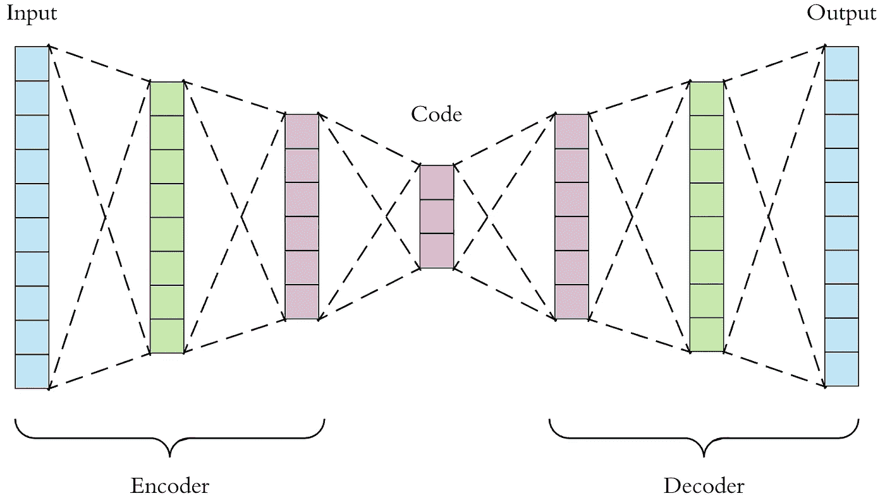

# 用 PyTorch 创建自动编码器

> 原文：<https://medium.com/analytics-vidhya/creating-an-autoencoder-with-pytorch-a2b7e3851c2c?source=collection_archive---------5----------------------->



自动编码器架构

自动编码器是创建更复杂数据的简单表示的基础。他们使用一种著名的编码器-解码器架构，允许网络获取数据的关键特征。如果你是自动编码器的新手，并且想了解更多，我推荐你阅读这篇关于自动编码器的文章:[https://towards data science . com/applied-deep-learning-part-3-auto encoders-1c 083 af 4d 798](https://towardsdatascience.com/applied-deep-learning-part-3-autoencoders-1c083af4d798)

在本文中，我们将实现一个自动编码器，并使用 PyTorch，然后将该自动编码器应用于来自 MNIST 数据集的图像。

# 进口

对于这个项目，您将需要一个内置的 Python 库:

```
import os
```

您还需要以下技术库:

```
import numpy as np                       
import torch                       
import torchvision                       
from torch import nn                       
from torch.autograd import Variable                       
from torchvision.datasets import MNIST                       
from torchvision.transforms import transforms                       from torchvision.utils import save_image                       import matplotlib.pyplot as plt
```

# 自动编码器类 __init__

对于自动编码器类，我们将扩展 nn。模块类，并具有以下标题:

```
class Autoencoder(nn.Module):
```

## __init__ 方法头

对于 init，我们将有我们想要训练的纪元数量、数据的批量大小和学习速率的参数。方法标题应该如下所示:

```
def __init__(self, epochs=100, batchSize=128, learningRate=1e-3):
```

然后我们要调用超级方法:

```
super(Autoencoder, self).__init__()
```

## 初始化网络参数

对于这个网络，我们只需要初始化纪元、批量大小和学习速率:

```
self.epochs = epochs                               
self.batchSize = batchSize                               self.learningRate = learningRate
```

## 编码器网络架构

出于模块化的目的，编码器网络架构将全部位于 init 方法中。对于编码器，我们将有 4 个线性层，每个层中的节点数量都随着**的减少而减少。我们还将使用 3 个 ReLU 激活函数。考虑到这一点，我们的编码器网络将如下所示:**

```
self.encoder = nn.Sequential(nn.Linear(784, 128),                                                            nn.ReLU(True),                                                            nn.Linear(128, 64),                                                            nn.ReLU(True),                                                            nn.Linear(64, 12),                                                            nn.ReLU(True),                                                            nn.Linear(12, 3))
```

## 解码器网络架构

解码器网络架构也将位于 init 方法中。对于解码器，我们将使用一个非常相似的架构，具有 4 个线性层，每层中的节点数量增加**。我们还将使用 3 个 ReLU 激活函数以及 1 个 tanh 激活函数。考虑到这一点，我们的解码器网络将如下所示:**

```
self.decoder = nn.Sequential(nn.Linear(3, 12),                                                            nn.ReLU(True),                                                            nn.Linear(12, 64),                                                            nn.ReLU(True),                                                            nn.Linear(64, 128),                                                            nn.ReLU(True),                                                            nn.Linear(128, 784),                                                            nn.Tanh())
```

## 数据和数据加载器

用于训练数据的数据和数据加载器将保存在 init 方法中。我们还将使用 PyTorch 库中的转换器将图像归一化并转换为张量。

```
self.imageTransforms = transforms.Compose([ transforms.ToTensor(),                                   transforms.Normalize([0.5], [0.5]) 

]) self.data = MNIST('./Data', transform=self.imageTransforms)self.dataLoader = torch.utils.data.DataLoader(dataset=self.data,                                                                             batch_size=self.batchSize,                                                                             shuffle=True)
```

## 优化器和标准

对于这个网络，我们将使用 Adams 优化器和 MSE 损失作为损失函数。

```
self.optimizer = torch.optim.Adam(self.parameters(), lr=self.learningRate, weight_decay=1e-5)self.criterion = nn.MSELoss()
```

## 完成自动编码器 __init__

完整的自动编码器初始化方法可以定义如下

# 正向方法

正向方法将通过数组 x 获取数字表示的图像，并通过编码器和解码器网络进行馈送。它可以非常简单地定义为:

# 训练模型方法

对于此方法，我们将有以下方法头:

```
def trainModel(self):
```

然后，我们将根据纪元的数量重复训练过程:

```
for epoch in range(self.epochs):
```

然后，我们需要使用以下方法遍历数据加载器中的数据:

```
for data in self.dataLoader:
```

我们需要将图像数据初始化为一个变量，并使用以下方法对其进行处理:

```
image, _ = data                                       
image = image.view(image.size(0), -1)                                       image = Variable(image)
```

最后，我们需要输出预测，根据我们的标准计算损失，并使用反向传播。这可以非常简单地通过以下方式实现:

```
# Predict
output = self(image)

# Loss                                   
loss = self.criterion(output, image) # Back propagation                                                                          self.optimizer.zero_grad()                                       loss.backward()                                       self.optimizer.step()
```

然后，我们可以打印训练过程使用的损失和时期:

```
print('epoch [{}/{}], loss:{:.4f}'                                         .format(epoch + 1, self.epochs, loss.data))
```

完整的训练方法应该是这样的:

# 测试图像方法

最后，我们可以使用我们新创建的网络来测试我们的自动编码器是否真正工作。我们可以编写这个方法，使用数据中的一个样本图像来查看结果:

# 主要方法

对于 main 方法，我们首先需要初始化一个自动编码器:

```
model = Autoencoder()
```

然后我们需要训练网络:

```
model.trainModel()
```

然后，我们需要创建一个新的张量，它是基于 MNIST 随机图像的网络输出。我们还需要重塑图像，以便我们可以查看它的输出。为了简单起见，我将使用的索引是 7777。

```
tensor = model.testImage(7777)
tensor = torch.reshape(tensor, (28, 28))
```

然后，我们需要创建一个 toImage 对象，然后我们可以通过它传递张量，这样我们就可以真正地查看图像。我们也可以事后保存图像:

```
toImage = torchvision.transforms.ToPILImage()
image = toImage(tensor)
image.save('After.png')
```

我们完整的 main 方法应该是这样的:

# 自动编码器的结果

我们之前的图像是这样的:


应用自动编码器后，我们的图像看起来像这样:


正如你所看到的，8 的所有关键特征都被提取出来，现在它是原始 8 的一个更简单的表示，所以可以说自动编码器工作得非常好！我的完整代码可以在 [Github](https://github.com/SamratSahoo/UT-Arlington-Research/blob/master/Week%209%20-%20PCA%20%26%20Autoencoders/Autoencoders.py) 上找到

如果你喜欢这个或者觉得它有帮助，如果你能给它一个掌声并给我一个关注，我将不胜感激！感谢您的阅读！