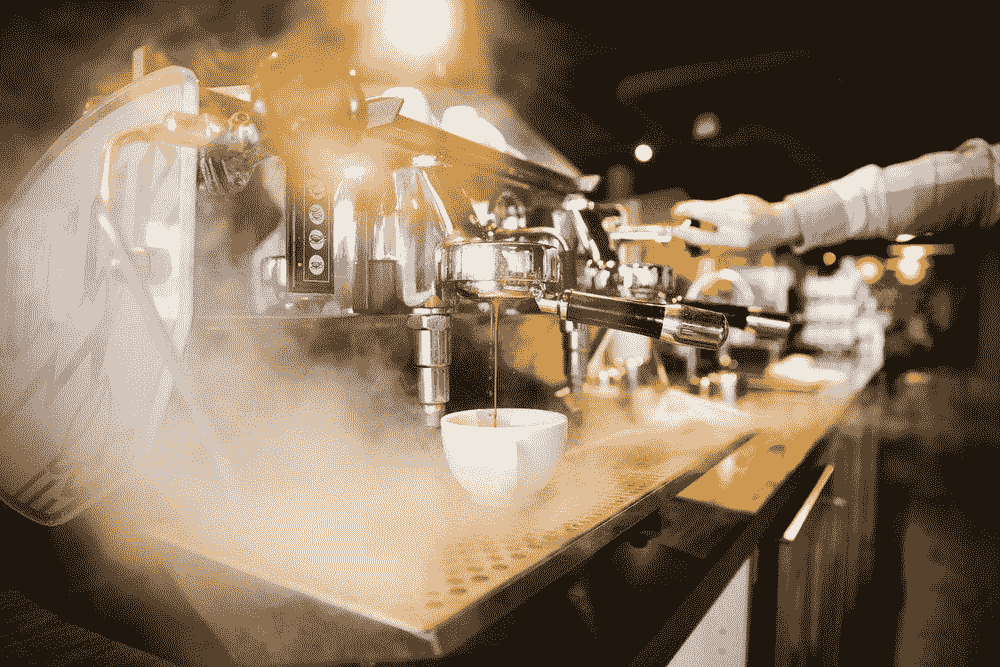
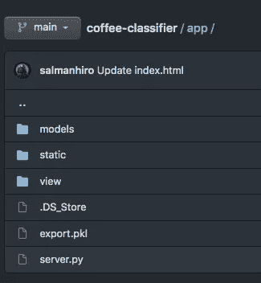
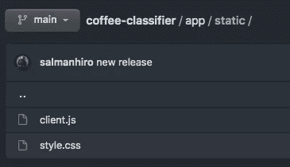
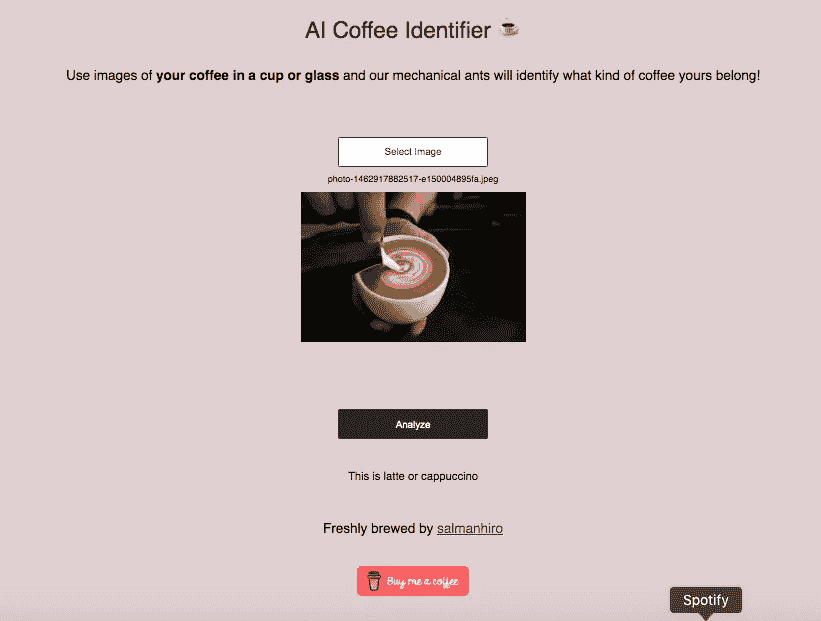

# 在 Docker 上创建端到端咖啡图片分类器

> 原文：<https://medium.com/analytics-vidhya/creating-an-end-to-end-coffee-picture-classifier-on-docker-28a731202f5a?source=collection_archive---------21----------------------->



照片由[阿莱西娅·卡赞特切娃](https://unsplash.com/@saltnstreets?utm_source=unsplash&utm_medium=referral&utm_content=creditCopyText)在 [Unsplash](https://unsplash.com/s/photos/americano?utm_source=unsplash&utm_medium=referral&utm_content=creditCopyText) 上拍摄

# 介绍

几个月前，我开始用 [Fast.ai](http://fast.ai) 进行深度学习。这门课程非常简单易懂。课程还涵盖了[图像分类部署](https://github.com/render-examples/fastai-v3)，对泰迪熊、灰熊和黑熊进行分类。我做的是把它修改成一个咖啡分类问题。就这么简单，因为我在兼职做咖啡师，我太爱咖啡了。我只是被迫编码，因为这个世界要求你为做出如此伟大的事情而编码一点点。所以，不要叫我程序员(是的，我很讨厌)。

我在 Docker 上本地试过，在 render.com[上公开试过，但我建议你先用 Docker，因为渲染部署每月花费你 7 美元。如果你是 Docker 的新手，你应该尽早安装它。](http://render.com)

[Docker 入门](https://docs.docker.com/get-docker/)

所需的包在`requirement.txt`中列出

## 之后，我们开始吧。如果你不耐烦，就克隆[我的 GitHub repo](https://github.com/salmanhiro/coffee-classifier)

# 密码

1.  **首先，我们将收集一些饮料图片。**我选择其中一些作为分类，你可以从 [unsplash](http://unsplash.com) 或者其他来源搜索免费图片。为了更好的效果，我建议你收集 50 张以上的图片，包括你自己的咖啡。

> 美式咖啡、浓缩咖啡、拿铁咖啡、非咖啡

2.**爽！下一步是训练 CNN 分类器。** [这是我在 google colab 上的笔记本](https://github.com/salmanhiro/coffee-classifier/blob/main/coffee_classifier.ipynb)。您可以修改所用的模型或用其他技术演奏。这只是一个基线。

这部分会救你的`model.pkl`。

```
learn.export()
```

3.保存模型后，您可以**在 Dockerfile** 上工作以进行部署。

```
FROM python:3.8-slim-buster RUN apt-get update && apt-get install -y git python3-dev gcc \    
&& rm -rf /var/lib/apt/lists/* COPY requirements.txt . RUN pip install --upgrade -r requirements.txt COPY app app/ RUN python app/server.py EXPOSE 5000 CMD ["python", "app/server.py", "serve"]
```

该文件将通过安装编译器、必要的包、运行 flask 应用程序以及将容器端口暴露给设备端口来设置您的容器。

4.**创建一个名为 app 的文件夹，在该文件夹中，有一个运行服务器的脚本**。我把它命名为`server.py`。请注意，我实际上是将模型直接(而不是在模型文件夹中)放在 repo 中的。



这里是`server.py`。

```
import aiohttp
import asyncio
import uvicorn
from fastai import *
from fastai.vision import *
from io import BytesIO
from starlette.applications import Starlette
from starlette.middleware.cors import CORSMiddleware
from starlette.responses import HTMLResponse, JSONResponse
from starlette.staticfiles import StaticFiles

export_file_name = 'export.pkl'

classes = ['americano', 'espresso', 'latte', 'not coffee']
path = Path(__file__).parent

app = Starlette()
app.add_middleware(CORSMiddleware, allow_origins=['*'], allow_headers=['X-Requested-With', 'Content-Type'])
app.mount('/static', StaticFiles(directory='app/static'))

async def download_file(url, dest):
    if dest.exists(): return
    async with aiohttp.ClientSession() as session:
        async with session.get(url) as response:
            data = await response.read()
            with open(dest, 'wb') as f:
                f.write(data)

async def setup_learner():
    await download_file(export_file_url, path / export_file_name)
    try:
        learn = load_learner(path, export_file_name)
        return learn
    except RuntimeError as e:
        if len(e.args) > 0 and 'CPU-only machine' in e.args[0]:
            print(e)
            message = "\n\nThis model was trained with an old version of fastai and will not work in a CPU environment.\n\nPlease update the fastai library in your training environment and export your model again.\n\nSee instructions for 'Returning to work' at https://course.fast.ai."
            raise RuntimeError(message)
        else:
            raise

loop = asyncio.get_event_loop()
tasks = [asyncio.ensure_future(setup_learner())]
learn = loop.run_until_complete(asyncio.gather(*tasks))[0]
loop.close()

@app.route('/')
async def homepage(request):
    html_file = path / 'view' / 'index.html'
    return HTMLResponse(html_file.open().read())

@app.route('/analyze', methods=['POST'])
async def analyze(request):
    img_data = await request.form()
    img_bytes = await (img_data['file'].read())
    img = open_image(BytesIO(img_bytes))
    prediction = learn.predict(img)[0]
    return JSONResponse({'result': str(prediction)})

if __name__ == '__main__':
    if 'serve' in sys.argv:
        uvicorn.run(app=app, host='0.0.0.0', port=5000, log_level="info")
```

请看看原始源代码(如果你复制:D，我对它是否可运行持悲观态度)

5.**一些支持脚本。**在`app`文件夹中可以看到，有`view`和`static`。我们想把前端放在那里。

在静态文件夹中，放置`style.css`和`client.js.`



这里是`client.js`里面的东西，链接到视图文件夹里的`index.html`。

```
var el = x => document.getElementById(x);

// pick input file
function showPicker() {
  el("file-input").click();
}

// show input file
function showPicked(input) {
  el("upload-label").innerHTML = input.files[0].name;
  var reader = new FileReader();
  reader.onload = function(e) {
    el("image-picked").src = e.target.result;
    el("image-picked").className = "";
  };
  reader.readAsDataURL(input.files[0]);
}

// analyze button function and result
function analyze() {
  var uploadFiles = el("file-input").files;
  if (uploadFiles.length !== 1) alert("Please select a file to analyze!");

  el("analyze-button").innerHTML = "Analyzing...";
  var xhr = new XMLHttpRequest();
  var loc = window.location;
  xhr.open("POST", `${loc.protocol}//${loc.hostname}:${loc.port}/analyze`,
    true);
  xhr.onerror = function() {
    alert(xhr.responseText);
  };
  xhr.onload = function(e) {
    if (this.readyState === 4) {
      var response = JSON.parse(e.target.responseText);
      el("result-label").innerHTML = `This is ${response["result"]}`;
    }
    el("analyze-button").innerHTML = "Analyze";
  };

  var fileData = new FormData();
  fileData.append("file", uploadFiles[0]);
  xhr.send(fileData);
}
```

而这里是样式模板，`style.css`。随意挑选颜色和位置！

```
body {
    background-color: rgb(223, 208, 208);
}

.no-display {
    display: none;
}

.center {
    margin: auto;
    padding: 10px 30px;
    text-align: center;
    font-size: 18px;
    font-family: sans-serif;
    margin-bottom: 2em;
}

.title {
    font-size: 30px;
    margin-top: 1em;
    margin-bottom: 1em;
    color: #262626;
}

.content {
    margin-top: 4em;
}

.analyze {
    margin-top: 5em;
}

.upload-label {
    padding: 10px;
    font-size: 12px;
}

.result-label {
    margin-top: 2em;
    padding: 10px;
    font-size: 15px;
}

button.choose-file-button {
    width: 200px;
    height: 40px;
    border-radius: 2px;
    background-color: #ffffff;
    border: solid 1px #262626;
    font-size: 13px;
    color: #262626;
}

button.analyze-button {
    width: 200px;
    height: 40px;
    border: solid 1px #262626;
    border-radius: 2px;
    background-color: #262626;
    font-size: 13px;
    color: #ffffff;
}

button:focus {
    outline: 0;
} 
```

然后，你就可以在`view`文件夹上玩`index.html`了。

```
<html lang='en'>

<head>
  <link rel="icon" type="image/png" href="./icon.png"/>
  <meta charset='utf-8'>
  <link rel='stylesheet' href='../static/style.css'>
  <script src='../static/client.js'></script>
</head>
<body>
<div>
  <div class='center'>
    <div class='title'>AI Coffee Classifier ☕</div>
    <p>
      Use images of <strong>your coffee in a cup or glass</strong> 
      and our mechanical ants will identify what kind of coffee yours belong!
    </p>
    <div class='content'>
      <div class='no-display'>
        <input id='file-input'
               class='no-display'
               type='file'
               name='file'
               accept='image/*'
               onchange='showPicked(this)'>
      </div>

      <button class='choose-file-button' type='button' onclick='showPicker()'>Select Image</button>
      <div class='upload-label'>
        <label id='upload-label'>No coffee chosen</label>
      </div>

      <div>
        
      </div>

      <div class='analyze'>
        <button id='analyze-button' class='analyze-button' type='button' onclick='analyze()'>What is it?</button>
      </div>

      <div class='result-label'>
        <label id='result-label'></label>
      </div>

    <br>
    </br> 

      Freshly brewed by <a href="https://github.com/salmanhiro" target="_blank">salmanhiro</a>

  </div>
 </body>
</html>
```

6.**最后一步！在 Docker** 上运行它。首先，我们需要构建容器。这将执行 Dockerfile 文件中的内容。之后，我想将容器端口 5000 绑定到本地端口 5000。

```
docker build -t coffee .

docker run --rm -it -p 5000:5000 coffee
```

7.**尽情享受！**你可以用自己的咖啡测试一下。在浏览器上抬头看`[**http://0.0.0.0:5000**](http://0.0.0.0:5000)` 。这是我的，有 buymeacoffee 按钮。



**咖啡照由** [**泰勒弗兰茨**](https://unsplash.com/@taylorrfranz?utm_source=unsplash&utm_medium=referral&utm_content=creditCopyText) **上** [**不溅**](https://unsplash.com/collections/1215/coffee?utm_source=unsplash&utm_medium=referral&utm_content=creditCopyText)

# **参考**

1.  *快速 AI 课程*，[https://course19.fast.ai/](https://course19.fast.ai/)。
2.  *快速 AI 模型部署库【https://github.com/render-examples/fastai-v3】、[、](https://github.com/render-examples/fastai-v3)。*

# 关于作者

萨尔曼是一个赛博朋克爱好者，非常喜欢咖啡、高保真音乐、河外探索、机器人和自动驾驶汽车。他正在从事 Asis 和 Mata-AI 个人助理产品-作为自然语言理解和强化学习驱动的自学习代理领域的应用研究员。此前，他是同一家母公司 Zapps AI 的计算机视觉应用研究员，万隆技术研究所天文系的研究助理，以及 Dago Hoogeshool 的机器人计算机视觉工程师。

他在万隆技术研究所攻读天文学和天体物理学专业，在普林斯顿大学的物理暑期学校和 2020 年机器学习暑期学校(MLSS)学习，他很自豪地接受了 Max Welling 的 AMLab 和 DeepMind 研究人员的授课。

在 LinkedIn 上查看他的个人资料。