# 创建一个预测英格兰超级联赛结果的 ML 模型(或使用机器学习来计算阿森纳是否会在 2020-2021 年重返冠军联赛)

> 原文：<https://medium.com/analytics-vidhya/creating-an-ml-model-for-predicting-english-premiership-results-or-using-machine-learning-to-875b369c1b48?source=collection_archive---------10----------------------->


大家好！这是我第一篇关于媒介的文章。我将写下我学习机器学习的旅程，让我们开始吧！

我在墨西哥长大，所以我只喜欢一项运动。事实上，与其说它是一项运动，不如说它是一种宗教。当然，我说的是足球。你可能已经从上面的图片中推断出，我最喜欢的球队是[阿森纳](https://www.arsenal.com/) ( [我们跑北伦敦！](https://www.youtube.com/watch?v=VLZeTOID0jU))所以，当我寻找一些数据时，我希望能找到一些关于足球的东西，尤其是关于阿森纳的。谢天谢地，我找到了这个[公共 Kaggle 数据集](https://www.kaggle.com/irkaal/english-premier-league-results?select=EPL.csv)(感谢 [Alvin](https://www.kaggle.com/irkaal) ！！)拥有从 2000 年到 2020 年 3 月的每一场英超比赛的结果。

我们要做的是利用这个数据集，建立一个神经网络来预测未来英超比赛的结果。即使利物浦已经赢得了冠军，阿森纳仍然有机会晋级冠军联赛，所以我们需要知道这是否可能发生。具体来说，我们要做的是:

*   创建一个 Jupyter 笔记本，我们将在其中进行所有的计算
*   下载艾尔文的数据集
*   可视化数据集的几个维度
*   对数据进行预处理，以便将其输入神经网络
*   将数据分成训练集和测试集
*   创建一个神经网络
*   用我们的训练数据训练神经网络
*   用我们的测试数据来测试我们的神经网络有多好
*   使用 TensorFlow 模型服务将我们的模型部署为 API
*   让我们的 API 预测阿森纳剩余比赛的所有结果，看看我们是否能重返冠军联赛

# **创建 Jupyter 笔记本**

我们可以在许多环境中创建我们的笔记本，但我们将使用 [google colab](https://colab.research.google.com/) 来托管我们的笔记本。只要转到那个网址，你就会立即进入你的第一个笔记本。如果是第一次，您应该会看到类似下图的内容:

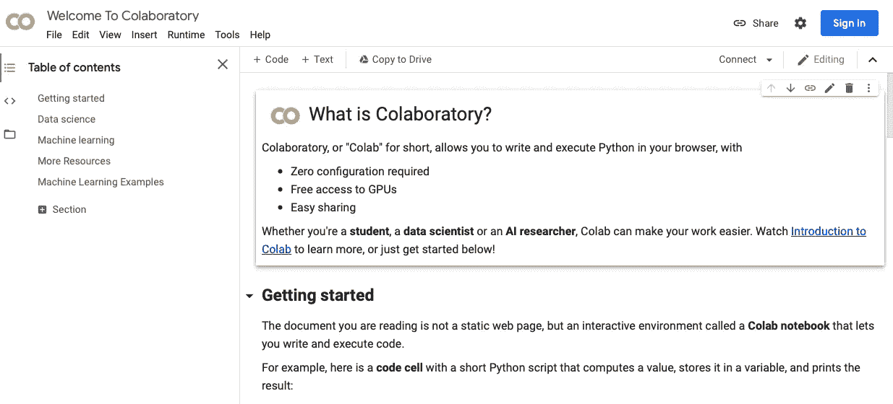

Google Colab 欢迎屏幕

现在我们可以开始在笔记本上添加数据和代码了。

# **下载我们的数据**

我们可以在 Kaggle 的环境中创建我们的笔记本，但我已经在我参加的一些 Coursera ML 课程中使用了 Google Colab，所以我使用了我熟悉的东西。

我们有很多方法可以下载艾尔文的数据集。我所做的是将它下载到我的 Google Drive 上，从那里我可以将数据集下载到 colab 笔记本上。因此，我们需要做的第一件事是导入我们需要的所有库，并安装我们的驱动器，以便我们的 colab 笔记本可以访问它的文件系统。您的 colab 单元格看起来会像这样:

```
import pandas as pd
import tensorflow as tf
import numpy as np
import matplotlib.pyplot as plt
import os
import codecs, json
import tempfile
import requests
import base64from google.colab import drivedrive.mount("/content/drive")
```

一旦你执行了这个单元，google 将带你通过一个授权周期，这个授权周期包括让 Google Drive 访问你的 colab 笔记本。一旦发生这种情况，驱动器被安装。我们可以运行一个 *ls* 命令来确保驱动器已经安装:

```
!ls /content/drive
```

你的回答应该是下图这样的。

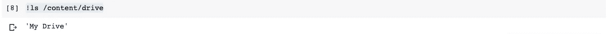

酷！我们的硬盘已经装好了。我们的文件在“/content/drive/My Drive/”下，所以从这里我可以去寻找我们想要使用的数据集。我将其命名为 EPLresults.csv，因此我们将把这个 csv 文件加载到 pandas 数据帧中，并显示该文件的前几行。下面的代码完成这些任务:

```
file_path = "/content/drive/My Drive/EPLresults.csv"my_df = pd.read_csv(file_path)print('The shape of our dataset is ', my_df.shape)my_df.head()
```

您应该得到的结果如下图所示:

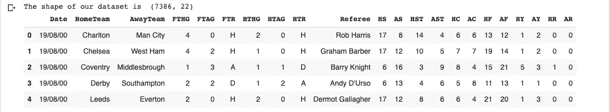

显示了英超比赛数据集中的前几行

正如我们所看到的，我们的数据集有 7，386 行(这是很多足球比赛！)每行 22 列。我们可以看到一些行是:

*   玩游戏的日期
*   主队
*   客场球队
*   全职结果(FTR)

诸如此类。你可以在这里看到所有[栏目的描述。好了，我们有了所有的列，但是我们需要检查它们是什么类型。你会问为什么？嗯，一个原因是因为神经网络不接受字符串作为输入。让我们用下面的命令来看看列类型:](https://www.kaggle.com/irkaal/english-premier-league-results)

```
my_df.info()
```

您的输入应该如下图所示:

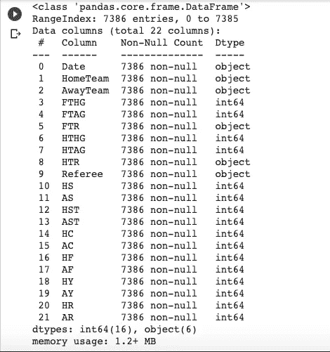

超级联赛游戏数据集的列类型

好，我们有 16 个 int 列和 6 个 object 列。记住这个事实，因为我们稍后将需要修改对象列，以便它们可以用作我们的神经网络的输入。

# 可视化我们的数据

建议我们做一些可视化来熟悉我们的数据集。我们将为这个数据集做几个。

第一个是全职结果的频率(FTR)。我们想知道哪种结果更普遍:主队赢，客队赢还是平局。我们将使用 matplotlib 来绘制全职结果的直方图。代码如下所示:

```
fig, chart = plt.subplots()
data = my_df['FTR'].value_counts()points = data.index
frequency = data.valueschart.bar(points, frequency)chart.set_title('Frequency of different results in the English Premiership (2001-2020) ')
chart.set_xlabel('Result Type')
chart.set_ylabel('Frequency')
```

我们得到的直方图如下所示:

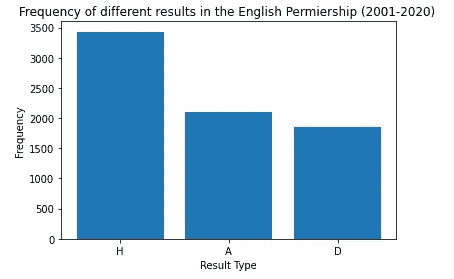

我们可以看到主场胜利比客场胜利更普遍，这是有道理的。在足球比赛中，观众总是一个重要的因素。然后我们可以推断，打了最多主场比赛的球队最有可能获胜，因此，更有可能赢得冠军和/或获得冠军联赛的资格。

使用类似上面的代码，让我们画出每支英超球队主场比赛的数量。生成的直方图如下所示:

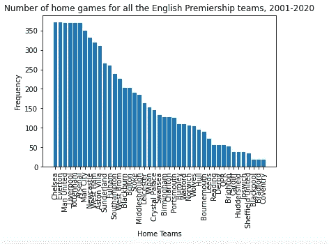

有点难以理解，但我们可以看到大约有 6 支球队拥有最多的主场比赛:切尔西、埃弗顿、曼联、利物浦、热刺和阿森纳。你会认为其中一支球队最有可能赢得冠军，这 6 支球队最有可能在积分榜上排名第一，因此最有可能参加冠军联赛。

我们可以想象其他的维度，但是现在让我们停在这里。

# **数据预处理**

现在，我们有了决定将哪些列用作神经网络输入所需的数据。在此之前，我们将制作数据框的副本，并在该副本上进行所有列更改。为什么？我们希望保留原始数据帧，以防我们在新数据帧中搞砸了列转换。

好，那么我们保留哪些列，去掉哪些列，如果有的话？

我们肯定需要参加比赛的球队和统计数据，如犯规次数、黄牌数、红牌数和半场比分。所有这些栏目看起来都像是帮助我们预测未来游戏分数的功能。其他几个专栏呢？

先说裁判。裁判对比赛有着巨大的影响，但这个数据集包含了过去 20 个赛季的比赛。一些裁判已经退休了，所以我不确定使用裁判栏是否能帮助我们预测。出于这个原因，我们将放弃它。

下面的代码创建了我们的 dataframe 副本并删除了 referee 列。我们还打印前几行，以确认 referee 列已删除。

```
epl_df_objects = my_df.copy()
epl_df_objects.drop('Referee', axis=1, inplace=True)epl_df_objects.head()
```

您应该会看到这样的结果:

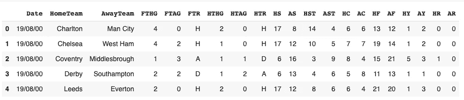

删除 Referee 列后的 Dataframe 列

很好，我们可以看到我们现在有 21 列(所有我们最初拥有的列减去我们刚刚删除的 referee 列)。

在继续之前，让我们检查一下我们的数据集是否有空值。如果是这样，我们将需要修复它们。下面的命令将显示我们的数据集中有多少空值:

```
print(epl_df_objects.isnull().values.sum())
```

结果应该是 0。这太棒了！Alvin 将我们从修复数据集的繁琐过程中解救了出来。艾尔文的爸爸！！！

我们现在可以转到其他栏目了。比赛的日期怎么样？我要说的是，我们不太关心实际的日子，而是更关心一周中的某一天。英超比赛通常在周六、周日和周一进行。如果你在一个比赛日的周一比赛，你有一周的时间为下一个比赛日恢复。然后，我们可以假设周一比赛的球队在下周的比赛中处于劣势，他们更有可能输掉或打平那场比赛。然而，我们也可以提出相反的论点:周一比赛的球队比周末比赛的球队有更长的休息时间，所以他们可能有更好的机会赢得周一的比赛。无论如何，看起来星期几确实是一个因素，所以我们将把它包括在内。然后，我们将把日期列转换成星期几列。下面的代码实现了这一点:

```
epl_df_objects["matchDate"] = pd.to_datetime(epl_df_objects["Date"], infer_datetime_format=True)epl_df_objects['matchDay'] = epl_df_objects['matchDate'].dt.day_name()print(epl_df_objects["matchDate"][0])
print(epl_df_objects['matchDay'][149])epl_df_objects.drop('Date', axis=1, inplace=True)
epl_df_objects.drop('matchDate', axis=1, inplace=True)
epl_df_objects.head()
```

我们做了什么？首先，我们创建了一个新的 dataframe 列 matchDate，它转换日期字符串列(还记得我们打印所有列类型时它有一个“object”类型吗？)转换为 python *datetime* 对象。然后，我们将一周的日期提取到一个新的 dataframe 列中，我们称之为“比赛日”。然后我们打印一个比赛日实例，在本例中是第 149 行，只是为了确保我们得到了我们需要的东西。这两个 drop 命令删除了我们不再需要的列。最后，我们打印几行数据帧来确认我们的数据帧是正确的。您应该会看到如下所示的输出:

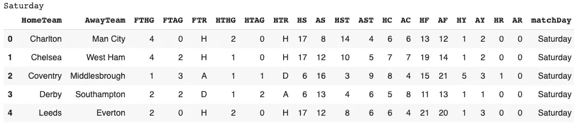

一旦我们将日期转换为星期几列

对学校来说很酷！！我们在做生意。现在，我们需要查看其余的对象/字符串列，并决定我们将如何处理它们。我们肯定希望这些列作为我们的神经网络的输入，因为它们是像主队和客场队这样的列。我们需要把它们转换成数字。一种方法是把它们转换成数字，这样我们可以得到阿森纳= 1，阿斯顿维拉= 2 等等。这很好，但不完全好。假设我们总共有 50 支球队，阿森纳= 1，西汉姆是最后一支，因此是 50。这是否意味着我们的神经网络将给予西汉姆 50 倍于阿森纳的权重？我们不想那样。为了解决这个问题，我们将使用 *get_dummies* dataframe 命令。 *get_dummies* 命令将为每个团队及其状态创建虚拟列，这样我们将拥有相等的值。我们将得到如下所示的列:

*   主队 _ 阿森纳
*   主场球队 _ 阿斯顿维拉
*   纽卡斯尔客场队

诸如此类。这样的列将具有二进制值:除了实际参与该游戏的主队和客场队之外，所有球队的值都是 0。我们现在已经消除了特征权重问题。用机器学习的话来说，我们已经将分类特征(具有一组有限的值且这些值之间没有排序的特征)转换为二元/指示变量。下面的代码为主队、客场队、HTR 和比赛日功能完成了这个任务。

```
epl_df_objects = pd.get_dummies(epl_df_objects, columns=['HomeTeam'], prefix = ['HomeTeam'])
epl_df_objects = pd.get_dummies(epl_df_objects, columns=['AwayTeam'], prefix = ['AwayTeam'])
epl_df_objects = pd.get_dummies(epl_df_objects, columns=['HTR'], prefix = ['HTR'])
epl_df_objects = pd.get_dummies(epl_df_objects, columns=['matchDay'], prefix = ['matchDay'])epl_df_objects.head()
```

我们现在有更多的列。下面我们将展示其中的几个新栏目。

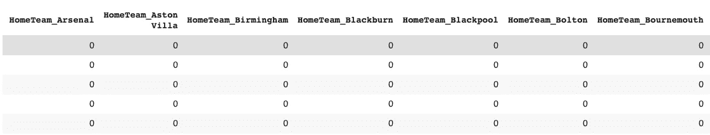

一些新的二元变量

好了，现在我们有了要输入神经网络的所有特征。标签怎么样？很高兴你问了。标签上有字母，所以我们需要将这些字母转换成数字。为了做到这一点，我们使用 sklearn 的 [LabelEncoder](https://scikit-learn.org/stable/modules/preprocessing_targets.html) ，然后我们打印唯一的值来确认我们有数字。

我们打印 3 个不同比赛的全职结果，这样我们就可以知道哪个数字代表哪个结果(主队获胜，客场获胜或平局)。最后，我们将所有特征分配给一个中间变量。下面的代码完成了所有这些操作。

```
from sklearn.preprocessing import LabelEncoder
label_encoder = LabelEncoder()epl_df_objects['FTR']= label_encoder.fit_transform(epl_df_objects['FTR'])print('Unique values for our label are: ', epl_df_objects['FTR'].unique())print('if the home team wins the label is ', epl_df_objects['FTR'][0])
print('if the away team wins the label is ', epl_df_objects['FTR'][2])
print('if there is a tie the label is ', epl_df_objects['FTR'][3])label = epl_df_objects['FTR']print('the result for the match in row 149 is ', label[149])print(epl_df_objects.iloc[:,3:113])features = epl_df_objects.iloc[:,3:113]
```

我们应该得到如下所示的输出:

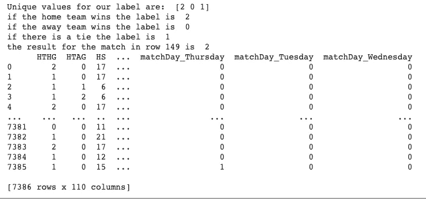

将标签转换为数字后的输出

很好，我们可以看到我们有三个唯一的值，我们还可以看到 0 表示客队赢了，1 表示平局，2 表示主队赢了。我们还可以看到，我们现在有 110 个特征，我们将输入到我们的神经网络；这与我们在本练习开始时拥有的最初的 21 个特性相比有很大的变化。

唷！至此，我们已经完成了数据的预处理。如你所见，这花了我们不少时间。

# 创建训练集和测试集

我们如何将我们的特性分解成训练集和测试集？好吧，一个建议是把原始数据集的 67%作为训练集，剩下的作为测试集。我们将采纳这个建议，我们将使用 sklearn 的 *train_test_split* 来进行拆分。

下面的代码显示了测试分割。分割之后，我们打印出结果训练集和测试集的形状，看看每一个上有多少行。

```
from sklearn.model_selection import train_test_splity=np.ravel(label)X = features
X_train, X_test, y_train, y_test = train_test_split(X, y, test_size=0.33, shuffle=False)print("The shape of X_train is " + str(X_train.shape))
print("The size of y_train is " + str(y_train.shape))
print("The size of X_test set is " + str(X_test.shape))
print("The size of y_test is " + str(y_test.shape)) 
```

您的输出应该类似于下面的内容:

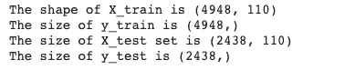

定型集和测试集形状

接下来，我们执行最后一个数据处理练习:我们使用 keras '*to _ quantitative*命令将我们的标签转换为一个独热编码变量，如下面的代码片段所示。然后，我们打印一个热编码 y 集的形状，并打印一行训练标签，以确认标签是一个热编码的。

```
#one hot-encoding y_train and y_testy_train = tf.keras.utils.to_categorical(y_train, num_classes=3)
y_test = tf.keras.utils.to_categorical(y_test, num_classes=3)print("The size of y_train is " + str(y_train.shape))
print("The size of y_test is " + str(y_test.shape))print(y_train[0])
```

我们的输出应该是这样的:

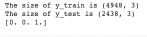

标签集的形状和我们的一个一键编码标签的例子

现在我们可以继续我们的神经网络。

# 创建神经网络

我们创建我们的神经网络如下:

*   一个输入为 110 个要素的图层，对应于我们要输入到数据集的要素数量
*   一个中间层
*   一个输出层，带有激活 softmax 和 3 个输出，对应于我们的 3 种可能的结果:主队获胜，客场获胜或平局。我们使用 [softmax](https://www.machinecurve.com/index.php/2020/01/08/how-does-the-softmax-activation-function-work/) 作为激活，因为我们有两个以上的可能结果。(如果我们只有 2 个结果，我们将使用 [sigmod](https://en.wikipedia.org/wiki/Sigmoid_function) 作为激活函数。)

下面的代码创建神经网络，打印模型摘要并编译它:

```
model = tf.keras.models.Sequential([tf.keras.layers.Dense(330, input_dim=110, activation='relu'),tf.keras.layers.Dense(10, input_dim=330, activation='relu'),tf.keras.layers.Dense(3,activation='softmax')])model.summary()model.compile(loss = 'categorical_crossentropy', optimizer='adam', metrics=['accuracy'])
```

我们的输出应该类似于下面的内容:

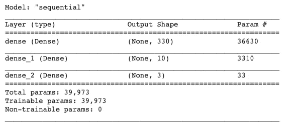

我们的神经网络模型的模型总结

# **用训练数据训练神经网络**

我们现在可以用训练数据集来训练神经网络。我们通过下面的代码来实现这一点:

```
history = model.fit(X_train, y_train, epochs=65)
```

以下是最近几个时期的输出:

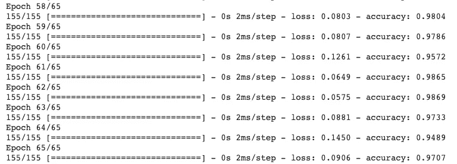

我们注意到了什么？我们可以看到损失函数在下降，精度在上升，这很好。让我们绘制我们的损失函数和准确性，以更好地了解它们在我们训练模型时是如何变化的。我们通过下面的代码来实现这一点:

```
#accuracy history
plt.plot(history.history['accuracy'])
plt.title('model accuracy')
plt.ylabel('accuracy')
plt.xlabel('epoch')
plt.legend(['train'], loc='upper left')
plt.show()#loss history
plt.plot(history.history['loss'])
plt.title('model loss')
plt.ylabel('loss')
plt.xlabel('epoch')
plt.legend(['train'], loc='upper left')
plt.show()
```

生成的两个图表如下所示。当我们训练模型时，我们可以看到我们的模型损失在下降，模型精度在上升。还要注意，在两张图表的末尾，我们看到函数变得不稳定:上下波动。这表明我们可能不需要运行最后一个时期，因此，对于未来的培训课程，我们可以减少时期的数量。

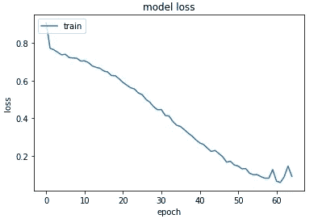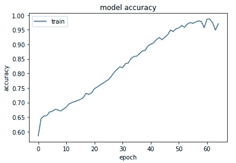

我们的训练模型的损失和准确性

# 用测试数据测试我们的神经网络

那么我们的结果好吗？是的，但是它们太好了吗？我们面临的一个危险是，我们让模型过度适应训练数据。这意味着我们的模型在训练数据集上表现很好，但在其他数据上表现不佳。

我们怎么知道呢？我们将用测试数据来测试我们的模型，看看我们会得到什么样的结果。用测试集测试模型的代码如下:

```
score = model.evaluate(X_test, y_test, verbose=1)print("Test Score:", score[0])
print("Test Accuracy:", score[1])
```

我们得到下面的结果。正如我们所怀疑的，我们过度拟合，模型精度和损失不能很好地转化为我们的测试集。

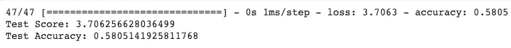

用测试数据评估我们的模型的损失和准确性

所以这里有一个岔路口。我们可以花更多的时间来改变我们的模型，以减少过度拟合，或者继续将模型作为 API 部署，看看阿森纳是否会进入冠军联赛。我们将继续部署，并在未来的帖子中优化我们的模型。

让我们用我们的模型做一个预测，看看我们会得到什么。我们将输入 2020 年 7 月 1 日进行的阿森纳对诺维奇的比赛。下面的代码创建发送给模型的数据，接收预测并打印出来。

```
Xnew = np.array([[0, 0, 0, 0, 0, 0, 0, 0, 0, 0, 0, 0, 0, 0, 1, 0, 0, 0, 0, 0, 0, 0, 0, 0, 0, 0, 0, 0, 0, 0, 0, 0, 0, 0, 0, 0, 0, 0, 0, 0, 0, 0, 0, 0, 0, 0, 0, 0, 0, 0, 0, 0, 0, 0, 0, 0, 0, 0, 0, 0, 0, 0, 0, 0, 0, 0, 0, 0, 0, 0, 0, 0, 0, 0, 0, 0, 0, 0, 0, 0, 0, 0, 0, 0, 0, 1, 0, 0, 0, 0, 0, 0, 0, 0, 0, 0, 0, 0, 0, 0, 0, 0, 0, 0, 0, 0, 0, 0, 0, 1]])print(Xnew.shape)# make a prediction
ynew = np.argmax(model.predict(Xnew), axis=-1)# show the inputs and predicted outputs
print("X = %s " % Xnew)
print("Prediction = %s" % ynew[0])
```

输出如下所示。我们的模型预测主队会赢，而碰巧阿森纳赢了那场比赛。即使一个模型有 59%的准确率，有时也是正确的:-)

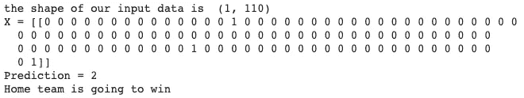

向我们的模型发送预测并打印输出

现在我们可以继续将我们的模型作为 API 进行部署。

# 使用 TensorFlow 模型服务将我们的模型部署为 API

我们需要做的第一件事是用下面的代码保存我们的模型文件。

```
MODEL_DIR = tempfile.gettempdir()
version = 1export_path = os.path.join(MODEL_DIR, str(version)) if os.path.isdir(export_path):
    print('\nAlready saved a model, cleaning up\n')
    !rm -r {export_path}model.save(export_path, save_format="tf")print('\nexport_path = {}'.format(export_path))!ls -l {export_path}
```

我们的模型保存在一个临时目录中，如下所示:

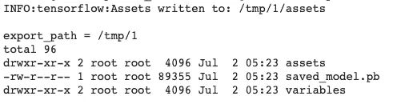

我们的模型文件保存在一个临时目录中

现在我们可以下载张量流模型服务器代码:

```
!echo "deb http://storage.googleapis.com/tensorflow-serving-apt stable tensorflow-model-server tensorflow-model-server-universal" | tee /etc/apt/sources.list.d/tensorflow-serving.list && \curl https://storage.googleapis.com/tensorflow-serving-apt/tensorflow-serving.release.pub.gpg | apt-key add -!apt update
```

并安装服务器:

```
!apt-get install tensorflow-model-server
```

您应该会看到如下所示的输出:

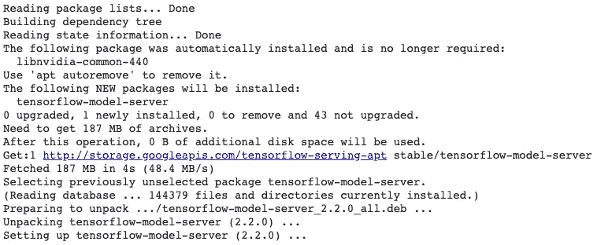

安装模型服务库后的输出

酷，现在我们可以运行我们的 api 服务器了:

```
os.environ["MODEL_DIR"] = MODEL_DIR%%bash --bgnohup tensorflow_model_server \
--rest_api_port=8501 \
--model_name=epl_predictions \
--model_base_path="${MODEL_DIR}" >server.log 2>&1
```

服务器运行后，您应该会看到以下消息:

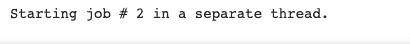

# 要求 API 预测阿森纳剩余比赛的结果

酷，我们的服务器正在运行。我们将把剩下的阿森纳游戏 8 发送到 api 服务器，然后看看我们的模型预测了什么。

首先，我们为每个游戏创建一个包含所有列(共 110 列)的对象。然后我们将它转换成一个列表，然后保存为一个 JSON 对象。下面的代码实现了这一点:

```
entry = np.array([[0,0,0,0,0,0,0,0,0,0,0,0,0,0,1,0,0,0,0,0,0,0,0,0,0,0,0,0,0,0,0,0,0,0,0,0,0,0,0,0,0,0,0,0,0,0,0,0,0,0,0,0,0,0,0,0,0,0,0,0,0,0,0,0,0,0,0,0,0,0,0,0,0,0,0,0,0,0,0,0,0,0,0,0,0,1,0,0,0,0,0,0,0,0,0,0,0,0,0,0,0,0,0,0,0,0,0,0,0,1],[0,0,0,0,0,0,0,0,0,0,0,0,0,0,0,0,0,0,0,0,0,0,0,0,0,0,0,0,0,0,0,0,0,0,0,0,0,0,0,0,0,0,0,0,0,0,0,0,0,0,0,0,0,0,0,0,1,1,0,0,0,0,0,0,0,0,0,0,0,0,0,0,0,0,0,0,0,0,0,0,0,0,0,0,0,0,0,0,0,0,0,0,0,0,0,0,0,0,0,0,0,0,0,0,0,1,0,0,0,0],[0,0,0,0,0,0,0,0,0,0,0,0,0,0,1,0,0,0,0,0,0,0,0,0,0,0,0,0,0,0,0,0,0,0,0,0,0,0,0,0,0,0,0,0,0,0,0,0,0,0,0,0,0,0,0,0,0,0,0,0,0,0,0,0,0,0,0,0,0,0,0,0,0,0,0,0,0,0,0,1,0,0,0,0,0,0,0,0,0,0,0,0,0,0,0,0,0,0,0,0,0,0,0,0,0,0,0,0,1,0],[0,0,0,0,0,0,0,0,0,0,0,0,0,0,0,0,0,0,0,0,0,0,0,0,0,0,0,0,0,0,0,0,0,0,0,0,0,0,0,0,0,0,0,0,0,0,0,0,0,0,0,1,0,0,0,0,0,1,0,0,0,0,0,0,0,0,0,0,0,0,0,0,0,0,0,0,0,0,0,0,0,0,0,0,0,0,0,0,0,0,0,0,0,0,0,0,0,0,0,0,0,0,0,0,0,0,1,0,0,0],[0,0,0,0,0,0,0,0,0,0,0,0,0,0,1,0,0,0,0,0,0,0,0,0,0,0,0,0,0,0,0,0,0,0,0,0,0,0,0,0,0,0,0,0,0,0,0,0,0,0,0,0,0,0,0,0,0,0,0,0,0,0,0,0,0,0,0,0,0,0,0,0,0,0,0,0,0,0,0,0,1,0,0,0,0,0,0,0,0,0,0,0,0,0,0,0,0,0,0,0,0,0,0,0,0,0,0,0,0,1],[0,0,0,0,0,0,0,0,0,0,0,0,0,0,1,0,0,0,0,0,0,0,0,0,0,0,0,0,0,0,0,0,0,0,0,0,0,0,0,0,0,0,0,0,0,0,0,0,0,0,0,0,0,0,0,0,0,0,0,0,0,0,0,0,0,0,0,0,0,0,0,0,0,0,0,0,0,0,0,0,0,1,0,0,0,0,0,0,0,0,0,0,0,0,0,0,0,0,0,0,0,0,0,0,0,1,0,0,0,0],[0,0,0,0,0,0,0,0,0,0,0,0,0,0,0,1,0,0,0,0,0,0,0,0,0,0,0,0,0,0,0,0,0,0,0,0,0,0,0,0,0,0,0,0,0,0,0,0,0,0,0,0,0,0,0,0,0,1,0,0,0,0,0,0,0,0,0,0,0,0,0,0,0,0,0,0,0,0,0,0,0,0,0,0,0,0,0,0,0,0,0,0,0,0,0,0,0,0,0,0,0,0,0,0,0,0,0,0,1,0],[0,0,0,0,0,0,0,0,0,0,0,0,0,0,1,0,0,0,0,0,0,0,0,0,0,0,0,0,0,0,0,0,0,0,0,0,0,0,0,0,0,0,0,0,0,0,0,0,0,0,0,0,0,0,0,0,0,0,0,0,0,0,0,0,0,0,0,0,0,0,0,0,0,0,0,0,0,0,0,0,0,0,0,0,0,0,0,0,0,0,0,0,0,0,0,1,0,0,0,0,0,0,0,0,0,0,1,0,0,0]])print(type(entry))
print(entry.shape)the_list = entry.tolist()
print(type(the_list))data = json.dumps({"signature_name": "serving_default", "instances": the_list})
print('Data: {} ... {}'.format(data[:50], data[len(data)-52:]))
```

好了，现在我们有了正确格式的请求，我们可以用下面的代码将它发送给我们的 api:

```
!pip install -q requestsheaders = {"content-type": "application/json"}
json_response = requests.post('http://localhost:8501/v1/models/epl_predictions:predict', data=data, headers=headers)response = json.loads(json_response.text)
predictions = response['predictions']print(json_response)
print(json_response.text)
print(response['predictions'])my_predictions = np.array(predictions)
print("The predictions are: ",np.argmax(my_predictions,axis=1))
```

上面我们做的是用 *requests.post* 命令发送请求，并在 *json_response* 中接收响应。然后我们提取*预测*对象并打印出来，这样我们就可以看到 3 种可能结果的概率(如果客队赢了，0；如果两队打成平局，1；如果主队赢了，2)。最后，我们提取具有最大概率的数组索引，这告诉我们我们的预测是 0，1 或 2。我们得到了下面的输出:

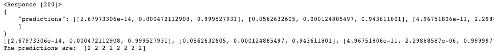

我们的模型对阿森纳所有剩余比赛的预测

我们的模型预测主队将赢得所有比赛。

我们相信吗？就像我们在本页顶部的第一个直方图中看到的那样，主队获胜是最常见的结果，我们推测这是因为主队拥有人群优势。然而，在这个新冠肺炎时代已经没有人群了。但是，我们的模型不知道这一点，所以这是一个很好的特性，可以添加到模型的未来迭代中。

现在让我们假设我们相信它。如果是这样的话，那么我们有以下阿森纳的记录:

5 胜(在我们派出的 5 场比赛中作为主队比赛)和 3 负(在我们派出的另外 3 场比赛中作为客场队比赛)

在对阵诺维奇(我们送到 API 的 8 场比赛的第一场)之前，阿森纳有 43 分。43 + 15(作为主队赢了 5 场)= 58 所以，按照我们的模型，枪手将以 58 分结束本赛季。欧冠够不够？只有前 4 支球队有资格参加冠军联赛，所以阿森纳必须排在第 4 名或者更好。58 分够第 4 名了吗？好吧，让我们看看 30 个比赛日之后的情况(英超联赛有 38 个比赛日):

*   利物浦远远超过 58 分，所以只剩下 3 个名额了。
*   曼城有 63 分，所以他们也在冠军联赛中。
*   莱斯特城有 54 分，所以他们离超过我们队还有 5 分之遥。莱斯特城不到 59 分的几率有多大？他们需要一场胜利和两场平局，这并不困难，因为莱斯特本赛季表现出色。所以我们会考虑他们。现在只剩下一个名额了。
*   切尔西有 51 分，所以他们只需要 2 场胜利和几场平局就可以超过阿森纳。这很难，但也是可行的。
*   此外，曼联、狼队和谢菲尔德联队也在阿森纳之上，踢得很好。我的猜测是这四支球队(切尔西、曼联、狼队和谢菲尔德联队)中的一支会占据最后的位置，我们只剩下安慰奖:欧罗巴联赛。

# 结论

在这篇文章中，我们经历了很多。

为了我的同胞们，TL；博士是，我们的球队很可能会在欧洲联赛(再次！)下一季；令人失望，但给米克尔时间，他刚刚来到这里(去年年底)，我认为他现在是阿森纳的合适人选。他只是需要时间。

对于我的 ML 爱好者同伴来说，我们经历了 ML 模型部署的完整周期:下载数据集，可视化数据集的几个维度，预处理数据，创建训练和测试集，创建神经网络，训练神经网络，用测试数据测试它，其中我们发现我们过度适应我们的训练数据，将模型保存到文件系统，使用 TensorFlow 模型服务将模型部署为 api，创建发送到 API 的对象，接收所有预测并解释它们。咻，太多了！

你可以在 [github](https://github.com/icarovazquez/premiership-predictor/blob/master/EPL_Match_Predictions.ipynb) 的这个 Jupyter 笔记本上学到很多东西。

在以后的帖子中，我们将关注:

*   我们如何设法减少我们观察到的过度拟合。
*   尝试不同的 ML 模型，看看那些模型是否比我们目前的神经网络更好。

感谢阅读！！如果你想鼓掌，请不要忘记在下面鼓掌。