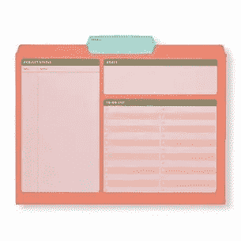
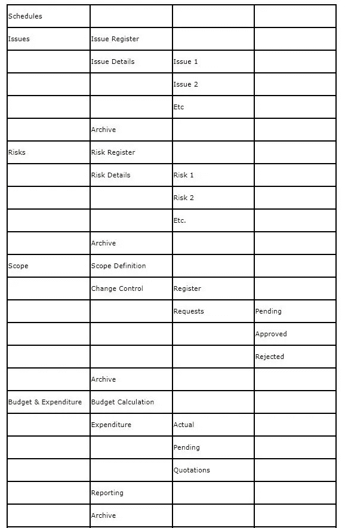

# 为最后一年项目创建和管理项目文件夹结构

> 原文：<https://medium.com/analytics-vidhya/creating-and-managing-project-folder-structure-for-final-year-report-be73f94833de?source=collection_archive---------18----------------------->

项目文件夹结构

# 1.概观

我最近被要求为学士级别的项目提供一个文件夹结构的建议。像大多数任务管理器一样，我已经改进了一些系统，但是从来没有好好考虑过。项目报告系统的形式有机地发展起来了。我查了谷歌，现在这对两者都没什么帮助。我认为这是一个合适的讨论话题。这听起来很琐碎，但是我越想越接近，越多的元素开始浮现。

## 1.1.为什么我们需要项目文件夹

如果你能考虑的唯一原因是保持事物的“整洁”,那么我相信你已经和我一样给了它一个大概的整体概念。还有一些其他原因，我将概述。

## 1.2.项目文件夹可访问性

在这个不断融合的全球环境中，诸如人员甘特图之类的东西被吸收到任务主计划中。像业务需求陈述这样不寻常的文件被用作其他项目的时尚。如果他们可以毫无问题地完成每项任务，那么生活方式就不会那么复杂了。如果我是一个全新的企业主管，需要了解 srs 看起来像什么，我可以深入到其他计划中并快速找到 srs 目录。

# 2.项目文件夹组织

那些一次次点击子目录寻找某个文件的人，走到了路的尽头，找到你一直在寻找的文件的最佳位置现在不在那里了？现在，我假设你坐在那里，每个手指都在空中。你现在可以放下了。拥有共同结构的另一个原因是，我们不受制于做出决定的人的扭曲思维发布注册需要在文件夹形状的底部，称为 l:biratmanaging system projects 2020 first quarter project xmiscellaneousupdatesrecentires
之后，您已经单击了 5 分钟，遵循每个可能的逻辑路线来发现注册，您进行了最有效的搜索，但什么也没有发现。然后你肯定会发现 2020 指的是企业的结束日期，而不是 2019 年的开始日期。顺便说一下，我们在 2020 年初改变了整个列表形状，并为任务 x 迁移了最简单的 1/2 文件。

## 2.1.组织选项

这个问题可能没有合适的解决方案。有两种广泛的策略:

通过节来组织，这样每个 pinnacle 目录就是一个节。举个例子，你可能有关于可行性、企业评估、设计和许多其他内容的目录。或者任何你的阶段被称为。通过特性来组织，以便巅峰列表阶段是能力。例如，风险、需求、范围、exchange 管理、开发。最多使用两种情况的混合。你有一个阶段性的巅峰阶段，下一个学位致力于功能。对于更大的计划，顶尖学位实际上也可以是一个企业附近。例如，对于 erp 实施，它可能是财务、制造、销售和许多其他部门。

## 2.2.我的项目文件夹组织方法

我更喜欢上面两个选项的组合结构。首先，我问自己什么会跨越阶段。比如:

*   问题
*   风险
*   预算
*   变更控制
*   每周报告
*   会议、日志和议程

所有倾向于跨越阶段。我首先为这些函数创建一组目录。

第二组目录涵盖了各个阶段。阶段下的下一级关注阶段中的特定活动。第一个子目录通常是规划，用于与阶段规划相关的任何内容。下一组目录是可交付物。例如，在初始阶段，我可能有以下目录:

*   项目章程
*   资源招聘
*   系统设置
*   设备采购
*   入职培训
*   多方面的

作为初始阶段的一部分，这些都是我需要实际交付的东西。快速浏览一下我的项目计划应该能告诉我可交付成果。

# 3.子目录

根据经验，如果列表超过 20 个文档，我会出现在子目录中。这些子目录也可以按时间(第 1 周、第 2 周、第 3 周)或阶段分割。如果 Change Control 将要生成 20 个或者更多的条目，我可能会在 change manipulate 下面创建子目录，主要基于阶段。月也同样有效。它仅仅依赖于预期的体积。

当我为我的最后一年项目工作时，我通常有一个“慢扔”抽屉或马尼拉文件夹。任何不再清楚是否必须归档，也不再清楚是否应该扔掉的东西都被放在了堆的顶端。每一个月或三个月，我从背面开始，评估背面的 1/2，看看它们是否被归档或丢弃。很难找到想要保留的东西。另一方面，大约一周一到两次，我会回到那堆东西中去检验一些我保存过的东西。通常只有一周左右。

对于项目，我通常会设置许多归档子目录。通常我会在文件前面加上日期(01 格式)来重命名文件，如果我需要找到一个旧文件，可以很容易地对其进行排序。通常，它被用作一种粗略的版本控制机制。

## 3.1.工作空间理念

另一个要设置的位置是每个人的工作目录。在这里，您可以购买正在开发和不完整的档案。一旦报告完成(即使是版本 0.1)，它必须被移动到一个永久目录。大约一个月之后，我会要求每个人花 10 分钟的时间，轻松完成他们的工作清单，这样文件数量就会保持较低且最新。

## 3.2.文件管理系统

市场上有许多文档管理系统，它们保存关于每个文档的元数据，并具有强大的搜索功能。如果你的组织有一个，你可能也会有一个标准的存储文档的结构。如果没有，您应该购买我们的项目管理员软件，它有一个内置的文档管理系统，可以描述每个文档并链接它们。它还提供了一个文档封面，上面有日期、版本等。这就去。

## 3.3.示例结构

下面是一个示例结构，您可能希望将其用作项目的起点。*注意-以此为例，您的组织将为您提供准确的示例。

项目文件夹结构示例

# 4.摘要

创建项目文件结构没有完美的方法。如果你真的想一想，你会为自己节省大量的时间和悲伤。当你在一个目录中有 100 个文档时，开始整理就太晚了。在你开始之前花一些时间，并且把一个项目文件结构准备好。即使它不完美，你也可以在以后修改它。