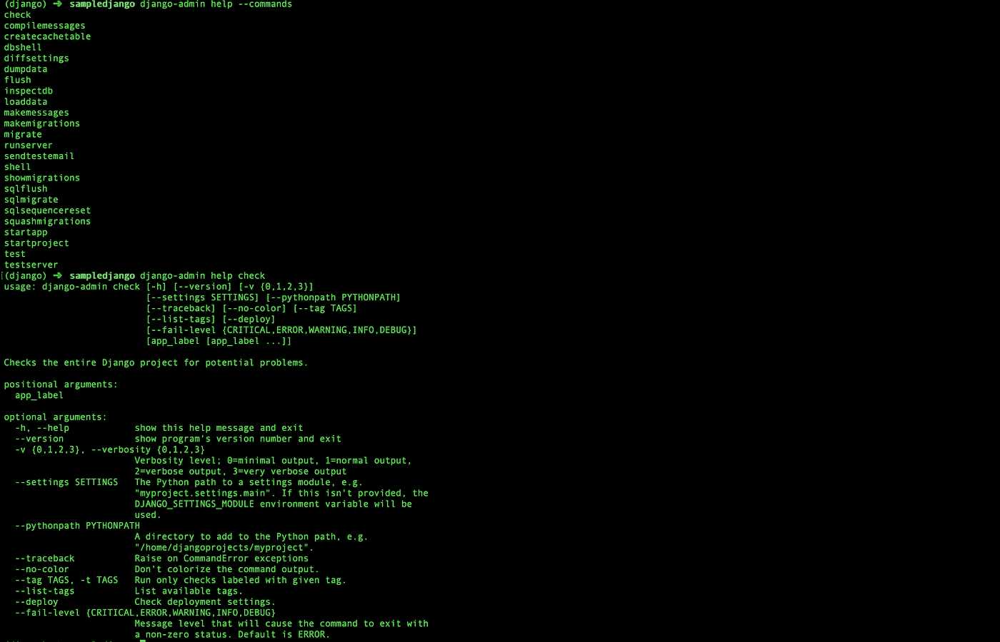
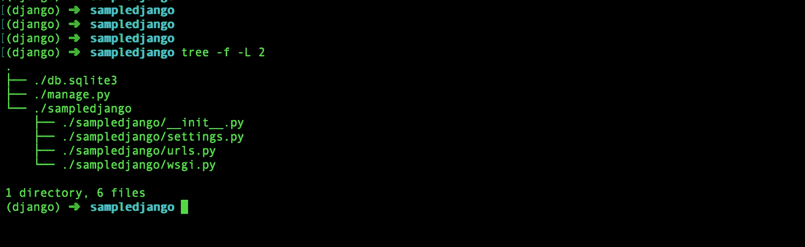
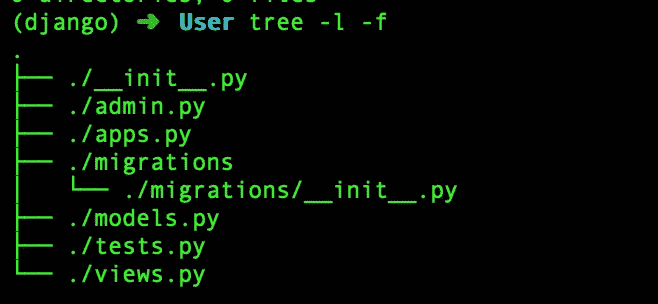

# 创建和理解你的第一个 Django 项目

> 原文：<https://medium.com/analytics-vidhya/creating-and-understanding-your-first-django-project-991d56f84944?source=collection_archive---------8----------------------->

从头做起😃

让我们直接进入正题，把我们的手弄脏。本文的目的是理解基础知识，而不仅仅是创建一个 Django 项目。有很多工具可以立即创建一个示例 Django 项目。

**第一步:创建虚拟环境**

我假设您的环境中已经运行了 python，那么下一个明显的步骤就是安装 Django。在此之前，如果我们创建一个虚拟环境会更好，这样我们就可以将这个项目与我们的其他项目隔离开来，这也有助于我们维护不同项目的不同版本的依赖关系

创建一个**虚拟环境**非常简单。

```
pip install virtualenv
virtualenv django
source django/bin/activate
```

上面的代码将安装 **virtualenv，**创建一个名为 **django** 的虚拟环境并激活它，这意味着我们现在在虚拟环境中，我们将要创建的项目将被隔离。如果你想离开这个环境，只需使用命令**停用**

**步骤 2** : **安装 Django**

下一步是安装 **Django**

```
pip install django
```

这将安装 Django。现在你都准备好了。


现在让我们继续创建我们的第一个 Django 项目

```
django-admin startproject sampledjango
```

上面的代码将创建一个名为 **sampledjango** 的 **Django 项目**(我不擅长记名字😓)对于有基础结构的你。是的，这个指挥部会处理好一切，我们根本不需要担心。顺便说一下，你可能想知道 django-admin 是什么……它是 django 的命令行管理工具

```
django-admin help --commands
```

这将列出所有可能的命令，如下所示，你也可以使用帮助命令来检查每个命令做什么。



如果您想了解 Django 如何在内部执行这些命令，您可以查看核心目录下 Django 文件夹中的相应代码。这不是必需的，但是如果您能够研究这些文件夹和文件，以便更好地理解这是如何做到的，那将是很好的。

**第三步** : **了解项目的结构**

现在，让我们看看我们的项目文件夹，看看它包含什么文件，他们做什么。



这就是我们的项目结构的样子。让我们了解每个文件的重要性

**。/manage.py:** 它是对 **django-admin** 的替代，两者是相同的，都用于运行服务器、运行测试、进行迁移、编辑迁移等等

**settings.py:** 这是一个设置文件，我们在其中存储与项目相关的配置，如密钥、数据库集群设置等

**urls.py** :这个文件保存路由和其他映射。这是您的 API 的触发点

**wsgi.py** :这是保存 wsgi 配置的文件。现在，你一定想知道什么是 **WSGI** 它代表 **Web 服务器网关接口**顾名思义，它充当 Web 服务器和 Django 应用程序之间的中间件或接口。

```
WSGI is the Standard and uWSGI is the implementation
```

我发现很多人对此感到困惑

这就是流动的样子

```
Web Client < --- > Web Server < --- > WSGI Server < --- > Django App
```

有几个流行的 WSGI 服务器可用，如 **uWSGI** 和 **gunicorn**

给你一点信息，告诉你我们为什么要用这个

web 服务器无法直接与 python 应用程序通信。所以社区提出了一个叫做 WSGI 的标准，它必须在 web 服务器和 python 框架上实现。我们现在实际上不需要担心它。

**步骤 4** : **启动应用**

既然我们的设置已经完成，并且我们了解了默认项目的样子，那么让我们继续运行 Django 服务器

```
./manage.py runserver
```

服务器在默认端口 8000 上运行。所以去浏览器尝试访问[***http://localhost:8000/***](http://localhost:8003/)***。*** *如果您看到成功消息，那么我们已经* ***成功运行了我们的第一个 Django 项目*** *。如果你想在不同的端口上运行它，使用下面的格式*

```
./manage.py runserver 8005
```

**第五步:创建应用**

既然我们的项目已经开始运行，让我们创建一个名为 **User 的应用程序。**那么，什么是 app 呢？你可以说 app 的组合是 Django 项目。

每个应用程序要么可以与其他应用程序完全隔离，要么可以与项目中的其他应用程序有一些依赖或关系，但我强烈建议您尽可能保持分离。

```
./manage.py startapp User
```

上面的命令将创建一个 app **用户**，其中包含一些文件。



**admin.py** :该文件用于配置 app 的管理相关内容

**apps.py** :该文件用于配置与该应用本身相关的设置

**迁移**:这个文件夹由迁移文件组成，这些文件有助于按顺序创建表，也就是说，基本上它是一种关于表是如何被修改的日志。

**models.py** :这个文件包含了基本上是类的模型，用于通过 Django 内置的 **ORM** 创建数据库表并与之通信

**tests.py** :这个文件是写与这个 app 本身相关的测试用例

这是一个主文件，我们应该把重点放在这个文件上，它将包含所有的函数或类，这些函数或类将是我们的 API

现在，既然我们已经创建了我们的应用程序，让我们继续进行项目配置。为此我们需要在 ***中添加 app INSTALLED _ APPS***

```
INSTALLED_APPS = [
    'django.contrib.admin',
    'django.contrib.auth',
    'django.contrib.contenttypes',
    'django.contrib.sessions',
    'django.contrib.messages',
    'django.contrib.staticfiles',
    'User'
]
```

正如你所看到的，已经有几个应用程序被列出来了，这些都是 Django 内部的。

**第六步**:创建模型

让我们创建一个具有一些基本属性的用户模型

models.py

既然我们已经创建了一个表示表的模型，下一步就是在数据库中创建相应的表。

那么我们要怎么做呢……好消息！Django 会处理它，我们需要做的就是运行下面的命令来创建 db 表。

```
./manage.py makemigrations User
./manage.py migrate
```

F**first**行将由 Django 创建一个迁移文件，这些文件基本上是关于如何将模型转换成数据库表的命令。

第二个**行将执行命令，并创建一个名为 User 的表，该表具有给定的属性和条件。**

一旦这两个命令成功运行，我们就可以进入下一步了。

如果你想更多地了解不同类型的 Django 字段。

 [## 模型字段参考| Django 文档| Django

### 文件上传字段。注意不支持 primary_key 参数，如果使用该参数将会引发错误。有两个可选的…

docs.djangoproject.com](https://docs.djangoproject.com/en/3.0/ref/models/fields/) 

**步骤 7** : URL 模式

那么，当请求到达应用程序时，它如何路由到适当的视图或功能呢？

我们将在 urls.py 中维护一个名为 **urlpatterns** 的映射，它是路由 URL 的主要文件。因此，Django 在收到请求时所做的是，它按顺序遍历每个 URL 模式，并在第一个匹配所请求的 URL 的模式处停止(可以是 regex 或精确匹配，如果您希望它是精确匹配，请使用**路径**)。

强烈建议在应用程序中编写特定于应用程序的 URL，并将其包含在主 urls.py 文件中，如下所示

第八步:设计视图

一旦 URL 匹配，它就执行映射到它的函数。有三种可能的视图

1.  基于功能的视图
2.  基于类的视图

**基于功能的视图**:

让我们创建一个基于函数的视图来获取用户的帐户余额

这只是一个示例视图，所以如果你想使用相同的 URL 模式创建、更新或删除，你必须在视图中使用 **request.method** 来相应地路由

**基于类的视图**:

Django 已经有了一个内置的视图类，它负责路由和其他事情。我们总是建议使用基于类的视图，而不是基于函数的视图，因为基于类的视图更面向对象，更广泛，并且可以在整个项目中重用。

我们需要做的就是如下继承视图类，我们调用基于类的视图的方式也是不同的

也有一些内置的 Django 通用的基于类的视图可供我们使用，或者总是建议创建我们自己的**基本视图**类，我们可以在不同的应用程序中使用。

既然我们已经完成了模型、视图和 URL 的创建，让我们来看看它们的运行情况。在 8005 端口运行服务器，并检查下面的输出

```
[http://localhost:8005/user](http://localhost:8005/user/)[http://localhost:8005/user/balance](http://localhost:8005/user/balance)
```

**结论**:

好了，你已经创建了你的第一个 Django 项目。现在，您需要做的就是尝试创建一些模型和视图，探索 Django 的核心代码，理解从请求到响应的流程。

我也附上代码供参考

[](https://gitlab.com/dundigallashanmukh/sample-django) [## dundigalla Shanmukh/SampleDjango

### 创建一个简单的 Django 项目

gitlab.com](https://gitlab.com/dundigallashanmukh/sample-django) 

在 Django 中还有很多东西需要理解，比如 ORM、日志、测试、管理站点和部署。就像我下面说的，上面的设置是本地的，但是创建一个活的 Django 项目，我们需要有 WSGI 和 NGINX 服务器。

如果你想要所有这些话题的文章，请在评论区告诉我。感谢阅读。

## 页（page 的缩写）如果你有任何疑问，请在 [Linkedin](https://www.linkedin.com/in/shanmukh-dundigalla-4910b5129/) 上给我留言

编辑:

这里有一篇关于如何登录 Django 的文章

[](/@dundigallashanmukh/django-logging-fba0f8d15e86) [## Django 伐木公司

### Django 使用 python 自己的日志模块来执行系统日志记录。所以 Django 只是给了一个选项来配置…

medium.com](/@dundigallashanmukh/django-logging-fba0f8d15e86)