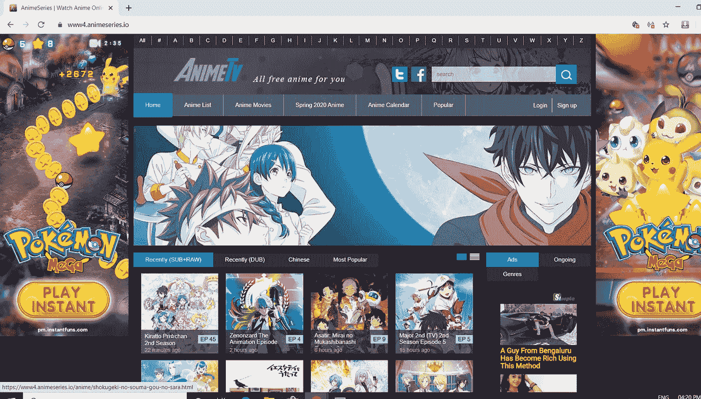
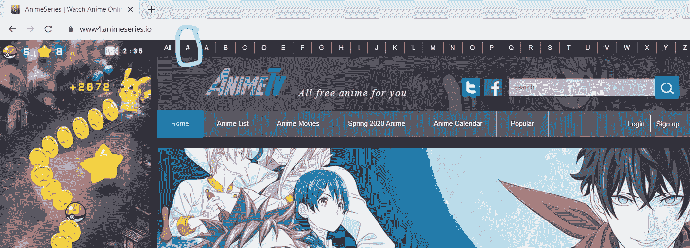
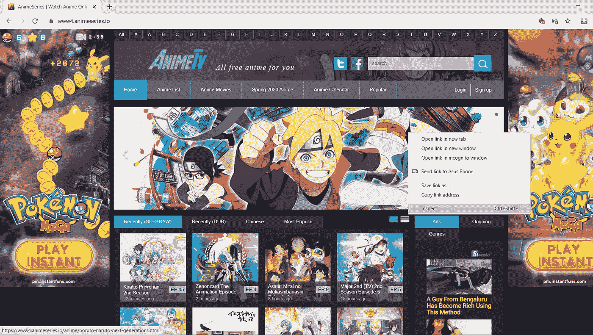
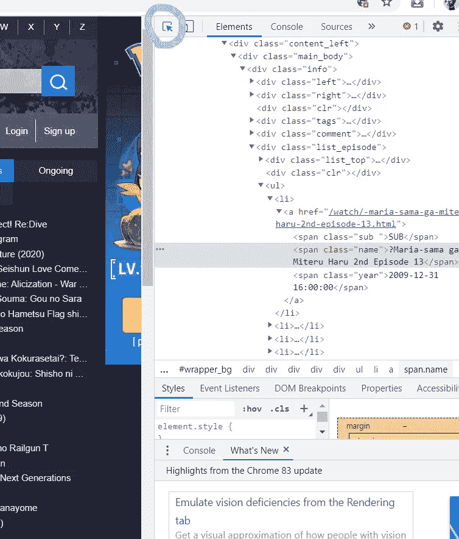
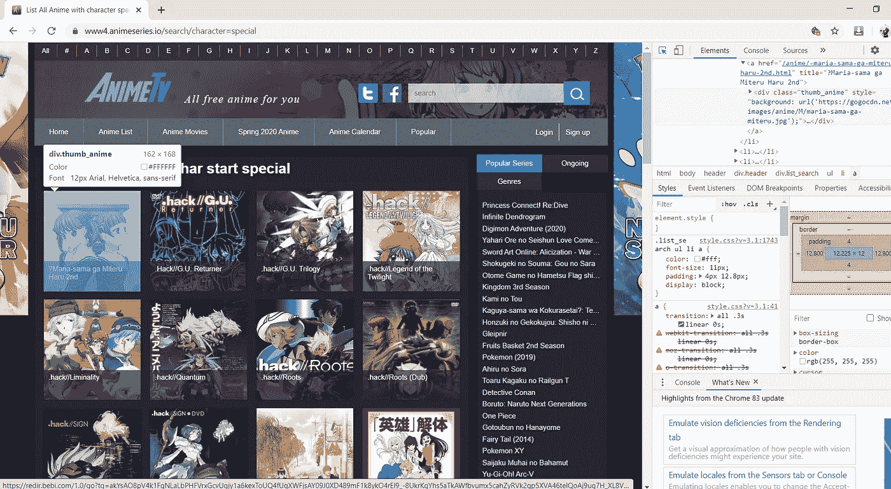
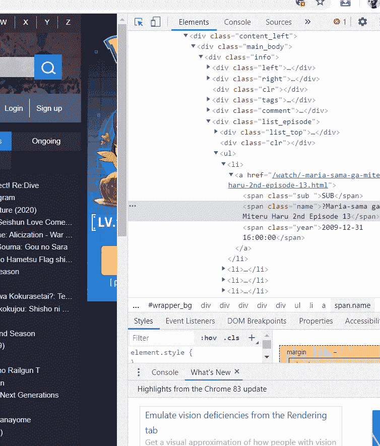
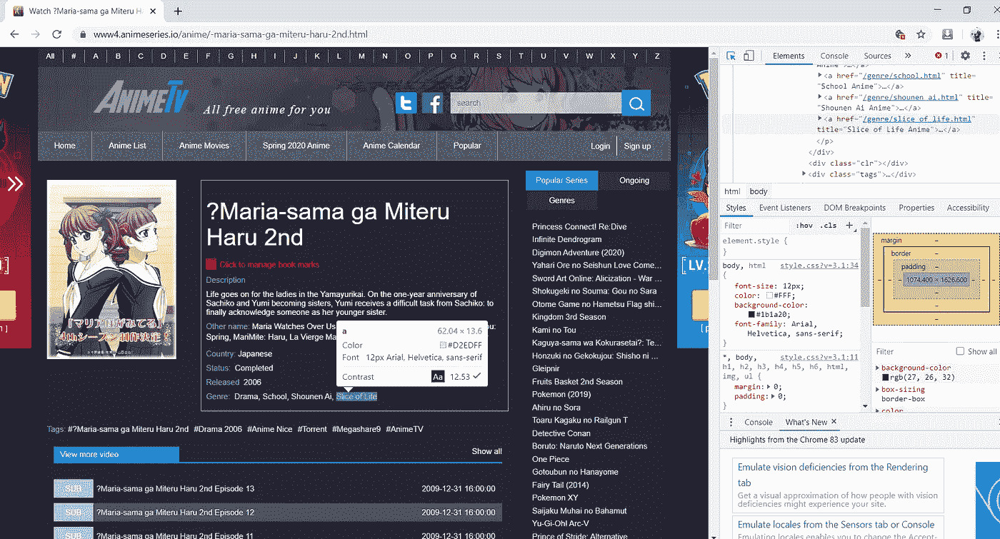
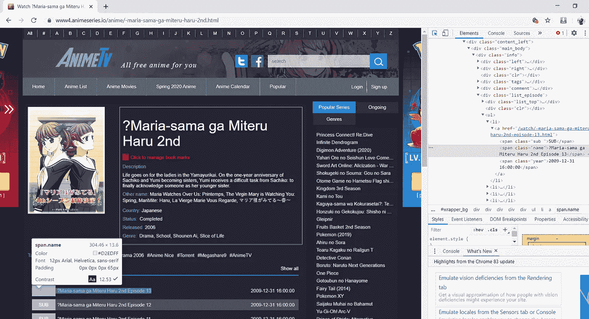

# 用 Web Scraping-Hand on 教程创建动漫数据库

> 原文：<https://medium.com/analytics-vidhya/creating-anime-database-with-web-scraping-hand-on-tutorial-6f90e2174be1?source=collection_archive---------10----------------------->

使用 python 和 urllib & BeautifulSoup 库创建一个动画数据库

[](https://github.com/Tejas-Haritsa-vk/Creating_Anime_Database_With_Web_Scraping) [## tejas-Haritsa-vk/Creating _ Anime _ Database _ With _ Web _ Scraping

### 网络抓取是一种用于从网站中提取大量数据的自动化方法。网站上的数据是…

github.com](https://github.com/Tejas-Haritsa-vk/Creating_Anime_Database_With_Web_Scraping) 

## 对于那些可能错过了第一部分介绍的人来说:

[](/@tejastejatej/creating-anime-database-with-web-scraping-introduction-b40916f03583) [## 用网络抓取创建动漫数据库-简介

### 使用 python 和 urllib & BeautifulSoup 库创建一个动画数据库

medium.com](/@tejastejatej/creating-anime-database-with-web-scraping-introduction-b40916f03583) 

# 网页抓取教程

*   在我们开始之前，本教程我们将使用谷歌浏览器。
*   谷歌浏览器的链接:“T0”https://www.google.com/intl/en/chrome/“T1”给那些需要它的人。
*   您还需要安装以下库:

```
*#importing required libraries* 
**import** **urllib** **from** **urllib.request** 
**import** Request, urlopen **from** **bs4** 
**import** BeautifulSoup **as** bs 
**import** **re** 
**import** **csv**
```

# 这篇文章的主题包括:如何检查和分析网页抓取

首先，我们需要一个网站来收集数据，在这篇文章中，我将使用“【https://www4.animeseries.io/】”作为例子。

```
base_url = "https://www4.animeseries.io" *#initilizing base url* 
url_template = https://www4.animeseries.io/search/character=special" *#initilizing url template for alphabetical search* 
url = url_template
```

## 步骤 1:导航到上述网站



## 第二步:导航并点击页面顶部“全部”旁边的“#”字符

*   当点击“#”时，它会把你带到 https://www4.animeseries.io/search/character=special 的



## 步骤 3:右键单击屏幕上的任意位置，然后单击检查选项



# 步骤 4:点击“在页面中选择一个元素进行检查”选项

*   在检查一个元素时，请密切注意它对应的 HTML 源代码以及它在层次结构中的位置。这在稍后通过 BeautifulSoup 提取数据时非常有用。



```
*#Below we will be requesting the html source code from the website through the urllib module's Request function & reading it using urlopen function*

*#Requesting for url using Request Library*
url_link = Request(url, headers={'User-Agent': 'Mozilla/5.0'}) *#using headers={'User-Agent': 'Mozilla/5.0'} for setting preferred browser*
url_page = urlopen(url_link).read() *#reading url*
url_html = bs(url_page, 'html.parser') *#parsing html file using BeautifulSoup (getting the html source code)**#Familiarize yourself with the HTML Structure to better navigate through it*
url_html *# viweing the raw HTML source code*
```

*   *raw HTML 源代码，试着读几行，了解基本结构。如果你没有得到它，不要担心，我们稍后会详细介绍它*

```
<!DOCTYPE html>

<html itemscope="" itemtype="http://schema.org/WebPage" lang="en-US" >
<head prefix="og: http://ogp.me/ns# fb: http://ogp.me/ns/fb# article: http://ogp.me/ns/article#">
<meta charset="utf-8"/>
<meta content="width=device-width, initial-scale=1.0, minimum-scale=1.0, user-scalable=no" name="viewport"/>
<link href="https://gmpg.org/xfn/11" rel="profile"/>
<link href="https://www4.animeseries.io/favicon.png" rel="shortcut icon"/>
<meta content="F64RcKpc425o569H2C1hLW7A9ZObUdTf0AHIDEa4dL4" name="google-site-verification"/>
<title>List All Anime with character special at Anime Series | Anime List</title>
<meta content="noodp, noydir" name="robots"/>
<meta content="List All Anime with character special at Anime Series | Anime List" name="description"/>
<meta content="List All Anime with character special at Anime Series .
.
.
.
.
.
<meta content="https://www4.animeseries.io/images/logo.png" property="og:image"/>
<meta content="https://www4.animeseries.io/images/logo.png" property="og:image:secure_url"/>
<meta content="summary" property="twitter:card"/>
<meta content="List All Anime with character special at Anime Series | Anime List" property="twitter:title"/>
<meta content="List All Anime with character special at Anime Series | Anime List" property="twitter:description"/>
<meta content="5ed3d26d380fb" name="csrf-token"/>
<link href="https://www4.animeseries.io/avatar/icon_192x192.png" rel="apple-touch-icon" sizes="192x192">
<link href="https://www4.animeseries.io/avatar/icon_120x120.png" rel="apple-touch-icon" sizes="120x120">
<link href="https://www4.animeseries.io/avatar/icon_87x87.png" rel="apple-touch-icon" sizes="87x87"/>
<link href="https://www4.animeseries.io/avatar/icon_80x80.png" rel="apple-touch-icon" sizes="80x80"/>
<link href="https://www4.animeseries.io/avatar/icon_60x60.png" rel="apple-touch-icon" sizes="60x60"/>
<link href="https://www4.animeseries.io/avatar/icon_58x58.png" rel="apple-touch-icon" sizes="58x58"/>
<link href="https://www4.animeseries.io/avatar/icon_32x32.png" rel="apple-touch-icon" sizes="32x32"/>
<link href="https://www4.animeseries.io/avatar/icon_16x16.png" rel="apple-touch-icon" sizes="16x16"/>
<link href="https://www4.animeseries.io/search/character=special" rel="canonical"/>
<link href="https://www4.animeseries.io/search/character=special" hreflang="en-us" rel="alternate"/>
<link href="https://www4.animeseries.io/css/font.css?v=3.1" rel="stylesheet" type="text/css"/>
<link href="https://www4.animeseries.io/css/style.css?v=3.1" rel="stylesheet" type="text/css"/>
<link href="https://www4.animeseries.io/css/res.css?v=3.1" rel="stylesheet" type="text/css"/>
<link href="https://www4.animeseries.io/js/fancybox/jquery.fancybox.css?v=3.1" rel="stylesheet" type="text/css"/>
<link href="https://www4.animeseries.io/css/font-awesome.min.css?v=3.1" rel="stylesheet" type="text/css"/>
<script src="https://www4.animeseries.io/js/jquery.js" type="text/javascript"></script>
</link></link></meta></meta></meta></head>
<body>
.
.
.
.
.
title="Spring 2020 Anime">Spring 2020 Anime</a></li>
<li><a href="https://www4.animeseries.io/calendar.html" title="Anime Calendar">Anime Calendar</a></li>
<li><a href="https://www4.animeseries.io/popular-anime" title="Popular Anime">Popular</a></li>
<li class="user">
<a href="/login.html" title="login animetv">Login</a>
<a href="/register.html" title="register animetv">Sign up</a>
</li>
</ul>
</div>
</div>
<header>
<div class="header">
<div class="list_search">
<ul>
<li><a href="/list.html" title="Anime List">All</a></li>
<li><a href="/search/character=special" title="Anime List With Special Character">#</a></li>
<li>
<a href="/search/character=A" title="Anime List With A Character">A</a>
</li>
<li>
<a href="/search/character=B" title="Anime List With B Character">B</a>
</li>
<li>
<a href="/search/character=C" title="Anime List With C Character">C</a>
</li>
<li>
.
.
.
.
.
</ul>
</div>
<div class="clr"></div>
<div class="logo">
<div class="left">
<a href="/" title="Home">
 </a>
</div>
<div class="center">
 </div>
<div class="right">
<div class="form">
<form action="/search" id="search-form">
<div class="row">
<input autocomplete="off" id="search" name="keyword" placeholder="search" type="text"/>
<input type="submit" value=""/>
</div>
</form>
</div>
<div class="clr"></div>
</div>
</div>
<div class="clr"></div>
<nav class="menu_top"><ul>
<li><a href="https://www4.animeseries.io/" title="Home">Home</a></li>
<li><a href="https://www4.animeseries.io/list.html" title="Anime list">Anime List</a></li>
<li><a href="https://www4.animeseries.io/anime-movies" title="Anime Movies">Anime Movies</a></li>
<li>
.
.
.
.
.
</li>
</ul></nav>
<ul class="auth"> <li class="user">
<a href="/login.html" title="login animetv">Login</a>
<a href="/register.html" title="register animetv">Sign up</a>
</li>
</ul>
<ul class="social">
<li><a href="https://twitter.com/animenetwork5/" target="_blank"></a></li>
<li><a href="https://www.facebook.com/Anime4funNetwork/" target="_blank"></a></li>
</ul>
</div>
</header>
<div class="clr"></div>
<div class="wrapper_nen">
<div id="wrapper_inside">
<div id="wrapper">
<div id="wrapper_bg">
<div class="content">
<div class="content_left">
<div class="main_body">
<div class="content_episode revent datagrild">
<h1 class="search-title">List all Anime with char start special</h1>
<ul class="items">
<li>
<a href="/anime/-maria-sama-ga-miteru-haru-2nd.html" title="?Maria-sama ga Miteru Haru 2nd">
<div class="thumb_anime" style="background: url('https://gogocdn.net/images/anime/M/maria-sama-ga-miteru.jpg');">
<div class="bottom" style="padding: 5px 8px;">
<div class="name">?Maria-sama ga Miteru Haru 2nd</div>
</div>
</div>
</a>
</li>
<li>
<a href="/anime/hackgu-returner.html" title=".Hack//G.U. Returner">
<div class="thumb_anime" style="background: url('https://gogocdn.net/images/anime/5745.jpg');">
<div class="bottom" style="padding: 5px 8px;">
<div class="name">.Hack//G.U. Returner</div>
</div>
</div>
</a>
</li>
<li>
<a href="/anime/hackgu-trilogy.html" title=".hack//G.U. Trilogy">
<div class="thumb_anime" style="background: url('https://gogocdn.net/images/Trilogy.jpg');">
<div class="bottom" style="padding: 5px 8px;">
<div class="name">.hack//G.U. Trilogy</div>
</div>
</div>
</a>
</li>
<li>
<a href="/anime/hacklegend-of-the-twilight.html" title=".hack//Legend of the Twilight">
<div class="thumb_anime" style="background: url('https://gogocdn.net/images/anime/hacklegend-of-the-twilight2.jpg');">
<div class="bottom" style="padding: 5px 8px;">
<div class="name">.hack//Legend of the Twilight</div>
</div>
.
.
.
.
.
.
<li>
<a href="/anime/hacksign-dub.html" title=".hack//Sign (Dub)">
<div class="thumb_anime" style="background: url('https://gogocdn.net/cover/hacksign-dub.jpg');">
<div class="bottom" style="padding: 5px 8px;">
<div class="name">.hack//Sign (Dub)</div>
</div>
</div>
</a>
</li>
<li>
<a href="/anime/hackthe-movie-sekai-no-mukou-ni.html" title=".hack//The Movie: Sekai no Mukou ni">
<div class="thumb_anime" style="background: url('https://gogocdn.net/images/hack The Movie Sekai no Mukou ni.jpg');">
<div class="bottom" style="padding: 5px 8px;">
<div class="name">.hack//The Movie: Sekai no Mukou ni</div>
</div>
</div>
</a>
</li>
<li>
<a href="/anime/eiyuu-kaitai.html" title='"Eiyuu" Kaitai'>
<div class="thumb_anime" style="background: url('https://gogocdn.net/cover/eiyuu-kaitai.png');">
<div class="bottom" style="padding: 5px 8px;">
<div class="name">"Eiyuu" Kaitai</div>
</div>
</div>
</a>
</li>
<li>
<a href="/anime/009-recyborg.html" title="009 Re:Cyborg">
<div class="thumb_anime" style="background: url('https://gogocdn.net/images/anime/126644.jpg');">
<div class="bottom" style="padding: 5px 8px;">
<div class="name">009 Re:Cyborg</div>
</div>
</div>
</a>
</li>
<li>
<a href="/anime/009-recyborg-dub.html" title="009 Re:Cyborg (Dub)">
<div class="thumb_anime" style="background: url('https://gogocdn.net/cover/009-recyborg-dub.jpg');">
<div class="bottom" style="padding: 5px 8px;">
<div class="name">009 Re:Cyborg (Dub)</div>
</div>
</div>
</a>
</li>
<li>
<a href="/anime/009-1.html" title="009-1">
<div class="thumb_anime" style="background: url('https://gogocdn.net/images/anime/A/009-1.jpg');">
<div class="bottom" style="padding: 5px 8px;">
<div class="name">009-1</div>
</div>
</div>
</a>
</li>
.
.
.
.
.
<a href="/anime/100-pascal-sensei.html" title="100% Pascal-sensei">
<div class="thumb_anime" style="background: url('https://gogocdn.net/cover/100-pascal-sensei.png');">
<div class="bottom" style="padding: 5px 8px;">
<div class="name">100% Pascal-sensei</div>
</div>
</div>
</a>
</li>
<li>
<a href="/anime/1001-nights.html" title="1001 Nights">
<div class="thumb_anime" style="background: url('https://gogocdn.net/images/1001 Nights.jpg');">
<div class="bottom" style="padding: 5px 8px;">
<div class="name">1001 Nights</div>
</div>
</div>
</a>
</li>
<li>
<a href="/anime/1001-nights-dub.html" title="1001 Nights (Dub)">
<div class="thumb_anime" style="background: url('https://gogocdn.net/cover/1001-nights-dub.png');">
<div class="bottom" style="padding: 5px 8px;">
.
.
.
.
.
.
</ul>
<div class="main_body right">
<div class="main_body_black right ads">
<div class="series">
<nav class="menu_series">
<ul>
<li>
<a href="/anime/princess-connect-redive.html" title="Princess Connect! Re:Dive">Princess Connect! Re:Dive</a>
</li>
<li>
<a href="/anime/infinite-dendrogram.html" title="Infinite Dendrogram">Infinite Dendrogram</a>
</li>
<li>
<a href="/anime/digimon-adventure-2020.html" title="Digimon Adventure (2020)">Digimon Adventure (2020)</a>
</li>
<li>
<a href="/anime/yahari-ore-no-seishun-love-comedy-wa-machigatteiru-kan.html" title="Yahari Ore no Seishun Love Comedy wa Machigatteiru. Kan">Yahari Ore no Seishun Love Comedy wa Machigatteiru. Kan</a>
</li>
<li>
<a href="/anime/sword-art-online-alicization-war-of-underworld-2nd-season.html" title="Sword Art Online: Alicization - War of Underworld 2nd Season">Sword Art Online: Alicization - War of Underworld 2nd Season</a>
</li>
<li>
<a href="/anime/shokugeki-no-souma-gou-no-sara.html" title="Shokugeki no Souma: Gou no Sara">Shokugeki no Souma: Gou no Sara</a>
</li>
<li>
<a href="/anime/otome-game-no-hametsu-flag-shika-nai-akuyaku-reijou-ni-tensei-shiteshimatta.html" title="Otome Game no Hametsu Flag shika Nai Akuyaku Reijou ni Tensei shiteshimatta...">Otome Game no Hametsu Flag shika Nai Akuyaku Reijou ni Tensei shiteshimatta...</a>
</li>
<li>
<a href="/anime/kingdom-3rd-season.html" title="Kingdom 3rd Season">Kingdom 3rd Season</a>
</li>
<li>
<a href="/anime/kami-no-tou.html" title="Kami no Tou">Kami no Tou</a>
</li>
<li>
<a href="/anime/kaguya-sama-wa-kokurasetai-tensai-tachi-no-renai-zunousen-2.html" title="Kaguya-sama wa Kokurasetai?: Tensai-tachi no Renai Zunousen 2">Kaguya-sama wa Kokurasetai?: Tensai-tachi no Renai Zunousen 2</a>
</li>
<li>......
</body>
</html>
```

## 步骤 5:将你的鼠标悬停在一个动画图片上

*   将鼠标悬停在其中一个动画图片上，并在右侧的 inspect 屏幕上查看相应的 html 源代码。
*   请注意它是如何被包含在“”中的。这将作为一个检查点，当我们开始抓取时，我们可以使用它作为参考。



## 第六步:查看并理解当前页面的结构吧

*   "通过 Beautifulsoup 模块，使用命令" html _ code _ variable . find*all(' div '，class*= " your _ required _ class ")"
*   在这种情况下，我们的命令将是“url_html.find *all('div '，class*= " content _ episode revent datagril ")”，如在“动画网站数据搜集”笔记本和下面的代码单元格/块中所使用的。



```
*#Getting all div's having class_='content_episode revent datagrild'*containers = url_html.find_all('div',class_='content_episode revent datagrild')containers *#viewing data inside containers variable*
```

*   让我们查看容器变量中的数据

```
[<div class="content_episode revent datagrild">
 <h1 class="search-title">List all Anime with char start special</h1>
 <ul class="items">
 <li>
 <a href="/anime/-maria-sama-ga-miteru-haru-2nd.html" title="?Maria-sama ga Miteru Haru 2nd">
 <div class="thumb_anime" style="background: url('https://gogocdn.net/images/anime/M/maria-sama-ga-miteru.jpg');">
 <div class="bottom" style="padding: 5px 8px;">
 <div class="name">?Maria-sama ga Miteru Haru 2nd</div>
 </div>
 </div>
 </a>
 </li>
 <li>
 <a href="/anime/hackgu-returner.html" title=".Hack//G.U. Returner">
 <div class="thumb_anime" style="background: url('https://gogocdn.net/images/anime/5745.jpg');">
 <div class="bottom" style="padding: 5px 8px;">
 <div class="name">.Hack//G.U. Returner</div>
 </div>
 </div>
 </a>
 </li>
 <li>
 <a href="/anime/hackgu-trilogy.html" title=".hack//G.U. Trilogy">
 <div class="thumb_anime" style="background: url('https://gogocdn.net/images/Trilogy.jpg');">
 <div class="bottom" style="padding: 5px 8px;">
 <div class="name">.hack//G.U. Trilogy</div>
 </div>
 </div>
 </a>
 </li>
 <li>
 <a href="/anime/hacklegend-of-the-twilight.html" title=".hack//Legend of the Twilight">
 <div class="thumb_anime" style="background: url('https://gogocdn.net/images/anime/hacklegend-of-the-twilight2.jpg');">
 <div class="bottom" style="padding: 5px 8px;">
 <div class="name">.hack//Legend of the Twilight</div>
 </div>
 </div>
 </a>
 </li>
 <li>
.
.
.
.
.
.</div>]
```

## 第七步:导航并点击动画图片打开它

*   下面我们使用了 for 循环来遍历当前页面中的每个动画标题。这里为了演示的目的，我们将只讨论循环的第一次迭代。



*   通过点击动画图片，我们将被带到"[https://www4 . animeseries . io/Anime/-Maria-sama-ga-miteru-haru-2nd . html](https://www4.animeseries.io/anime/-maria-sama-ga-miteru-haru-2nd.html)"

```
*#looping through containers to extract more detailed info*
**for** items **in** containers[:1]:

    animes = items.find_all('div',class_ = "name") *#extracting name/title of all Anime in the current page*
    html_links = items.find_all('a') *#getting url of anime*

anime = animes[0],
html_link = html_links[0]animes[0],'**\n**',html_links[0] *# viewing an Anime Title & its corresponding html link*
```

*   输出:

```
(<div class="name">?Maria-sama ga Miteru Haru 2nd</div>,
 '\n',
 <a href="/anime/-maria-sama-ga-miteru-haru-2nd.html" title="?Maria-sama ga Miteru Haru 2nd">
 <div class="thumb_anime" style="background: url('https://gogocdn.net/images/anime/M/maria-sama-ga-miteru.jpg');">
 <div class="bottom" style="padding: 5px 8px;">
 <div class="name">?Maria-sama ga Miteru Haru 2nd</div>
 </div>
 </div>
 </a>)
```

*   *注意:在上面的代码单元/块中,“class="name " "后面的文本是动画的标题,“href”给出了到其源页面的部分 html 链接。为了获得上面“步骤 7”中所示的完整的 html 链接，我们需要将 base_url 和 html_link 结合起来。*

```
*#By combining the base_url and html_link we get the full HTML source link as shown below* *#using .get('href') function to obtain the html_link* new_url = base_url+html_link.get('href') 
print(new_url)
```

*   输出:

```
[https://www4.animeseries.io/anime/-maria-sama-ga-miteru-haru-2nd.html](https://www4.animeseries.io/anime/-maria-sama-ga-miteru-haru-2nd.html)
```

## 第八步:重复第三步和第四步

*   现在导航到动画描述的不同部分来查看它的 HTML 源代码



*   分析描述框(在 HTML 源代码中名为“div.right ”)的结构及其内容，看看标题“description ”(名为)及其文本是如何被包含在同一个带有 class="right "的中的，该文本又被包含在带有 class="main_body "的中。
*   这将作为稍后描述框中所有内容的进一步数据提取的定位点

```
*#initilizing some variables to store the data we are about to collect*
anime_dict = {}

*#we will be using for loop in the main code to loop through all the anime titles the is available in each page* 
**for** i,anime **in** enumerate(animes[:1]): 
    name=''
    description=''
    season=''
    genre=''
    new_url=''
    status=''
    episodes=''
    status
    initial_air_date=''
    movie=''
    sub=''

    title = anime.text*#find('div',class_ = "name").text #getting name of anime*
    html_link = html_links[i].get('href') *#getting url of anime*

    *#Checking if Season in mentioned in title & extracting both name and season seperatly*
    *#using  regex search function to extract Anime Title and Season seperatly*
    **if** re.search(r"Season [0-9]?",title):
        name,season = re.split(r"Season [0-9]?",title) *#spliting title content based on " Season " text*
    **elif** re.search(r"[0-9][a-z]+? Season",title):
        name,season = re.split(r"[0-9][a-z]+? Season",title) *#spliting title content based on " Season " text*
    **elif** re.search(r"[0-9][a-z][a-z]",title):
        **try**:
            name,season = re.split(r"[0-9]['nd','rd','th']+",title) *#spliting title content based on " Season " text*
        **except**:
            name = re.split(r"[0-9]['nd','rd','th']+",title)[0] *#spliting title content based on " Season " text*
    **else**:
        name = title *#if no " Season " text is found in the Anime title Initilizing name = title*

    *#initilizing a pattern to search for " Season " in the Anime Title using regex*
    pattern = r"^([0-9][a-z]+? Season | Season [0-9][a-z]+?\s )$"
    season = re.search(pattern,title) *#using regex search function to search for pattern*

    **if** **not** season:
        pattern = r"[0-9]['nd','rd','th']+"
        season = re.search(pattern,title) *#using regex search function to search for pattern*

    **if** season:
        **pass** *#if season is already found do nothing*
    **else**:
        season = ["Season 1"] *#if season is still not found Initilizing season = ["Season 1"]*

    *#Initilizing " sub " variable as 'Dub' or 'Sub' based on its Apperance in Title*
    **if** 'Dub' **in** title **or** 'dub' **in** title:
        sub = 'Dub' 
    **else**:
        sub = 'Sub'
```

## 步骤 9:从描述框中提取所需的数据，并将它们存储到我们之前在上述代码单元/块中初始化的各个变量中

*   现在，让我们创建一个新的 url，重新路由到主页以提取更多信息

```
*#creating new_url to reroute to anime main page to extract more detatiled information such as:*
*#1\. description*
*#2\. status*
*#3\. initial air date*
*#4\. genre*
*#5\. total number of episodes*
new_url = base_url+html_link
new_url = new_url.replace('watch','anime')

url_link = Request(new_url, headers={'User-Agent': 'Mozilla/5.0'})
url_page = urlopen(url_link).read()
url_html = bs(url_page, 'html.parser')

*#getting div's with class_="main_body"*
containers = url_html.find_all('div',class_="main_body")
*#getting div's with class_="right"*
contents = containers[0].find_all('div',class_='right')

*#extracting description of anime*
description = contents[0].find_all('p')[0].text 
*#extracting status, initial air date, genre & total number of episodes of anime*
temp=[]
genre=[]
**for** i **in** contents[0].find_all('a')[2:]:
    temp.append(i.text)

status,initial_air_date = temp[:2]
genre = temp[2:]
genre = ', '.join(genre)

containers = containers[0].find_all('div',class_='list_episode')
**try**:
    text = containers[0].find('span',class_='name').text
    text = re.search('Episode [0-9]+',text)
    episodes = re.search('[0-9]+',text[0])[0]
    **if** int(episodes) > 0 **and** int(episodes) < 2:
        movie = 'Movie'
    **else**:
        movie = 'Series'
**except**:
    episodes = 'None'
    movie = 'None'
```

*   现在让我们构建所有收集的数据

```
*#Gathering all the data collected till now into a dictionary to structure it based on Anime Title*
*#adding all extracted information in Anime dict*
anime_dict['Anime Title'] = name
anime_dict['Description'] = description
anime_dict['Current/Latest Season'] = season[0]
anime_dict['URL'] = new_url
anime_dict['Status'] = status
anime_dict['Initial Air Date'] = initial_air_date
anime_dict['Genre'] = genre
anime_dict['Episodes Aired'] = episodes
anime_dict['Series/Movie'] = movie
anime_dict['Sub/Dub'] = sub*#we will be appending the anime_dict variable to list variable " Anime " after each loop to store all the data from each loop*
*#here for the sake of demo we'll be appening anime_data only once*
Anime = []
Anime.append(anime_dict)
```

## 步骤 10:将目前收集的非结构化数据写入结构化的(csv)格式

*   现在让我们保存提取的数据

```
*#Writing the Unstructured data collected till now into a Structured (.csv) format*
*#Initilizing the header file*
header = ['Anime Title', 'Description', 'Current/Latest Season', 'Episodes Aired', 'Status', 'Initial Air Date', 'Genre', 'Sub/Dub', 'Series/Movie', 'URL']

*#Writing the collected data into readable format i.e, .csv file*
**with** open(r'C:\Users\usr\folder\Anime_Data_Base_v01.csv', 'w+', newline='', encoding="utf-8") **as** csvfile:
    writer = csv.DictWriter(csvfile, fieldnames=header)

    writer.writeheader()
    writer.writerows(Anime)

print("CSV file saved to: ",r'C:\Users\usr\folder\Anime_Data_Base.csv')
```

# 祝贺你完成教程！！！现在你有了一个包含一部动画数据的. csv 文件

完整的工作源代码请查看我的 Github 上的“动漫网站数据抓取. ipynb”文件。

[](https://github.com/Tejas-Haritsa-vk/Creating_Anime_Database_With_Web_Scraping) [## tejas-Haritsa-vk/Creating _ Anime _ Database _ With _ Web _ Scraping

### 网络抓取是一种用于从网站中提取大量数据的自动化方法。网站上的数据是…

github.com](https://github.com/Tejas-Haritsa-vk/Creating_Anime_Database_With_Web_Scraping) 

希望这对你有帮助。