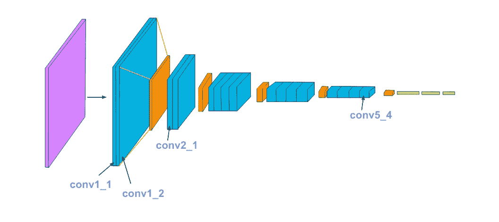

# 用人工智能创造艺术

> 原文：<https://medium.com/analytics-vidhya/creating-art-using-ai-dcee46793028?source=collection_archive---------16----------------------->

## 不需要画笔，只需要 PyTorch


有了人工智能，你可以把两张图片合成一张新的，就像这样:


图像芝加哥结合雨公主画。

这被称为风格转移，它的工作原理是采用一个图像的内容和另一个图像的风格，创建一个新的目标图像，它结合了以前图像的内容和风格。

下面的解释和代码来自 Udacity 的[风格迁移练习笔记本](https://colab.research.google.com/drive/1rXkHKJzH9u2hs-OAqxDLNvotVxieg9S1)，来自他们的[用 Pytorch 介绍深度学习课程](https://www.udacity.com/course/deep-learning-pytorch--ud188)，是我最近完成的。我觉得这是一个很好的方式让人们开始使用风格转移的概念，并希望分享我用它创造的东西。

风格转换可以使用 PyTorch 和预先训练好的 [VGG19 网络](https://www.cv-foundation.org/openaccess/content_cvpr_2016/papers/Gatys_Image_Style_Transfer_CVPR_2016_paper.pdf)中的功能来完成。该网络将彩色图像作为输入，并将其通过一系列卷积/池层，以及三个完全连接的层，这些层对传入的图像进行分类，并提取内容和风格特征。从这些特征中产生损失，以迭代地更新目标图像，直到获得期望的结果。

为了实现这一点，网络将获取内容图像，通过前馈过程，直到它到达网络中的卷积层。该层的输出将是输入图像的内容表示。当它看到样式图像时，它将从不同的层获取代表图像样式的特征。最后，它将使用内容和样式表示来创建目标图像。



VGG19 架构

我用笔记本上的代码创作了我可爱的艺术作品，我将它命名为“着火了” [*Gudetama*](https://www.vox.com/2017/4/3/14685348/gudetama-sanrio-hello-kitty-explained) *！*'


Gudetama 着火了！

要开始，首先打开 [Google Colab](https://colab.research.google.com/notebooks/intro.ipynb) ，这样你就可以创建一个笔记本，而不用担心进口和使用他们的 GPU。

导入适当的资源。

```
%matplotlib inline
from PIL import Image
from io import BytesIO
import matplotlib.pyplot as plt
import numpy as np
import torch
import torch.optim as optim
import requests
from torchvision import transforms, models
```

加载预训练的 VGG19 网络。

```
# use the convolutional and pooling layers to get the "features" 
# portion of VGG19 
vgg = models.vgg19(pretrained=True).features# freeze all VGG parameters as we're only optimizing the target 
# image
for param in vgg.parameters():
    param.requires_grad_(False)
```

你应该知道这个:


下载 VGG19 预训练模型。

您可以通过运行以下命令来查看 VGG 模型:

```
# move the model to GPU, if available (but since I'm using colab
# it doesn't really matter
device = torch.device("cuda" if torch.cuda.is_available() else\ "cpu")print (vgg)
```

您应该得到这样的结果:


VGG 网络的片段。

将您的内容和风格图片上传到 Colab。


这个辅助函数将帮助你加载任何类型和大小的图像，并将它们转换成归一化张量。

接下来，通过文件名加载图像。我们还将确保样式图像与内容图像的大小相同。

```
# load in content and style image
content = load_image('Gudetama.png').to(device)
# Resize style to match content, makes code easier
style = load_image('Leaves.jpg',shape=content.shape[-2:]).to(device)
```

现在，这个辅助函数将用于对图像进行非归一化处理，并将其从张量图像转换为 numpy 图像以供显示。

让我们展示我们的内容和风格图像！

```
# display the content and style images side-by-side
fig, (ax1, ax2) = plt.subplots(1, 2, figsize=(20, 10))
ax1.imshow(im_convert(content))
ax2.imshow(im_convert(style))
```


显示我们的内容和样式图像。

我们现在可以通过 VGG19 网络传递一个图像，以获取它的内容和样式表示。这是重复的，直到我们得到我们想要的层和输出。

接下来，下面的函数将图层名称映射到 VGG19 网络中的名称，我们用它来获取内容和样式表示。

下面是一个得到一个卷积层的[克矩阵](https://en.wikipedia.org/wiki/Gramian_matrix)的计算的函数。

```
def gram_matrix(tensor):
    ## get the batch_size, depth, height, and width of the Tensor
    _, d, h, w = tensor.size()

    # reshape so we're multiplying the features for each channel
    tensor = tensor.view(d, h * w) # calculate the gram matrix
    gram = torch.mm(tensor, tensor.t()) return gram
```

通过编写这些函数，我们可以从图像中提取特征，并计算样式表示中每一层的 gram 矩阵。

```
# get content and style features only once before forming the target # image
content_features = get_features(content, vgg)
style_features = get_features(style, vgg)# calculate the gram matrices for each layer of our style 
# representation
style_grams = {layer: gram_matrix(style_features[layer]) for layer\ in style_features}# create a third "target" image and prep it for change
# it is a good idea to start off with the target as a copy of our 
# *content* image then iteratively change its style
target = content.clone().requires_grad_(True).to(device)
```

## 内容样式和权重

可以为每个相关层的样式表示赋予权重(范围在 0 到 1 之间)。通过给第一层(`conv1_1`和`conv2_1`)更大的权重，你可以期望在最终的目标图像中得到更大的风格特征。将权重添加到后面的层，将导致目标图像上的特征变小。

`content_weight`和`style_weight`将影响你最终图像的风格化程度。建议将`content_weight`设为 1，并根据您想要的目标图像风格设置`style_weight`。

```
# weights for each style layer
# weighting earlier layers more will result in *larger* style 
# features
style_weights = {'conv1_1': 1.,
                 'conv2_1': 0.8,
                 'conv3_1': 0.5,
                 'conv4_1': 0.3,
                 'conv5_1': 0.1}content_weight = 1  
style_weight = 1e6 
```

## 更新目标和计算损失

我们现在将创建一个迭代循环来计算内容和样式损失，这将只更新目标图像。这将通过将样式和内容损失相加并用您指定的`content_weight` & `style_weight`进行加权来产生总损失。

你可以看到你的目标形象改变了！


## 显示最终结果

```
# display content and final target image
fig, (ax1, ax2) = plt.subplots(1, 2, figsize=(20, 10))
ax1.imshow(im_convert(content))
ax2.imshow(im_convert(target))
```


内容图像与目标图像

感谢您的阅读，我希望您在阅读过程中感到愉快！

小时候我上过艺术课，但我一直认为艺术不重要，没有用处。随着年龄的增长，我开始更多地欣赏艺术，并发现风格转移很有趣，因为它可以让人工智能创造艺术。我相信人工智能也可以从零开始创造艺术，而不需要结合图像，我期待着更多地探索这个主题！

如果您有任何问题或意见，请在下面留下您的反馈。你也可以在社交媒体[这里](https://linktr.ee/oscarkwok)和我联系。