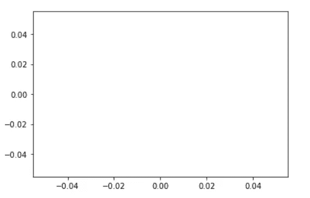
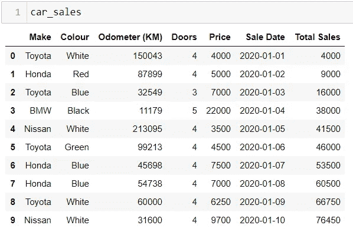
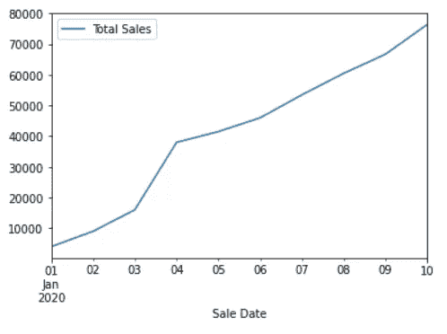
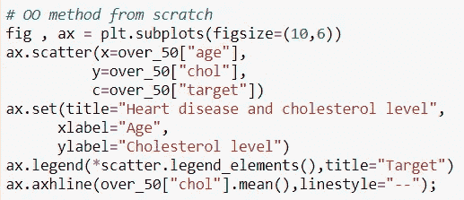
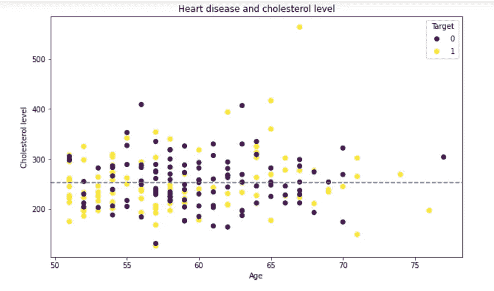

# 在数据分析中使用 matplotlib 创建基本绘图。

> 原文：<https://medium.com/analytics-vidhya/creating-basic-plotting-using-matplotlib-in-data-analysis-f4473126d7e2?source=collection_archive---------30----------------------->

所以我从过去的两个月开始学习机器学习，我认为这篇文章可以帮助许多使用 python 学习机器学习或数据分析的新人。

使用 matplotlib 创建地块有两种方法:

1.  Python API(使用 matplotlib.pyplot)
2.  使用 OOP 风格(OOP-面向对象编程)

首先，您需要将 matplotlib 导入到 jupyter 笔记本或 python 文件中。

将 matplotlib.pyplot 作为 plt 导入

在上面的代码行中，plt 是 matplotlib 的别名。

导入 matplotlib 模块后，您可以使用绘图功能创建一个空绘图。

示例:plt.plot()

输出:

使用 plt.plot 方法，您可以创建一个空图，如上例所示。

*   对于 Python API:

在这种类型的方法中，您无需做任何事情就可以创建数据框的绘图。该 API 方法将自行完成所有工作。

但它不能预先策划阴谋。为了创建 Python API 图，我们使用 plot 方法。

示例:DataFrame.plot(附加功能)；

示例:我们有一个名为 car_sales 的数据框架，其中包含汽车销售数据。

可以看到上图的数据。

假设我们想要创建一个折线图，使用 x 轴作为销售日期列，y 轴作为总销售额列。

代码:car_sales.plot(x=“销售日期”，y=“总销售额”)；

输出:

所以上图代表了销售日期和总销售额之间的关系。

*   matplotlib 中不同类型的图:

1.  线形图
2.  直方图
3.  条形图
4.  水平条形图
5.  散点图
6.  支线剧情

链接阅读不同的情节:

 [## 可视化— pandas 1.1.2 文档

### 我们使用引用 matplotlib API 的标准约定:在[1]中:导入 matplotlib.pyplot 作为 plt 在[2]中:plt…

pandas.pydata.org](https://pandas.pydata.org/docs/user_guide/visualization.html) 

*   创建图的 OOP 方法:

OOP 方法通常用于预先绘图。使用支线绘图方法可以从创建图形和轴开始。

图，ax = plt.subplots(附加功能)

展示 matplotlib 中 OOP 方法威力的快速程序。

上图是使用 OOP 方法创建绘图的代码。

这是上面代码的输出。

您可以看到 Python API 和 OOP 方法之间的区别。

这就是你想知道的关于使用 python 进行数据分析的 Matplotlib 的基础知识。

有关更多信息，请查看以下链接:

 [## Pyplot 教程— Matplotlib 3.3.2 文档

### 绘图界面介绍。是使 matplotlib 像 MATLAB 一样工作的函数的集合。每个…

matplotlib.org](https://matplotlib.org/tutorials/introductory/pyplot.html)