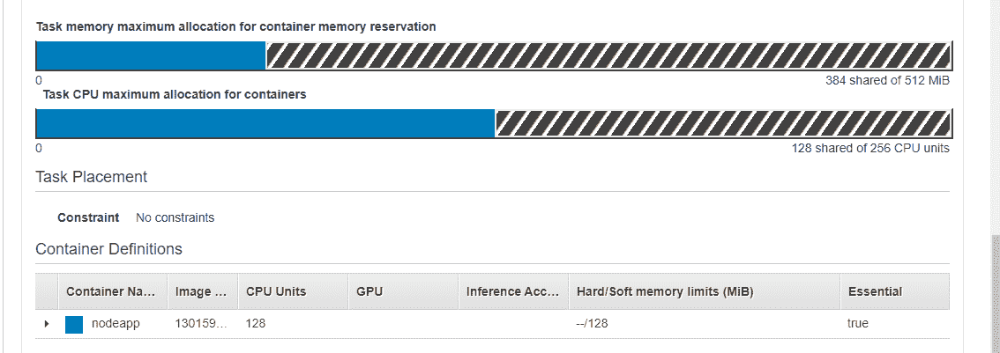
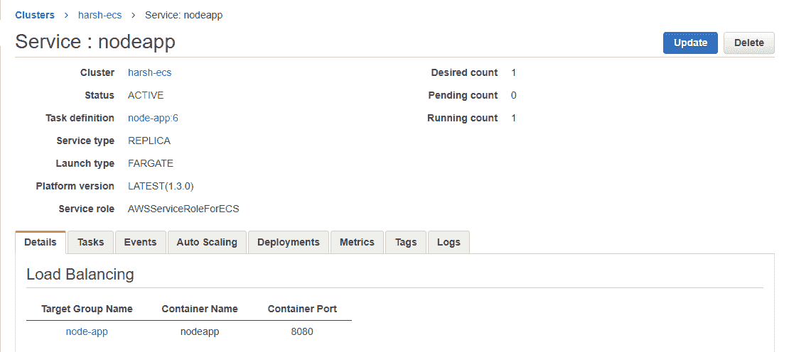

# 为 AWS ECS 创建 CI/CD 管道—第一部分

> 原文：<https://medium.com/analytics-vidhya/creating-ci-cd-pipeline-for-aws-ecs-part-i-b2f61bb1522f?source=collection_archive---------5----------------------->

***亚马逊弹性容器服务(ECS)*** 是亚马逊运行和编排 Docker 容器的解决方案。它提供了一个接口，用于定义和部署 Docker 容器，以便在 EC2 实例集群上运行。

在这篇博文中，我将解释如何在亚马逊 EC2 容器服务(ECS)中运行简单的 **node.js** 应用程序，然后在下一部分我们将创建 CI/CD 管道。

你可以从我的 GitHub 账号下载[源代码](https://github.com/harshvijaythakkar/node-app)。

# 先决条件

1.  您应该在您的帐户中创建了*和 ***公共和私有子网*** ，并且私有子网应该有到 ***NAT 网关*** 的路由。*
2.  *亚马逊弹性容器服务(ECS)集群*
3.  *应用负载平衡器*
4.  *ECR 储存库*
5.  *创建 IAM 角色、策略的权限*
6.  *AWS CLI*
7.  *应用负载平衡器*

# *我们开始吧*

*确保您的目录结构如下:*

```
*/home/ubuntu/youur_proj_dir
  - server.js
  - Dockerfile
  - package.json*
```

*在您喜欢的文本编辑器中打开 ***server.js*** 并添加以下行:*

```
*'use strict';const express = require('express');// Constantsconst PORT = 8080;const HOST = '0.0.0.0';// Appconst app = express();app.get('/', (req, res) => {res.send('<h1 style="color:green;">Sample Node App - version-1!!</h1> \n');});app.listen(PORT, HOST);console.log(`Running on http://${HOST}:${PORT}`);*
```

*在您喜欢的文本编辑器中打开 ***Dockerfile*** 并添加以下行:*

```
*FROM node:carbon# Create app directoryWORKDIR /usr/src/app# Install app dependencies# A wildcard is used to ensure both package.json AND package-lock.json are copied# where available (npm@5+)COPY package*.json ./RUN npm install# If you are building your code for production# RUN npm install --only=production# Bundle app sourceCOPY . .EXPOSE 8080CMD [ "npm", "start" ]*
```

*在您喜欢的文本编辑器中打开 ***package.json*** ，添加以下几行:*

```
*{"name": "docker_web_app","version": "1.0.0","description": "Node.js on Docker","author": "First Last <first.last@example.com>","main": "server.js","scripts": {"start": "node server.js"},"dependencies": {"express": "^4.16.1"}}*
```

****恭喜恭喜！我们已经完成了 node.js 应用程序的创建。****

# *将图像传送到 Docker Hub*

*我的 ECR 库名称是***【node-app】***。确保根据您的 ECR 存储库名称替换它。*

1.  *登录到 ECR*

```
*aws ecr get-login-password --region ***<your_ecr_repo_region>*** | docker login --username AWS --password-stdin ***<your_ecr_repo_url>****
```

*2.在本地构建 Docker 映像*

```
*docker build -t node-app .*
```

*3.标记您的本地 docker 图像*

```
*docker tag node-app:latest ***<your_ecr_repo_url>****
```

*4.将图像推送到 ECR 存储库*

```
*docker push ***<your_ecr_repo_url>****
```

# *创建任务定义*

*在 ECS 群集主页的左侧导航面板上。点击任务定义。点击创建新的任务定义*

> *在亚马逊 **ECS 中运行 Docker 容器需要一个**任务定义**。**您可以在**任务定义**中指定的一些参数包括:与您的**任务**中的每个容器一起使用的 Docker 图像。每个**任务**或一个**任务**中的每个容器使用多少 CPU 和内存。*

1.  *选择 Fargate 作为启动类型兼容性*
2.  *点击下一步*
3.  *输入任务定义名称。我用的是***【node-app】****
4.  *保留任务角色和网络模式的默认值*
5.  *对于**任务执行 IAM 角色**，要么选择您的任务执行角色，要么选择**创建新角色**，以便 AWS 可以为您创建一个。*
6.  *为任务内存和任务 CPU 选择所需的值。我选择最小值。*
7.  *点击添加容器*

*   *输入容器名称。我用的是***【nodeapp】****
*   *在图片中写上***<your _ ECR _ repo _ URL>:最新****
*   *在内存限制类型 128 中*
*   *在端口映射中输入***【8080】******主机端口*** 和***【8080】******集装箱端口*** 和“tcp”协议*
*   *向下滚动，在环境部分点击 ***基本*** 复选框*
*   *单击添加按钮*

*8.向下滚动并单击创建按钮*

*创建任务定义后，您应该会看到类似这样的内容*

**

*AWS ECS 任务定义*

****恭喜恭喜！你已经完成了这篇博客的复杂部分。现在，我们将在 ECS 集群中运行这个任务定义。****

# *在集群中运行任务定义*

*转到集群页面并选择您的集群。点击*标签页。**

> **在 AWS 中，ECS ***【服务】*** 将始终确保我们所需数量的任务定义(容器)将始终运行。这与我们的 EC2 自动缩放组将始终确保所需数量的 EC2 实例始终可用是一样的。**

1.  **单击服务选项卡中的创建按钮**
2.  **选择 ***Fargate*** 作为发射类型**
3.  **选择我们之前创建的任务定义，然后选择最新版本**
4.  **在平台版本中选择 ***最新*****
5.  **选择您的集群名称**
6.  **键入服务名称。我用的是***【nodeapp】*****
7.  **选择类型作为副本**
8.  **在任务数中键入 1。这是我们想要运行的预期任务。**
9.  **保留最小健康百分比和最大百分比的默认值**
10.  **选择滚动更新作为部署类型**
11.  **保留任务放置的默认值**
12.  **点击下一步。选择您的 VPC**
13.  **选择专用子网。我们将只使用私有子网来运行我们的容器**
14.  **单击安全组中的编辑按钮。在入站中选择自定义 TCP 作为类型，在端口范围中写入 8080，在源中添加负载平衡器的安全组**
15.  **保留自动分配 Ip 的默认值**
16.  **在负载平衡器类型中选择应用程序负载平衡器**
17.  **保留服务 IAM 角色的默认值**
18.  **选择您现有的负载平衡器**
19.  **单击容器中的“添加到负载平衡器”按钮以进行负载平衡**

*   **生产监听端口类型 8080**
*   **将协议保留为 HTTP**
*   **在目标组名称中，键入任何名称。我正在使用“ecs-harsh-nodeapp”**
*   **将目标协议保留为 HTTP**
*   **向下滚动到服务发现并取消选择“启用服务发现集成”**
*   **点击下一步**
*   **选择配置自动缩放**

**a.输入要运行的任务的最小和最大数量**

**b.保留 IAM 角色的默认值**

**c.键入策略名称。我使用的是“CPU 利用率-80”**

**d.保留默认服务指标**

**e.输入目标值 80**

**f.将其他值保留为默认值**

**查看配置并单击创建服务**

*****恭喜恭喜！*** 您已经成功创建了一个服务，它应该处于活动状态。**

**服务详细信息页面应该如下所示:**

****

**AWS ECS 服务详细信息页面**

**要测试节点 js 应用程序，请进入浏览器并键入 <your_alb_url>:8080。确保您的 ALB SG 允许来自任何地方的端口 8080。</your_alb_url>**

> **我们需要在 ALB DNS 的末尾写入 8080，因为在为我们的 ECS 集群创建服务时，我们提到 8080 是我们的侦听器端口。您可以查看 ALB 详细信息，其中会自动添加一个监听端口 8080 的监听器。**

# *****恭喜恭喜！*****

**您已经在 AWS ECS 中成功运行了节点应用程序。在本教程的 [***第二部分***](/@harshvijaythakkar/creating-ci-cd-pipeline-for-aws-ecs-part-ii-b43e4089cb52) 中，我将解释如何创建 CI/CD 管道。**

**谢谢大家！**