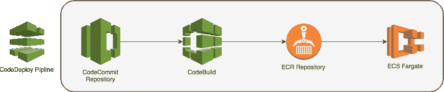
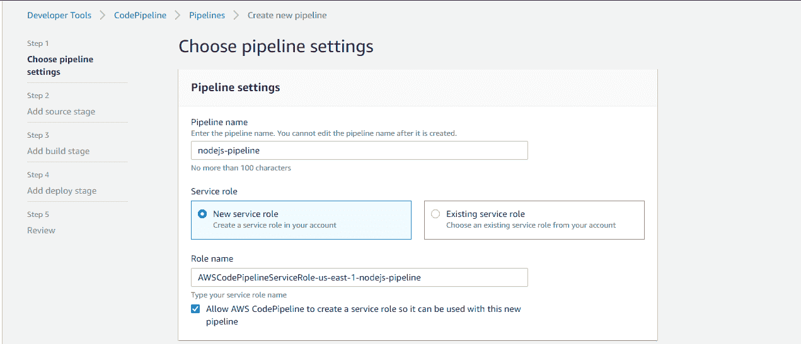
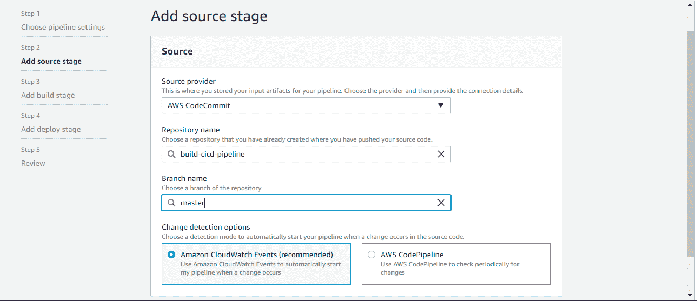
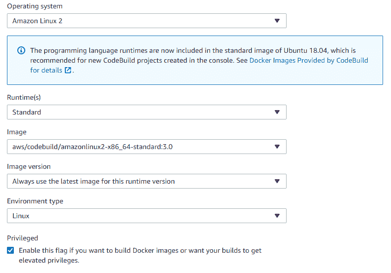
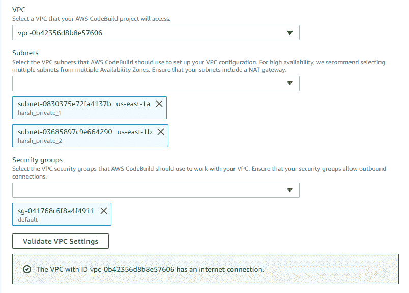
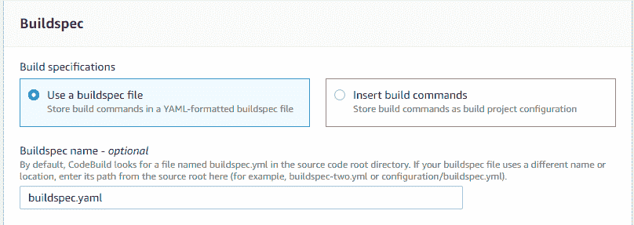
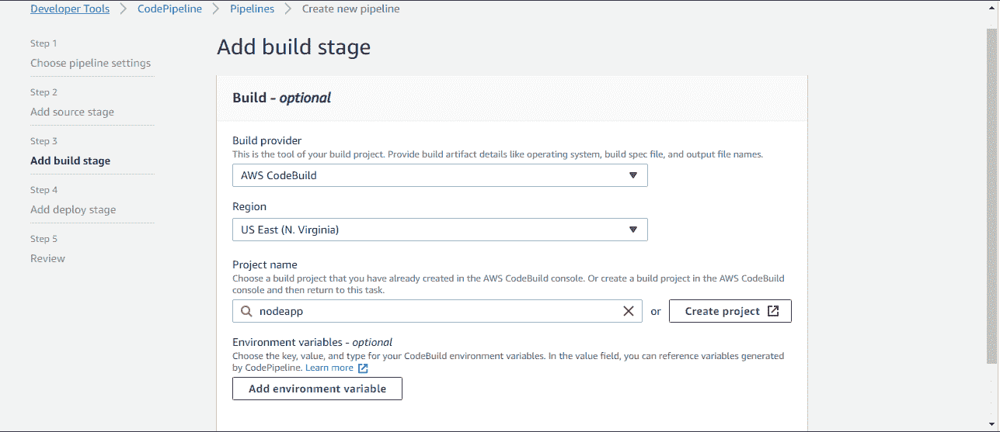
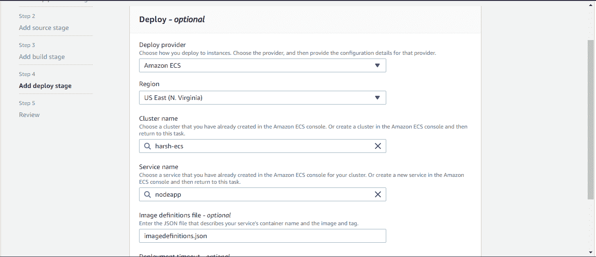

# 为 AWS ECS 创建 CI/CD 管道—第二部分

> 原文：<https://medium.com/analytics-vidhya/creating-ci-cd-pipeline-for-aws-ecs-part-ii-b43e4089cb52?source=collection_archive---------3----------------------->

在本教程的第 1 部分中，我解释了如何在 AWS ECS 中运行样本节点 js 应用程序。在本教程中，我将解释如何使用 AWS 代码管道创建 CI/CD 管道。

你可以从我的 GitHub 账号下载[源代码](https://github.com/harshvijaythakkar/node-app)。

# 先决条件

1.  代码提交存储库
2.  您应该在您的帐户中创建了***【VPC】***，并带有 ***公共和私有子网*** ，私有子网应该有一个到 ***NAT 网关*** 的路由。
3.  AWS ECS 集群与服务运行任务定义(参考:第一部分)
4.  AWS ECR 存储库
5.  创建 IAM 角色、策略的权限

# 架构图



AWS ECS CI/CD

# 我们开始吧

将您的代码推送到您现有的代码提交存储库中。我们将使用 AWS 代码提交作为代码管道的源阶段。如果你没有，你可以使用我的[示例代码](https://github.com/harshvijaythakkar/node-app)。

在我们开始创建我们的管道之前，我们需要在我们代码的根目录下有一个***build spec . YAML***文件。该文件将被 ***AWS 代码构建*** 用来构建 docker 映像并将该映像推送到 ECR。将以下命令添加到***build spec . YAML***中，并将其推送到您的代码提交库。

确保用您的 AWS ECR 仓库 URL 和 ***容器名称*** 值(AWS 任务定义容器名称)替换 ***仓库 _URI*** 。

```
# Don't change this version, this version is buildspec.yml file's versionversion: 0.2phases:
  pre_build:
    commands:
      - echo Logging in to Amazon ECR...
      - aws --version
      - $(aws ecr get-login --region $AWS_DEFAULT_REGION --no-include-email)
      - REPOSITORY_URI=***<your_ecr_repo_url>***
      - COMMIT_HASH=$(echo $CODEBUILD_RESOLVED_SOURCE_VERSION | cut -c 1-7)
      - IMAGE_TAG=build-$(echo $CODEBUILD_BUILD_ID | awk -F":" '{print $2}')build:
    commands:
      - echo Build started on `date`
      - echo Building the Docker image...
      - docker build -t $REPOSITORY_URI:latest .
      - docker tag $REPOSITORY_URI:latest $REPOSITORY_URI:$IMAGE_TAGpost_build:
    commands:
      - echo Build completed on `date`
      - echo Pushing the Docker images...
      - docker push $REPOSITORY_URI:latest
      - docker push $REPOSITORY_URI:$IMAGE_TAG
      - echo Writing image definitions file...
      - printf '[{"name":"***<Your Container Name>***","imageUri":"%s"}]'    $REPOSITORY_URI:$IMAGE_TAG > imagedefinitions.json
      - cat imagedefinitions.jsonartifacts:
  files: imagedefinitions.json
```

# 创建代码管道

我们的代码管道将有 3 个阶段，即 ***源代码，构建*** *和* ***部署。***

转到 AWS 代码管道页面，并单击创建管道。

1.  输入管道名称并保留服务角色的默认值，然后单击下一步



AWS 代码管道

2.选择 AWS 代码提交作为源提供者。选择您的代码提交库和分支名称。转到添加构建阶段。



AWS 代码管道源

3.在构建提供者中选择 ***AWS CodeBuild*** 。我们需要有一个 CodePipeline 的 CodeBuild 项目，它将创建 Docker 图像并将其推送到我们的 ECR 存储库。单击项目名称下的创建项目，将弹出一个新窗口。写下项目名称并输入如下所示的配置。



AWS 代码构建环境配置

> 确保选中**特权**复选框。这将允许代码构建器构建 Docker 映像。

保留 ***服务角色*** 的默认设置，点击 ***附加配置*** 。向下滚动并选择在其中创建 AWS ECS 群集的 VPC，选择专用子网，选择默认安全组。通过单击验证 VPC 设置来验证您的 VPC 设置。



AWS 代码构建 VPC 配置

向下滚动到构建等级库并添加构建等级库文件名。我的文件名是***“build spec . YAML”***



AWS 代码构建构建规范文件配置

让一切保持默认，并点击继续编码管道。您的代码生成项目名称出现在项目名称部分。转到添加部署阶段。



AWS 代码管道构建阶段

4.选择 ***Amazon ECS*** 作为部署提供者。选择您的 ECS 群集名称和服务名称。在图像定义文件字段中输入***" Image definitions . JSON "***。这个文件是来自我们代码构建的工件(输出),它包括关于我们的 ECR 图像位置和我们的任务定义中的容器名称的信息。

> 确保在图像定义文件字段中写入的文件名与在工件块中的 buildspec.yaml 文件中写入的文件名相同。



AWS 代码管道部署阶段

检查您的代码管道，然后单击创建管道。

> 单击“创建管道”按钮后，它将开始执行，并将在构建阶段失败。这背后的原因是因为我们默认的 CodeBuild 项目角色没有将图像推送到 ECR 的权限。

# 更新代码生成项目 IAM 角色:

1.  转到 IAM 控制台，找到由您的 codebuild 项目创建的 IAM 角色
2.  向 ECR 完全访问添加权限(amazone C2 containerregistrytryfull access 策略)

完成 IAM 角色更新后，请在代码管道的构建阶段单击“重试”。

**恭喜！**您已经成功创建了 CI/CD 管道，该管道会将您的应用程序自动部署到 AWS ECS 集群。

谢谢大家！