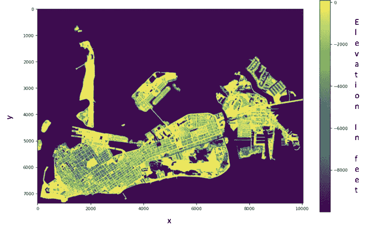
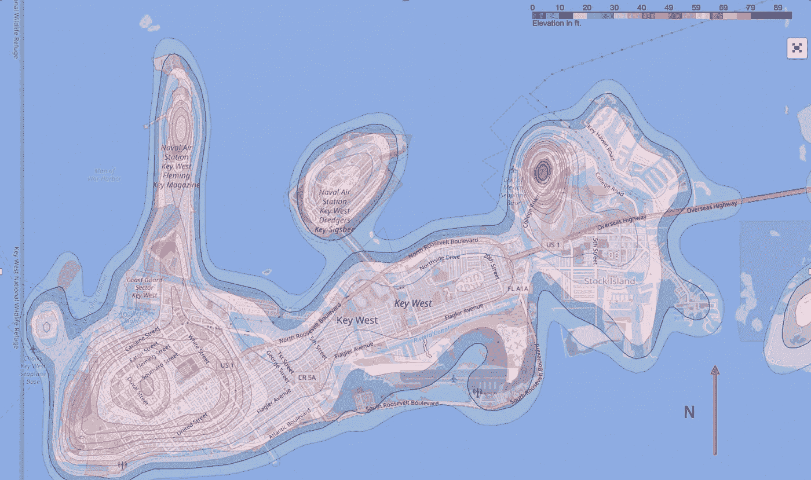

# 用 Python 在树叶地图上创建等高线

> 原文：<https://medium.com/analytics-vidhya/creating-contour-lines-on-folium-map-with-python-b7994e67924b?source=collection_archive---------5----------------------->

## 等高线为你的视觉化和地图增加额外的维度


安妮·斯普拉特在 [Unsplash](https://unsplash.com?utm_source=medium&utm_medium=referral) 上的照片

## 学分:

*   【https://pypi.org/project/geojsoncontour/】T5[T6](https://pypi.org/project/geojsoncontour/)
*   [**https://www.tjansson.dk/2018/10/contour-map-in-folium/**](https://www.tjansson.dk/2018/10/contour-map-in-folium/)
*   **Jorge Manchola 在代码的第 4 块中捕捉错误**

在许多情况下，我们可能会遇到在二维地图上添加第三维空间的需要，如海拔、降雨量、温度、人口和许多其他信息。创建等高线是一种方法。这篇文章将引导你一步一步地使用 Python 在 follow 上创建轮廓线。

**该过程所需的库有:**

numpy，pandas，leav，branca，matplotlib.pyplot，scipy.interpolate，geojsoncontour，scipy，Raster2xyz，tiffile 和 rasterio。其中一些是常用的，但其余的是特殊的映射。根据你的三维数据的文件格式，你可以跳过一些代码，或者你可能需要使用不同的工具来读取不同的文件格式。在本例中，我们将使用 TIFF 格式的 DEM(数字高程模型)。

以 TIFF 格式读取 DEM 并显示。

```
**import** tifffile **as** tiff
**import** matplotlib.pyplot **as** plt
**import** rasteriofilename = '../path/...TIF' # name the file path and name
tfile **=** tiff.imread(filename) # read the data
tfile.shape # arrange the data into an array
tiff.imshow(tfile) # display the map
```

上面的代码产生了下图。如果这是您唯一需要的东西，那么您就万事俱备了。



根据数字高程模型制作的佛罗里达基韦斯特地图

上图显示了 x，y 坐标中的地图，主要显示了低于零平均海平面的海拔。我们可能希望从 DEM 中获取更多信息，例如地表高程。我们可能需要创建等高线来显示更多信息的地图。让我们创建等高线，并显示在叶。

**等高线生成**

首先，我们希望将图像保存为 **csv** 格式，如下所示:

```
**from** raster2xyz.raster2xyz **import** Raster2xyzinput_raster = filename # set the input file name
out_csv = filename + ".csv" # set the output file namertxyz = Raster2xyz(input_raster) # transform raster to x,y,z
rtxyz.translate(input_raster, out_csv) # save to a csv fileDEM = pd.read_csv('Job504475_2007_FDEM_South_xyz.csv', header = None, names = ['longitude','latitude','elevation'])# read the x,y,z file and assign the column names
DEM.drop(DEM.head(1).index, inplace=True)# delete the first row that contain labels 'x,y,z'
DEM = DEM.replace(',','.', regex=True).astype(float) # set data type to float, they were saved as strings
```

为了在 leav 上显示我们的地图，我们需要将我们的坐标转换成经度和纬度格式。下面的循环将完成这项工作。但是，请记住，根据文件的大小，这个过程可能非常耗时。作为练习，使用一个小数据集来确保您的代码有效。

```
R = 6371 # Earth radius in km
for i in range(1,len(DEM)):
    DEM['latitude'][i] = np.degrees(np.arcsin(DEM['elevation'][i]/(3.280833*R*1000))) # our data is in ft.
    DEM['longitude'][i] = np.degrees(np.arctan2(DEM['latitude'][i]/(3.280833*1000), DEM['longitude'][i]/(3.280833*1000)))
DEM = DEM.to_csv("DEM.csv", index=True, header=True) # save to csv
```

现在，我们准备创建基韦斯特地图的等高线高程。为此，我们需要导入一些库。如果您还没有这样做，您可能需要预安装其中的一些。

```
**import** folium
**import** branca
**from** folium **import** plugins
**from** scipy.interpolate **import** griddata
**import** geojsoncontour
**import** scipy as sp
**import** scipy.ndimage%matplotlib inline# Read the digital elevation  model in longitude, latitude and elevation format.
DEM = pd.read_csv('DEM.csv', header = None, names = ['longitude','latitude','elevation'])# Set all negative elevations to zero to show that they will be under the mean sea level of zero
for i in range(0,len(DEM)):
    if DEM['elevation'][i] <= 0.:
        DEM['elevation'][i] = 0.# Setup minimum and maximum values for the contour lines
vmin = DEM['elevation'].min() 
vmax = DEM['elevation'].max()# Setup colormap
colors = ['blue','royalblue', 'navy','pink',  'mediumpurple',  'darkorchid',  'plum',  'm', 'mediumvioletred', 'palevioletred', 'crimson',
         'magenta','pink','red','yellow','orange', 'brown','green', 'darkgreen']
levels = len(colors)
cm     = branca.colormap.LinearColormap(colors, vmin=vmin, vmax=vmax).to_step(levels)# Convertion from dataframe to array
x = np.asarray(DEM.longitude.tolist())
y = np.asarray(DEM.latitude.tolist())
z = np.asarray(DEM.elevation.tolist()) # Make a grid
x_arr          = np.linspace(np.min(x), np.max(x), 500)
y_arr          = np.linspace(np.min(y), np.max(y), 500)
x_mesh, y_mesh = np.meshgrid(x_arr, y_arr)

# Grid the elevation (Edited on March 30th, 2020)
z_mesh = griddata((x, y), z, (x_mesh, y_mesh), method='linear')

# Use Gaussian filter to smoothen the contour
sigma = [5, 5]
z_mesh = sp.ndimage.filters.gaussian_filter(z_mesh, sigma, mode='constant')

# Create the contour
contourf = plt.contourf(x_mesh, y_mesh, z_mesh, levels, alpha=0.5, colors=colors, linestyles='None', vmin=vmin, vmax=vmax)
```

上面的代码以 MatPlotLib 格式创建等高线。这与 leav map 不兼容。所以我们需要用下面的代码把这个等高线转换成 GeoJson 格式。

```
# Convert matplotlib contourf to geojson
geojson = geojsoncontour.contourf_to_geojson(
    contourf=contourf,
    min_angle_deg=3.0,
    ndigits=5,
    stroke_width=1,
    fill_opacity=0.1)

# Set up the map placeholdder
geomap1 = folium.Map([DEM.latitude.mean(), DEM.longitude.mean()], zoom_start=12, tiles="OpenStreetMap")# Plot the contour on Folium map
folium.GeoJson(
    geojson,
    style_function=lambda x: {
        'color':     x['properties']['stroke'],
        'weight':    x['properties']['stroke-width'],
        'fillColor': x['properties']['fill'],
        'opacity':   0.5,
    }).add_to(geomap1)

# Add the colormap to the folium map for legend
cm.caption = 'Elevation'
geomap1.add_child(cm)

# Add the legend to the map
plugins.Fullscreen(position='topright', force_separate_button=True).add_to(geomap1)
geomap1
```

下图是我们佛罗里达州基韦斯特的等高线高程图。



佛罗里达基韦斯特等高线地图

享受创建地图，我希望我能与你分享更多的地图技巧。

数据来源:美国国家海洋和大气局