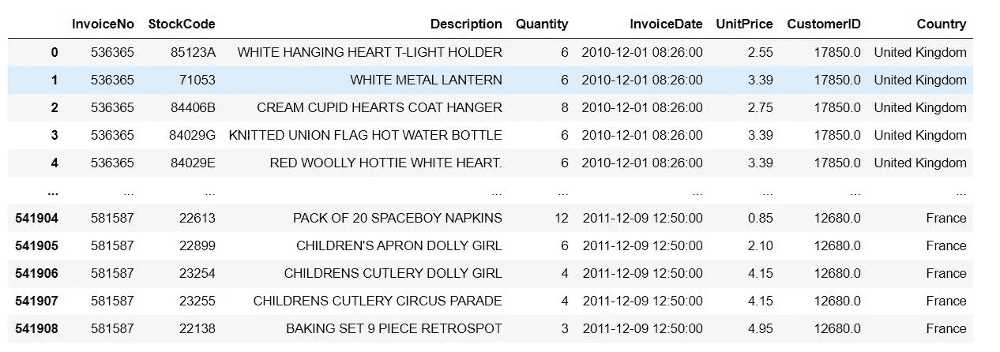
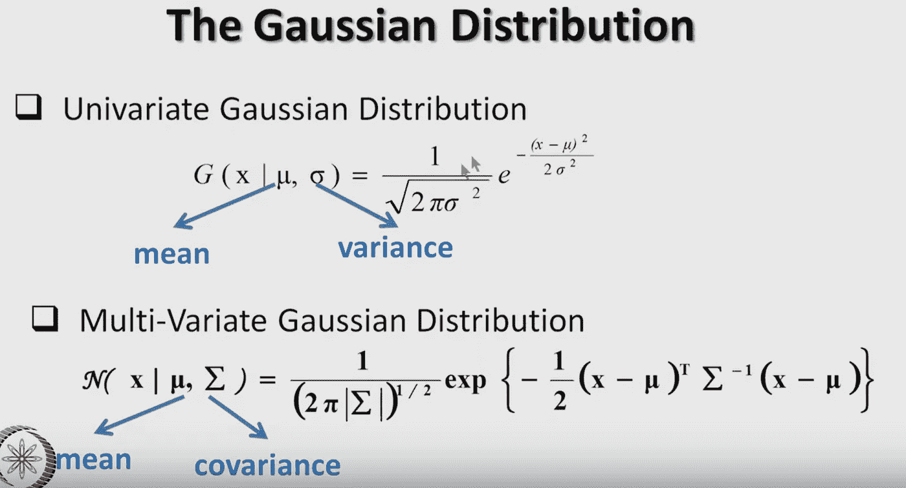
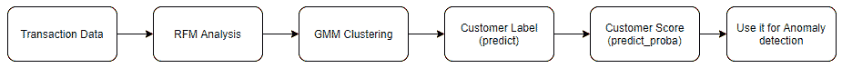
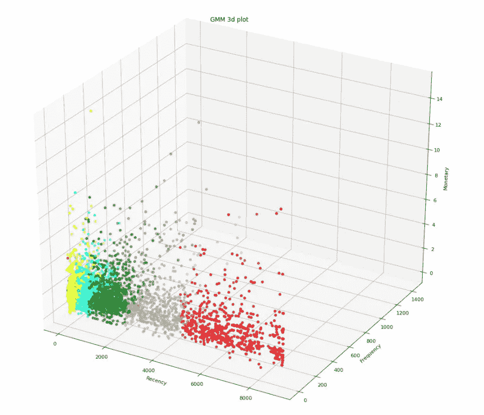
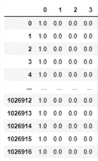
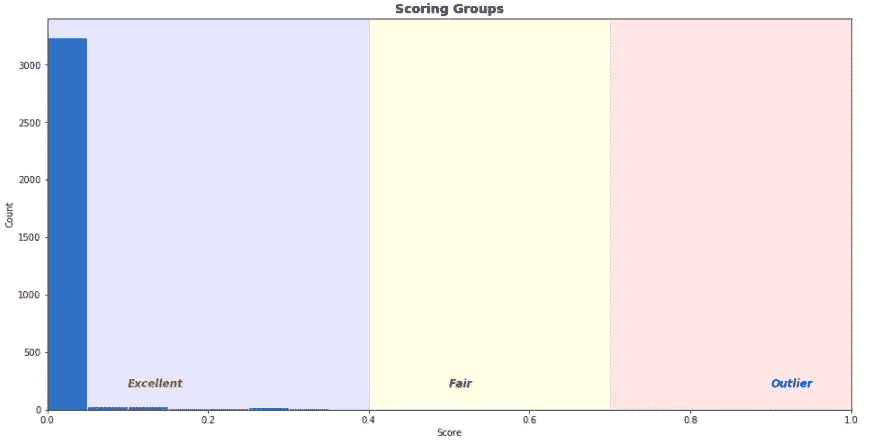

# 使用高斯混合模型为异常检测算法创建客户评分特征

> 原文：<https://medium.com/analytics-vidhya/creating-customer-scoring-feature-for-anomaly-detection-algorithms-using-gaussian-mixture-model-be00e0874c8b?source=collection_archive---------6----------------------->

## 异常检测模型的特征工程

前景的定义:晋升、成功、利润等的明显概率

我在本文中的目的是给出一些关于如何在客户交易数据中创建高级特性来预测信用卡中的异常或欺诈的直觉。

**欺诈和异常检测**

近年来，用于欺诈检测的机器学习方法越来越受欢迎，因为自学习人工智能模型取代了基于规则的方法，能够不断学习并能够检测异常值和异常行为。在基于规则的系统中，算法由欺诈分析师编写，并且基于严格的阈值。

**监督与非监督方法**

尽管大多数消息来源称受监督的数据在行业中很常见，但实际上，带标签的数据很难找到。即使你发现它，不平衡和偏见可能是一个问题，特别是欺诈数据，其中大多数样本(非欺诈样本)。由于这个原因，无监督模型增加了重要性。然而，与监督学习任务相比，无监督学习更难。

**异常的无监督方法&欺诈检测**

> *“这种无监督学习问题的目标可能是发现数据中相似示例的组，这被称为聚类，或者确定数据如何在空间中分布，被称为密度估计”(*第 3 页，[模式识别和机器学习](https://amzn.to/2O2WWnj)，2006 年。*)。*

无监督异常检测方法:

*   k 均值
*   高斯混合模型
*   基于密度的噪声应用空间聚类
*   光学
*   隔离林(异常检测算法)
*   LOF(异常检测算法)
*   一类 SVM(异常检测算法)
*   深度学习方法

scikit-learn 页面很好地解释了他们页面上的不同聚类算法。[链接](https://scikit-learn.org/stable/auto_examples/cluster/plot_cluster_comparison.html)

**我的项目详情**

我目前的一个项目是试图检测客户信用卡交易数据中的异常或欺诈行为。数据具有没有标注的有限要素。我只有日期时间、客户 id、金额列。这里有两个重要步骤很重要，即领域知识和高级特征工程，但是，如果你在咨询公司工作，很难联系到分析师团队，因此，特征工程或数据驱动方法在这种情况下变得很重要。

什么是重要的参数身份，数量，位置，频率？我有一个金额栏。我想创建基于客户的数据，因此，我需要创建有效的客户细分，这是 RFM(最近，频率，金额)。在此帮助下，我们尝试对客户进行分类。

**数据集**

UCI 机器学习知识库已经制作了包含 2010 年和 2011 年实际交易的数据集。链接在这里:【https://archive.ics.uci.edu/ml/datasets/Online+Retail+II】T2

**属性(特征)信息**

发票号:发票号。**标称**。
库存代码:产品(项目)代码。**标称**。
描述:产品(物品)名称。**名义上的**。
数量:每笔交易中每种产品(物品)的数量。**数字**。
InvoiceDate:发票日期和时间。**数字**。单价:单价。**数字**。客户号:客户编号。**标称**。国家:国家名称。**标称**。

图 1:数据集

**聚类方法**

在 RFM 分析之后，我们需要对数据进行标记或分类。首先是聚类方法。K-means 和 GMM 方法是重要的无监督聚类算法，可用于聚类未标记数据。

但是，对于这个项目，我使用 GMM，因为它比 K-means 有一些优势。一个优点是，在 predict_proba 函数的帮助下，它返回了一个数据点属于 K 个聚类中的每一个的概率。因此，每个客户都有一个分数，我们在其中创建功能。

**高斯混合模型的基础**

我想给出一些关于高斯混合模型的详细信息。这是一个概率分布模型。模拟的集群是高斯型的。这是一种“软聚类”，这意味着“不是将每个数据点放入单独的聚类中，而是分配该数据点在那些聚类中的概率或可能性”([链接](https://www.analyticsvidhya.com/blog/2016/11/an-introduction-to-clustering-and-different-methods-of-clustering/))

拟合数据的参数:

*   平均
*   协方差
*   混合系数

背后有什么数学？

图 2:收到的图片:[链接](https://www.youtube.com/watch?v=ZBLyXgjBx3Q)

每个组件从具有均值和协方差矩阵的高斯矩阵生成数据。为了学习这样的参数，GMM 使用期望最大化(EM)算法来优化最大似然，最大似然是以某种概率将数据分配给聚类。我们可以调用 predict_proba 函数来返回一个数据点属于 K 个聚类中的每一个的概率。

GMM 有十个参数。n_components，协方差 _type 是更好的性能模型的非常重要的参数。为了确定有多少高斯分布，我们可以使用几种方法中的一种来评估它与数据的拟合程度。例如，有赤池信息标准(AIC)，贝叶斯信息标准(BIC)，肘，剪影评分都是有用的方法([细节链接](https://scikit-learn.org/stable/auto_examples/mixture/plot_gmm_selection.html))。GMM 有四种协方差类型，即“球形”、“束缚”、“诊断”、“完整”。这里有什么区别:[链接](https://www.slideshare.net/PengjingZhang/em-and-gmm)。最后，GMM 算法的执行速度很快。我处理了超过六百万的数据行。

在深入研究代码之前，我想展示一下创建特性的管道。

图 3:客户评分的样本管道

**编码部分(Github** [**链接**](https://github.com/yssefunc/gaussian_mixture_model_scoring) **为所有代码)**

如果客户的交易次数超过五次，我会对他们进行过滤。详细代码如下。对于这些数据，我们的团队决定五个以上的交易历史适用于 RFM。但是，这个决定可能会因企业而异。有一笔(新客户)到四笔交易的客户应单独分类。

过滤客户频率后，我想同时对每个客户进行最近频率货币分析，您可以添加平均值、最小值、最大值和标准值。戴夫，这取决于你。

**别忘了**

最近，频率和货币都准备好了。我还添加了平均值、最小值、最大值和标准值。但是，它们是可选的。我的货币价值代表给定客户购买的中间值，而不是平均值，因为根据我的统计分析。

我将用 RFM 零件来训练我的 GMM 模型。然而，这个过程还没有结束。分布检查和异常值清理是每个要素的重要要求，因为聚类算法对异常值和倾斜数据非常敏感。最后，在决定了 n _ 分量和协方差类型之后，数据为高斯混合模型算法做好了准备。

图 rfm 分析的 3d 图

我展示了两张图，分别是正常视图和俯视图。最近和频率部分几乎很好地聚集，但货币数据是扭曲的，有离群值，因此，它导致一些重叠。

此代码块为每个标签添加分数。对了，predict_proba 评分回报是这样的，

图 5: GMM 模型结果

在添加了每个标签的分数后，我想将分数归一化到 0 到 1 之间。

最后，每个客户分数都为异常检测方法做好了准备。我将客户评分分为优秀、一般和异常。可视化如下。我 Github 账户里的所有代码。[链接](https://github.com/yssefunc/gaussian_mixture_model_scoring)

图 6:客户得分分布

**总结**

在本文中，我们介绍了如何从信用卡交易数据创建一个特性。我们看了 RFM 分析，客户细分。最后，我们使用高斯混合算法为每个客户分配一个分数。如果有不清楚的地方，请随时给我反馈或问我问题。我希望你喜欢读它。

# G.附录

# G.1 .参考文献

 [## 欺诈检测算法|使用机器学习的欺诈检测

### 多年来，欺诈一直是银行、医疗、保险和许多其他行业的主要问题。由于…

intellipaat.com](https://intellipaat.com/blog/fraud-detection-machine-learning-algorithms/)  [## 高斯混合模型聚类算法讲解

### 高斯混合模型可以像 k-means 一样用于聚类未标记的数据。

towardsdatascience.com](https://towardsdatascience.com/gaussian-mixture-models-d13a5e915c8e)  [## 如何用 Python 从头开始编写高斯混合模型

### 使用 NumPy 的 GMMs 和最大似然优化

towardsdatascience.com](https://towardsdatascience.com/how-to-code-gaussian-mixture-models-from-scratch-in-python-9e7975df5252)  [## yssefunc -概述

### yssefunc 有 14 个可用的存储库。在 GitHub 上关注他们的代码。

github.com](https://github.com/yssefunc) 

【http://www.mit.edu/~9.54/fall14/slides/Class13.pdf】T5[T6](http://www.mit.edu/~9.54/fall14/slides/Class13.pdf)

[*https://www . slide share . net/petite geek/expect-maximization-and-Gaussian-mixture-models*](https://www.slideshare.net/petitegeek/expectation-maximization-and-gaussian-mixture-models)

[https://www.youtube.com/watch?v=ZBLyXgjBx3Q](https://www.youtube.com/watch?v=ZBLyXgjBx3Q)

[https://github . com/aviolante/SAS-python-work/blob/master/machine _ learning/score card _ post/credit _ score card _ demo _ public . ipynb](https://github.com/aviolante/sas-python-work/blob/master/machine_learning/scorecard_post/credit_scorecard_demo_public.ipynb)

[https://sci kit-learn . org/stable/auto _ examples/mixture/plot _ GMM _ selection . html # sphx-glr-auto-examples-mixture-plot-GMM-selection-py](https://scikit-learn.org/stable/auto_examples/mixture/plot_gmm_selection.html#sphx-glr-auto-examples-mixture-plot-gmm-selection-py)

[https://github . com/aviolante/SAS-python-work/blob/master/machine _ learning/score card _ post/credit _ score card _ demo _ public . ipynb](https://github.com/aviolante/sas-python-work/blob/master/machine_learning/scorecard_post/credit_scorecard_demo_public.ipynb)