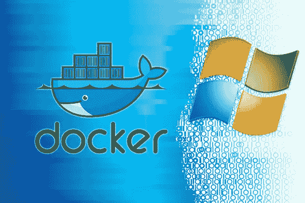
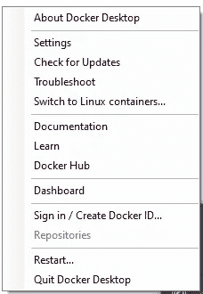
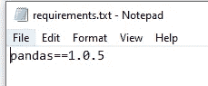
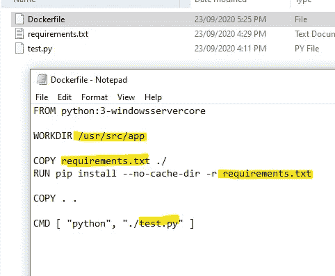
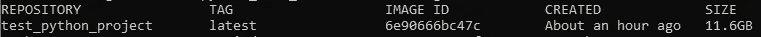
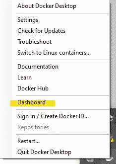
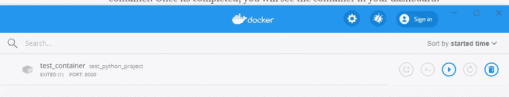

# 从 Python 3 开始，在 Windows 机器上从头开始创建 Docker Image +容器

> 原文：<https://medium.com/analytics-vidhya/creating-docker-image-container-from-scratch-on-windows-machine-for-python-3-onwards-3a69ab4ce2b2?source=collection_archive---------1----------------------->

对于今天数以百万计的开发者来说， **Docker** 是构建和共享容器化应用的事实标准——从桌面到云(Docker.com)。将您的代码部署到生产环境中是如此简单。对于 **Python** 开发者来说，它是一个流行的开发工具(它也可以用于将 **R** 部署到生产环境中)。

# 准备

1.  从 Docker 网站下载并安装 Docker 桌面:[https://docs.docker.com/get-docker/](https://docs.docker.com/get-docker/)
2.  准备好 python 脚本、库名(依赖项)
3.  右键单击任务栏上的 docker 图标，确保切换到 Windows。如果已经切换到 windows，该选项将不再出现，您将能够看到“切换到 Linux 容器”。

4.创建一个 requirements.txt，包含所需的库和版本

5.创建一个名为 *Dockerfile* 的 docker 文件，其中包含您希望在 docker 容器中包含的文件层次结构。用您的 python 文件名完成 *Dockerfile* 。

6.把它们放在同一个文件夹里

# 建立

1.  从你的窗口启动 docker。* *注意:请确保您的计算机中至少有 12 gb 以上的空间专门用于映像。
2.  打开命令提示符，将目录更改为代码和文件所在的文件夹。示例`cd "C:\Users\Folder_Name"`
3.  在命令提示符下键入`docker build -t test_python_project .`。注意: *test_python_project* 是我给图像起的名字。用 **fullstop** 结束代码，否则会导致错误。
4.  泡一杯咖啡，坐在电视机前，等待图像生成。我没有记下时间，可能需要 30 分钟(取决于你的网络和机器规格)。
5.  通过在 cmd 中键入`docker images`,检查您的 docker 图像是否已成功创建。我的文件很小，因为我只有熊猫图书馆。一旦你看到你的图像被成功创建，在我的例子中 *test_python_project* 出现了。我将根据这个图像创建一个容器。

6.键入 cmd `docker run — publish 8000:8080 — detach — name test_container test_python_project`，如果你不耐烦，你可以再次遛狗——我没有记录创建容器花了多长时间。

7.完成后，您将在仪表板中看到该容器。再次右击你的 docker 图标，点击 dashboard。在脚本中，我将我的容器命名为 *test_container* ，它基于我们之前创建的映像，即 *test_python_project。*要列出你在 cmd 中的所有容器，只需键入`docker container ls -all`

8.瞧，我们完成了。将鼠标悬停在容器上，您将能够使用 UI 启动容器。否则，如果您喜欢脚本方式—将代码键入 cmd `docker start test_pyton_project.`

如果你喜欢这篇文章，请给我一个掌声！

**留下你的评论。谢谢你。**