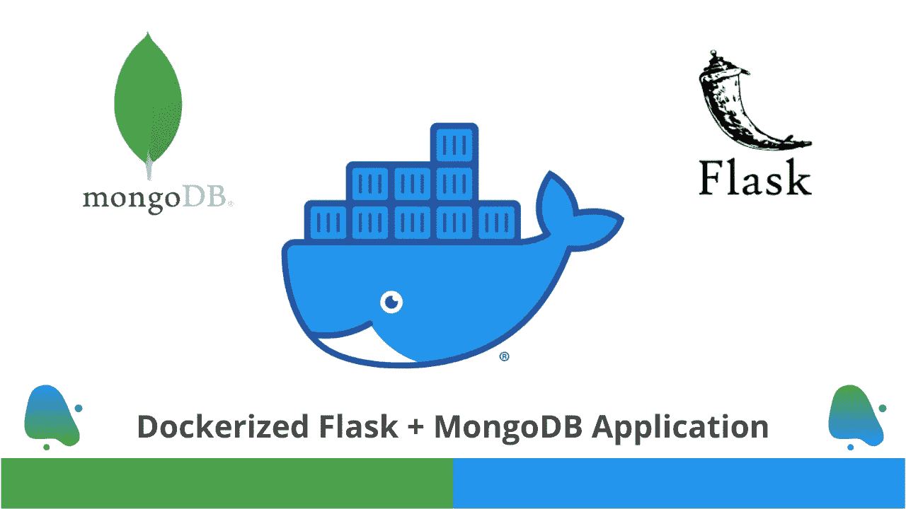

# 创建 Dockerized Flask + MongoDB 应用程序

> 原文：<https://medium.com/analytics-vidhya/creating-dockerized-flask-mongodb-application-20ccde391a?source=collection_archive---------3----------------------->

dockered Flask+MongoDB 应用程序

要创建这种涉及两个以上组件的应用程序，我们首先想到的是，我们应该运行一个容器，该容器将暴露 Flask server 和 MongoDB。但在我看来，这不是一个好的设计。这种设计有以下缺点。

*   如果容器崩溃，我们将失去 Flask server 和 MongoDB。
*   访问 Flask 并且不需要 DB 操作的前端应用程序将无法工作。
*   访问数据库且不需要 Flask server 的前端应用程序将无法工作。

更好、更优化的设计是拥有两个容器:一个用于 Flask server，另一个用于 MongoDB，并将拥有 Flask server 的容器与拥有 MongoDB 的容器链接起来。这样，我们可以克服第一种设计的一些非常严重的缺点。

如果你对视觉学习感兴趣，我在我的 YouTube 频道上制作了一个视频，你可以看看下面。

这个博客的 YouTube 教程

首先，我们可以把这个应用问题分成两部分:Flask 和 MongoDB。我们需要创建足够的代码来创建 dockerized Flask 应用程序和托管在容器中的 MongoDB。我们可以独立完成这两件事。最后一步是连接这两个代码。

现在，这是实现我们目标的简单路线图:

*   归档烧瓶应用需要 ***app.py*** 、 ***requirements.txt*** 、 ***Dockerfile*** 等 *app.py* 需要的文件。
*   要在容器上托管 MongoDB，我们可以从[这里](https://hub.docker.com/_/mongo)拉已经存在的 mongo 映像，此外我们还需要 ***init-db.js*** 文件，当 MongoDB 在容器上托管时，我们将在其中编写 JavaScript 代码来初始化带有一些表的数据库。注意，如果你不想在创建时初始化数据库，这个文件可以是空的。
*   我们将用 *yml* 文件连接 Flask 和 MongoDB。所以，我们还需要***docker-compose . yml***文件。

现在，事情变得简单了。我们只需要遵循上面的路线图。

# **步骤 1:为烧瓶应用程序创建代码库**

这里，我将有一个小 Flask 应用程序，它将从 MongoDB 获取动物及其类型。代码如下所示。

你可以看一下下面的代码，你可以观察到 route***"/***只是返回一个字符串，这个字符串只是用来检查代码，route ***"/animals"*** 会查询在另一个容器中运行的 MongoDB。请注意，我们还没有用 MongoDB 创建容器，所以这段代码现在无法工作。但是请注意，Flask server 将运行在端口 ***5000*** 上，我们假设 MongoDB 运行在端口 ***27017*** 上。

我们还需要***requirements . txt***，其中包含 ***app.py*** 和 ***Dockerfile*** 在容器中部署 Flask app 所需的依赖项。

箱式烧瓶应用

当然，您可以根据自己的需求在 Flask 应用程序中包含一些功能，但是要确保您获取的数据在下面的第二步中被填充到 MongoDB 中。

# 步骤 2:为在 Docker 容器上托管 MongoDB 创建代码库

在这一步中，我们不需要手动提取 mongo 的 docker 映像。我们可以在步骤 3 的***docker-compose . yml***中定义图片的名称。在这一步中，我们只需要创建 ***init-db.js*** 文件，该文件将在创建 MongoDB 时预先填充数据。本演示的 ***init-db.js*** 文件如下所示。

初始化数据库

您可以看到，我们访问了一个数据库***“animal _ db”***，并在这个数据库中初始化了名为***“animal _ TB”***的集合，其中包含 3 个元素。

# **第三步:创建 docker-compose.yml 文件链接上述组件并部署**

我们需要创建***docker-compose . yml***文件，我们将在其中定义链接组件的详细信息，以及在上面两个步骤中创建的代码库所需的信息。示例***docker-compose . yml***文件如下所示。

如果你遵守上面的代码。我们有一个应用程序，其中我们定义了一个命令来运行该应用程序。此外，我们已经将 ***db*** 与 app 链接，其中 ***db*** 在上述代码的后面部分定义，这就是我们的 MongoDB。

我们已经给出了 MongoDB 图像的名称，它需要从 docker-hub 中提取。这里注意，您可以更改 ***主机名*** 和 ***环境*** ，但请确保在步骤 1 中创建的 ***app.py*** 和步骤 2 中创建的 ***init-db.js*** 中进行相同的更改。

此外，请注意，我们已经为 app 公开了 ***端口 5000，为 db*** 公开了 ***端口 27017，因为我们在 Flask app 代码中使用了相同的端口。***

现在，我们离部署整个应用程序只差一个命令了。运行下面的命令，直到所有的东西都部署完毕。

$ docker-撰写

Flask + MongoDB 应用程序已部署，您可以访问 Flask 应用程序，如下所述。

如果你运行的是 docker desktop，那么你可以通过 [http://localhost:5000/](http://localhost:5000/) 访问 flask app，但是如果你已经安装了 docker with virtual-machine，那么你首先需要获得 docker-machine 的 IP。你可以通过执行命令“docker-machine default ip”来实现。这里，default 是 docker-machine 的名称。现在可以用网址 http://<docker-machine-IP>:5000/访问 flask app 了。

如果你想要完整项目的代码，你可以在 GitHub 库[这里](https://github.com/ashutosh1919/flask_mongodb_dockerized_app)获得代码。

感谢你阅读这篇博客。