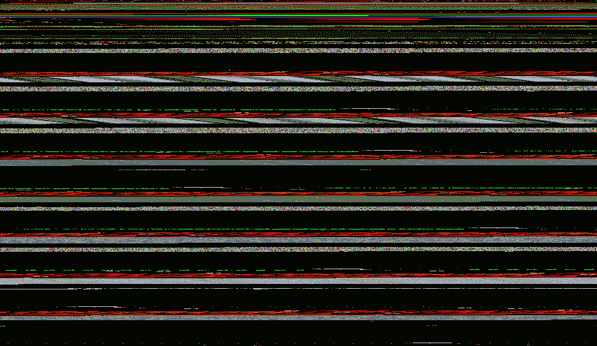

# 用 C++创建 Gstreamer 多媒体管道第 1 部分

> 原文：<https://medium.com/analytics-vidhya/creating-gstreamer-multimedia-pipeline-with-c-part-1-a7f0f86b5e1f?source=collection_archive---------0----------------------->


Gstreamer 是一个功能强大的通用框架，用于创建流媒体应用程序。它为构建实时 IVA ( *智能视觉分析*)应用提供了广泛的动力。

NVIDIA DeepStream SDK 是基于 Gstreamer 框架构建的。因此，学习 Gstreamer 将为您提供构建 IVA 应用程序的广阔视角。我开发 IVA 应用程序的主要语言是 C++。

本指南旨在帮助您理解 GStreamer 框架，以便您可以基于它开发应用程序。本系列的第一部分将重点介绍一个简单的 Gstreamer Hello world 程序的开发。我们正在处理多媒体应用，所以我们要播放一个网络视频。

Gstreamer 可以在 Linux、Mac OS X、Windows，

## **安装:**

在 Ubuntu 18.04.4 LTS 版上安装 Gstreamer

```
sudo apt-get updatesudo apt-get upgradesudo apt install g++ cmake pkg-configsudo apt-get install libgstreamer1.0-0 gstreamer1.0-plugins-base gstreamer1.0-plugins-good gstreamer1.0-plugins-bad gstreamer1.0-plugins-ugly gstreamer1.0-libav gstreamer1.0-doc gstreamer1.0-tools gstreamer1.0-x gstreamer1.0-alsa gstreamer1.0-gl gstreamer1.0-gtk3 gstreamer1.0-qt5 gstreamer1.0-pulseaudio
```

Windows 和 Mac 安装请点击此链接
[https://gstreamer . freedesktop . org/documentation/installing/index . html？gi-language=c](https://gstreamer.freedesktop.org/documentation/installing/index.html?gi-language=c)

## 文件结构

*   *CmakeLists.txt*
*   *main.cpp*

我们正在使用 cmake 工具来构建 cpp 程序。有关 cmake 的更多信息，请点击此链接[*https://cmake.org/cmake/help/v3.17/*](https://cmake.org/cmake/help/v3.17/)

***cmakelists . txt***

***main.cpp***

**代码遍历**

```
gst_init(&arg, &argv);
```

*   它初始化所有内部结构
*   检查有哪些插件可用
*   执行任何用于 Gstreamer 的命令行选项

如果您总是将命令行参数 argc 和 argv 传递给 gst_init()，您的应用程序将自动受益于 GStreamer 标准命令行选项

```
pipeline = gst_parse_launch(
        "playbin uri=https://www.freedesktop.org/software/gstreamer-sdk/data/media/sintel_trailer-480p.webm",
        *nullptr*);
```

这一行是这个例子的核心。gst_parse_launch()和 playbin。Gstreamer 是一个设计用来处理多媒体流的框架，媒体通过源(生产者)传播到接收器(消费者)，传递一系列中间元素来执行所有任务。所有相互连接的元素的集合称为管道。


在 Gstreamer 中，通常通过手工组装各个元素来构建管道。对于这个简单的演示，我们使用 gst_parse_launch()，这个函数获取管道的文本表示，并转换成实际的管道。

Playbin 是一个特殊的元素，它起着源和汇的作用，是一个完整的管道。在内部，它将创建和连接所有必要的元素来播放您的媒体。

```
gst_element_set_state(pipeline, GST_STATE_PLAYING);
```

每个 gstreamer 元素都有一个关联的状态，为了播放媒体，我们需要将管道设置为播放状态。

```
bus = gst_element_get_bus(pipeline);
msg = gst_bus_timed_pop_filtered(bus, **GST_CLOCK_TIME_NONE**,
                                 *static_cast*<GstMessageType>(GST_MESSAGE_ERROR | GST_MESSAGE_EOS));
```

这一行将一直等待，直到出现任何错误或找到流的结尾

退出应用程序之前，请释放资源。

```
*if* (msg != *nullptr*)
    gst_message_unref(msg);gst_object_unref(bus);
gst_element_set_state(pipeline, GST_STATE_NULL);
gst_object_unref(pipeline);
```

## 构建和执行:

```
git clone [https://github.com/karthickai/gstreamer.git](https://github.com/karthickai/gstreamer.git)
cd gstreamer/gstreamer-01
mkdir build; cd build
cmake ../
make
./gstreamer-01
```

## 输出:



感谢阅读。

如果你有任何建议/问题，请在评论区告诉我们！