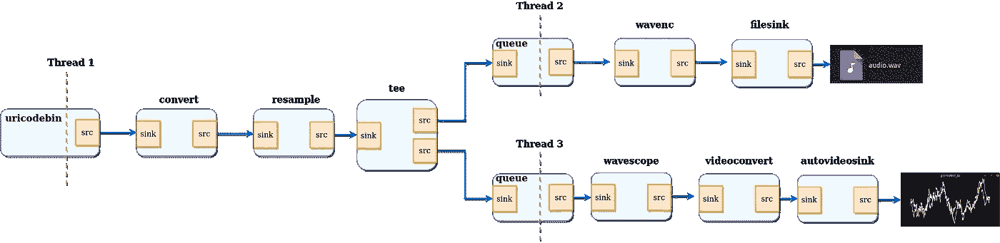

# 用 C++创建 Gstreamer 多媒体管道(第 2 部分)

> 原文：<https://medium.com/analytics-vidhya/creating-gstreamer-multimedia-pipeline-with-c-part-2-d3085c471747?source=collection_archive---------0----------------------->


为了掌握这篇文章的完整内容，请阅读我之前的[帖子](/@karthickai/creating-gstreamer-multimedia-pipeline-with-c-part-1-a7f0f86b5e1f)。

如果你正在从事边缘人工智能或计算机视觉项目，你一定会遇到 Gstreamer 框架。对 Gstreamer 有很好的了解将对您的项目有很大的帮助。

本文第 2 部分展示了使用 GStreamer 所需的其他基本概念，主要是

*   Gstreamer 多线程
*   Gstreamer 解复用器
*   Gstreamer 三通
*   Gstreamer 队列
*   GStreamer 可视化
*   GStreamer 重采样
*   Gstreamer 文件链接。

完成本文后，您将获得“动态”构建 Gstreamer 管道的必要知识。



让我们开始构建一个动态管道项目。源是网络视频，然后转换为音频信号，使用`tee`元素将其分离(它通过其源焊盘发送通过其接收焊盘接收的所有内容)。然后，一个分支将信号发送到 filesink 以保存音频文件，另一个分支呈现波形的视频并将其发送到屏幕。

## 完整的管道图:


## 文件结构

*   *CmakeLists.txt*
*   *main.cpp*

## 游戏攻略

```
*struct* CustomData {
    GstElement *pipeline;
    GstElement *source;
    GstElement *convert;
    GstElement *resample;
    GstElement *tee;
    GstElement *audio_queue;
    GstElement *wavenc;
    GstElement *sink;
    GstElement *wave_queue;
    GstElement *visual;
    GstElement *wave_convert;
    GstElement *wave_sink;

};
```

到目前为止，我们已经将所有需要的信息(基本上是指向 GstElements 的指针)保存为局部变量。由于本教程(和大多数真实的应用程序)涉及回调，我们将所有的数据组织在一个结构中，以便于处理。

```
/* Handler for the pad-added signal */
static void pad_added_handler (GstElement *src, GstPad *pad, CustomData *data);
```

这是一个前向参考，以后会用到。

```
data.source = gst_element_factory_make("uridecodebin", "source");
data.tee = gst_element_factory_make("tee", "tee");
data.audio_queue = gst_element_factory_make("queue", "audio_queue");
data.convert = gst_element_factory_make("audioconvert", "convert");
data.resample = gst_element_factory_make("audioresample", "resample");
data.wavenc = gst_element_factory_make("wavenc", "wavenc");
data.sink = gst_element_factory_make("filesink", "sink");
data.wave_queue = gst_element_factory_make("queue", "wave_queue");
data.visual = gst_element_factory_make ("wavescope", "visual");
data.wave_convert = gst_element_factory_make ("videoconvert", "csp");
data.wave_sink = gst_element_factory_make ("autovideosink", "wave_sink");
```

我们将照常创建元素。`uridecodebin`将在内部实例化所有必要的元素(源、解复用器和解码器),将 URI 转换为原始音频和/或视频流。它做的工作是`playbin`的一半。由于它包含解复用器，其源焊盘最初是不可用的，我们将需要在飞行中链接到它们。

`audioconvert`对于不同音频格式之间的转换很有用，确保这个例子可以在任何平台上工作，因为音频解码器产生的格式可能与音频接收器预期的不同。

`audioresample`对于不同的音频采样率之间的转换很有用，同样确保这个例子可以在任何平台上工作，因为音频解码器产生的音频采样率可能不是音频接收器支持的。

`wavescope`使用 autovideosink 消耗音频信号并在显示器上渲染波形。

```
*if* (!gst_element_link_many(data.convert, data.resample, data.tee, **NULL**) || !gst_element_link_many(data.audio_queue, data.wavenc, data.sink, **NULL**) || !gst_element_link_many(data.wave_queue, data.visual, data.wave_convert,data.wave_sink, **NULL**)) {
    g_printerr("Elements could not be linked");
    gst_object_unref(data.pipeline);
    *return* -1;
}
```

这里我们将 convert 元素链接到 tee，但我们**没有**将它们与源链接，因为此时它不包含源焊盘。我们只是让这个分支(converter - > tee)不链接，直到以后。

```
tee_audio_pad = gst_element_get_request_pad(data.tee, "src_%u");
g_print("Obtained request pad %s for audio branch.\n", **gst_pad_get_name** (tee_audio_pad));
tee_wave_pad = gst_element_get_request_pad(data.tee, "src_%u");
g_print("Obtained request pad %s for audio branch.\n", **gst_pad_get_name** (tee_wave_pad));
queue_audio_pad = gst_element_get_static_pad(data.audio_queue, "sink");
queue_wave_pad = gst_element_get_static_pad(data.wave_queue, "sink");

*if* (gst_pad_link(tee_audio_pad, queue_audio_pad) != GST_PAD_LINK_OK ||
    gst_pad_link(tee_wave_pad, queue_wave_pad) != GST_PAD_LINK_OK) {
    g_printerr("Tee could not be linked.\n");
    gst_object_unref(data.pipeline);
    *return* -1;
}
gst_object_unref(queue_audio_pad);
gst_object_unref(queue_wave_pad);
```

要链接请求板，需要通过将它们“请求”到元素来获得它们。一个元素可能能够产生不同种类的请求板，因此，当请求它们时，必须提供所需的板模板名称。在`tee`元素的文档中，我们看到它有两个 pad 模板，名为“sink”(用于其 sink Pads)和“src_%u”(用于请求 pad)。我们从带有`gst_element_get_request_pad()`的球座处要求两个衬垫(用于音频和波形分支)。

然后，我们从这些请求 pad 需要链接到的下游元素获取 pad。这些都是正常的总是垫，所以我们用`gst_element_get_static_pad()`获得它们。

最后，我们用`gst_pad_link()`链接 pads。这是`gst_element_link()`和`gst_element_link_many()`内部使用的功能。

```
g_signal_connect (data.source, "pad-added", G_CALLBACK (pad_added_handler), &data);
```

`GSignals`是 GStreamer 中至关重要的一点。当有趣的事情发生时，它们允许您得到通知(通过回调的方式)。信号通过名称识别，每个`GObject`都有自己的信号。

当我们的源元素最终有足够的信息开始产生数据时，它将创建源焊盘，并触发“焊盘添加”信号。此时，我们的回调将被调用:

```
static void pad_added_handler (GstElement *src, GstPad *new_pad, CustomData *data) {
```

`src`是触发信号的`GstElement`。在这个例子中，它只能是`uridecodebin`。

`new_pad`是刚刚添加到`src`元素中的`GstPad`。这通常是我们要链接的凸台。

`data`是我们在附加信号时提供的指针。在这个例子中，我们用它来传递`CustomData`指针。

```
GstPad *sink_pad = gst_element_get_static_pad(data->convert, "sink");
```

从`CustomData`中，我们提取转换器元素，然后使用`gst_element_get_static_pad ()`检索其汇点。这是我们想要链接的焊盘`new_pad`

```
*/* Check the new pad's type */* new_pad_caps = gst_pad_get_current_caps(new_pad);
new_pad_struct = gst_caps_get_structure(new_pad_caps, 0);
new_pad_type = gst_structure_get_name(new_pad_struct);
*if* (!g_str_has_prefix(new_pad_type, "audio/x-raw")) {
    g_print("It has type '%s' which is not raw audio. Ignoring.\n", new_pad_type);
    *goto* exit;
}
```

现在我们将检查这个新 pad 将要输出的数据类型，因为我们只对产生音频的 pad 感兴趣。我们之前已经创建了一个处理音频的管道(一个`audioconvert`与一个`audioresample`和`tee`链接)

如果名字不是`audio/x-raw`，这就不是解码音频板，我们对它不感兴趣。

否则，尝试链接:

```
ret = gst_pad_link(new_pad, sink_pad);
*if* (**GST_PAD_LINK_FAILED** (ret)) {
    g_print("Type is '%s' but link failed.\n", new_pad_type);
} *else* {
    g_print("Link succeeded (type '%s').\n", new_pad_type);
}
```

`gst_pad_link()`尝试连接两个焊盘。最后我们完成了， ***源*** 与 ***三通*** 通过 ***转换*** 和 ***重采样。三通*** 与 ***音频 _ 队列*** 和 ***波 _ 队列*** 然后 ***音频 _ 队列*** 与 ***文件链接*** 保存一个 wav 文件使用 ***wavenc*** 编码器和 ***波 _ 队列***

## 构建和执行:

```
git clone [https://github.com/karthickai/gstreamer.git](https://github.com/karthickai/gstreamer.git)
cd gstreamer/gstreamer-02
mkdir build; cd build
cmake ../
make
./gstreamer-02
```

## 输出:


## 链接:

[](https://github.com/karthickai/gstreamer.git) [## karthickai/gstreamer

### 使用 C++开始使用 Gstreamer。为 karthickai/gstreamer 开发做贡献，创建一个帐户…

github.com](https://github.com/karthickai/gstreamer.git) 

感谢阅读。

如果你有任何建议/问题，请在评论区告诉我们！