# 使用 Google 云平台 AutoML 创建、托管和推理机器学习模型

> 原文：<https://medium.com/analytics-vidhya/creating-hosting-inferencing-machine-learning-model-using-google-cloud-platform-automl-83413c9ff919?source=collection_archive---------5----------------------->

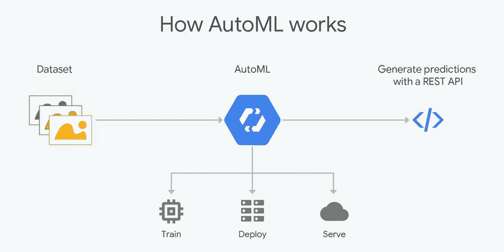

谷歌云平台 Auto ML

# **目标:**

1.  创建数据集并上传训练数据。
2.  培训和部署模型
3.  使用 REST API 进行推理

# **数据集:**

[https://gist . github . com/10b 81 d9 f 1286 bb 002 b 3312 b 2300d 808 . git](https://gist.github.com/10b81d9f1286bbe002b3312b2300d808.git)

# **步骤:**

第一步:

*   创建一个 Google 云存储桶并上传 csv 文件。

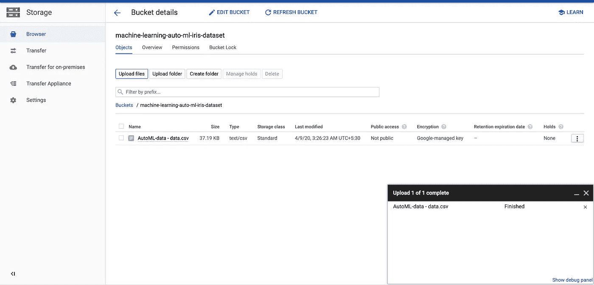

GCS 存储桶创建和上传数据文件

*   现在，我们将在 GCP 平台内创建一个数据集。访问[https://console.cloud.google.com/](https://console.cloud.google.com/)并转到人工智能- >表格- >数据集。启用 API(如果尚未启用)。

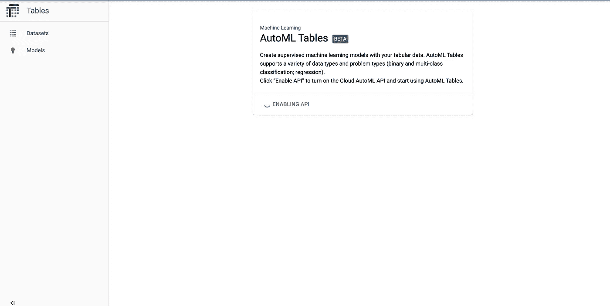

自动表格主页屏幕

*   点击“新建数据集”

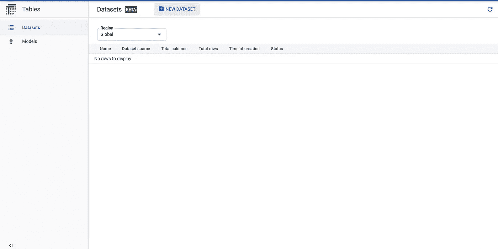

创建新数据集。

*   将名称设置为“irisdataset ”,并将区域设置为“Global”。点击“创建数据集”。

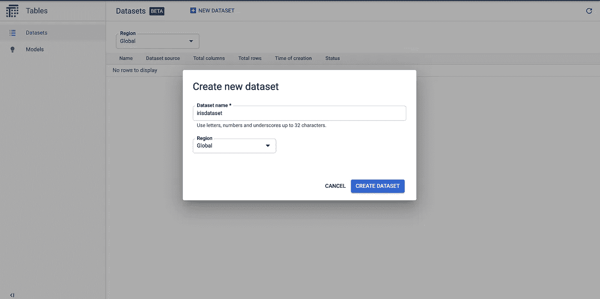

创建数据集

*   我们现在需要将数据导入到新创建的数据集中。我们将通过上面上传的 GCS 桶加载相同的内容。但是，如果您有数据，也可以从本地机器和 BigQuery 上传。选择“从云存储中选择 CSV 文件”选项，并提供文件所在的 GCS bucket 文件路径。完成后，点击“导入”按钮。

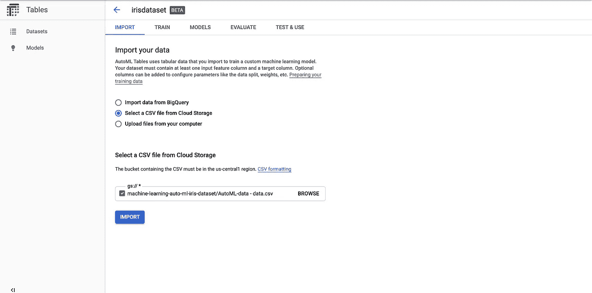

导入数据

*   一旦数据被导入，它将显示数据的模式和数据摘要。它将显示缺失值计数、无效值(如果有)、不同值计数以及相互关系。它会自动预测数据类型，但如果你觉得它的分类不正确，请继续改变它。

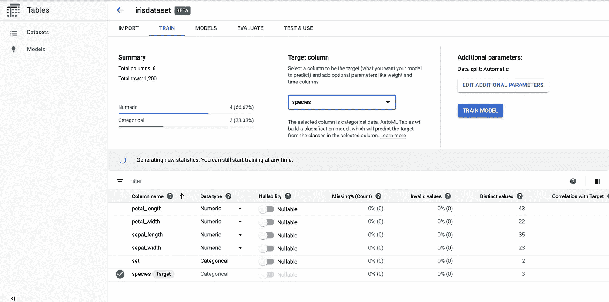

输入数据详细信息

*   这就完成了我们创建数据集和上传数据的第一个目标。
*   你可以在下面的链接中了解更多关于准备培训数据的信息:[https://cloud.google.com/automl-tables/docs/prepare](https://cloud.google.com/automl-tables/docs/prepare)

**第二步:**

*   现在，让我们将重点放在培训和部署模型上。
*   我们需要选择目标列为“物种”。这将被用作我们的目标属性，即预测值。一旦设定，谷歌云平台将开始分析特征和目标变量之间的相互关系。

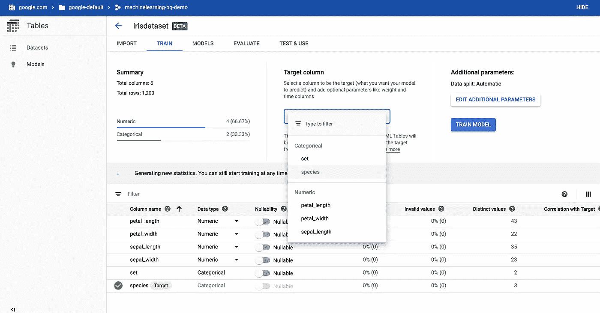

设置目标变量

*   一旦设置了目标变量，请点击“训练模型”。提供模型名称“irisdataset”。您可以将预算设置为“2”个最大节点小时。这可以确保您的模型构建过程不会被收取过高的费用。在功能选择列下，请取消选择“设置”功能，因为它与我们的目标变量无关，并且对目标变量没有任何影响。

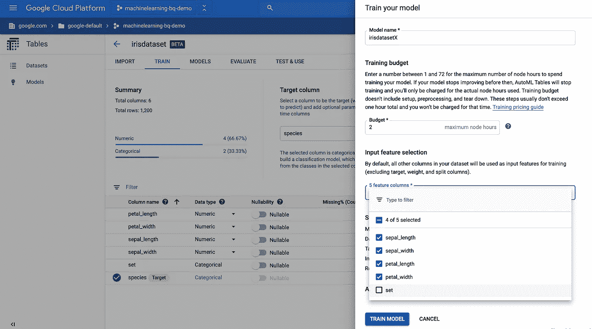

为模型训练设置配置

*   你会发现 AutoML 会自动选择机器学习模型。谷歌有多个深度学习模型，根据功能和目标变量，它会选择最适合的模型。(**注:没有更改型号的选项。**)

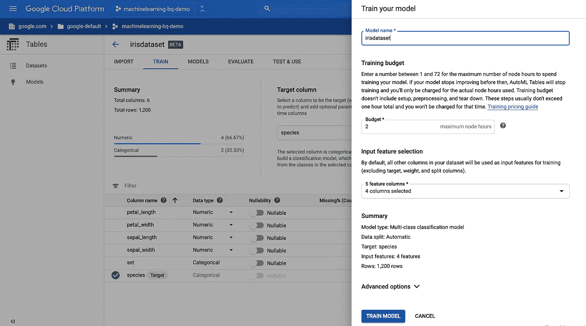

AutoML 选择模型

*   完成后，请点击“火车模型”。这将开始训练模型。培训过程需要时间。您无需等待培训过程，因为您将在完成模型培训过程后收到一封电子邮件。

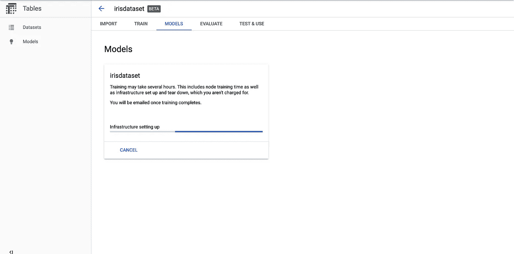

模特培训

*   模型训练完成后，您将能够看到模型训练的详细信息。

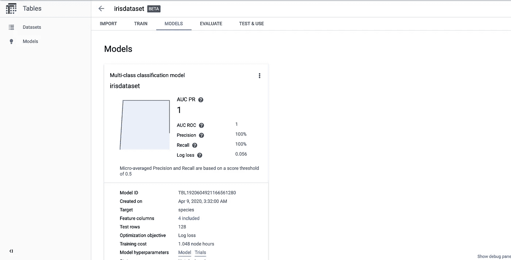

模型细节

*   您可以通过访问“评估”选项卡查看模型评估的详细信息。

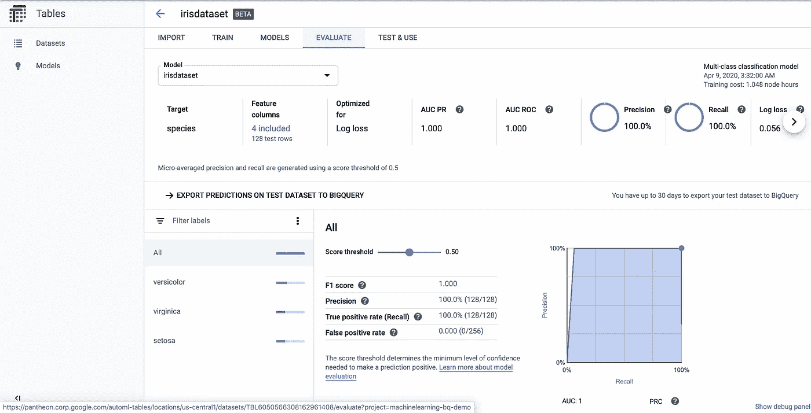

模型评估详细信息

*   现在，我们已经准备好了我们的机器学习模型，我们将通过 REST API 在线部署它来进行预测。
*   转到“测试和使用”选项卡，点击“在线预测”，如下所示。

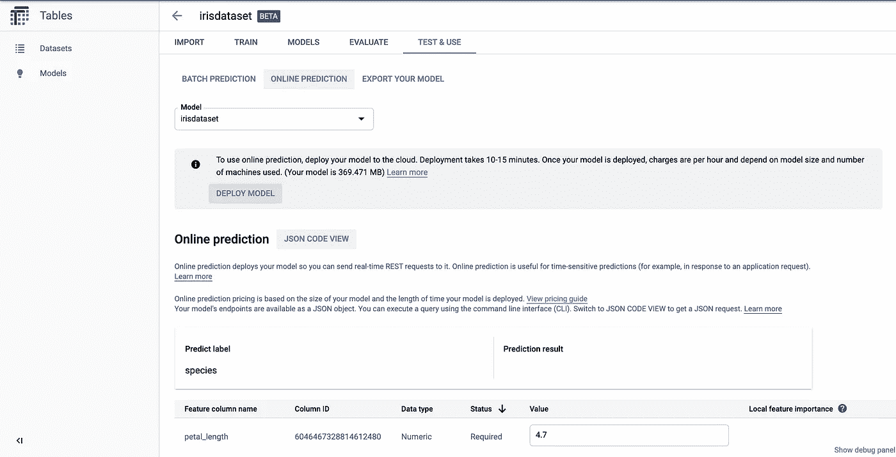

在线预测部署

*   点击“部署模型”。系统将提示您进行确认，单击“部署”继续。

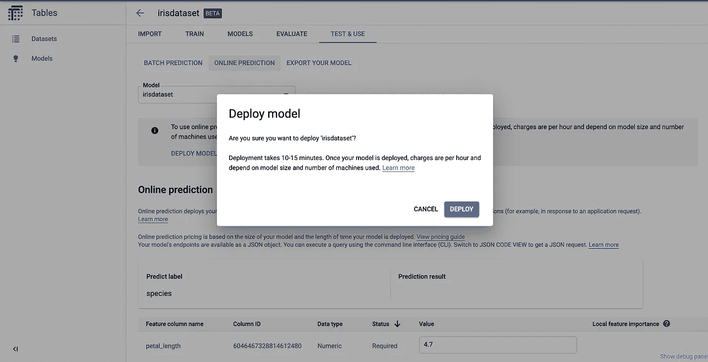

模型部署确认

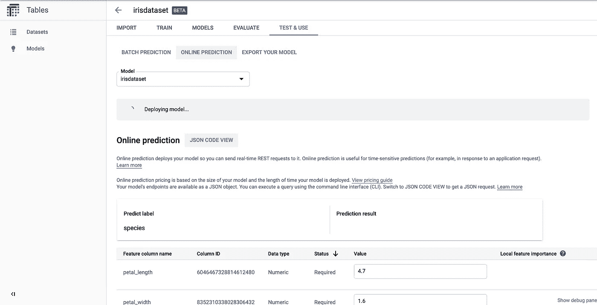

模型部署正在进行

*   一旦模型部署完成，模型将可用于在线预测。

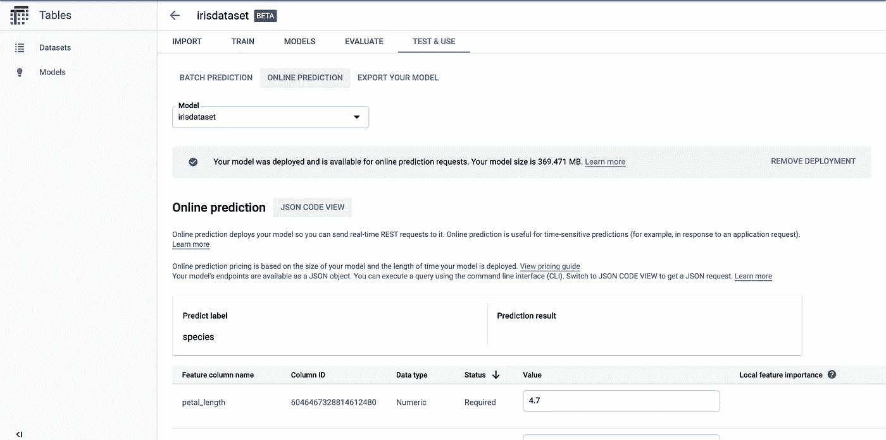

为在线预测部署的模型。

*   GCP 平台按模型部署时间对虚拟机收费。如果我们不用它来节省成本，我们可以删除该模型。这完成了我们的第二个目标，现在让我们继续使用 REST API 进行推理。
*   你可以在下面的链接阅读更多关于训练汽车模型的信息:【https://cloud.google.com/automl-tables/docs/train 

**第三步:**

*   可以使用下面的 API 来访问 REST API

```
POST https://automl.googleapis.com/v1beta1/projects/<<projectid>>/locations/<<region_name>>/models/<<modelid>>:predict?access_token=<<access_token>>
```

*   您可以通过访问 model 选项卡找到 modelid。
*   请看下面通过 REST API 推断模型的快照

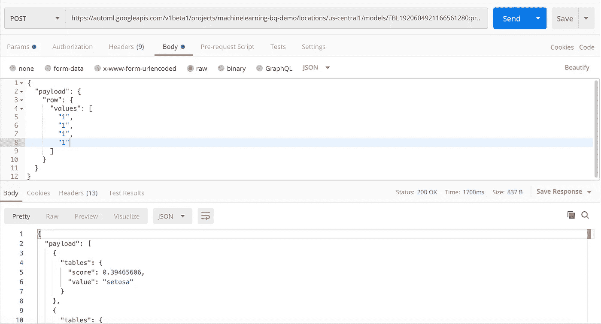

REST API 接口

*   这就完成了我们的第三个目标。(**注意:如果您不打算继续使用模型部署，请将其删除，以节省成本。**)
*   你可以通过下面的链接了解更多关于 AutoML 表格的信息:[https://cloud.google.com/automl-tables/docs](https://cloud.google.com/automl-tables/docs)
*   如果有任何疑问，请提出意见，我很乐意回答。