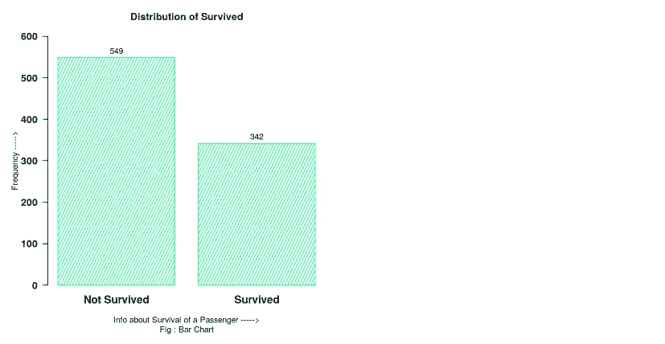

# 用 R 语言创建信息丰富的装饰性简单条形图

> 原文：<https://medium.com/analytics-vidhya/creating-informative-and-decorative-simple-bar-chart-in-r-detailed-explanation-of-concepts-and-6cf45ef1fa75?source=collection_archive---------24----------------------->

## (详细的*概念和代码的解释)*

**嘿**，想创建这样简单的条形图？阅读文章(代码见文章末尾)


## 简介-

这篇文章的主要目的是创建一个**信息和装饰简单条形图**。本文由以下内容组成-

1.  问题陈述
2.  问题的解决
3.  什么是简单条形图？
4.  什么时候用？
5.  图表的一部分
6.  它是如何在 R 中绘制的？
7.  保存图表以供脱机使用
8.  一些重要的观点
9.  所有有用的代码
10.  参考

## 1.问题陈述-

假设您有一个数据集，其中有许多特征，其中一个(或多个)是分类特征。**我的问题是:**这些特征是如何一个一个地进行可视化分析的？

## 2.问题的解决方案-

在**简单条形图**的帮助下，对这些特征逐一进行可视化分析。

## 3.简单条形图-

简单条形图提供了某一实例的分类特征的直观表示。它通常有-

1.  X 轴上的类别
2.  Y 轴上相应类别的数字(频率或相对频率)

这种简单的条形图也被称为**垂直条形图**或**柱形图**。

## 4.当它被使用时-

在下列情况下使用此图表类型-

1.  你必须比较几个类别特征/变量的数字(频率或相对频率)。
2.  类别的顺序并不重要。

## 5.简单条形图的一部分-

在绘制图表之前，必须了解图表的不同部分。一个简单的条形图主要有六个部分-

1.  主标题
2.  副标题
3.  轴线
4.  坐标轴标题
5.  轴标签
6.  数据和数据标签(数据面板)

所有这些部分都显示在下图中-


## 6.它是如何在 R -中绘制的

它包括以下三个步骤-

1.  创建简单的条形图
2.  让它信息丰富
3.  装饰一下

现在，我将逐一详细讨论这些步骤。

**加载数据集-**

在继续之前，让我们通过以下代码在 R-session ( ***我正在使用 kaggle R-Notebook，您可以使用 R-studio 离线工作*** )中加载数据集-

> 想要下载数据集供离线使用，点击 [**这里**](https://www.kaggle.com/pranjalpandey12/data-for-bar-chart/download)

```
**# Loading Data**
data = read.csv("../input/data-for-bar-chart/Data for Bar chart.csv" , header = T)
```

**检查数据集-**

请参见数据集的前 5 行，了解如下特征类型-

```
**# See top 5-rows of data**
head(data)
```


**输出:1**

从上面的输出可以清楚地看出，有两个分类特征**【已出发】**和**【幸存】**。

我将为特性**【幸存】**绘制简单的条形图，并将其他特性**【已出发】**留给您练习。

现在，回到上面讨论的三个步骤，即:

1.  创建简单的条形图
2.  让它信息丰富
3.  装饰一下

**1。创建简单条形图的步骤-**

*   **步骤— (i)** :为幸存的创建一个频率表(**“table(column _ name)”函数用于**)，并将该表分配到 R-object“a”中
*   **步骤— (ii)** :通过 **barplot(a)** 函数创建简单的条形图，将步骤— (i)中已经创建的 R-object 作为其参数传递，并将该图分配给 R-object“x”以供进一步使用。

```
**# Step - (i)**

**# Creating frequency table for Survived and assigning this table in R-object "a"** 
a <- table(data$Survived)

**# Print object a**
a
```


**输出:2 个**

**以上输出显示了“幸存”的频率表。这意味着在“数据”的“幸存”列中，0 出现了 549 次，1 出现了 342 次。**

```
**# Step - (ii)**

**# Creating Simple bar chart and assign it in R-object "x" for further use**
x <- barplot(a)
```


**输出:3**

嗯，简单的条形图现在已经准备好了，但它是不完整的。**为什么？**

> 让我们想一想，你是了解数据集的人，如果你制作了这样的图表，你可能会知道这个图表在解释什么。但是如果你把同样的图表给一个不知道你的数据集的人看，那么他就不能理解你的图表。这就是为什么有必要让它提供更多的信息。

**2。使上面得到的简单条形图更具信息量的步骤-**

*   **步骤-(i)** : **调整 Y 轴极限**:使用 **barplot()** 函数中的 **ylim = c(lower_limit，upper_limit)** 自变量。
*   **步骤-(ii)** : **重命名 X 轴的标签:**在 **barplot()** 函数中使用 **names.arg = c("label_for_0 "，" label_for_1")** 参数。
*   **步骤-(iii)** : **添加所有标题(主标题、子标题、轴标题)**:在 **barplot()** 函数后使用 **title()** 函数。

**title()函数的参数-**

1.  **添加主标题**:在 **title()** 函数中使用 **main = "Main_title"** 自变量。
2.  **添加子标题**:使用 **title()** 函数中的 **sub = "Sub_title"** 参数。
3.  **添加 X 轴标题**:在 **title()** 函数中使用 **xlab = "X-axis_title"** 参数。
4.  **添加 Y 轴标题**:使用 **title()** 函数中的 **ylab = "Y 轴标题"**参数。

*   **步骤-(iv)** : **添加数据标签**:在 **barplot()** 函数之后使用 **text()** 函数。

**文本(d1，d2，d3)函数的参数-**

1.  **d1** :表示包含条形图的 R 对象。(在我的例子中是:x)
2.  **d2** :表示标签的位置，即我们想要在绘图中写入标签的位置。在我的例子中，它是:a + 16，其中 a : R-object 包含底层分类特征的频率表，我已经将 16 添加到 a 中，这为所有类别的标签提供了合适的位置。

> **注:**值:16 因地块不同而不同，采用试凑法获得，即先试 a + 1，绘制图形。如果它是好的，那么好，否则增加它，直到你得到一个合适的地方的标签。

3. **d3** :代表你要作为字符书写的标签。用 **labels = as.character(a)** 代替 d3，其中 a:R-包含频率表的对象。

```
**# Step-(i)**

**# Increasing limit of y-axis**
x <- barplot(a , ylim = c(0,600))
```


**输出:4 个**

```
**# Step-(ii)**

**# Renaming X-axis Labels**
x <- barplot(a , ylim = c(0,600) , names.arg = c("Not Survived","Survived"))
```


**输出:5**

```
**# Step-(iii)**

x <- barplot(a , ylim = c(0,600) , names.arg = c("Not Survived","Survived"))

**# Add all type of titles**
title(main = "Distribution of Survived" , sub = "Fig : Bar Chart" , xlab = "Info about Survival of a Passenger ----->" , ylab = "Frequency ----->" )
```


**输出:6 个**

```
**# Step-(iv)**

x <- barplot(a , ylim = c(0,600) , names.arg = c("Not Survived","Survived"))

**# Add all type of titles**
title(main = "Distribution of Survived" , sub = "Fig : Bar Chart" , xlab = "Info about Survival of a Passenger ----->" , ylab = "Frequency ----->" )

**# Add data labels**
text(x , a+16, labels = as.character(a))
```


**输出:7**

这是一个信息丰富的简单条形图。它解释了所有关于“幸存”的特性。

现在，创建一个简单的信息条形图，如下所示

```
**# Just make an informative simple bar chart in a single shot**

x <- barplot(a , ylim = c(0,600) , names.arg = c("Not Survived","Survived"))

title(main = "Distribution of Survived" , sub = "Fig : Bar Chart" , xlab = "Info about Survival of a Passenger ----->" , ylab = "Frequency ----->" )    

text(x , a+16, labels = as.character(a))
```


**输出:8**

## 很好！

> 上面的图表中遗漏了一些东西。**什么？**
> 
> 嗯…我认为是“装饰”。哈哈哈哈…..
> 
> **为什么要装饰图表？**
> 
> 一般来说，人们喜欢颜色。装饰性图表和信息性图表比信息性图表更能吸引人们的注意力。因此，还需要装饰图表。

**3。将上面获得的信息丰富的简单条形图制作成装饰图的步骤-**

*   **步骤-(i)** : **旋转 Y 轴标签以获得更好的视图**:使用 **las = 1** 作为 **barplot()** 函数中的参数。
*   **步骤-(ii)** : **装饰矩形条**:3-更多参数在 **barplot()** 函数中使用。

**论证细节-**

1.  **col :** 给矩形条着色
2.  **边框**:给矩形条的边框上色
3.  **密度**:调整各条线条的密度

*   **步骤-(iii)** : **修饰轴标签**:4-在**条形图()**函数中使用了更多的参数。

**参数详细信息-**

1.  **cex.axis** :调整 Y 轴标签尺寸
2.  **cex.names** :调整 X 轴标签的大小
3.  **font.axis** :改变轴的字体样式(字体= 1 表示正常，字体= 2 表示粗体，字体= 3 表示斜体，字体= 4 表示粗体和斜体)
4.  **col.axis** :改变轴标签的颜色

*   **步骤-(iv)** : **修饰标题**:9-在 **title()** 函数中使用了更多的参数。

**论证细节-**

1.  **cex.main** :调整主标题的大小
2.  **cex.sub** :调整副标题的大小
3.  **cex.lab** :调整轴标题的大小
4.  **font.main** :改变主标题的字体样式
5.  **font.sub** :改变副标题的字体样式
6.  **font.lab** :改变轴标题的字体样式
7.  **主栏**:改变主标题的颜色
8.  **子标题**:改变子标题的颜色
9.  **col.lab** :改变轴标题的颜色

*   **步骤-(v)** : **布置数据标签**:3-更多参数在 **text()** 函数中使用。

**论证细节-**

1.  **cex** :调整数据标签的大小
2.  **字体**:改变数据标签的字体样式
3.  **col** :改变数据标签的颜色

```
**# Step-(i)**

**# Rotate Y-axis labels**
x <- barplot(a , ylim = c(0,600) , names.arg = c("Not Survived","Survived") , las = 1)

title(main = "Distribution of Survived" , sub = "Fig : Bar Chart" , xlab = "Info about Survival of a Passenger ----->" , ylab = "Frequency ----->" )    

text(x , a+16, labels = as.character(a))
```


**输出:9**

**注意，Y 轴标签现在是水平的。**

```
**# Step-(ii)

# Using "col" argument in barplot() function**
x <- barplot(a , ylim = c(0,600) , names.arg = c("Not Survived","Survived") , las = 1 , col = "spring green")

title(main = "Distribution of Survived" , sub = "Fig : Bar Chart" , xlab = "Info about Survival of a Passenger ----->" , ylab = "Frequency ----->" )    

text(x , a+16, labels = as.character(a))
```


**输出:10 个**

> **通知-**
> 
> **1。酒吧的颜色是春天的绿色。**
> 
> **2。条形的边框是黑色的。**
> 
> **3。每个条形中的线条密度非常高。**

```
**# Step-(ii)**

**# Using "border" argument in barplot() function**
x <- barplot(a , ylim = c(0,600) , names.arg = c("Not Survived","Survived") , las = 1 , col = "spring green" , border = "spring green")

title(main = "Distribution of Survived" , sub = "Fig : Bar Chart" , xlab = "Info about Survival of a Passenger ----->" , ylab = "Frequency ----->" )    

text(x , a+16, labels = as.character(a))
```


**输出:11**

> **通知-**
> 
> **1。酒吧的边界也是春天的绿色。**
> 
> **2。每个条形中的线条密度非常高。**

```
**# Step-(ii)**

**# Using "density" argument in barplot() function**
x <- barplot(a , ylim = c(0,600) , names.arg = c("Not Survived","Survived") , las = 1 , col = "spring green" , border = "spring green" , density = 12)

title(main = "Distribution of Survived" , sub = "Fig : Bar Chart" , xlab = "Info about Survival of a Passenger ----->" , ylab = "Frequency ----->" )    

text(x , a+16, labels = as.character(a))
```


**输出:12**

**注意，每个条形中的线条密度较低。**

```
**# Step-(iii)**

**# Using "cex.axis" argument in barplot() function**
x <- barplot(a , ylim = c(0,600) , names.arg = c("Not Survived","Survived") , las = 1 , col = "spring green" , border = "spring green" , density = 12 , cex.axis = 1.2)

title(main = "Distribution of Survived" , sub = "Fig : Bar Chart" , xlab = "Info about Survival of a Passenger ----->" , ylab = "Frequency ----->" )    

text(x , a+16, labels = as.character(a))
```


**输出:13**

**注意 Y 轴上标签尺寸的差异。**

```
**# Step-(iii)**

**# Using "cex.names" argument in barplot() function**
x <- barplot(a , ylim = c(0,600) , names.arg = c("Not Survived","Survived") , las = 1 , col = "spring green" , border = "spring green" , density = 12 , cex.axis = 1.2 , cex.names = 1.3)

title(main = "Distribution of Survived" , sub = "Fig : Bar Chart" , xlab = "Info about Survival of a Passenger ----->" , ylab = "Frequency ----->" )    

text(x , a+16, labels = as.character(a))
```


**输出:14**

**注意 X 轴上标签尺寸的差异。**

```
**# Step-(iii)**

**# Using "font.axis" argument in barplot() function**
x <- barplot(a , ylim = c(0,600) , names.arg = c("Not Survived","Survived") , las = 1 , col = "spring green" , border = "spring green" , density = 12 , cex.axis = 1.2 , cex.names = 1.3 , font.axis = 2)

title(main = "Distribution of Survived" , sub = "Fig : Bar Chart" , xlab = "Info about Survival of a Passenger ----->" , ylab = "Frequency ----->" )    

text(x , a+16, labels = as.character(a))
```



**输出:15**

**注意轴标签现在是粗体的。**

```
**# Step-(iii)**

**# Using "col.axis" argument in barplot() function**
x <- barplot(a , ylim = c(0,600) , names.arg = c("Not Survived","Survived") , las = 1 , col = "spring green" , border = "spring green" , density = 12 , cex.axis = 1.2 , cex.names = 1.3 , font.axis = 2 , col.axis = "dark blue")

title(main = "Distribution of Survived" , sub = "Fig : Bar Chart" , xlab = "Info about Survival of a Passenger ----->" , ylab = "Frequency ----->" )    

text(x , a+16, labels = as.character(a))
```


**输出:16**

**注意坐标轴标签现在是深蓝色的。**

```
**# Step-(iv)**

**# Using "cex" argument in title() function for all titles**
x <- barplot(a , ylim = c(0,600) , names.arg = c("Not Survived","Survived") , las = 1 , col = "spring green" , border = "spring green" , density = 12 , cex.axis = 1.2 , cex.names = 1.3 , font.axis = 2 , col.axis = "dark blue")

title(main = "Distribution of Survived" , sub = "Fig : Bar Chart" , xlab = "Info about Survival of a Passenger ----->" , ylab = "Frequency ----->" , cex.main = 1.8 , cex.lab = 1.5 , cex.sub = 1.15)    

text(x , a+16, labels = as.character(a))
```


**输出:17**

**注意所有标题大小的差异。**

```
**# Step-(iv)**

**# Using "font" argument in title() function for all titles**
x <- barplot(a , ylim = c(0,600) , names.arg = c("Not Survived","Survived") , las = 1 , col = "spring green" , border = "spring green" , density = 12 , cex.axis = 1.2 , cex.names = 1.3 , font.axis = 2 , col.axis = "dark blue")

title(main = "Distribution of Survived" , sub = "Fig : Bar Chart" , xlab = "Info about Survival of a Passenger ----->" , ylab = "Frequency ----->" , cex.main = 1.8 , cex.lab = 1.5 , cex.sub = 1.15 , font.main = 2 , font.lab =2 , font.sub = 2)    

text(x , a+16, labels = as.character(a))
```


**输出:18**

**请注意，所有标题现在都是粗体。**

```
**# Step-(iv)**

**# Using "col" argument in title() function for all titles**
x <- barplot(a , ylim = c(0,600) , names.arg = c("Not Survived","Survived") , las = 1 , col = "spring green" , border = "spring green" , density = 12 , cex.axis = 1.2 , cex.names = 1.3 , font.axis = 2 , col.axis = "dark blue")

title(main = "Distribution of Survived" , sub = "Fig : Bar Chart" , xlab = "Info about Survival of a Passenger ----->" , ylab = "Frequency ----->" , cex.main = 1.8 , cex.lab = 1.5 , cex.sub = 1.15 , font.main = 2 , font.lab =2 , font.sub = 2 , col.main = "red" , col.lab = "darkgreen" , col.sub = "magenta")    

text(x , a+16, labels = as.character(a))
```


**输出:19**

注意标题的颜色。

```
**# Step-(v)**

**# Using "cex" argument in text() function** 
x <- barplot(a , ylim = c(0,600) , names.arg = c("Not Survived","Survived") , las = 1 , col = "spring green" , border = "spring green" , density = 12 , cex.axis = 1.2 , cex.names = 1.3 , font.axis = 2 , col.axis = "dark blue")

title(main = "Distribution of Survived" , sub = "Fig : Bar Chart" , xlab = "Info about Survival of a Passenger ----->" , ylab = "Frequency ----->" , cex.main = 1.8 , cex.lab = 1.5 , cex.sub = 1.15 , font.main = 2 , font.lab =2 , font.sub = 2 , col.main = "red" , col.lab = "darkgreen" , col.sub = "magenta")    

text(x , a+16, labels = as.character(a) ,cex = 1.4 )
```


**输出:20**

注意数据标签大小的不同。

```
**# Step-(v)**

**# Using "font" argument in text() function** 
x <- barplot(a , ylim = c(0,600) , names.arg = c("Not Survived","Survived") , las = 1 , col = "spring green" , border = "spring green" , density = 12 , cex.axis = 1.2 , cex.names = 1.3 , font.axis = 2 , col.axis = "dark blue")

title(main = "Distribution of Survived" , sub = "Fig : Bar Chart" , xlab = "Info about Survival of a Passenger ----->" , ylab = "Frequency ----->" , cex.main = 1.8 , cex.lab = 1.5 , cex.sub = 1.15 , font.main = 2 , font.lab =2 , font.sub = 2 , col.main = "red" , col.lab = "darkgreen" , col.sub = "magenta")    

text(x , a+16, labels = as.character(a) ,cex = 1.4 , font = 2)
```


**输出:21**

**请注意，数据标签现在以粗体显示。**

```
**# Step-(v)**

**# Using "col" argument in text() function** 
x <- barplot(a , ylim = c(0,600) , names.arg = c("Not Survived","Survived") , las = 1 , col = "spring green" , border = "spring green" , density = 12 , cex.axis = 1.2 , cex.names = 1.3 , font.axis = 2 , col.axis = "dark blue")

title(main = "Distribution of Survived" , sub = "Fig : Bar Chart" , xlab = "Info about Survival of a Passenger ----->" , ylab = "Frequency ----->" , cex.main = 1.8 , cex.lab = 1.5 , cex.sub = 1.15 , font.main = 2 , font.lab =2 , font.sub = 2 , col.main = "red" , col.lab = "darkgreen" , col.sub = "magenta")    

text(x , a+16, labels = as.character(a) ,cex = 1.4 , font = 2 , col = "orange")
```


**输出:22**

**注意数据标签的颜色。**

**只需一次创建一个信息丰富、装饰精美的简单条形图，如下所示-**

```
**# Just create an Informative and well-Decorative Simple Bar Chart in one shot** 
x <- barplot(a , ylim = c(0,600) , names.arg = c("Not Survived","Survived") , las = 1 , col = "spring green" , border = "spring green" , density = 12 , cex.axis = 1.2 , cex.names = 1.3 , font.axis = 2 , col.axis = "dark blue")

title(main = "Distribution of Survived" , sub = "Fig : Bar Chart" , xlab = "Info about Survival of a Passenger ----->" , ylab = "Frequency ----->" , cex.main = 1.8 , cex.lab = 1.5 , cex.sub = 1.15 , font.main = 2 , font.lab =2 , font.sub = 2 , col.main = "red" , col.lab = "darkgreen" , col.sub = "magenta")    

text(x , a+16, labels = as.character(a) , cex = 1.4 , font = 2 , col = "orange")
```


**输出:23**

## 太好了！

这是一个信息量大、装饰性强的简单条形图。

## 7.保存图表以供脱机使用-

```
**# Saving the Chart for offline use**
jpeg("BarChart.jpg")

x <- barplot(a , ylim = c(0,600) , names.arg = c("Not Survived","Survived") , las = 1 , col = "spring green" , border = "spring green" , density = 12 , cex.axis = 1.2 , cex.names = 1.3 , font.axis = 2 , col.axis = "dark blue")

title(main = "Distribution of Survived" , sub = "Fig : Bar Chart" , xlab = "Info about Survival of a Passenger ----->" , ylab = "Frequency ----->" , cex.main = 1.8 , cex.lab = 1.5 , cex.sub = 1.15 , font.main = 2 , font.lab =2 , font.sub = 2 , col.main = "red" , col.lab = "darkgreen" , col.sub = "magenta")    

text(x , a+16, labels = as.character(a) , cex = 1.4 , font = 2 , col = "orange")

dev.off()
```

从笔记本电脑数据面板的输出部分下载文件。

## 8.一些重要的观点-

1.  到目前为止，我已经用频率做了简单的柱状图。**您也可以使用相对频率**。在这种情况下，唯一的区别是创建包含频率表的 R 对象。**现在，你必须创建一个包含相对频率表的 R 对象，其实现如下-**

```
**# Creating Relative frequency table and assigning it in a R-object****"a"**a <- table(data$Survived)/length(data$Survived)

*# Print the object a*
a
```


**输出:24**

> **以上输出显示了幸存特征的相对频率表。**
> 
> **所有其他绘图步骤与上述情况相同。**

2.X 轴和 Y 轴可以互换，即我们可以在 Y 轴上表示不同的类别，在 X 轴上表示相应类别的编号。这种图表称为**水平简单条形图**。要绘制它，只需在 **barplot()** 函数中再传递一个参数 **horiz = TRUE** ，并相应地进行一些更改，如 X 轴和 Y 轴标题、数据标签的位置等。(**自己动手**)

3.当有大量类别要比较时，水平简单条形图比垂直简单条形图更可取。

4.条形的高度(长度)与它们所代表的数字(频率/相对频率)成正比。

5.条的宽度是任意的。

6.条形图通常是按比例缩放的，这样所有的数据都可以适当地显示在图表上。(当你在一张图表纸上工作时，这个概念被使用)

7.像 cex，cex.main，cex.sub，cex.lab，cex.axis，cex.names，density 这样的参数值是通过试凑法选择的。(不需要记住这些值)

8.**字体**和**列**的值取决于您的选择。你也可以使用**十六进制颜色代码**来选择你喜欢的颜色。示例:**深粉色的十六进制代码— #FF1493**

> 要知道颜色的十六进制代码，点击 [**这里**](https://www.rapidtables.com/web/color/RGB_Color.html)

## 9.所有有用的代码-

如果你处理频率表并想创建一个垂直的简单条形图，使用下面的代码

```
**# Creating a Vertical Simple Bar Chart using frequency table** 
a <- table(data$Survived)

x <- barplot(a , ylim = c(0,600) , names.arg = c("Not Survived","Survived") , las = 1 , col = "spring green" , border = "spring green" , density = 12 , cex.axis = 1.2 , cex.names = 1.3 , font.axis = 2 , col.axis = "dark blue")

title(main = "Distribution of Survived" , sub = "Fig : Bar Chart" , xlab = "Info about Survival of a Passenger ----->" , ylab = "Frequency ----->" , cex.main = 1.8 , cex.lab = 1.5 , cex.sub = 1.15 , font.main = 2 , font.lab =2 , font.sub = 2 , col.main = "red" , col.lab = "darkgreen" , col.sub = "magenta")    

text(x , a+16, labels = as.character(a) , cex = 1.4 , font = 2 , col = "orange")
```


**输出:25**

如果你处理相对频率表并想创建一个垂直的简单条形图，使用下面的代码

```
**# Creating a Vertical Simple Bar Chart using relative frequency table but adjust the limit of Y-axis , Otherwise it may create problem**
a <- table(data$Survived)/length(data$Survived)

x <- barplot(a , **ylim = c(0,0.7)** , names.arg = c("Not Survived","Survived") , las = 1 , col = "spring green" , border = "spring green" , density = 12 , cex.axis = 1.2 , cex.names = 1.3 , font.axis = 2 , col.axis = "dark blue")

title(main = "Distribution of Survived" , sub = "Fig : Bar Chart" , xlab = "Info about Survival of a Passenger ----->" , ylab = "Frequency ----->" , cex.main = 1.8 , cex.lab = 1.5 , cex.sub = 1.15 , font.main = 2 , font.lab =2 , font.sub = 2 , col.main = "red" , col.lab = "darkgreen" , col.sub = "magenta")    

text(x , a+16, labels = as.character(a) , cex = 1.4 , font = 2 , col = "orange")
```


**输出:26**

## 10.参考文献-

我从一些网站和文档中读到了这些东西，我在这篇文章中整理了所有获得的知识。如果你愿意，你可以看到以下内容

*   [https://www . rdocumentation . org/packages/graphics/versions/3 . 6 . 2/topics/bar plot](https://www.rdocumentation.org/packages/graphics/versions/3.6.2/topics/barplot)
*   [http://howtoinr.weebly.com/customize-labels1.html](http://howtoinr.weebly.com/customize-labels1.html)
*   [http://www . sth da . com/English/wiki/add-titles-to-a-plot-in-r-software](http://www.sthda.com/english/wiki/add-titles-to-a-plot-in-r-software)
*   [https://subscription . packtpub . com/book/big _ data _ and _ business _ intelligence/9781783988785/6/ch 06 LV 1 sec 69/displaying-values-on-top-of-or-next-the-bar](https://subscription.packtpub.com/book/big_data_and_business_intelligence/9781783988785/6/ch06lvl1sec69/displaying-values-on-top-of-or-next-to-the-bars)
*   [https://www . r-graph-gallery . com/210-custom-bar plot-layout . html](https://www.r-graph-gallery.com/210-custom-barplot-layout.html)

一定要自己练习！

我的 kaggle 笔记本 [**链接**](https://www.kaggle.com/pranjalpandey12/informative-and-decorative-simple-bar-chart-in-r) 。

如果你发现任何错误或你有任何建议，请让我知道，你总是受欢迎的。

## 非常感谢你阅读我的文章！