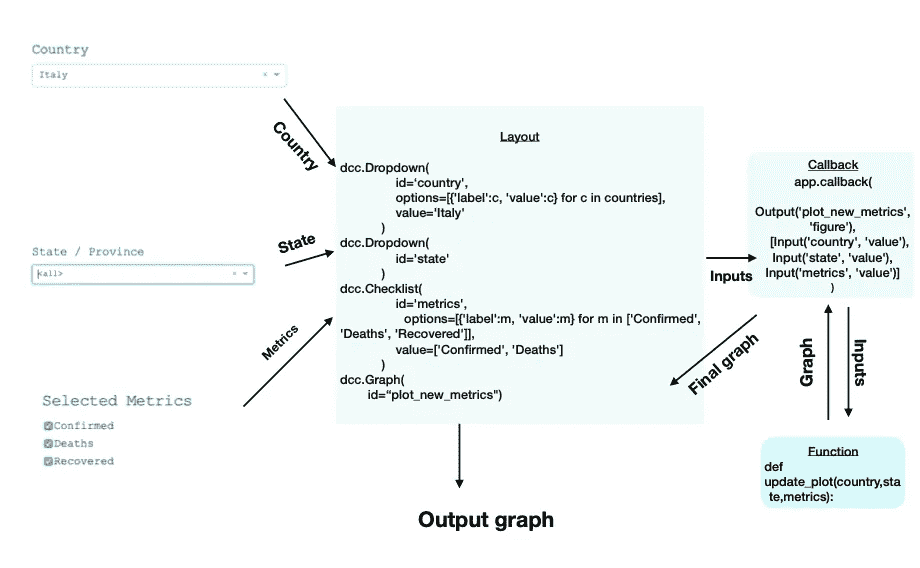
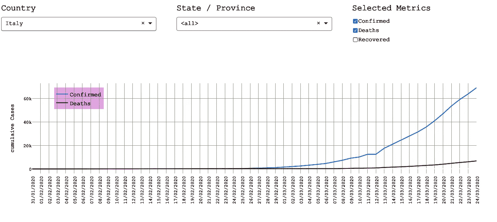
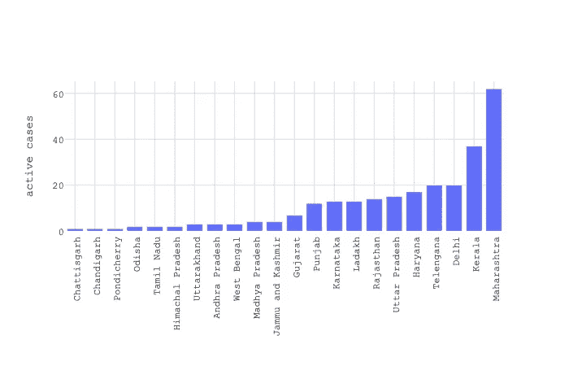
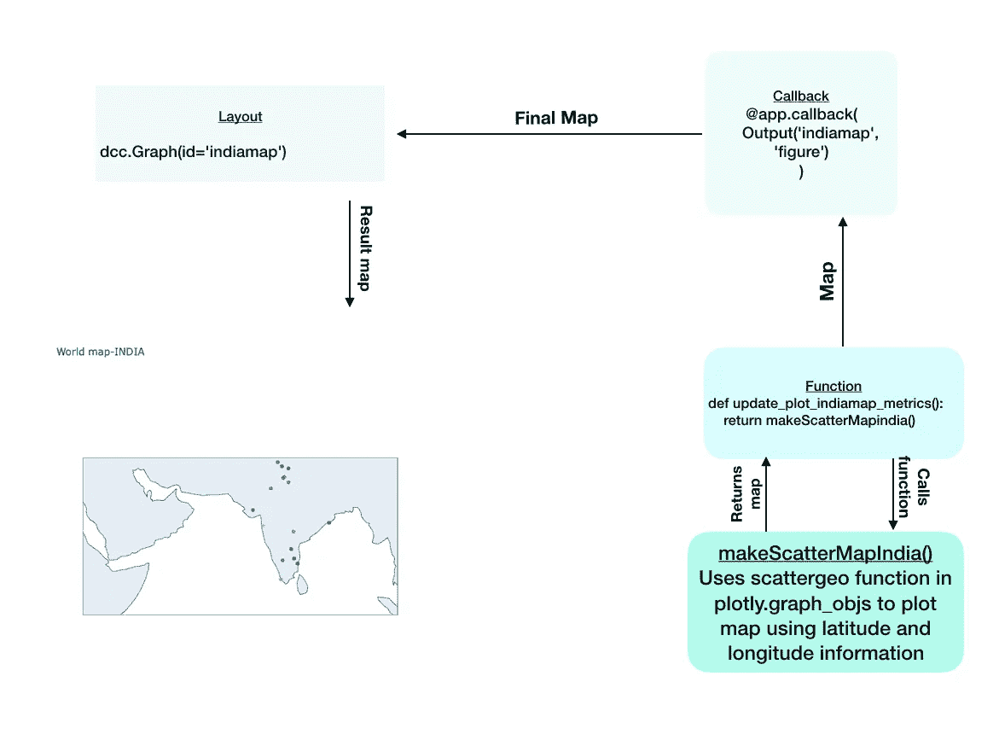
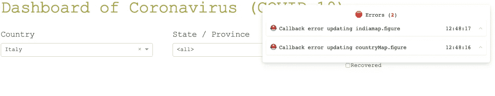
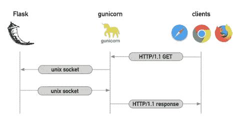

# 为新冠肺炎数据创建交互式仪表板

> 原文：<https://medium.com/analytics-vidhya/creating-interactive-dashboard-for-covid-19-data-ad8dc8fd0495?source=collection_archive---------13----------------------->

为了更好地理解数据，我们需要更好的可视化。仪表板动态报告来自数据的见解。

在本帖中，我们将使用 python 库 Dash 构建一个反应式仪表盘。

# 关于 Dash

Dash 是一个开源 python 库，用于创建交互式绘图和基于 web 的应用程序。Dash 便于围绕我们的数据分析代码构建良好的 GUI。在使用 dash 构建的 web 应用程序中，从标题标签到复杂情节的每个元素都是可定制的。

> 我们不需要非常好的开发技能来使用 Dash 构建 web 应用程序。

回调使得 dash web 应用变得被动。Callback 是一个简单的反应式装饰器，用于为我们的代码提供输入更改。通过输入的这种变化，我们可以过滤数据、修改图表等等。

我们可以包含各种可以用 plotly.graph_objs 制作的图。

React 是构建 UI 的强大 javascript 库。Flask 是基于 WSGI 的 web 应用框架。Dash 利用 flask 和 react 创建基于 web 的应用程序。

我们不需要为我们的应用程序编写任何 HTML 代码。我们可以使用 dash_html_components 中的 div、img、h1、h2、table 等 python 类。

为了让用户输入，我们可以使用 dash_core_components 中的下拉菜单、滑块、日期选择器和清单类。

> 选择 Dash 的原因之一是它的 web 应用程序可以并发使用，即多个用户可以同时进行多个会话。

# 文章中的章节

我们将工作流程分为三个部分。他们是

1.  理解数据。
2.  实施思路和测试。
3.  正在部署 web 应用程序。

# 1.理解数据

> 理解数据对于从数据中得出更好的见解和做出更好的图是非常重要的。

世界卫生组织将新冠肺炎列为疫情。有许多来源提供新冠肺炎的数据。我们正在使用来自 [kaggle 的数据构建我们的仪表板。](https://www.kaggle.com)

任何新冠肺炎数据集都有四个重要特征。它们是时间戳、确诊病例数、报告的死亡人数和康复人数。

这些数据也是从世界各地收集的。因此，国家和州也将在观想中扮演重要角色。

我们的仪表板必须解释随着时间的推移在全球以及特定国家收到的案件率。也是从一月开始到现在，这个新冠肺炎是如何周游世界的。

为了更好地理解上述所有特征并满足我们的要求，我们需要绘制以下图表:

a.时间戳与病例数(确诊、死亡和痊愈)的散点图/线图/条形图。

b.一个国家内时间标记与病例数(确诊、死亡和痊愈)的状态散点图/线图/条形图。

c.世界地图上渐进月明智的信息阴谋。

我们将从一个国家收集数据并进行分析。在这篇文章中，我们使用了印度的数据。我们将绘制以下图表

a.国内各州与病例数(确诊、死亡和康复)的散点图/线图/条形图。

b.在世界地图上绘制信息。

# 2.实施思路和测试

在这一节中，我们将为上一节中确定的所有情节编写代码。

我们需要以下包来继续

```
import dash
import dash_table
import dash_core_components as dcc
import dash_html_components as html
import plotly.graph_objects as go
from dash.dependencies import Input, Output
import pandas as pd
```

加载数据并进行所有必要的预处理。预处理包括清理数据、从现有要素创建新要素以及准备好数据以进行处理。

```
ind_df['Total cases'] = ind_df['Total Confirmed cases (Indian National)'] + ind_df['Total Confirmed cases ( Foreign National )']ind_df['Active cases'] = ind_df['Total cases'] - (ind_df['Cured/Discharged/Migrated'] + ind_df['Deaths'])countries = allData['Country/Region'].unique()
```

默认情况下，选项卡上的标题是“破折号”。我们可以用下面的代码把它改成我们自己的标题。

```
app = dash.Dash(__name__, external_stylesheets=external_stylesheets)
app.title='Coronavirus'
```

编写任何 web 应用程序的关键部分是创建布局。部件的顺序和样式在这一部分决定。我们将为每个组件提供一个唯一的 id，以便更好地访问。我们的布局如下

```
app.layout = html.Div(
    style={ 'font-family':"Courier New, monospace" },
    children=[
    html.H1('Dashboard of  Coronavirus (COVID-19)',style={'color'
             :'#a8a222'}),
    html.Div(className="row", children=[
        html.Div(className="four columns", children=[
            html.H5('Country',style={'color': '#296665'}),
            dcc.Dropdown(
                id='country',
                options=[{'label':c, 'value':c} for c in countries],
                value='Italy'
            )
        ]),
        html.Div(className="four columns", children=[
            html.H5('State / Province',style={'color': '#296665'}),
            dcc.Dropdown(
                id='state'
            )
        ]),
        html.Div(className="four columns", children=[
            html.H5('Selected Metrics',style={'color': '#296665'}),
            dcc.Checklist(
                id='metrics',
                options=[{'label':m, 'value':m} for m 
                         in ['Confirmed', 'Deaths', 'Recovered']],
                value=['Confirmed', 'Deaths']
            )
        ])
    ]),
    dcc.Graph(
        id="plot_new_metrics",
        config={ 'displayModeBar': False }
    ),
    html.H3('State wise plot',style={'color':'#a8a222'}), dcc.Graph(
        id="plot_new_states",
        config={ 'displayModeBar': False }
    ),
    html.H3('Coronavirus (COVID-19) in India',
    style{'color':'#a8a222'}), dcc.Graph(id = 'plot_india'),
    html.H3('Coronavirus (COVID-19) representation in 
    World  map',style={'color':'#a8a222'}), dcc.Graph(id = 'countryMap'),
    dcc.Slider(
        id='my-slider',
            min=0,
            max=10,
            step=None,
            marks={
            0: 'Jan ',
            5: 'Feb',
            10: 'March',
            },
            value=5
            )
    ,
    dcc.Graph(id='indiamap'),
    html.Div(id='slider-output-container'),
    html.H3('State wise chart of Coronavirus (COVID-19) 
             in India',style={'color':'#a8a222'}),
    html.Div(id='output-data-upload')])
```

代码的大部分是不言自明的。但是我们会在制作情节之前检查一次代码。Div、H1 和 H3 是替换 html 标签的 dash_html_components 的类。我们可以通过将它作为参数传递来给每个组件添加样式。

下拉菜单、检查表、滑块和图表是 [dash_core 组件](https://dash.plotly.com/dash-core-components)的类别。我们包括一个用于选择国家的下拉列表、一个用于选择州的下拉列表和一个用于选择指标的清单。我们给每个组件一个唯一的 id，以便从代码的其他部分访问它们。在上一节中，有足够的关于回调的解释。因此，我们将开始编写代码。

```
@app.callback(
    Output('plot_new_metrics', 'figure'),
    [Input('country', 'value'), Input('state', 'value')
    ,Input('metrics', 'value')]
             )
def update_plot_new_metrics(country, state, metrics):
    data = reactive_data(country, state)
    return barchart(data, metrics,yaxisTitle="cumulaive Cases ")
```

reactive_data 支持我创建的函数，用于更新与国家对应的州下拉列表。



控制流程

以上是从布局到回调生成输出图的控制流程。输出图如下所示



同样，我们也可以编写代码来制作状态散点图。

```
@app.callback(
    Output('plot_new_states', 'figure'),
    [Input('country', 'value'), Input('state', 'value')
                               , Input('metrics', 'value')])
def update_plot_new_states(country, state, metrics):
    data = reactive_data(country, state)
    return barchartstate(data, metrics, yaxisTitle="cumulaive 
                         Cases")
```

我们在第一部分中决定的第三个图是“世界地图上信息的渐进月智能图”。

为此，我们需要用户输入月份。这次我们将使用 dash_core_components 中的滑块。根据输入更新地图的支持功能是

```
def makeScatterMap(value):
    if(value==0):
        allData1=allData[allData['dateStr'].isin(da1)]
    elif(value==5):
        allData1=allData[allData['dateStr'].isin(da2)]
    else:
        allData1=allData[allData['dateStr'].isin(da3)]
    allData1['Country'] = allData1['Country/Region']
    world_data = pd.merge(world_coordinates,allData1,on='Country')
    world_data['Confirmed']=world_data['Confirmed'].astype(str)
    world_data['Deaths']=world_data['Deaths'].astype(str)
    scl = [0,"rgb(150,0,0)"],[0.125,"rgb(100, 0, 0)"],
           [0.25,"rgb(0, 25, 0)"],\
         [0.375,"rgb(0, 152, 0)"],[0.5,"rgb(44, 255, 0)"]
               ,[0.625,"rgb(151, 0, 0)"],\
         [0.75,"rgb(255, 234, 0)"],[0.875,"rgb(255, 111, 0)"]
                ,[1,"rgb(255, 0, 0)"]
    data = [
    go1.Scattergeo(
            lat = world_data['latitude'],
            lon=world_data['longitude'],
            text=world_data['Country']+'\n'+'Confirmed : '
                +(world_data['Confirmed'])+'\n'+
                'Deaths : '+(world_data['Deaths']),
             marker=dict(
               color=(world_data['Recovered']%100)*0.01,
                      size=7,opacity=0.7)
                         ) ]
    fig=go1.Figure(data=data)
    fig.update_layout(title='World map',height=700)
    return fig
```

根据用户的输入，我们将过滤数据，并使用来自 [graph_objects](https://plotly.com/python-api-reference/generated/plotly.graph_objects.Figure.html) 的散点图在世界地图上绘制信息。

该图的回叫和相应功能为

```
@app.callback(
    Output('countryMap', 'figure'),
    [Input('my-slider', 'value')]
              )
def update_plot_world_metrics(value):
    return makeScatterMap(value)
```

现在，我们将在本节的第二部分分析来自印度的数据。

首先，我们将制作一个简单的柱状图，就像我们在第一部分所做的那样

```
@app.callback(
    Output('plot_india', 'figure'),
    [Input('metrics', 'value')]
               )
def update_plot_india_metrics(country, state, metrics):
    return barchartindia()
```

条形图印度功能代码是

```
def barchartindia(): ds=ind_df.sort_values('Active cases',ascending=True)
  ds=ds[['Active cases','Name of State / UT']]
  figure = go.Figure(data=[
  go.Bar(y=ds['Active cases'], x = ds['Name of State / UT'])])
  figure.update_layout(
              barmode='group', legend=dict(x=.05, y=0.95, font
        =  {'size':15}, bgcolor='rgba(240,200,240,0.5)'),
              plot_bgcolor='#FFFFFF', font=tickFont) \
          .update_xaxes(
              title="", tickangle=-90, type='category'
             ,showgrid=True, gridcolor='#DDDDD0',
              tickfont=tickFont, ticktext=ds['Name of State / UT']
              ,tickvals=ds['Name of State / UT']) \
          .update_yaxes(
              title="active cases", showgrid=True, 
                gridcolor='#DDDDDD') return figure
```

我们制定的计划是



我们现在将在世界地图上标出同样的信息。

```
@app.callback(
    Output('indiamap', 'figure'),
    [Input('my-slider', 'value')]
             )
def update_plot_indiamap_metrics(value):
    return makeScatterMapindia(value)
```



以上是在世界地图上绘制印度信息的回调控制流程。

最后，我们将在我们的 web 应用程序中显示部分数据帧，如 [dash table](https://dash.plotly.com/datatable) 。

```
def update_output(contents, filename,k):
  max_value = ind_df['Deaths'].max()
  new_d = ind_df[['Name of State 
      / UT','Cured/Discharged/Migrated','Deaths','Total 
        cases','Active cases']]
  return html.Div([
  dash_table.DataTable(
   id='table',
   columns=[{"name": i, "id": i} for i in new_d.columns],
   data=new_d.to_dict("rows"),
   style_data={
   'border':'1px solid black',
   'font-size':'1.2em'
   },
   style_data_conditional=[
   {
   'if': {
   'column_id':'Deaths',
   'filter_query':'{Deaths} > 0'
   },
   'backgroundColor':'red'
   },
   {
   'if': {
   'column_id':'Active cases',
   'filter_query':'{Active cases} > 10'
   },
   'backgroundColor':'orange'
   },],
   style_cell={'width': '300px',
   'height': '60px',
   'textAlign': 'left',
   'border' : '1px solid grey'},
   style_table={
   'height':'600px',
   'width':'900px',
   'margin-left':'200px',
   'margin right':'40 px'
   })
  ])
```

DashTable 类用于显示使用上述函数的部分数据帧。

现在，在本节的最后一部分，我们将在部署之前测试我们的 web 应用程序。

遵循以下简单步骤:

1.  打开终端并运行“python app.py”。
2.  启动浏览器并进入 [http://127.0.0.1:8050/](http://127.0.0.1:8050/)
3.  我们将在那里看到我们的 web 应用程序。如果代码中有任何错误，将会在右上角显示详细的追溯信息，如下所示



4.开始修复它们，以便与您的应用程序进行交互。

这一部分的一个常见错误是“关键错误”。若要修复此错误，请检查部分代码，并使用从命令“dataframe.columns”获得的列表交叉检查列名。

# 3.部署 Web 应用程序

这是文章的最后一部分。大多数开发者更喜欢 [heroku](https://dashboard.heroku.com/apps) 或[弹性豆茎](https://aws.amazon.com)。

首先，我们将介绍部署到 heroku 的步骤。dash 部署到 heroku 的官方文档非常清晰明了。以下步骤摘自该文档。

1.  为您的项目创建新文件夹。

```
$ mkdir dash_app
$ cd dash_app
```

2.用 git 初始化这个项目文件夹并激活虚拟环境。

```
$ git init        
$ virtualenv env
$ source env/bin/activate 
```

3.Virtualenv 创建一个新的 python 实例。所以我们需要重新安装依赖项。

```
$ pip install dash 
$ pip install plotly
```

4.我们需要另一个名为 gunicorn 的依赖项。



摘自[来源](https://chrisvoncsefalvay.com/2019/08/28/deploying-dash-on-amazon-ecs/)

```
$ pip install gunicorn
```

5.现在将上面创建的 app.py 粘贴到项目文件夹中。还要在项目文件夹中添加 [Procfile](https://devcenter.heroku.com/articles/procfile) 和 requirements.txt。

```
#Procfile
web: gunicorn app:server 
```

(确保 Procfile 中的 P 是大写)

```
$ pip freeze > requirements.txt
```

6.现在通过初始化 heroku 并将其添加到 git 来部署文件。

```
$ heroku create my-app #Corona-app is name of Corona app
$ git add . 
$ git commit -m 'Version 1 of  app ' 
$ git push heroku master 
```

7.您可以使用以下代码片段重新部署应用程序

```
$ git status # view the changes 
$ git add .  
$ git commit -m 'a description of the changes' 
$ git push heroku master
```

您可以从 heroku 的 dashboard 启动应用程序或访问 https:// <app-name>.herokuapp.com/</app-name>

搞定了！！！

还有一些人喜欢将应用程序部署到 aws。您可以按照这里提到的[步骤进行操作。](https://www.phillipsj.net/posts/deploying-dash-to-elastic-beanstalk/)

# 结论

阅读完本文后，我们可以为任何数据集创建自己的仪表板并部署它。上述文章的完整代码可以在这里[获得。](https://github.com/maheshsai252/dash-corona)

感谢阅读:)

## 参考

我从以下文章中获得了一些见解

[](/plotly/introducing-dash-5ecf7191b503) [## 🌟引入破折号🌟

### 用纯 Python 创建反应式 Web 应用程序

medium.com](/plotly/introducing-dash-5ecf7191b503) [](https://towardsdatascience.com/how-to-build-a-complex-reporting-dashboard-using-dash-and-plotl-4f4257c18a7f) [## 如何使用 Dash 和 Plotly 构建报告仪表板

### 在这篇博文中，我将提供如何使用 Dash(一种 Python 语言)构建报告仪表板的分步指南…

towardsdatascience.com](https://towardsdatascience.com/how-to-build-a-complex-reporting-dashboard-using-dash-and-plotl-4f4257c18a7f)