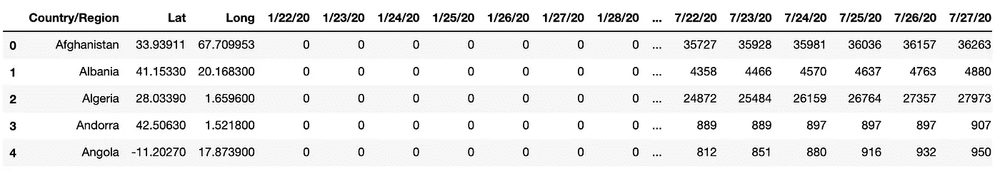
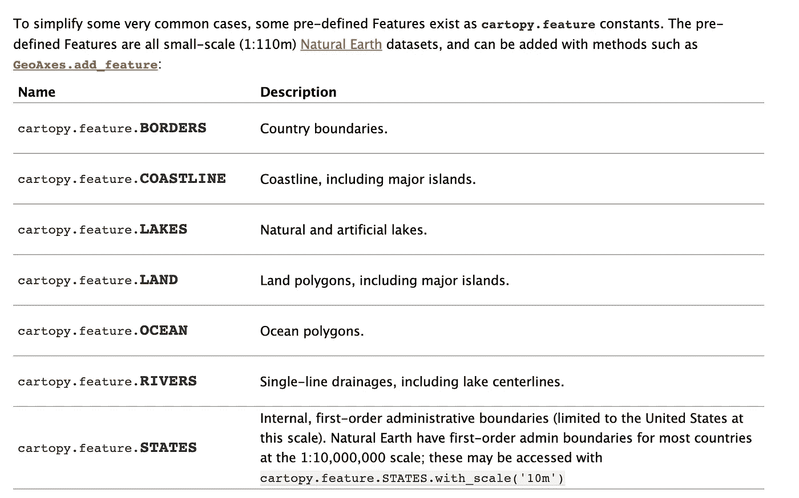
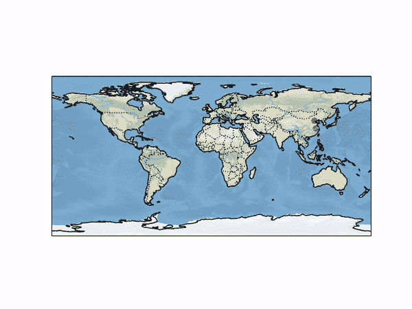

# 使用 Python 创建地图动画

> 原文：<https://medium.com/analytics-vidhya/creating-map-animations-using-python-3b52061768a3?source=collection_archive---------14----------------------->

在这篇文章中，我将向你展示制作地图动画的整个过程，我在我的第一篇[文章](/@rahulrisav/covid-19-in-india-visualising-the-data-ec78897a8dbc)中使用过这个过程。


由[路易·汉瑟](https://unsplash.com/@louishansel)在 [Unsplash](https://unsplash.com/) 上拍摄的照片

## 我将使用的 Python 包:

我将使用的 Python 包是 [Cartopy](https://scitools.org.uk/cartopy/docs/latest/) 。它最初是由英国气象局开发的，这样科学家就可以准确地可视化他们的数据。Cartopy 利用了 **PROJ.4** 、 **NumPy** 和 **Shapely** 库，并在 **Matplotlib** 之上构建了一个接口。

## 抽样资料

样本数据是从以下 [**网站**](https://data.humdata.org/dataset/novel-coronavirus-2019-ncov-cases) 下载的新冠肺炎数据。它包含受新冠肺炎影响的每个国家的**纬度**和**经度**数据，以及每天的累计病例数。

## 数据预览



这是数据的样子

## 提取纬度和经度

我们需要从上面的数据中提取经纬度列表，列表从国家开始按顺序为排列**，这显示了**第一个新冠肺炎**案例。**

在下面给出的代码中，对于每个数据列，我们迭代所有的行，检查特定行和列的值是否为**零**。如果该值不等于零，则附加相应的纬度和经度，从而确保纬度和经度列表按照该特定国家的新冠肺炎出现的顺序排列。由于相同的纬度和经度会被追加很多次，我们**将**的值更改为 **500** (更改为这样的**值**，使得**不可能**拥有**纬度**或**经度**)，以便以后更容易将它们从列表中删除。

```
list_lat= []
list_long = []for i in range(3, 193):
    for k in range(data.shape[0]):
        if(int(data.iloc[k, i]) != 0):
            list_lat.append(data.iloc[k, 1])
            list_long.append(data.iloc[k, 2])
***#Change the already appended values to a different value***
            data.iloc[k, 1] = 500 
            data.iloc[k, 2] = 500
        else:
            continue

list_lat[0:5] 
list_long[0:5]***#Removing the 500s from the list
#Latitude*** for i in range(list_lat.count(500)):
    list_lat.remove(500)
***#Longitude***
for i in range(list_long.count(500)):
    list_long.remove(500)
```

## 创建制图地图

```
***#Installing Cartopy***
pip install cartopy***#Importing required libraries*** import cartopy
import cartopy.crs as ccrs
import cartopy.feature as cfeature
from cartopy.mpl.gridliner import LONGITUDE_FORMATTER, LATITUDE_FORMATTER
import matplotlib.pyplot as plt
import cartopy.mpl.geoaxes
from mpl_toolkits.axes_grid1.inset_locator import inset_axes
from matplotlib.animation import FuncAnimation
```

要检查 Cartopy 所需的**依赖关系**，请查看以下[网站](https://scitools.org.uk/cartopy/docs/latest/installing.html)。

```
***#Creating the map object***
fig = plt.figure()
m1 = fig.add_subplot(1, 1, 1, projection=ccrs.PlateCarree())
***#Adding features to the map***
m1.add_feature(cfeature.LAND)   
m1.add_feature(cfeature.OCEAN)
m1.add_feature(cfeature.COASTLINE)
m1.add_feature(cfeature.BORDERS, linestyle=':')
m1.add_feature(cfeature.LAKES, alpha=0.5)
m1.add_feature(cfeature.RIVERS)
m1.stock_img()
```

在代码中，给出了上面的' **ccrs。______()** '决定所创建地图的投影。Cartopy 提供了多种投影，可以在下面的[网站](https://scitools.org.uk/cartopy/docs/latest/crs/projections.html)上查看。

从上面给出的代码中可以很明显地看出，‘[**c feature**](https://scitools.org.uk/cartopy/docs/latest/matplotlib/feature_interface.html#example-of-using-the-feature-class-with-the-matplotlib-interface)’用于向地图添加各种功能。



可添加到地图的要素列表

## 动画

在下面给出的代码中，我们首先定义了一个' **animate** 函数，我们在 **FuncAnimation** 中调用它。在“动画”功能中，我们在地图上绘制第一个点，之后我们从列表中删除它，这样当我们再次调用该功能时，将绘制下一组点。

在 FuncAnimation 中， **fig** 代表我们已经创建的图形， **animate** 是我们已经创建的函数， **265** 表示我们想要调用“animate”函数的次数，而“interval”是我们想要在绘制两个点之间的时间间隔(以毫秒为单位)。

```
X_points_1 = list_long
Y_points_1= list_latdef animate(i):
    X_points= X_points_1[0]
    Y_points= Y_points_1[0]
    X_points_1.remove(X_points_1[0])
    Y_points_1.remove(Y_points_1[0])
    m1.scatter(X_points, Y_points, color = 'red')ani= FuncAnimation(fig, animate, 265, interval=200, repeat = False)
plt.show()
```

***注:标绘点的输入格式为:(经度，纬度)。我建议使用终端或命令提示符在本地运行代码，而不是使用 Jupyter Notebook。***

## 结果



上面的动画展示了新冠肺炎的传播。

## 密码

上面动画的代码已经上传到下面的 GitHub [库](https://github.com/rahulks9/COVID_VIZ/blob/master/animation.ipynb)。

## 数据

数据摘自以下[网站](https://data.humdata.org/dataset/novel-coronavirus-2019-ncov-cases)。

谢谢你能走到这一步。请在下面的回复部分提出任何建议。