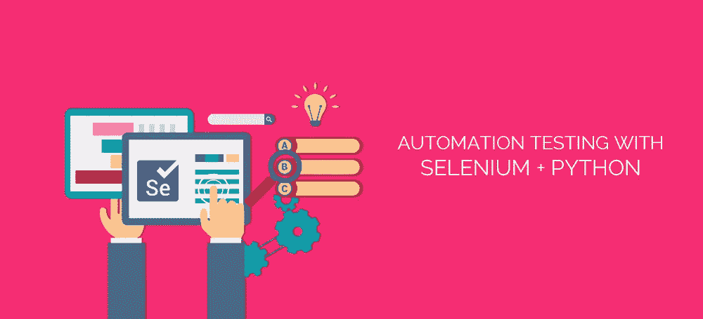
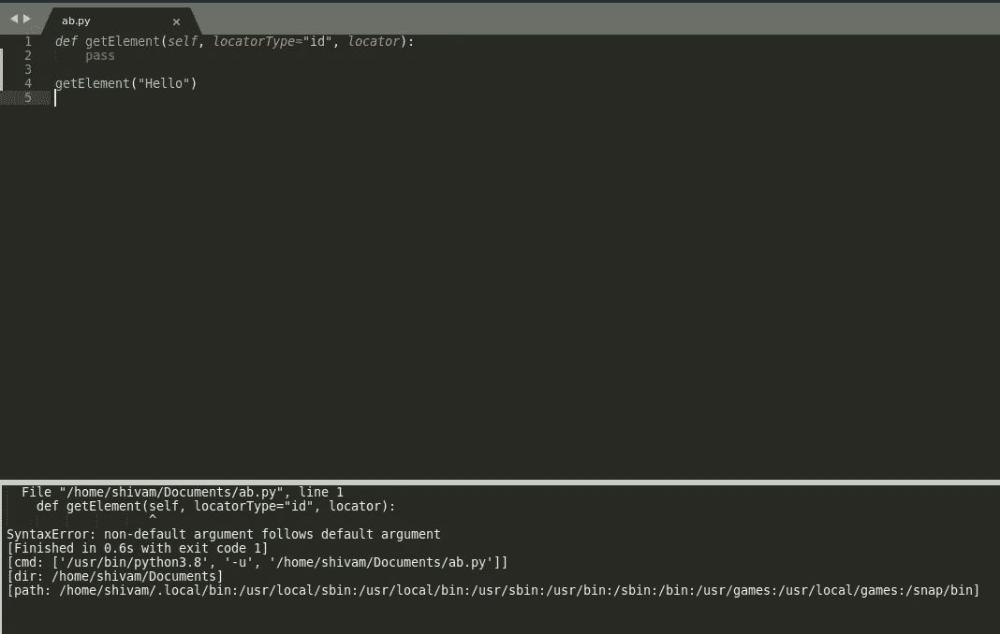
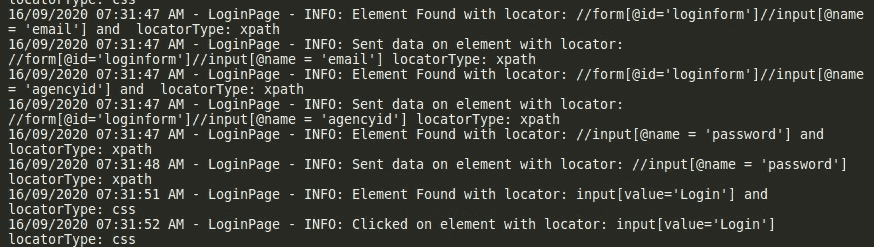

# 使用 python3.x 和重要的 python 概念创建我们自己的 Selenium 驱动程序类

> 原文：<https://medium.com/analytics-vidhya/creating-our-own-selenium-driver-class-in-python3-x-and-important-python-concepts-8bf92d702230?source=collection_archive---------7----------------------->



## 为什么应该创建自己的驱动程序类以及如何创建。

在这篇博客中，我将与您分享创建我们自己的 SeleniumDriver 类的重要性和方法，该类将由我们的自定义方法组成，可以使用 python 代替 selenium webdriver 的默认方法和属性。

如果你学过 selenium webdriver，你必须熟悉驱动方法和属性。

如果您不熟悉使用 python 的 selenium webdriver。你可以看看我的其他博客:

[](/@shivam23thaman/locators-in-selenium-webdriver-with-python-4d778deed7af) [## 使用 Python 的 Selenium WebDriver 中的定位器

### Selenium Webdriver 使用 python 教程

medium.com](/@shivam23thaman/locators-in-selenium-webdriver-with-python-4d778deed7af) [](/@shivam23thaman/become-expert-in-xpath-for-selenium-webdriver-e44faff3a80) [## 成为 selenium webdriver 的 XPath 专家

### 简单地说，Xpath 是一种通过给定路径在 HTML DOM 中查找元素的方法。这是有用的，当名称或 id…

medium.com](/@shivam23thaman/become-expert-in-xpath-for-selenium-webdriver-e44faff3a80) 

默认方法虽然很好，但是可能比较冗长，并且可能缺乏可重用性。

如果你想找一个元素，你可以:

另一个例子是实现显式等待，它有大量的行要写。

首先，您需要从 webdriver 包中导入一些类:

现在实际的代码是:-

如果我们想在很多位置执行显式等待，那么我们必须一次又一次地编写它们。

我们可以通过构建自己的驱动程序类来避免这种情况，这个类将包含所有这些包装函数；我们只需要在需要的时候给他们打电话，大概是这样的:

看它有多干净。一切都将在我们的自定义驱动程序类中定义， ***这将节省我们大量的时间和精力，同时帮助我们建立对框架方法的理解。***

既然你知道这样做的目的，让我们开始构建这个类，让我们把它命名为' *SeleniumDriver'* ，文件名为 *'selenium_driver.py '。*

首先让我们导入所有必需的包和类:

添加 sys . Path . append(" Path/to/the/project/directory ")有助于在我们导入 utilities.custom_logger 作为 cl 时设置环境的路径，否则它会给出 Module not found 错误

```
export PYTHONPATH=`pwd` #pwd - current working directory(path to project)
```

每次运行 python 文件之前，或者在 linux 或 mac 的环境变量 settings 或 bash.profile 文件中设置 python 路径。另外，您需要从终端或 cmd 运行。

我们开始吧，

我们将首先创建一个 SeleniumDriver 类，添加一个包含 utilities.custom_logger.py 中定义的记录器信息的日志变量，然后在 __init__ 方法中创建一个驱动程序实例。

注意—用不同于原始驱动程序类的名称命名函数，以避免任何冲突。

Eg — send_keys() ==> sendKeys()

1.  **getTitle()**

这是一个捕捉页面标题的简单方法。

既然是小函数，我们可以用 lambda 函数。我们可以像变量一样声明一个函数。例如—

请参见[https://cais balderas . com/blog/iterating-with-python-lambdas/](https://caisbalderas.com/blog/iterating-with-python-lambdas/)了解更多关于 lambdas 和其他常见函数(如地图和过滤器)的信息。

2. **getByType()**

这相当于我们开始时谈到的 By.locator。

注意——这里 self.log.info 用于将结果捕获到日志文件中，而不是打印出来，我们在这里肯定可以使用 print()。

3. **getElement()**

这个方法根据 by 的原理来寻找元素。定位器类型，“定位器”

现在，你可能想知道，在这里 locatorType 被写成第二个参数，而在 driver.find_element(By。LOCATORTYPE，' locator ')，它是先声明的还有那个，我们不能让它和原来的差不多吗？这是因为我们正在输入 locatorType = 'id '的默认值，因此，当 locatorType 为 id 时，我们不需要强制输入它。注意—关键字参数后面不能跟非关键字参数，在本例中为*“locator”*。Python 会抛出一个错误。



现在使用 getByType()我们可以找到一个元素，相当于 driver.find_element(BY。LOCATORTYPE，“定位器”)。我们也可以在其他功能中使用它。

4. **getElements()**

类似于 getElement，但是查找元素列表；相当于 driver.find_elements(By。LOCATORTYPE，“定位器”)

5. **elementClick()**

这个方法找到一个元素并点击它。相当于:

6.发送键()

用于向输入字段发送数据

在这里，我们声明了 data 参数来发送所需的数据(例如— email_id)，因此在使用它时它将有 3 个参数(除非 locatorType="id ")。这个方法结合了查找元素(使用 getElement 方法)和发送数据。

***参数 Vs 变元***

很多人被*parameter*和 *argument 这两个词搞糊涂了。其实很简单:*

```
**Parameter** - During method Declaration
Eg - def sendKeys(self, data, locator, locatorType="id"):
         pass**Argument** - At the time of passing the value
Eg- sendKeys("abc@gmail.com", 'email_id', locatorType= 'name')
```

7. **isElementPresent()**

有时我们想在执行任何操作之前先确定元素是否存在，在这种情况下，我们可以使用这个函数。没有 selenium.webdriver 的等价物。这完全是我们的职责。如果存在则返回真，否则返回假。

8. **elementPresenceCheck()**

另一种寻找元素是否存在的方法。与前一个函数相反，它的工作基础是查找列表的长度，如果它大于零，就意味着该元素存在。在这里，我们使用的是*self . driver . find _ elements*，它使用的不是 locatorType，而是 byType，即 self.driver.find_elements(BY。XPATH)。我只是在展示同样的事情可以用不同的方式来完成(所以练习逻辑构建)。

9. **waitForElement()**

如果你还记得，这和我们开始讨论的方法是一样的。它的定义如下:

这里，我们传递所需的参数，将元素初始化为 none，按照显式等待语法定义 byType:

可点击的元素只是一个条件，还有其他几个条件。实现显式等待方法的示例:

查看结果如何存储在日志文件中:



这只是创建的一些方法，尝试添加更多的 handywrappers。以下是完整文件的链接:-

[https://github . com/shivam 23 thaman/POM-Project/blob/master/base/selenium _ driver . py](https://github.com/Shivam23Thaman/POM-Project/blob/master/base/selenium_driver.py)

感谢向下滚动:)如果您有任何问题，请告诉我。如果这是有帮助的，请投票并评论它。

还有，你可以看看我的其他文章:

[](/analytics-vidhya/class-composition-vs-inheritance-in-python-2fb4a788b330) [## Python 中的类组合与继承

### 介绍

medium.com](/analytics-vidhya/class-composition-vs-inheritance-in-python-2fb4a788b330) [](/@shivam23thaman/15-best-practices-in-software-testing-d5879f379393) [## 软件测试的 15 个最佳实践

### 嗨，我是一名软件测试工程师，在莫哈利的韦伯纳解决方案有限公司工作。我分享我的经验来帮助别人…

medium.com](/@shivam23thaman/15-best-practices-in-software-testing-d5879f379393) 

你可以在 LinkedIn 上联系我；

[](https://www.linkedin.com/in/shivam-thaman-1167a8147/) [## Shivam Thaman -质量分析师-韦伯纳解决方案私人有限公司| LinkedIn

### ●自 2018 年 9 月起，目前在莫哈利的 Webner Solutions Pvt Ltd .担任质量分析师(在以下领域有 2 年经验……

www.linkedin.com](https://www.linkedin.com/in/shivam-thaman-1167a8147/)