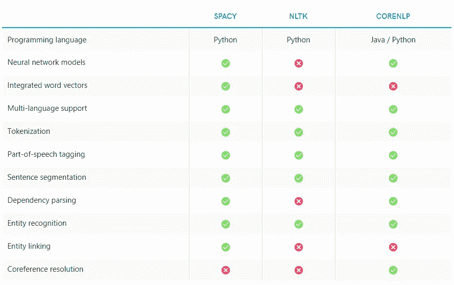
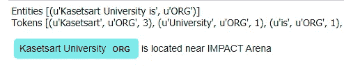
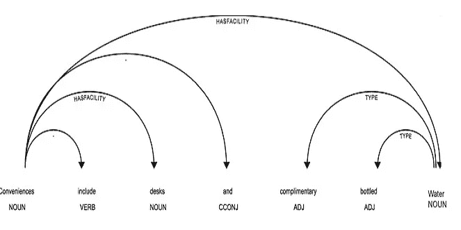
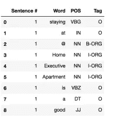
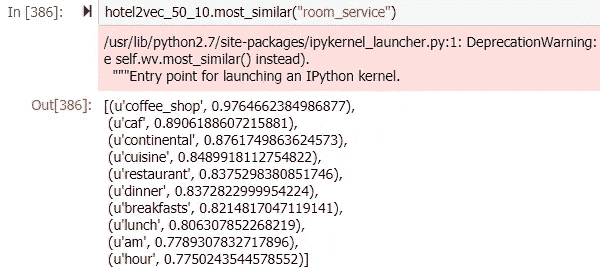
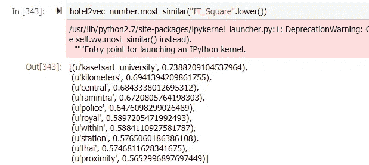
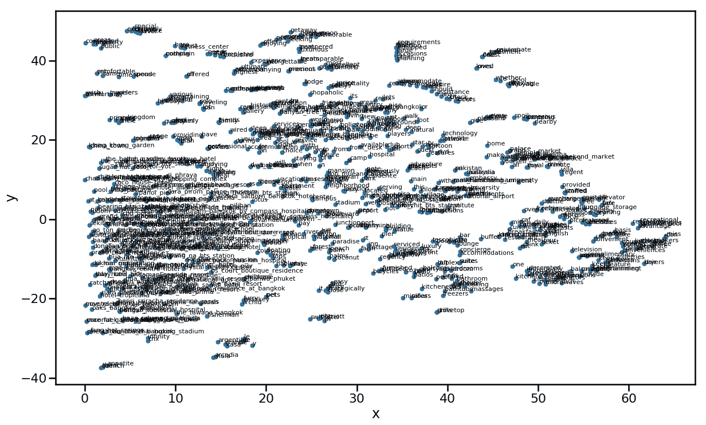
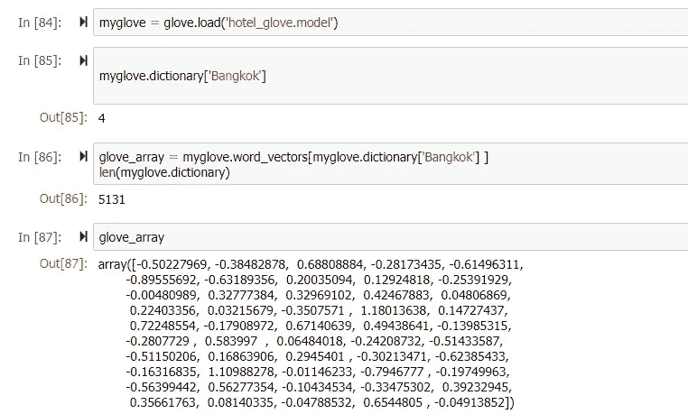
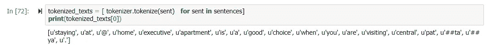
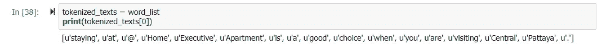

# 使用 BERT 和 SpaCy 创建自己的命名实体识别:旅游数据集

> 原文：<https://medium.com/analytics-vidhya/creating-own-name-entity-recognition-using-bert-and-spacy-tourism-data-set-c5ee1c2955a2?source=collection_archive---------0----------------------->


保罗·雷兹在 [Unsplash](https://unsplash.com?utm_source=medium&utm_medium=referral) 上的照片

由于我们对旅游数据集的本体数据抽取感兴趣，我们试图找到自动插入数据到本体的方法。我们有许多文本，发现很难阅读这些文本并找到关系和关键字来发现必要的信息。因此，我们创建了一个使用自动化数据抽取的实验方法:命名实体抽取。我们希望这能引导我们达到最终目标。我们实验的代码在 https://github.com/cchantra/nlp_tourism 的。

我们搜索机器学习和 NLP(自然语言处理)技术/工具中的论文，以找到我们想要的类别的命名实体。去年我们感兴趣的两个工具是“SpaCy”([https://spacy.io/usage/models/](https://spacy.io/usage/models/))和“BERT”([https://github.com/google-research/bert](https://github.com/google-research/bert))。

与过去我们不得不依赖的 lex、yacc、bison 等相比，现在的语言处理工具已经进步了这么多，这是相当令人惊讶的。像标记化和词性标注这样的事情非常容易，甚至像名称实体识别这样的复杂任务也是如此。



来源:[https://spacy.io/usage/facts-figures](https://spacy.io/usage/facts-figures)

SpaCy 是一个具有预训练模型的机器学习模型。它是 NLTK 之类的流行产品的替代产品。我们感兴趣的部分是依存解析和实体链接以及单词表示的集成。

作为一个预训练的语言模型，BERT 最近在 2018 年宣布，并在当年证明了其准确性。BERT 预训练模型的使用是围绕着之后的代码实例，比如情感分类，包括命名实体识别([https://github.com/kamalkraj/BERT-NER](https://github.com/kamalkraj/BERT-NER))，关系抽取([https://github.com/monologg/R-BERT](https://github.com/monologg/R-BERT))。

因此，我们决定探索两者。

# 旅游数据集的创建和准备

首先，我们通过从各省的普通酒店网站中抓取数据来发现旅游领域的数据集。数据集以 JSON 格式保存，如下所示:

> [{ "address": "1/1 Moo 5 Baan Koom，Doi
> Angkhang，Tambon Mae Ngon，Amphur Fang，
> Mon Pin，Fang District，清迈，
> ，50320 "，
> "description ":"，当你
> 游览 Mon Pin 时，住在 Angkhang Nature
> 度假村是个不错的选择。这家酒店是…
> “设施”:“公共区域 WiFi、
> 咖啡厅、
> 餐厅、早餐、…
> “名称”:“B.M.P. By Freedom Sky”、“附近”:“Maetaeng 大象公园、
> Maetamann 大象营、Mae Ngad Dam
> 和 Moncham 水库、
> “回顾”:“}
> { …}]

全文部分从“设施”、“位置”、“附近”、“描述”、“名称”、“地址”字段中提取，并按类型将构建关键字存储在关键字文件中:location-list.txt、name-list.txt、facility-list.txt

提取名称以构建这些关键字并保存到文件的代码在“extract_names.ipynb”中。这些关键字是创建训练数据集的注释线索。

这些文件中的多词使用 *nltk.tokenize.mwe* 进行处理。为了便于处理，将多个单词连接成一个单词。接下来，我们为训练数据集选择句子。摘录总结可用于选择。它基于 *textrank* 算法。我们的 *github* 中的文件“extractive_summ_desc.ipynb”就是这样的例子。

基于这些关键词文件，我们对选择的句子进行处理以建立数据集来标注命名实体。

对于关系，我们可以用“relation _ hotels _ locations . ipynb”在一个句子中标注关系。这段代码使用空间依赖解析器为关系提取构建训练数据。

# 空间线和关系模型

对于空间，我们可以使用它的预训练模型将其用于命名实体(NE)识别。也可以训练新的 NE 标签。正如我们在预处理中所做的那样，训练数据必须由位置指定。

下面是 NE 注释的例子。实体显示包含元组的实体列表(开始位置、结束位置、实体名称)。例如，“Kasetsart 大学位于……附近”。“Kasetsart 大学”的边界是(0，23)，类型是“ORG”。

```
# training data
TRAIN_DATA = [
 ("Who is Shaka Khan?", {"entities": [(7, 17, "PERSON")]}),
 ("I like London and Berlin.", {"entities": [(7, 13, "LOC"), (18, 24, "LOC")]}),
 ("Kasetsart University is located near IMPACT Arena",{"entities": [(0, 23, "ORG"), (40, 52, "LOC")]})
]
```

我们可以使用依赖解析器来寻找关系([https://spacy.io/usage/examples](https://spacy.io/usage/examples))。我们必须如下定义关系的注释。

```
TRAIN_DATA2 = [
    ("Conveniences include desks and complimentary bottled water", {
        'heads': [0, 0, 0, 0, 6, 6,0],  # index of token head
        'deps': ['ROOT', '-', 'HASFACILITY', '-', 'TYPE', 'TYPE','HASFACILITY']
    }),
   ("Get the best deal for finest quality of spa treatment", {
        'heads': [0, 1, 3, 3,4, 6, 9,7,9,3],  # index of token head
        'deps': ['ROOT', '-', 'QUALITY', 'TYPE', '-', 'QUALITY', 'QUALITY','-','TYPE','HASFACILITY'] 
    }),
     ("You will enjoy a high speed wifi in the hotel everywhere", {
        'heads': [0, 1,2,3, 5, 6, 9, 7, 8, 9, 9],  # index of token head
        'deps': ['-', '-','-','-', 'QUALITY', 'TYPE', 'HASFACILITY','-','-','PLACE','-']
     }),
```

句首和句尾的长度等于句子的字数。Heads 是“Deps”中相关依赖名称的目标词。对于上面的例子，“便利设施包括桌子和……”。“HASFACILITY”是从办公桌到便利设施的关系名称。“类型”是水的类型。

*displaCy* 用于查看命名实体和依赖关系，如下所示:

```
spacy.displacy.serve(doc, style='ent')
```



```
spacy.displacy.serve(doc, style='dep')
```



参见“spaCy_NER_train.ipynb”中的代码。

# BERT NE 与关系抽取

对伯特·NER 来说，标记需要一种不同的方法。生物标签是首选。下面是一个生物标签的例子。它在词类中呈现词性，在标签中是每个单词的标签。我们将 B-xxx 标记为起始位置，I-xxx 标记为中间位置。对于 O，我们不感兴趣。



因此，我们创建了一个流程来为伯特·NER 的训练数据创建标签。

第一步是加载关键字集。

```
word_files = ['./keywords/facility.txt']
word_list_fac = []
for word_file in word_files:
    with open(word_file) as f:
        lines = f.readlines()
    word_list2 = [x.strip() for x in lines] 

    word_list_fac.extend(word_list2)
word_list_fac[0:5]
```

示例输出:

```
['24-hour Receptionist',
 'Laundry service',
 'Luggage storage',
 'Tours',
 'Parking']
```

在处理了多个单词之后，我们循环使用训练数据中的句子来标记生物标记和词性。(参见[https://github . com/cchantra/NLP _ tourism/blob/master/BERT _ all _ tag _ my word . ipynb](https://github.com/cchantra/nlp_tourism/blob/master/BERT_all_tag_myword.ipynb))

```
all_item = []for i in range(len(reviews)):
    word_ls = []

    for token in spans(reviews.location[i]):

        my_tuple = token[0]

        if token[0] in word_location:

            subwords = token[0].split()
            pos_list = [nltk.pos_tag([w]) for w in subwords]
            tag_list = ['I-LOC']*len(pos_list)
            tag_list[0] = 'B-LOC' 

            for s,p,t in zip(subwords,pos_list,tag_list):           
                if type(p) == list:
                    p = p[0][1]
                    new_item = dict({'Sentence #': i+1, 'Tag' : t, 'Word': s,'POS': p})
                all_item.append(new_item)

        elif token[0] in word_list_name:
             .......
```

我们将位置、名称和设施标记为命名实体。然后，我们得到训练数据。在训练过程开始之前，需要表示单词。可以使用诸如 word2vec 或 glove 的表示。我们在这个文件中演示了如何使用这两种方法来创建单词表示。

[https://github . com/cchantra/NLP _ tourism/blob/master/word 2 vec . ipynb](https://github.com/cchantra/nlp_tourism/blob/master/word2vec.ipynb)

这些表示将被保存，然后将用于培训。以下是使用 gensim 训练后的一些表示示例。找出两个词之间的相似之处。



这是语料库中单词表征的全貌。



使用 Glove，我们可以查看每个单词的表示。



为了准备训练，使用这种表示将句子中的单词转换成数字。注意，表示必须覆盖训练集中使用的单词。

还有其他方法可以简化这一点。例如，可以直接使用单词索引，而不是使用表示法。

使用 BERT 预训练模型。在我们的代码中，我们使用“bert-base-uncased ”,它可以被更小的替换(见 https://github.com/google-research/bert[)以适应更小的 GPU 内存。同样，在代码中 MAX_LEN 必须足够长，以覆盖每个训练句子的长度。如果句子包含的单词比这个多，就会出现错误。但是，这也会增加用于训练的内存。一个常见的技巧是在 GPU 内存不足的情况下减少批量大小(bs)。](https://github.com/google-research/bert)

BERT 有自己的记号赋予器(BertTokenize)。对于不在字典中的单词，它会被拆分，我们有的注释有时可能是错误的。

例如，“中央芭提雅”被标记为“u'central”，u'pat '，u'##ta '，u'##ya '。标签 B-xxx，I-xxx，…会比拆分的字短(见 BERT_all_tag.ipynb)。



我们可以跳过 BERT 的分词器，对句子中的每个单词使用直接单词索引，如 BERT_all_tag_myword.ipynb。



比较 spaCy 和 BERT 的实验结果可以在下面的论文中找到。

C.Chantrapornchai 和 A. Tunsakul，“基于旅游语料库命名实体的信息提取”， *2019 年第 16 届计算机科学和软件工程国际联合会议(JCSSE)* ，泰国春武里，2019 年，第 187–192 页。
土井指数:10.1109/jcsse。36806.88868886667

```
@INPROCEEDINGS{8864166,
author={C. {Chantrapornchai} and A. {Tunsakul}},
booktitle={2019 16th International Joint Conference on Computer Science and Software Engineering (JCSSE)},
title={Information Extraction based on Named Entity for Tourism Corpus},
year={2019},
volume={},
number={},
pages={187–192}, 
doi={10.1109/JCSSE.2019.8864166},
ISSN={2372–1642},
month={July},}
```

# 运筹学

 [## 基于命名实体的旅游语料库信息抽取

### 如今旅游信息到处都是。为了搜索信息，浏览通常很费时间…

arxiv.org](http://arxiv.org/abs/2001.01588) 

代码和数据集可从以下网址获得:

[](https://github.com/cchantra/nlp_tourism) [## cchantra/NLP _ 旅游

### 此时您不能执行该操作。您已使用另一个标签页或窗口登录。您已在另一个选项卡中注销，或者…

github.com](https://github.com/cchantra/nlp_tourism) 

数据集可从以下网址获得

[https://drive . Google . com/drive/folders/1 qmxzaamidfbgjawc-453 z 4 nludqhe 9 x？usp =分享](https://drive.google.com/drive/folders/1QMxZaAMIDFBGCJaWc-453z4NLUDQHE9X?usp=sharing)