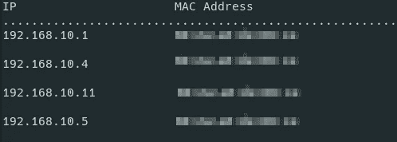

# 用 Python 设计基本网络扫描器

> 原文：<https://medium.com/analytics-vidhya/creating-own-network-scanner-using-python-f11a50a5ff77?source=collection_archive---------3----------------------->

马库斯·斯皮斯克在 [Unsplash](https://unsplash.com/s/photos/network-scanner?utm_source=unsplash&utm_medium=referral&utm_content=creditCopyText) 上的照片

信息收集是渗透测试或黑客攻击的关键之一。如果你没有足够的系统信息，你就无法控制或入侵系统。

假设您连接到一个网络，并且您的目标机器也连接到同一个网络。如何识别目标机器？为此，您需要知道目标机器的 IP 地址。因此，您需要发现该网络中的所有设备，收集它们的 mac 地址和 IP 地址是首要步骤。

你可以使用 NMAP 或网络发现；这些是发现设备的好方法。但是在这里，我们将给出一个基本步骤，让你使用 python 创建你的网络扫描器。

我们的基本扫描仪将显示所有连接到网络的设备及其 MAC 地址和 IP 地址。您可以使用您的功能实现添加系统的操作系统版本和其他信息。

当我们学习新事物时，我们想知道它们的基础。我们将在下一节中介绍它们。我们想了解广播 mac 和 ARP 协议来设计这个网络扫描器。如果你知道这些事情，你可以去实现。

## 什么是广播 Mac

BroadcastMac 不是设备的 Mac 地址。这是一个虚拟地址。当需要将一些数据包发送到网络中的所有设备时，这些数据包应该发往广播 IP 地址。然后，路由器会自动将数据包发送到连接到同一网络的所有设备。广播的 MAC 地址是“ff:ff:ff:ff:ff:ff:ff”。

## 什么是 ARP 协议

t 用于发现与给定 IP 地址相关联的 MAC 地址。为了通过本地网络发送数据包，我们需要目的机器的 MAC 地址。当数据包在本地网络中传输时，它们的 IP 地址会从数据包中删除，而 MAC 地址则用于识别设备。在此阶段，我们将这些数据包命名为帧。ARP 可以发现特定 IP 地址的 MAC 地址。

## ARP 是如何工作的？

Shutterstock.com(2019)。*等长商人扩音器在集团股票矢量(免版税)前讲话 699978403* 。【在线】可在:[https://www . shutterstock . com/image-vector/isometric-business-megahamper-speaking-before-group-699978403](https://www.shutterstock.com/image-vector/isometric-businessman-megaphone-speaking-before-group-699978403)【2019 年 9 月 4 日访问】。

当一台机器(192.168.1.4)想知道目标 IP 地址(192.168.1.3)的 MAC 地址时，它会发送 ARP 请求，以广播 MAC，消息类似于“谁有这个 IP 地址”。例如，如果目标 IP 地址是 192.168.1.3，则消息看起来像“谁拥有 192.168.1.3”。

广播 MAC 会将此数据包发送到网络中的每台设备。因此最终网络中的所有设备都会收到这个数据包。

IP 地址不等于目标 IP 地址(192.168.1.3)的设备会丢弃数据包。目标 IP 地址机器只发送类似“我是这个 IP 地址，我的 Mac 地址是这个”的响应消息。例如，消息在发送方(192.168.1.4)看来像“我是 192.168.1.3，我的 MAC 地址是 00:0a:95:9d:68:16”。

因此，发送方将在 ARP 协议的帮助下获得目标机器的 Mac 地址。使用这种 ARP 协议，设备可以识别网络中的其它设备。

一旦设备获得特定设备的 MAC 地址，它会将该 MAC 地址和设备的 IP 地址以一种称为 ARP 缓存表的表格格式保存在本地。当一台设备向另一台设备发送 ARP 响应时，收到响应的设备从不检查发送方设备的 IP 地址，并将其保存在发送方机器发送的带有 IP 地址的 ARP 缓存表中。我们可以利用这个陷阱做一些 ***中间人攻击。这种*** 通常被称为 ARP 欺骗。我将在下一篇文章中介绍使用 ARP 欺骗的中间人攻击。

中间的人

到目前为止，一切顺利。现在我们对 ARP 协议和广播有了更好的理解。我们可以转到网络扫描器的实现。

## 实现网络扫描仪

在我们的 python 脚本中，我们将按照这些步骤来设计我们的网络扫描器。

*   创建具有目标 IP 地址的 arp 请求包。
*   向广播发送数据包，并接收来自目标 IP 地址的响应。
*   解析响应以获取 Mac
*   打印结果

## 创建 ARP 请求数据包

可以使用 python 中的 scapy ARP 类创建 ARP 数据包。Scapy 是 python 中网络工具的基本库。我们可以创建带有我们想要知道的目标 IP 地址的数据包。我们可以使用广播 MAC 将此数据包发送到网络中连接的所有设备。需要在以太网帧中嵌入 ARP 协议数据包，因为在局域网中，数据包是在以太网帧中发送的。为此，我们想创建一个以太网帧。在这个以太网帧中，我们可以给出目的地作为广播 Mac 地址。因此，我们将 ARP 请求数据包附加到以太网帧中，该帧是以广播 Mac 的目的地址创建的。

因此，现在我们已经创建了一个 arp_request 数据包和以太帧。我们希望将 arp 请求附加到 ether_frame 中。为此，我们想放一个“/”来实现这一点。/运算符已被用作两层之间的复合运算符。在我们的例子中，ARP 数据包在网络层，以太网帧在数据链路层。在这里，我们有一个带有目标 IP 地址的 arp_request 数据包，它可以通过以太网帧从我们的设备发送到广播 MAC。

## 发送数据包和接收响应

作为第二步，我们必须发送 ARP 请求并接收相应的 ARP 响应。为此，我们可以使用 scapy 的 srp 函数。srp()函数用于发送数据包和接收应答。该函数返回几个数据包。它们被命名为“应答包”和“未应答包”。对我们来说，我们只需要答案包。我们将这些数据包存储在 success_list 变量中。

但是这个列表有更多的细节。我们只需要设备的 MAC 地址。所以，我们必须解析这个响应。

## 解析响应

为了解析响应，我们实现了小逻辑。success_list 表示 ARP 响应成功。因此，我们希望从 success_list 中获取每个响应。成功响应的每个 IP 地址存储在 psrc 变量中，MAC 地址存储在 hwsrc 变量中。我们初始化一个字典，将 psrc 和 hwsrc 值存储为键值对。然后我们可以用 python 的 print 方法把那些东西打印成表格格式。

当我们有了目标 IP 地址/ IP 范围，我们就可以得到他们的 MAC 地址。那么我们如何获得 IP 地址作为控制台参数呢？

## 获取用户输入作为参数

我们希望使用 python 的 optparse 库来获取命令行中的用户输入。我们只需要用户想要扫描的目标 IP 地址/ IP 范围。为此，我们可以定义一个选项“t”或“target”来获取输入并将其存储到目标变量中。

之后，我们发送这个目标变量(目标 IP 地址)来创建数据包方法，并将这些数据包发送到广播。我们可以获得响应并解析它，然后在控制台中打印结果。

我想你可以得到一个清晰的思路来设计一个简单的网络扫描仪。您可以通过添加目标计算机的操作系统版本来改进该扫描仪。在开发了这个网络扫描器之后，我们可以用 ARP 欺骗进行一些中间人攻击，这将是我的下一篇文章。

你可以克隆这个 GitHub [***资源库***](https://github.com/cvaram96/simple_network_scanner.git) 来获得完整的代码。更多细节可以在知识库的 [wiki 页面](https://cvaram96.github.io/BNS-scanner/)中找到。

*如果你喜欢这个，点击*👏*在下面，所以其他人会在媒体上看到这个。*你有什么建议吗？下面评论。