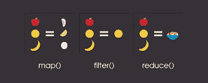

# 在 Python 中创建自己的归约和过滤函数

> 原文：<https://medium.com/analytics-vidhya/creating-own-reduce-and-filter-function-in-python-7e157c899532?source=collection_archive---------6----------------------->

## 关于循环和函数工作的基本思想



来源:- [堆栈溢出](https://www.google.com/search?q=reduce+and+filter+in+python&tbm=isch&ved=2ahUKEwi21Jbv_PHqAhVCHXIKHe72De0Q2-cCegQIABAA&oq=reduce+and+filter+in+python&gs_lcp=CgNpbWcQAzIECAAQGDoECCMQJzoFCAAQsQM6AggAOgcIIxDqAhAnOggIABCxAxCDAToECAAQQzoECAAQHjoGCAAQCBAeOgYIABAFEB5Q51pYn5QBYJSXAWgBcAB4AIAB0AGIAd0ekgEGMC4yNy4xmAEAoAEBqgELZ3dzLXdpei1pbWewAQrAAQE&sclient=img&ei=LiohX7aFJcK6yAPu7bfoDg&bih=625&biw=1366#imgrc=M7PAjF7_CE-kjM)

> 1.创建`myreduce()`功能

Reduce 函数是 python 中的一个内置函数，它的主要任务是输出聚合值。在语法上，它被写成:

`reduce(func,iter_obj)`这里的归约操作将在“func”函数上完成,“iter_obj”表示用于返回输出结果的可迭代数据值。

`reduce()`函数只接受可迭代数据进行输出，非可迭代数据将导致输出错误(不输出)。

```
# Method I 
from functools import reduce
def sum(a,b):
    return a+b
list_1=[10,15,25,10,40)
reduce(sum,list_1)
[out]>> 100
```

现在我将使用匿名函数(lambda)方法做同样的操作

```
# Method II
from functools import reduce
list_1=[10,15,25,10,40]
reduce(lambda a,b :a+b,list_1)
[out]>>100
```

> 现在，我将创建自己的函数来执行 reduce 操作，而不需要借助 python 中内置的`reduce()`函数。

```
def myreduce(add,list_1):
    return a
def add(a,b):
    return a+b
list_1=[10,15,25,40,10]
a=list_1[0]
for i in range(1,len(list_1)):
    b=list_1[i]
    a=add(a,b)
print(myreduce(add,list_1))[out]>> 100
```

> 2.创建`myfilter()`功能

filter()函数用于消除过时的值，例如:-我想从给定的列表中只取偶数，那么它将只取偶数值作为输出，并消除其余的数字。它给出结果当且仅当给定的结果返回真。

`filter(func,iter_data)`此处过滤操作将在“func”函数上完成,“iter_data”表示用于返回输出结果的可迭代数据值。

使用 python 中内置的`filter()`函数进行编码实现。

```
def is_even(a):
    if a%2==0:
        return True
list_1=[2,3,4,5,6,7,8,9,12345,5678,890,1234,567]
list(filter(is_even,list_1))[out]>> [2, 4, 6, 8, 5678, 890, 1234]
```

> 现在我将创建自己的函数来进行过滤操作，而不需要借助 python 中内置的 `filter()`函数。

```
def myfilter(is_even,list_2):
    return is_even(a)
list_2=[2,3,4,5,6,7,8,9,10]
list_3=[]
def is_even(a):
    for i in list_2:
        if i%2==0:
            list_3.append(i)
    print(list_3)
myfilter(is_even,list_2)[out]>> [2, 4, 6, 8, 10]
```