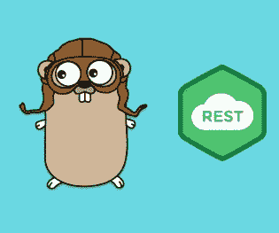
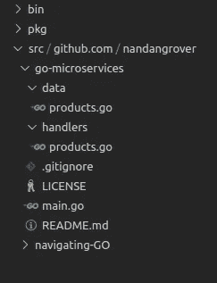

# 用 Go 创建 RESTful 服务—第 2 部分

> 原文：<https://medium.com/analytics-vidhya/creating-restful-services-with-go-part-2-1fc89b76f03f?source=collection_archive---------10----------------------->



**在这篇博客中，我们将构建一个完全成熟的 REST API** ,它公开 GET、POST、DELETE 和 PUT 端点，这将允许您执行所有的 CRUD 操作。正如在[上一篇文章](/swlh/creating-microservices-with-go-part-1-2f9aff360db5)中提到的，博客系列将封装一个生产就绪的项目。因此，博客的这一部分将为网上咖啡店打下基础。

这部分博客的代码将在这里托管:[https://github.com/nandangrover/go-microservices](https://github.com/nandangrover/go-microservices)。这个系列的第二部分，也就是这个博客的文档可以在这个[分支](https://github.com/nandangrover/go-microservices/tree/restful_services_2)中找到。

为了保持简单并专注于基本概念，我们将不与任何后端数据库技术交互来存储我们将要使用的产品。然而，我们将以这样一种方式编写这个 REST API，它将很容易更新我们将定义的函数，以便它们对数据库进行后续调用来执行任何必要的 CRUD 操作。

# RESTful 服务有哪些？

REST 是一种设计 web 服务的架构方法。REST APIs 是围绕*资源*设计的，这些资源是客户端可以访问的任何类型的对象、数据或服务。一个资源有一个*标识符*，它是唯一标识该资源的 URI。例如，特定客户订单的 URI 可能是:

```
[https://adventure-works.com/orders/1](https://adventure-works.com/orders/1)
```

客户端通过交换资源的*表示*与服务进行交互。许多 web APIs 使用 JSON(当然，这不是必需的)作为交换格式。例如，对上面列出的 URI 的 GET 请求可能会返回以下响应正文:

`{"orderId":1,"orderValue":99.90,"productId":1,"quantity":1}`

HTTP 协议定义了几种为请求分配语义的方法。大多数 RESTful web APIs 使用的常见 HTTP 方法有:

*   **GET** 在指定的 URI 检索资源的表示。响应消息的正文包含所请求资源的详细信息。
*   在指定的 URI 创建一个新的资源。请求消息的主体提供了新资源的详细信息。注意，POST 也可以用来触发实际上不创建资源的操作。
*   在指定的 URI 创建或替换资源。请求消息的主体指定了要创建或更新的资源。
*   **补丁**执行资源的部分更新。请求主体指定要应用于资源的一组更改。
*   **删除**删除指定 URI 的资源。

我们可以使用 GraphQL 或 gRPC 架构来构建我们的微服务结构。那我们为什么没有呢？Well REST 实现起来相对简单。在以后的博客中，我会用上面提到的一些技术重新设计后端。

# 文件结构是什么样的？

在上一篇博客中，我们添加了两个名为 hello 和 goodbye 的新处理程序。我们不再需要那些了，所以我们已经删除了它们。相反，我们创建了一个名为**产品的新处理程序。我们将通过这个处理程序执行 CRUD 操作。因为我们正在创建一个咖啡店，所以我们需要一个存储我们产品的数据存储。 **Products.go** 将产品的字段存储为 go 结构。**



# 产品处理程序和数据存储

让我们先看看我们的处理程序。我们首先检查 API 请求的 HTTP 动词，即 GET、POST 和 PUT。我们还编写了关于**产品**结构的方法。这些可以被 p.MethodName 调用，这对抽象我们的逻辑和可重用性很有帮助。如果你看看代码的底层结构，你会发现函数式编程的一些原则。 **Golang** 不是一种**函数式**语言，但是它有很多特性，使我们能够在开发中应用**函数式**原则，使我们的代码更加优雅、简洁、可维护、易于理解和测试。

```
package handlersimport (
 "log"
 "net/http"
 "regexp"
 "strconv""github.com/nandangrover/go-microservices/data"
)//Products structure that holds a logger
type Products struct {
 l *log.Logger
}// NewProducts function return the pointer to Products structure
func NewProducts(l *log.Logger) *Products {
 return &Products{l}
}func (p *Products) ServeHTTP(rw http.ResponseWriter, r *http.Request) {
 if r.Method == http.MethodGet {
  p.getProducts(rw, r)
  return
 }
 if r.Method == http.MethodPost {
  p.addProduct(rw, r)
  return
 }
 if r.Method == http.MethodPut {
  // expect the id in the URI
  regex := regexp.MustCompile(`/([0-9]+)`)
  group := regex.FindAllStringSubmatch(r.URL.Path, -1)if len(group) != 1 || len(group[0]) != 2 {
   http.Error(rw, "Invalid URI", http.StatusBadRequest)
   return
  }idString := group[0][1]
  // Ignore the error for now
  id, _ := strconv.Atoi(idString)p.updateProducts(id, rw, r)
 }
 // catch all other http verb with 405
 rw.WriteHeader(http.StatusMethodNotAllowed)
}func (p *Products) getProducts(rw http.ResponseWriter, r *http.Request) {
 p.l.Println("Handle GET products")listOfProducts := data.GetProducts()
 // Use encoder as it is marginally faster than json.marshal. It's important when we use multiple threads
 // d, err := json.Marshal(listOfProducts)
 err := listOfProducts.ToJSON(rw)
 if err != nil {
  http.Error(rw, "Unable to marshal json", http.StatusInternalServerError)
 }
}func (p *Products) addProduct(rw http.ResponseWriter, r *http.Request) {
 p.l.Println("Handle POST product")prod := &data.Product{}
 // The reason why we use a buffer reader is so that we don't have to allocate all the memory instantly to a slice or something like that,
 err := prod.FromJSON(r.Body)
 if err != nil {
  http.Error(rw, "Unable to unmarshal json", http.StatusBadRequest)
 }
 // p.l.Printf("Prod %#v", prod)
 data.AddProduct(prod)
}func (p *Products) updateProducts(id int, rw http.ResponseWriter, r *http.Request) {
 p.l.Println("Handle Put product")prod := &data.Product{}
 // The reason why we use a buffer reader is so that we don't have to allocate all the memory instantly to a slice or something like that,
 err := prod.FromJSON(r.Body)
 if err != nil {
  http.Error(rw, "Unable to unmarshal json", http.StatusBadRequest)
 }err = data.UpdateProduct(id, prod)
 if err == data.ErrProductNotFound {
  http.Error(rw, "Product not found", http.StatusNotFound)
  return
 }if err != nil {
  http.Error(rw, "Product not found", http.StatusInternalServerError)
  return
 }}
```

**我们产品的数据存储**定义了每个咖啡店产品的结构。我们需要导出产品，因此产品结构中的每个键都需要有一个大写的第一个字符。

我们还在这个文件中存储了一些 helper 实用程序方法，比如 ToJSON 和 FromJSON。这些方法有助于将我们的产品结构转换成 JSON，反之亦然。抽象在这里肯定是可能的，但是我们将在下一篇博客中更多地讨论它。

最后，我们还有一个变量 **productList** ，它存储了对 Product struct 的一部分引用。在切片内部，我们添加了一些虚拟数据，可以用来执行 CRUD 操作。

```
package dataimport (
 "encoding/json"
 "fmt"
 "io"
 "time"
)//Product defines the structure for an API product
//Since encoding/json is a package residing outside our package we need to uppercase the first character of the fields inside the structure
//To get nice json field names we can add struct tags though. This will output the key name as the tag name
type Product struct {
 ID          int     `json:"id"`
 Name        string  `json:"name"`
 Description string  `json:"description"`
 Price       float32 `json:"price"`
 SKU         string  `json:"sku"`
 CreatedOn   string  `json:"-"`
 UpdatedOn   string  `json:"-"`
 DeletedOn   string  `json:"-"`
}// Products is a type defining slice of struct Product
type Products []*Product// ToJSON is a Method on type Products (slice of Product), used to covert structure to JSON
func (p *Products) ToJSON(w io.Writer) error {
 // NewEncoder requires an io.Reader. http.ResponseWriter is the same thing
 encoder := json.NewEncoder(w)
 return encoder.Encode(p)
}// FromJSON is a Method on type Products (slice of Product)
func (p *Product) FromJSON(r io.Reader) error {
 decoder := json.NewDecoder(r)
 return decoder.Decode(p)
}//GetProducts - Return the product list
func GetProducts() Products {
 return productList
}//AddProduct - Add the product to our struct Product
func AddProduct(p *Product) {
 p.ID = getNextID()
 productList = append(productList, p)
}//UpdateProduct - Updates the product to our struct Product
func UpdateProduct(id int, p *Product) error {
 _, pos, err := findProduct(id)
 if err != nil {
  return err
 }p.ID = id
 productList[pos] = preturn nil
}func findProduct(id int) (*Product, int, error) {
 for i, p := range productList {
  if p.ID == id {
   return p, i, nil
  }
 }
 return nil, -1, ErrProductNotFound
}// ErrProductNotFound is the Standard Product not found error structure
var ErrProductNotFound = fmt.Errorf("Product not found")// Increments the Product ID by one
func getNextID() int {
 lastProduct := productList[len(productList)-1]
 return lastProduct.ID + 1
}var productList = []*Product{
 &Product{
  ID:          1,
  Description: "Latte",
  Name:        "Milky coffee",
  SKU:         "abc323",
  Price:       200,
  UpdatedOn:   time.Now().UTC().String(),
  CreatedOn:   time.Now().UTC().String(),
 },
 &Product{
  ID:          2,
  Description: "Expresso",
  Name:        "Strong coffee",
  SKU:         "errfer",
  Price:       150,
  UpdatedOn:   time.Now().UTC().String(),
  CreatedOn:   time.Now().UTC().String(),
 },
}
```

# 检索产品—获取

要检索我们的产品，我们可以通过基于 Unix 的终端以这种方式发送请求:

```
curl -v localhost:9090 | jq
```

> jq 有助于格式化响应。

products.go 处理程序根据这个请求被激活。在 ServeHTTP 方法中，我们编写了一个 if 条件，用于检查 HTTP 请求的 HTTP 谓词。MethodGet，本质上就是字符串“Get”。

```
if r.Method == http.MethodGet {
  p.getProducts(rw, r)
  return
 }
```

对于 GET 请求，依次调用 **getproducts()** 方法。我们向该方法发送 HTTP ResponseWriter 和请求。这个方法反过来从我们的数据存储中获取**产品列表**切片。因为它是一个片，我们使用定义在类型 Products 上的 to JSON 实用程序方法将它转换成 JSON，它是 struct Product 的一个片。

```
func (p *Products) getProducts(rw http.ResponseWriter, r *http.Request) {
 p.l.Println("Handle GET products")listOfProducts := data.GetProducts()
 // Use encoder as it is marginally faster than json.marshal. It's important when we use multiple threads
 // d, err := json.Marshal(listOfProducts)
 err := listOfProducts.ToJSON(rw)
 if err != nil {
  http.Error(rw, "Unable to marshal json", http.StatusInternalServerError)
 }
}
```

Encode 将 v 的 JSON 编码写入流中，后跟一个换行符。我们本可以使用 **json。元帅**在这里，但是我们没有。编码器和解码器将 struct 写入流的切片，或者从流的切片中读取数据并将其转换为 struct。在内部，它还实现了 marshal 方法。唯一的区别是，如果您想要处理字符串或字节，请使用 marshal，如果您想要读取或写入某些编写器接口(如我们的 ResoponseWriter)的任何数据，请使用 encodes 和 decode。这反过来也更快。我们不会注意到单个 API 调用的任何速度差异，但是使用编码器而不是封送器可以更好地处理成千上万个并发的 API 调用。你可以在这里阅读更多关于编码/json 包[的内容。](https://golang.org/pkg/encoding/json/#Encoder)

```
// ToJSON is a Method on type Products (slice of Product), used to covert structure to JSON
func (p *Products) ToJSON(w io.Writer) error {
 // NewEncoder requires an io.Reader. http.ResponseWriter is the same thing
 encoder := json.NewEncoder(w)
 return encoder.Encode(p)
}
```

因此，该编码器将我们的响应写入 ResponseWriter。我们的 API 调用的最终输出如下所示:

```
[
  {
    "id": 1,
    "name": "Milky coffee",
    "description": "Latte",
    "price": 200,
    "sku": "abc323"
  },
  {
    "id": 2,
    "name": "Strong coffee",
    "description": "Expresso",
    "price": 150,
    "sku": "errfer"
  }
]
```

# 添加新产品—帖子

要添加新产品，我们可以通过基于 Unix 的终端以这种方式发送请求:

```
curl -v localhost:9090 -XPOST -d {"name": "Tea", "description": "Cuppa Tea", "price": 10}
```

添加产品的结构类似于获取产品。我们遵循相同的数据传输流程:处理程序到数据存储。处理程序识别 HTTP 动词并调用适当的方法，即 **addProduct** 。

这个方法反过来创建了一个对我们的产品结构的引用，它定义了我们产品的结构。在请求体中收到的 JSON 数据被发送到来自 JSON 的实用程序方法，以将其解码成对我们定义的结构(即产品)的结构化引用。

```
func (p *Products) addProduct(rw http.ResponseWriter, r *http.Request) {
 p.l.Println("Handle POST product")prod := &data.Product{}
 // The reason why we use a buffer reader is so that we don't have to allocate all the memory instantly to a slice or something like that,
 err := prod.FromJSON(r.Body)
 if err != nil {
  http.Error(rw, "Unable to unmarshal json", http.StatusBadRequest)
 }
 // p.l.Printf("Prod %#v", prod)
 data.AddProduct(prod)
}
```

现在我们已经将产品存储为对 struct 产品的引用，我们将它附加到我们的 **productList** 片，它作为我们的临时数据库存储。

```
func AddProduct(p *Product) {
 p.ID = getNextID()
 productList = append(productList, p)
}
```

为我们的产品生成一个新的 id，并将其附加到我们的切片中。如果我们向我们的产品 API 发送 GET 请求，我们将看到现在列出了 3 个产品，而不是 2 个。

```
[
  {
    "id": 1,
    "name": "Milky coffee",
    "description": "Latte",
    "price": 200,
    "sku": "abc323"
  },
  {
    "id": 2,
    "name": "Strong coffee",
    "description": "Expresso",
    "price": 150,
    "sku": "errfer"
  },{
    "id": 3,
    "name": "Tea",
    "description": "Cuppa Tea",
    "price": 10
  }
]
```

# 更新现有产品—上传

要更新现有产品，我们可以通过基于 Unix 的终端以这种方式发送请求:

```
curl -v localhost:9090/2 -XPUT -d {"name": "Frappuccino", "description": "Cuppa frappuccino", "price": 100}
```

更新产品的结构类似于获取产品。我们遵循相同的数据传输流程:处理程序到数据存储。处理程序识别 HTTP 动词并调用适当的方法，即 **updateProducts** 。

PUT 请求比简单的 POST 或 GET 更难解析，因为我们必须从 URI 中提取请求的 ID。我们如何做到这一点？我们使用一些正则表达式。

因为我们的 ID 是一个数字，所以我们编写一个 regexp 来搜索一组可以重复的数字(0–9 ),用+标记表示。在运行 FindAllStringSubmatch 时，如果我们获得一个成功的匹配，匹配的字符串驻留在一个多维数组中。我们从索引[0][1]中提取必要的组。我将由您来决定为什么索引驻留在[1]而不是[0]中。

Regexp 非常有趣，在很多方面都很有帮助。你可以在这里阅读更多关于 Golang 标准图书馆提供的方法。

```
if r.Method == http.MethodPut {
  // expect the id in the URI
  regex := regexp.MustCompile(`/([0-9]+)`)
  group := regex.FindAllStringSubmatch(r.URL.Path, -1)if len(group) != 1 || len(group[0]) != 2 {
   http.Error(rw, "Invalid URI", http.StatusBadRequest)
   return
  }idString := group[0][1]
  // Ignore the error for now
  id, _ := strconv.Atoi(idString)p.updateProducts(id, rw, r)
 }
```

现在我们有了需要更新的产品 id，我们可以从请求体中提取更新的信息。

我们将把我们身体中的产品信息解码成指向数据存储中产品的结构引用。这个步骤类似于 POST 请求。我们的数据存储中的 **UpdateProduct** 方法被称为 next。

```
func (p *Products) updateProducts(id int, rw http.ResponseWriter, r *http.Request) {
 p.l.Println("Handle Put product")prod := &data.Product{}
 // The reason why we use a buffer reader is so that we don't have to allocate all the memory instantly to a slice or something like that,
 err := prod.FromJSON(r.Body)
 if err != nil {
  http.Error(rw, "Unable to unmarshal json", http.StatusBadRequest)
 }err = data.UpdateProduct(id, prod)
 if err == data.ErrProductNotFound {
  http.Error(rw, "Product not found", http.StatusNotFound)
  return
 }if err != nil {
  http.Error(rw, "Product not found", http.StatusInternalServerError)
  return
 }}
```

要更新我们的产品，我们需要先找到它。这是一件好事，我们有来自 URI 的 ID，因为这是我们产品的唯一唯一标识符。我们通过迭代我们的 **productList** 切片并返回产品引用、它在切片中的索引和一个错误(如果找到了产品，则返回零)来实现这一点。我们使用这个索引(pos 是这个索引的变量名)，用在请求体中收到的 JSON 替换引用(显然它现在被解码为对 product struct 的引用)。

```
//UpdateProduct - Updates the product to our struct Product
func UpdateProduct(id int, p *Product) error {
 _, pos, err := findProduct(id)
 if err != nil {
  return err
 }p.ID = id
 productList[pos] = preturn nil
}func findProduct(id int) (*Product, int, error) {
 for i, p := range productList {
  if p.ID == id {
   return p, i, nil
  }
 }
 return nil, -1, ErrProductNotFound
}
```

索引 2 处的产品现在应该已经更新了。如果我们向我们的产品 API 发送一个 GET 请求，我们将看到第二个产品用新值进行了更新。

```
[
  {
    "id": 1,
    "name": "Milky coffee",
    "description": "Latte",
    "price": 200,
    "sku": "abc323"
  },
  {
    "id": 2,
    "name": "Frappuccino",
    "description": "Cuppa Frappuccino",
    "price": 100,
    "sku": "errfer"
  },{
    "id": 3,
    "name": "Tea",
    "description": "Cuppa Tea",
    "price": 10
  }
]
```

# 下一步是什么？

我们将研究臭名昭著的大猩猩框架，也许还有一些很酷的 swagger 文档技术。我们还将在下一篇博客中研究如何处理文件。单元测试和全面的数据库集成显然即将到来，但我们将首先考虑建立一个强大的基础。

# 参考

*   代码库:[https://github.com/nandangrover/go-microservices](https://github.com/nandangrover/go-microservices)
*   第二部分 GitHub 链接:[https://GitHub . com/nandang rover/go-micro services/tree/restful _ services _ 2](https://github.com/nandangrover/go-microservices/tree/restful_services_2)
*   Golang 的 Freecodecamp 教程:[https://www.youtube.com/watch?v=YS4e4q9oBaU&ab _ channel = freecodecamp . org](https://www.youtube.com/watch?v=YS4e4q9oBaU&ab_channel=freeCodeCamp.org)
*   Rest API 设计原则:[https://docs . Microsoft . com/en-us/azure/architecture/best-practices/API-design](https://docs.microsoft.com/en-us/azure/architecture/best-practices/api-design)
*   JSON 包 Golang:[https://golang.org/pkg/encoding/json/](https://golang.org/pkg/encoding/json/)
*   https://golang.org/pkg/regexp/

[](/swlh/creating-microservices-with-go-part-1-2f9aff360db5) [## 使用 Go 创建微服务-第 1 部分

### 来自 JavaScript 背景，我一直想学习一门静态类型的编程语言，早些时候…

medium.com](/swlh/creating-microservices-with-go-part-1-2f9aff360db5)