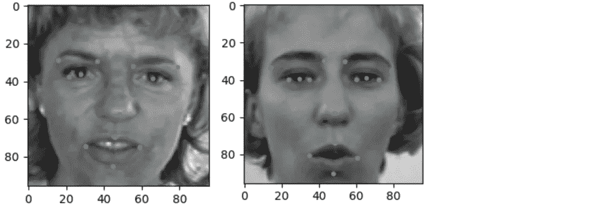
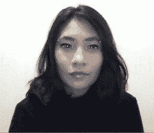

# 使用计算机视觉技术从头开始创建类似 Snapchat 的过滤器

> 原文：<https://medium.com/analytics-vidhya/creating-snapchat-like-filters-from-scratch-using-computer-vision-techniques-6374cde6a7db?source=collection_archive---------6----------------------->

如今，Snapchat 过滤器是任何特殊活动中无尽乐趣和笑声的来源。这些滤镜让人在镜头前很可爱，看起来很赏心悦目。作为一名人工智能(AI)学生和 Snapchat 爱好者，我想探索使用卷积神经网络(CNN)和 OpenCV 库创建类似 Snapchat 的过滤器。在这篇文章中，我将回顾在 python 中实现它们的概念和过程。

使用计算机视觉技术制作的可爱动物滤镜

**数据集**

我使用了一个公开的数据集，名为 Kaggle 的“面部关键点检测”，由训练集和测试集组成。在训练集中，有 7049 行和 31 列，其中输入列是字符串格式的图像数据，输出列是面部 15 个关键点(眼睛、眉毛、鼻子和嘴)的 30 长预测向量。在预处理步骤之后，不包含全部 15 个关键点的图像被丢弃。剩下的 2140 张图片被调整成 96x96x1 的尺寸。输入和输出变量被标准化并为训练做准备。输入图像和目标面部点可视化的结果如下所示:

训练集图像和面部关键点

**建立和训练模型**

这个项目的主要目标之一是预测未知人脸图像的关键点位置。我使用 CNN，因为它们是解决图像分类问题的强大工具。为了从输入图像中提取特征，CNN 模型由 4 个卷积块组成，其中每个块都有一个卷积层，后跟一个 max-pooling 层。为了防止过拟合，在一些卷积块中加入了漏失层。在特征提取之后，使用完全连接的层，输出层包括 30 个节点(15 对(x，y)坐标)。

在构建架构之后，使用均方误差作为损失参数，Adam 作为优化器参数来编译该模型。度量参数用于评估模型的准确性。该模型用 200 个批量大小的 100 个时期训练，并且能够达到大约 0.002 的最小损失和 80%的准确度。

**面部检测和面部关键点预测**

OpenCV 是一个用于图像处理和计算机视觉的开源库，用于处理图像和视频，识别模式和对象，以及其他实时操作。对于这个项目，我使用了“haarcascade_frontalface.xml ”,这是 OpenCV 为实时人脸检测提供的几个经过训练的 Haar 级联模型之一。在从网络摄像头检测到面部区域后，对其进行裁剪以应用一些预处理，如转换为灰度、归一化和整形。然后将准备好的图像作为输入传递给模型，该模型从网络摄像头预测以下面部关键点。

网络摄像头上预测的面部关键点

**添加 Snapchat like 过滤器**

用于覆盖图像的滤镜

在最后一步中，使用预测的眼睛和眉毛点将过滤器放置在每个人的脸上。将过滤器放置在眉毛点的稍上方，并且使用左上角和右上角的眉毛点来确定过滤器的宽度。最后，项目的输出是以下实时视频，带有可爱的 Snapchat 式动物滤镜。

这是显示可爱过滤器的最终实时输出

以下是我的 Github 的完整代码链接:[https://Github . com/shya a23/Snapchat-like-Filters-Using-Computer-Vision-Techniques](https://github.com/shyaa23/Snapchat-like-Filters-Using-Computer-Vision-Techniques)

我希望这篇文章是有益的。请随时留下任何意见和建议，以便进一步改进。

链接到我的网站:【http://shyaa23.github.io/ 