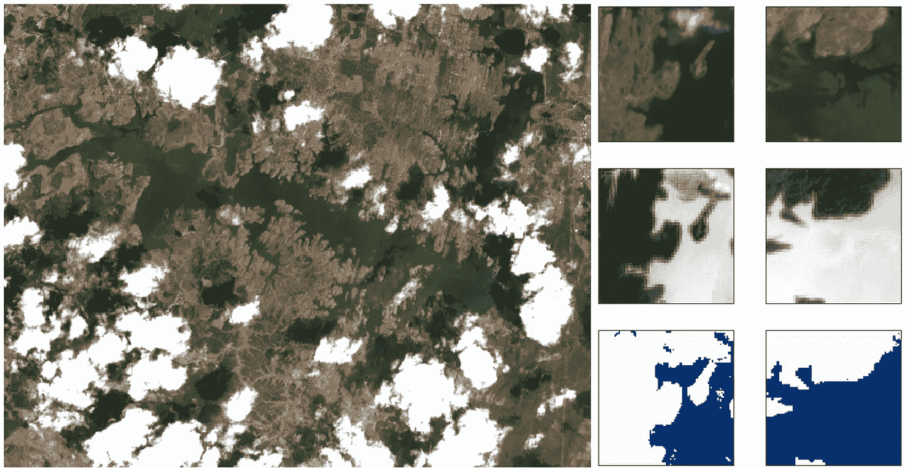

# 使用谷歌地球引擎(GEE)为卫星(Sentinel 2)图像的深度学习图像分割创建训练补丁

> 原文：<https://medium.com/analytics-vidhya/creating-training-patches-for-deep-learning-image-segmentation-of-satellite-sentinel-2-imagery-d3dd368c9c64?source=collection_archive---------4----------------------->

图-水体图像分割的面片创建示例。

## 更新

关于课程**科学家 Python 入门** ( [可在 YouTube](https://youtu.be/oQaoj6LE5E4) ) 和其他类似文章的信息，请访问我的网站[cordmaur.carrd.co](http://cordmaur.carrd.co/)。

# 介绍