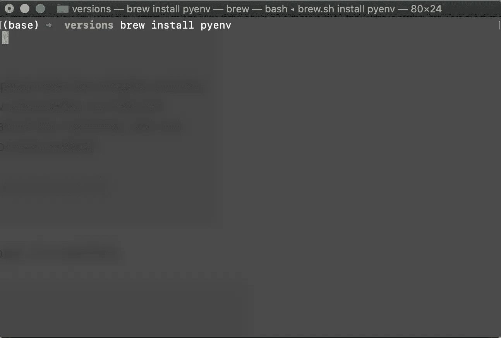

# 在不干扰 Conda 配置的情况下，用 Python 创建虚拟环境

> 原文：<https://medium.com/analytics-vidhya/creating-virtual-environment-for-python-without-disturbing-conda-configuration-f7cbbc70ae74?source=collection_archive---------10----------------------->

## 它们是什么以及如何使用它们！


Bram Van Oost 在 [Unsplash](https://unsplash.com?utm_source=medium&utm_medium=referral) 上拍摄的照片

大家好！我希望你们都有一个编码的好时光！

好吧，告诉你一点关于我自己的事情，我已经从全栈开发做了一个“小的职业转变”,并试图追求数据科学。我从零开始，希望在理解这个主题的所有细节的同时达到顶峰。在这个同化过程中，如果你们指出任何错误或者建议更好的做事方法，我会很高兴。

在这篇文章里，我要讲的是:
**1。创建虚拟环境的需求
2。用于维护虚拟环境多个版本的不同库
3。使用“pyenv”设置多种环境**

注意:我假设您已经安装了 Anaconda(尽管这不是必需的！).**这只是为了展示我们如何在使用 Python (3.x.x+)中使用的多个版本的包时保持我们的 Conda 配置不变。**

我目前在我的系统上安装了 Python 3.7.3，它附带了标准的 Anaconda 安装(在我写这篇文章时是当前的 4.7.12)。
你可以从[这里](https://www.anaconda.com/distribution/)下载 Anaconda。建议下载 Python 3.7 版本。

现在我们都准备好了，让我们开始吧！

**创建虚拟环境的需求**

每个程序员对于不同的编程环境都有不同的偏好。浅色主题与深色主题、制表符与空格、不同的字体风格以及不同的库偏好。嗯，所有这些对于他正在工作的项目/应用程序来说都是正确且独特的。
最近从获取深度学习的知识开始，偶然发现了强大的 Keras 库。在办公室里，当我的同事们讨论这方面的事情时，我听到了很多(嗯，参与他们的谈话促使我从事这方面的工作)。为了在我的机器上安装 Keras，我知道我必须降级我的 Python 版本，这是随 Anaconda 安装一起提供的标准 Python——Python 3 . 7 . 3，因为 Keras 与这个版本不兼容。最好的是 Python 3.6，我可以让它兼容。这就是我如何开始考虑如何安装这个版本而不干扰我的 Python 3.7.3 的标准配置，因为我的许多东西都在使用这个版本，我不想破坏它们，甚至不是偶然！

我很快开始阅读 Python 中的虚拟环境。不出我所料，我遇到了各种各样的库，每一个都服务于它的用途、它的用例，因为 Python 拥有大量的社区支持！
举几个流行的例子，有很多:

一. **pyenv**
ii。 **virtualenv**
iii。 **venv**
iv。**皮尤**
v. **pipenv**

[](https://towardsdatascience.com/comparing-python-virtual-environment-tools-9a6543643a44) [## 比较 Python 虚拟环境工具

### 设置 Python 虚拟环境的各种工具

towardsdatascience.com](https://towardsdatascience.com/comparing-python-virtual-environment-tools-9a6543643a44) 

# pyenv

让我们来看看创建和使用虚拟环境的方法之一:pyenv——一个简单的 python 版本管理工具。
可以更改全局 Python 版本，安装多个 Python 版本，设置特定 Python 版本的应用工作台，创建和管理多个 Python 环境。开始吧！

正如 pyenv 的 GitHub 文档中提到的—

**pyenv 确实……**

*   让您在每个用户的基础上**更改全局 Python 版本**。
*   为**每个项目的 Python 版本**提供支持。
*   允许您用一个环境变量覆盖 Python 版本。
*   一次从**多个版本的 Python 中搜索命令**。这可能有助于使用 tox 跨 Python 版本进行测试。

**与 pythonbrew 和 pythonz 相比，pyenv 没有…**

*   **靠 Python 本身**。pyenv 是由纯 shell 脚本构成的。Python 不存在引导问题。
*   **需要装入你的外壳**。相反，pyenv 的 shim 方法通过向您的`$PATH`添加一个目录来工作。
*   **管理虚拟人**。当然，你可以自己创建 [virtualenv](https://pypi.python.org/pypi/virtualenv) ，或者 [pyenv-virtualenv](https://github.com/pyenv/pyenv-virtualenv) 来自动化这个过程。

# 使用

就像大多数其他好的 CLI 包一样，pyenv 也提供了几个好的、直观的命令。

[](https://github.com/pyenv/pyenv/) [## pyenv/pyenv

### pyenv 允许您在多个版本的 Python 之间轻松切换。它简单、不引人注目，并且遵循 UNIX…

github.com](https://github.com/pyenv/pyenv/) 

这是 pyenv GitHub 页面的链接。让我们看看它的一些有用的命令。

**安装软件包:**

在您的系统上安装 CLI 有许多不同的方法，但我在不同的常用操作系统上写下了最简单的一种。

*   使用 brew 在 **Mac 系统**上安装:` brew install pyenv '



*   安装在 **Ubuntu 系统上**:

—安装依赖项:

```
sudo apt-get install -y make build-essential libssl-dev zlib1g-dev libbz2-dev \
libreadline-dev libsqlite3-dev wget curl llvm libncurses5-dev libncursesw5-dev \
xz-utils tk-dev libffi-dev liblzma-dev
```

—安装 pyenv CLI:

```
curl -L [https://raw.githubusercontent.com/pyenv/pyenv-installer/master/bin/pyenv-installer](https://raw.githubusercontent.com/pyenv/pyenv-installer/master/bin/pyenv-installer) | bash
```

*   将其安装在 **Windows 系统上**:

—检查这个包`pyenv-win` [这里](https://pypi.org/project/pyenv-win/)，它已经更新，看起来很稳定，虽然我还没有亲自试过，因为我主要在 Linux 系统上工作。

```
pip install pyenv-win
```

尝试的人，请让我知道你的经历，我也想知道你的想法。

**安装新版本的 python:**

pyenv 位于可以从`pyenv shell`访问的系统 Python 之上。它安装在主目录中，我的安装在这里

```
/Users/aashish/.pyenv
```

我们安装的所有 Python 版本实际上都安装在该目录下创建的`versions`文件夹中。

```
# To List out the Python versions$ **pyenv versions**
* system (set by /home/aashish/.pyenv/version)
 2.7.15
 3.6.8
```

要更改全局设置:

```
# Change the global settings of Python from pyenv$ **pyenv global 3.6.8**
system
 2.7.15
* 3.6.8 (set by /home/aashish/.pyenv/version)
```

要创建 Python 的本地设置，假设您特别希望在一个不寻常的环境中进行试验:

```
# Change the local settings$ **pyenv local 2.7.15**
$ **python -V**
 system
* 2.7.15 (set by /home/aashish/.python-version)
 3.6.8# This is also applied to the subdirectory that you create within the new project folder you are trying this in
```

**虚拟环境**

pyenv 使用了一个名为`[pyenv-virtualenv](https://github.com/pyenv/pyenv-virtualenv)`的插件。在我看来，这个插件简化了创建虚拟环境的工作，这是 Python 中独一无二的。它跨不同版本的 Python 管理虚拟环境。

```
# pyenv virtualenv <python_version> <environment_name>
# <environment_name>: name of the seperate virtual environments$ **pyenv virtualenv 3.6.8 flask-demo**
```

为了激活你的环境

```
$ **pyenv local flask-demo**
```

如果您没有将`eval "$(pyenv virtualenv-init -)"`配置为在您的 shell 中运行，您可以使用以下命令手动激活/停用您的 Python 版本:

```
$ **pyenv activate flask-demo**
$ **pyenv deactivate**
```

# 进一步阅读

如果这没有满足您的好奇心，并且您还想了解更多关于虚拟环境的信息，我强烈推荐这篇文章。

[](https://towardsdatascience.com/understanding-python-virtual-environments-7ccf690320d7) [## 了解 Python 虚拟环境

### 使用 VR 的 Python 虚拟环境介绍

towardsdatascience.com](https://towardsdatascience.com/understanding-python-virtual-environments-7ccf690320d7) 

除此之外，继续探索，并随时在评论中提出任何建议，为他人改进文章。

[](https://towardsdatascience.com/which-python-package-manager-should-you-use-d0fd0789a250) [## 应该使用哪个 Python 包管理器？

### 每个接触代码的人对于他们的编程环境都有不同的偏好。Vim 对 emacs…

towardsdatascience.com](https://towardsdatascience.com/which-python-package-manager-should-you-use-d0fd0789a250) 

最后是我发现的最重要和最有帮助的文章，它提高了我对这个主题的理解

[](https://realpython.com/intro-to-pyenv/) [## 使用 pyenv 管理多个 Python 版本——真正的 Python

### 你是否曾经想为一个支持多个 Python 版本的项目做贡献，但是不知道如何去做…

realpython.com](https://realpython.com/intro-to-pyenv/) 

# 跟我来

伙计们，如果你喜欢阅读这篇文章，并想阅读更多内容，跟随我成为一名见多识广的数据科学家，请在 [Medium](/@aashishchaubey) 、 [Twitter](https://twitter.com/AashishLChaubey) 和 [LinkedIn](https://www.linkedin.com/in/chaubey-aashish/) 上关注我。也请不要忘记留下你对这篇文章的赞赏或评论！