# 创建自己的 Alexa 技能集是非常令人兴奋的

> 原文：<https://medium.com/analytics-vidhya/creating-your-own-alexa-skillset-is-quite-exciting-89b7266071cb?source=collection_archive---------18----------------------->

如今，数字设备和小配件越来越成为我们生活中不可分割的一部分。亚马逊 Echo 和 Dot 等设备的高采用率可能有几个原因。

我列出了几个可能你也会感兴趣的例子:

*   它让我们比以前更容易执行多任务
*   与电话或笔记本电脑相比，它让我们做事更快
*   它能让我们快速找到问题的答案
*   它让我们的日常工作变得更容易

因此，如果你正在寻找一种方法来创建 Alexa 的语音功能，那么你就在正确的地方！
让我们使用节点服务器，使用 AWS 的 Lambda 函数服务，从零开始创建一个亚马逊 Alexa 技能。

首先注册一个亚马逊开发者账户，如果你还没有的话。

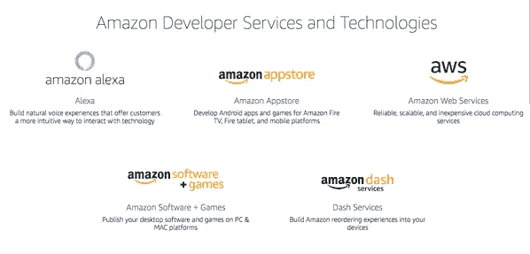

转到 Alexa 开发者页面。

然后去 Alexa 控制台。

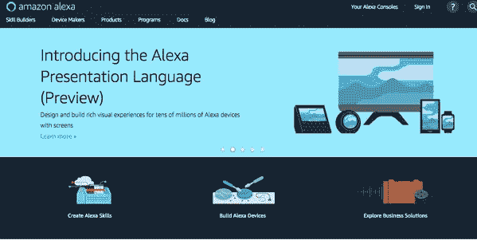

点击**创建技能。**

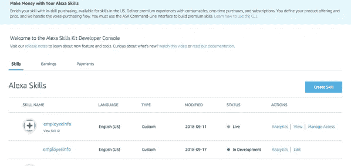

给技能起个名字，我把我的命名为 **employeeinfo** ，点击**下一个**。

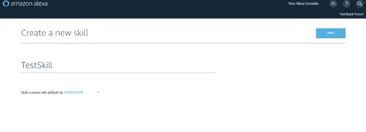

选择一个模型来增加你的技能。我选择了**自定义**进行我的实验。

点击**创造技能**。

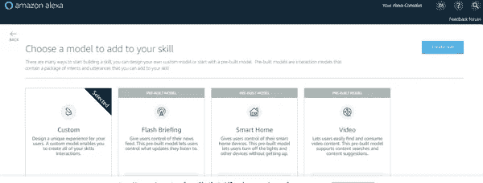

这样你就可以到达 **Alexa 技能仪表盘**。

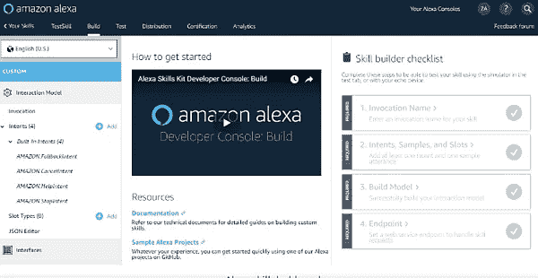

提供调用名。我将其命名为“**运行 employeeinfo** ”，并点击**保存模型**。

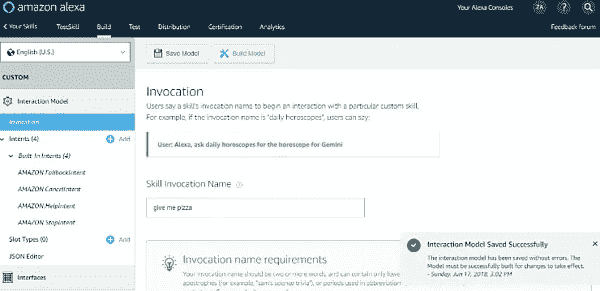

点击**端点**。

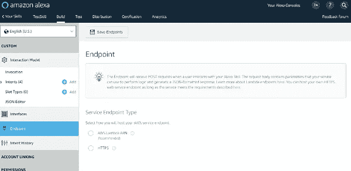

现在，我们需要为 Alexa 控制台提供端点。但在此之前，我们需要设置一个端点。

为了设置端点，我们需要使用 AWS Lambda 函数服务。

点击“创建函数”来创建你自己的 Lambda 函数。

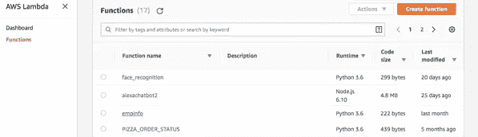

单击后，您将看到您的端点在仪表板的最右侧生成为 ARN。

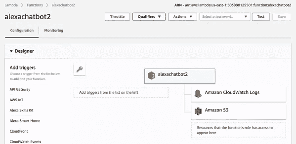

在 Alexa 控制台的 Lambda 端点部分复制并粘贴 ARN。
点击保存端点。

**创建节点服务器**

创建一个可以在默认位置(即“/”)接受 POST 请求的服务器。

创建服务器的技术有这么多，我个人更喜欢节点。

我假设你已经安装了节点，NPM 和 Visual Studio 代码。

对于本教程的具体要求，我们将按照下面给出的步骤创建一个 Hello World 节点应用程序:

*   在终端上运行 npm init。您将被要求提供包裹
*   遵循 package.json 文件中的终端向导
*   运行 npm i express http — save，这将在 package.json 文件中添加以下条目:

"依赖关系":{
"express": "4.16.3 "，
"sql": "0.0.2"
}

*   将值设置为 package.json 文件中主键的 index.js
*   在同一层添加一个 index.js 文件
*   将以下代码添加到 index.js 文件中:

const express = require(' express ')；
const app = express()；
app.post('/'，(req，res) = >
res.send({
版本:' 1.0 '，
响应:{
should session:false，
output speech:{
type:' SSML '，
text: 'Hello World！'，
ssml: ' <说话>你好世界！</说话>'
}
}
})；
app.listen(8080，()= > console.log('示例应用程序监听端口 8080！'));

*   将脚本的值设置为{"start": "node index.js"}
*   在终端上运行 npm start
*   如果一切正常，您必须看到以下提示:

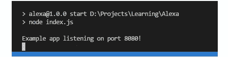

点击 JSON 编辑器，提供如下模型:
{
" interaction model ":{
" language model ":{
" invocation name ":" employee info "，
" intents ":[
{
" name ":" AMAZON。FallbackIntent "，
"samples": []
}，
{
"name": "AMAZON。CancelIntent”，
“samples”:[
“ya”，
“Yups”，
“yes”，
“我给错输入了”，
“我想知道点别的”，
“我想打听点别的”，
“我想要点别的”，

}，
“name”:“亚马逊。PauseIntent "，
"samples": []
}，
，
，【samples": [
"我能知道关于{empname}的信息吗"，
"我想知道关于{empname}的信息吗"，
"我能得到关于{empname}的所有信息吗"，
"我能知道关于{empname} "，
"我想知道关于{empname} "，
"我想知道全部

点击**保存模型**并点击**构建模型**。

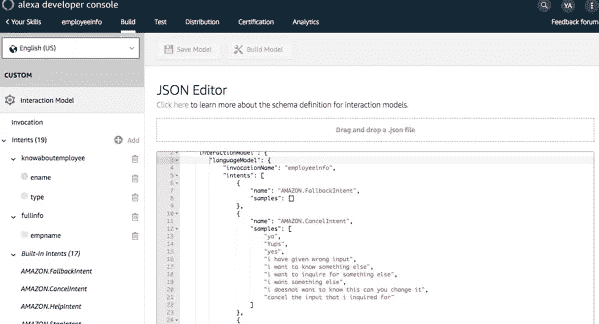

一旦技能模型建立起来，我们需要测试它。点击**测试**选项卡，并在上切换**。该技能的*测试已启用。***

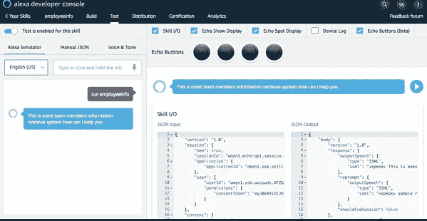

就这样，你已经在 AWS 上创建了一个连接到你的 Lambda 函数的 Alexa 技能。

这篇文章是根据 AWS 开发者门户的文档编写的。

如果你有任何问题，请在下面留下你的评论。