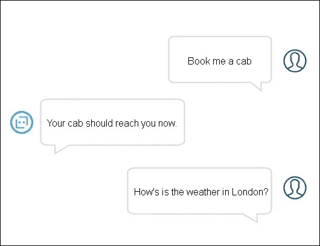
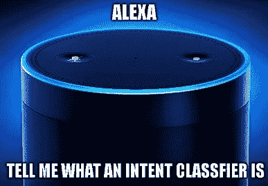
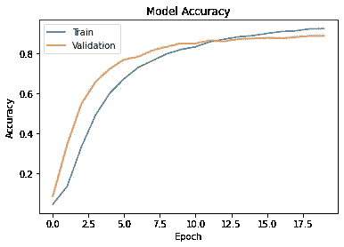
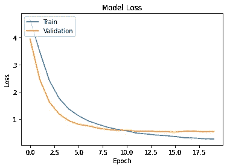
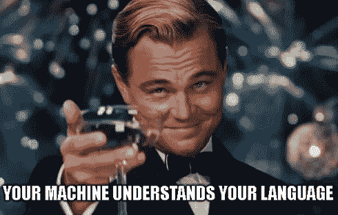

# 创建您自己的意图分类器

> 原文：<https://medium.com/analytics-vidhya/creating-your-own-intent-classifier-b86e000a4926?source=collection_archive---------0----------------------->



作为 NLP 的粉丝，我总是想知道当我要求谷歌助手或 Alexa 做一些事情时，它是如何理解的。问题接着是，我是否能让我的机器也理解我？解决方法是-意图分类。

> 意图分类是自然语言理解的一部分，其中机器学习/深度学习算法学习在它接受训练的短语的基础上对给定短语进行分类。

让我们举一个有趣的例子；我在做一个像 Alexa 一样的助手。



为简单起见，我们将执行 3 项任务，即开灯、关灯和告诉我们天气如何。让我们给这三个任务起个名字:开灯、关灯和天气。这些所有的任务在 NLU 被称为*‘意图’*。换句话说，*意图是一组属于共同名称的相似短语，这样深度学习算法就很容易理解用户要说的话*。每个意图被给予一定数量的训练短语，以便它能够学习对实时短语进行分类。

现在，我们知道什么是意图分类，让我们开始酷的东西！我写了一个[笔记本](https://github.com/horizons-ml/intent-classifier/blob/main/intent_classification.ipynb)如果你想跟着我，你可以在我的 [Github repo](https://github.com/horizons-ml/intent-classifier) 这里找到。

为方便起见，让我们遵循以下目录结构:

```
Your directory
├───models 
├───utils
└───intent_classification.ipynb
```

## 安装依赖项

使用以下命令安装所需的依赖项:

```
pip install wget tensorflow==1.5 pandas numpy keras
```

## 资料组

我们将使用公开可用的 [CLINC150 数据集](https://github.com/clinc/oos-eval)。它收集了 10 个领域中 150 种不同意图的短语。你可以在这里阅读更多关于数据集的信息。

我们将使用以下方式下载数据集:

```
**import** **wget**
url = 'https://raw.githubusercontent.com/clinc/oos-eval/master/data/data_full.json'
wget.download(url)
```

## 准备数据集

数据集已经分为“训练”、“测试”和“验证”集，但我们将创建自己的训练和验证集，因为我们不需要测试集。我们将通过合并所有集合，然后使用 scikit-learn 将它们分成“训练”和“验证”集合来实现这一点。这也将创建更多的训练数据。

```
**import** **numpy** **as** **np**
**import** **json** *# Loading json data*
**with** open('data_full.json') **as** file:
  data = json.loads(file.read())

*# Loading out-of-scope intent data*
val_oos = np.array(data['oos_val'])
train_oos = np.array(data['oos_train'])
test_oos = np.array(data['oos_test'])

*# Loading other intents data*
val_others = np.array(data['val'])
train_others = np.array(data['train'])
test_others = np.array(data['test'])

*# Merging out-of-scope and other intent data*
val = np.concatenate([val_oos,val_others])
train = np.concatenate([train_oos,train_others])
test = np.concatenate([test_oos,test_others])data = np.concatenate([train,test,val])
data = data.T

text = data[0]
labels = data[1]
```

接下来，我们将使用以下内容创建训练和验证拆分:

```
**from** **sklearn.model_selection** **import** train_test_splittrain_txt,test_txt,train_label,test_labels = train_test_split(text,labels,test_size = 0.3)
```

## 数据集预处理

由于深度学习是一个数字游戏，它希望我们的数据是数字形式的。我们将标记我们的数据集；意思是将句子分解成个体，并将这些个体转换成数字表示。我们将使用 K [时代标记器](https://www.tensorflow.org/api_docs/python/tf/keras/preprocessing/text/Tokenizer)来标记我们使用以下代码的短语:

```
**from** **tensorflow.python.keras.preprocessing.text** **import** Tokenizer
**from** **tensorflow.python.keras.preprocessing.sequence** **import** pad_sequencesmax_num_words = 40000
classes = np.unique(labels)

tokenizer = Tokenizer(num_words=max_num_words)
tokenizer.fit_on_texts(train_txt)
word_index = tokenizer.word_index
```

为了将我们的数据输入深度学习模型，我们所有的短语必须长度相同。我们将用 *0* 填充所有的训练短语，这样它们的长度就相同了。

```
ls=[]
**for** c **in** train_txt:
    ls.append(len(c.split()))
maxLen=int(np.percentile(ls, 98))train_sequences = tokenizer.texts_to_sequences(train_txt)
train_sequences = pad_sequences(train_sequences, maxlen=maxLen,              padding='post')test_sequences = tokenizer.texts_to_sequences(test_txt)
test_sequences = pad_sequences(test_sequences, maxlen=maxLen, padding='post')
```

接下来，我们需要将标签转换成独热编码形式。你可以在这里阅读更多关于一键编码[的信息。](https://victorzhou.com/blog/one-hot/)

```
**from** **sklearn.preprocessing** **import** OneHotEncoder,LabelEncoder

label_encoder = LabelEncoder()
integer_encoded = label_encoder.fit_transform(classes)

onehot_encoder = OneHotEncoder(sparse=**False**)
integer_encoded = integer_encoded.reshape(len(integer_encoded), 1)
onehot_encoder.fit(integer_encoded)train_label_encoded = label_encoder.transform(train_label)
train_label_encoded = train_label_encoded.reshape(len(train_label_encoded), 1)
train_label = onehot_encoder.transform(train_label_encoded)test_labels_encoded = label_encoder.transform(test_labels)
test_labels_encoded = test_labels_encoded.reshape(len(test_labels_encoded), 1)
test_labels = onehot_encoder.transform(test_labels_encoded)
```

## 在我们创建模型之前..

在我们开始训练我们的模型之前，我们将使用[全局向量](https://nlp.stanford.edu/projects/glove/)。手套是由斯坦福大学在大型语料库上训练的单词的 N 维向量表示。由于它是在大型语料库上训练的，它将帮助模型更好地学习短语。

我们将使用以下方式下载 GloVe:

```
**import** **wget**
url ='https://www.dropbox.com/s/a247ju2qsczh0be/glove.6B.100d.txt?dl=1'
wget.download(url)
```

下载完成后，我们会将其存储在 Python 字典中:

```
embeddings_index={}
**with** open('glove.6B.100d.txt', encoding='utf8') **as** f:
    **for** line **in** f:
        values = line.split()
        word = values[0]
        coefs = np.asarray(values[1:], dtype='float32')
        embeddings_index[word] = coefs
```

因为 GloVe 包含来自大型语料库的所有单词的向量表示，所以我们只需要那些出现在语料库中的单词向量。我们将创建一个嵌入矩阵，它只包含数据集中出现的单词的向量表示。因为我们的数据集已经被标记化了，所以 Keras 标记化器为数据集中的每个标记分配了一个唯一的编号。这个唯一的数字可以被认为是嵌入矩阵中每个单词的向量的索引；这意味着来自记号赋予器的每个第*n*个字由嵌入矩阵中第*n*个位置处的向量表示。

```
all_embs = np.stack(embeddings_index.values())
emb_mean,emb_std = all_embs.mean(), all_embs.std()num_words = min(max_num_words, len(word_index))+1embedding_dim=len(embeddings_index['the'])embedding_matrix = np.random.normal(emb_mean, emb_std, (num_words, embedding_dim))
**for** word, i **in** word_index.items():
    **if** i >= max_num_words:
        **break**
    embedding_vector = embeddings_index.get(word)
    **if** embedding_vector **is** **not** **None**:
        embedding_matrix[i] = embedding_vector
```

## 模型准备

让我们把我们的模型的架构放在一起，看看模型的运行情况。

```
**from** **tensorflow.python.keras.models** **import** Sequential
**from** **tensorflow.python.keras.layers** **import** Dense, Input, Dropout, LSTM, Activation, Bidirectional,Embeddingmodel = Sequential()

model.add(Embedding(num_words, 100, trainable=**False**,input_length=train_sequences.shape[1], weights=[embedding_matrix]))
model.add(Bidirectional(LSTM(256, return_sequences=**True**, recurrent_dropout=0.1, dropout=0.1), 'concat'))
model.add(Dropout(0.3))
model.add(LSTM(256, return_sequences=**False**, recurrent_dropout=0.1, dropout=0.1))
model.add(Dropout(0.3))
model.add(Dense(50, activation='relu'))
model.add(Dropout(0.3))
model.add(Dense(classes.shape[0], activation='softmax'))model.compile(loss='categorical_crossentropy', optimizer='adam', metrics=['acc'])
```

我们将在嵌入层中传递嵌入矩阵作为*权重。*

## 模特培训

最后是训练模型的时间。

```
history = model.fit(train_sequences, train_label, epochs = 20,
          batch_size = 64, shuffle=**True**,
          validation_data=[test_sequences, test_labels])
```

这大约需要一个小时左右，取决于您的机器。培训完成后，我们可以将指标想象为:

```
**import** **matplotlib.pyplot** **as** **plt**
%matplotlib inlineplt.plot(history.history['acc'])
plt.plot(history.history['val_acc'])
plt.title('Model Accuracy')
plt.ylabel('Accuracy')
plt.xlabel('Epoch')
plt.legend(['Train', 'Validation'], loc='upper left')
plt.show()
```



模型精度曲线

Wohoo！！我们得到了 92.45%的训练准确率和 88.86%的验证准确率，这是相当不错的。

这是损失曲线:

```
**import** **matplotlib.pyplot** **as** **plt**
%matplotlib inlineplt.plot(history.history['loss'])
plt.plot(history.history['val_loss'])
plt.title('Model Loss')
plt.ylabel('Loss')
plt.xlabel('Epoch')
plt.legend(['Train', 'Validation'], loc='upper left')
plt.show()
```



培训损失约为 0.2，验证损失约为 0.5。您可以尝试模型架构，看看损失是否会下降[😉](https://emojipedia.org/winking-face/)

## 保存模型、标记器、标签编码器和标签

让我们保存训练好的模型、标记器、标签编码器和标签，以便在将来的案例中使用它们。

```
**import** **pickle**
**import** **json**model.save('models/intents.h5')

**with** open('utils/classes.pkl','wb') **as** file:
   pickle.dump(classes,file)

**with** open('utils/tokenizer.pkl','wb') **as** file:
   pickle.dump(tokenizer,file)

**with** open('utils/label_encoder.pkl','wb') **as** file:
   pickle.dump(label_encoder,file)
```

## 是时候看看所有的活动了

我们经历了漫长的旅程..让我们看看最终的目的地是什么样的。

我创建了下面的类来使用我们的模型:

```
import numpy as np
from tensorflow.python.keras.preprocessing.sequence import pad_sequences**class** **IntentClassifier**:
    **def** __init__(self,classes,model,tokenizer,label_encoder):
        self.classes = classes
        self.classifier = model
        self.tokenizer = tokenizer
        self.label_encoder = label_encoder

    **def** get_intent(self,text):
        self.text = [text]
        self.test_keras = self.tokenizer.texts_to_sequences(self.text)
        self.test_keras_sequence = pad_sequences(self.test_keras, maxlen=16, padding='post')
        self.pred = self.classifier.predict(self.test_keras_sequence)
        **return** self.label_encoder.inverse_transform(np.argmax(self.pred,1))[0]
```

要使用该类，我们应该首先加载我们保存的文件:

```
**import** **pickle**

**from** **tensorflow.python.keras.models** **import** load_modelmodel = load_model('models/intents.h5')

**with** open('utils/classes.pkl','rb') **as** file:
  classes = pickle.load(file)

**with** open('utils/tokenizer.pkl','rb') **as** file:
  tokenizer = pickle.load(file)

**with** open('utils/label_encoder.pkl','rb') **as** file:
  label_encoder = pickle.load(file)
```

考试时间到了！😋

```
nlu = IntentClassifier(classes,model,tokenizer,label_encoder)
print(nlu.get_intent("is it cold in India right now"))
*#* Prints 'weather'
```



就是这样，伙计们！感谢您的阅读😃。快乐学习！