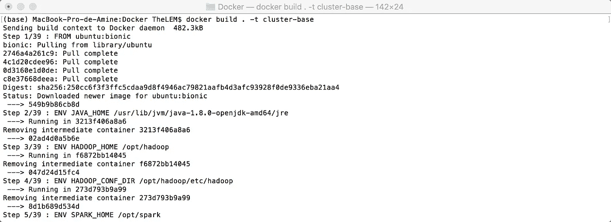

# 创建自己的微集群

> 原文：<https://medium.com/analytics-vidhya/creating-your-own-micro-cluster-5b75c1500ead?source=collection_archive---------8----------------------->

## 使用 Docker，在纱线上试验 Spark 和 Dask


在开始之前，我有一个简短的声明:这篇文章不是 Docker 教程，而是关于如何在你自己的机器上使用 Docker 创建集群的文章。如果你以前从未听说过它(这将是令人惊讶的)或者你从未有机会玩它，我强烈推荐你观看由[*Mumshad Mannambeth*](https://github.com/mmumshad)*制作的这个非常棒的入门* [*视频*](https://www.youtube.com/watch?v=zJ6WbK9zFpI) *。我还做了一个非常简短一致的* [*小抄*](https://github.com/aminelemaizi/cheat-sheets/blob/master/Docker-Cheat-Sheet.md) *你可以参考一下。*

除此之外，我假设你已经知道 Dask、Spark、Yarn 和 Hadoop 是什么了。同样，这不是一个介绍性的教程，而是一个“食谱”，可以这么说。

*如果您是为了代码而来，并且想要在自己的机器上拥有一个交钥匙的集群，请不要犹豫，在*[*my git repo*](https://github.com/aminelemaizi/micro-cluster-lab)*上使用我的代码。*

当第一次学习 Spark 或 Dask 时，我们通常在我们的本地机器上运行它们，这很方便，也很简单，但这远不是我们在许多节点上使用分布式计算的真实应用场景。有时我们只想在 Spark 或 Dask 上测试一两件事情，所以我们记得上次我们已经删除了独立的文件夹，或者我们已经丢弃了 python 虚拟环境，在那里我们已经很好地安装了 Dask 和 Pyspark，重做配置是一件非常痛苦的事情。

Docker 是一个很好的工具，可以让我们的生活变得轻松一些。关于这一点，它可以在您自己的机器上模拟“真实生活”的环境，我们将利用它的操作系统级虚拟化能力，将 Yarn、Spark 和 Dask 放在 1-Master 2-Slaves 集群上(或多或少取决于您机器的能力)。

如果您不太熟悉 Docker，您的第一反应可能是问为什么不使用许多虚拟机来完成这项工作？！在我看来，这是一个有效的问题，对此我有两个答案:首先，Docker 也进行虚拟化，但在低水平上，这意味着在资源消耗方面的高收益，更多的资源空间意味着更多的虚拟机(称为容器)，另外，Docker 的虚拟化不是“目标”，而只是运行虚拟机上包含的应用程序的一种手段，这使我想到了我的第二点，即 Docker 是一种“平台即服务”， 或者用一种更酷的方式，PaaS，这意味着存在一个一致的 API 来运行我们的容器并毫不费力地配置它们。

# 集群架构

我想象的架构是一个有三个节点的集群。一个是主节点，它不会做任何“工作”,但会作为其他节点的管理器，此外，它还会托管 web 接口(Jupyter 笔记本和 Yarn 资源管理器 UI ),我们将使用这些接口在集群上运行和检查我们的工作。另外两个节点是从节点(计算机科学有时可能很苛刻)，它们将完成繁重的工作，并执行任何我们希望它们做的计算-地图-冗余-机器-学习的事情。

如下图所示，Docker 运行在主机(用不太时髦的话来说就是您自己的计算机)内部，并将运行与我之前讨论的三个节点相对应的三个容器。这种架构取决于您的资源(您的机器拥有的 CPU 数量和 RAM 数量)，如果您愿意，您可以增加到 6 个节点，如果您的资源有限，您可以减少到 2 个节点。


一个 1 主 2 从架构，你可以看到集群被限制在 Docker

# 要使用的文件树

该[项目](https://github.com/aminelemaizi/micro-cluster-lab)将组织如下:

```
├── docker-compose.yml
├── Dockerfile
├── confs
│   ├── config
│   ├── core-site.xml
│   ├── hdfs-site.xml
│   ├── mapred-site.xml
│   ├── requirements.req
│   ├── slaves
│   ├── spark-defaults.conf
│   └── yarn-site.xml
├── datasets
│   ├── alice_in_wonderland.txt
│   └── iris.csv
├── notebooks
│   ├── Bash-Interface.ipynb
│   ├── Dask-Yarn.ipynb
│   ├── Python-Spark.ipynb
│   └── Scala-Spark.ipynb
└── script_files
    └── bootstrap.sh
```

*   **docker-compose.yml** :神奇的事情发生了，这个文件将包含 docker 用来创建整个集群、配置网络和为每个节点设置属性的所有指令集。
*   **Dockerfile** :这是 Docker 用来创建我们将用于容器的映像(OS +所需的应用程序)的文件。
*   这个文件夹将包含 Hadoop、Yarn 和 Spark 的配置文件以及 python 的需求。
*   **datasets** :该文件夹包含用于试验我们的集群的“starter”数据集。我选择了非常小的数据集来玩，记住这个集群不是为了“真正的”工作，而只是为了测试东西。
*   **笔记本**:这些是笔记本“启动器”，每一个都包含启动我们的 Scala-Spark 集群的基本命令(你说的真正的 Spark？！)、Python-Spark(对，我知道 py Spark……)和 Dask。除了这三个之外，还有一个运行 Bash 内核的笔记本，因此您可以拥有一个与命令 shell 的接口。
*   **script_files** :我会把所有要执行的 bash 脚本放在这里。现在，我只有一个名为`bootstrap.sh`的函数，它将在每次容器启动时执行。我将进一步解释它到底是干什么的。

# Hadoop、Yarn 和 Spark 的资源和预设配置

由于您拥有的资源，配置在这里非常重要。请记住，我们试图在一台机器上模拟许多节点，因此，如果您有例如 4 GB 的 RAM 和一个单独的 CPU…我认为最好不要为此费心，坚持使用您机器上运行的任何东西。但是，如果您碰巧有 16 GB 的 RAM 和 4 个或更多的内核，这将使您能够模拟一个集群，如果您手头没有的话(即使 8 GB 也可以完成这项工作，但是您必须将自己限制在一个从节点上……)。

也就是说，我将在这里介绍我用来运行这三个节点的默认配置，当然，您也可以更改它们，以适应您的需求和机器限制。

`spark-defaults.conf`(火花)

```
# We inform Spark that it has to use Yarn
spark.master                     yarn
# Client mode is important so we can interact with Spark using Jupyter
spark.submit.deployMode          client
# Spark driver and executor memory
spark.driver.memory              512m
spark.executor.memory            512m
# This has to be lower than yarn.nodemanager.resource.memory-mb (inside yarn-site.xml)
spark.yarn.am.memory             1G
```

`slave` (Yarn/Hadoop)，这里我们定义了我们的托盘的名称，我们将进一步看到这些名称是在`docker-compose.yml`文件的层次上定义的。内部 Docker DNS 设法将这些名称与它们各自的机器相匹配。

```
node-slave1
node-slave2
```

`core-site.xml` (Yarn/Hadoop)，我们在这里定义主节点的名称(“主机”)和使用 HDFS 通信的端口。在这种情况下，我的主节点名称是`node-master`，HDFS 端口是`9000`。

```
<?xml version="1.0" encoding="UTF-8"?>
<?xml-stylesheet type="text/xsl" href="configuration.xsl"?>
​
<configuration>
        <property>
            <name>fs.default.name</name>
            <value>hdfs://node-master:9000</value>
        </property>
</configuration>
```

`hdfs-site.xml` (Hadoop)，我们在这里定义一些与 HDFS 系统相关的属性。我们已经将复制的数量(`dfs.replication`)设置为等于节点的数量，在本例中，2 表示每个文件都将通过集群进行复制。除此之外，我们只是为 namenode 和 datanode 设置目录。

```
<?xml version="1.0" encoding="UTF-8"?>
<?xml-stylesheet type="text/xsl" href="configuration.xsl"?>
​
<configuration>
   <property>
            <name>dfs.namenode.name.dir</name>
            <value>/opt/hadoop/data/nameNode</value>
    </property>
    <property>
            <name>dfs.datanode.data.dir</name>
            <value>/opt/hadoop/data/dataNode</value>
    </property>
    <property>
            <name>dfs.replication</name>
            <value>2</value>
    </property>
</configuration>
​
```

`yarn-site.xml` (Yarn)，这里我们设置 Yarn 的资源消耗，并指明谁是主节点。每个从机将只使用一个内核(`yarn.nodemanager.resource.cpu-vcores`)，最大内存为 1536 MB ( `yarn.nodemanager.resource.memory-mb`)。

```
<?xml version="1.0"?>
<configuration>
        <property>
                <name>yarn.acl.enable</name>
                <value>0</value>
        </property>
        <property>
                <name>yarn.resourcemanager.hostname</name>
                <value>node-master</value>
        </property>
        <property>
                <name>yarn.nodemanager.aux-services</name>
                <value>mapreduce_shuffle</value>
        </property>
        <property>
                <name>yarn.nodemanager.resource.cpu-vcores</name>
                <value>1</value>
        </property>
        <property>
                <name>yarn.nodemanager.resource.memory-mb</name>
                <value>1536</value>
        </property>
        <property>
                <name>yarn.scheduler.minimum-allocation-mb</name>
                <value>256</value>
        </property>
        <property>
                <name>yarn.scheduler.maximum-allocation-mb</name>
                <value>1536</value>
        </property>
        <property>
                <name>yarn.nodemanager.vmem-check-enabled</name>
                <value>false</value>
        </property>
</configuration>
```

(Yarn/Hadoop)，这次是我们正在配置的 map 和 reduce 处理。

```
<?xml version="1.0"?>
<?xml-stylesheet type="text/xsl" href="configuration.xsl"?>
​
<configuration>
  <property>
      <name>mapreduce.framework.name</name>
      <value>yarn</value>
  </property>
  <property>
      <name>yarn.app.mapreduce.am.env</name>
      <value>HADOOP_MAPRED_HOME=$HADOOP_HOME</value>
  </property>
  <property>
      <name>mapreduce.map.env</name>
      <value>HADOOP_MAPRED_HOME=$HADOOP_HOME</value>
  </property>
  <property>
      <name>mapreduce.reduce.env</name>
      <value>HADOOP_MAPRED_HOME=$HADOOP_HOME</value>
  </property>
  <property>
      <name>yarn.app.mapreduce.am.resource.mb</name>
      <value>1536</value>
  </property>
  <property>
      <name>yarn.app.mapreduce.am.command-opts</name>
      <value>400</value>
  </property>
  <property>
      <name>mapreduce.map.memory.mb</name>
      <value>256</value>
  </property>
  <property>
      <name>mapreduce.reduce.memory.mb</name>
      <value>256</value>
  </property>
  <property>
      <name>mapreduce.map.java.opts</name>
      <value>200</value>
  </property>
  <property>
      <name>mapreduce.reduce.java.opts</name>
      <value>400</value>
  </property>
</configuration>
```

如果你不知道如何选择与你的资源相匹配的正确值，Cloudera 有[这篇文章](https://docs.cloudera.com/HDPDocuments/HDP2/HDP-2.6.5/bk_command-line-installation/content/determine-hdp-memory-config.html)解释了一些要使用的启发法。

# 创建基础映像

现在，我们需要一个特殊的“发行版”(在 Docker 行话中称为映像)，我们将在我们的三个容器上运行它，它必须包括必要的应用程序和配置，以便我们可以有一个包含 Python、Spark、Hadoop & Yarn 和所有朋友的小可爱操作系统！

为此，我们将把必要的指令放在名为`Dockerfile`的文件中。我们首先指定要使用的基本操作系统/映像，在我们的例子中是 Ubuntu Bionic Beaver，也称为 Ubuntu 18.04 LTS。

```
FROM ubuntu:bionic
```

之后，我们将为(将要)运行的会话定义所有必要的环境变量。注释解释了每一行的作用。

```
# showing to hadoop and spark where to find java!
ENV JAVA_HOME /usr/lib/jvm/java-1.8.0-openjdk-amd64/jre
​
# after downloading hadoop (a bit further) we have to inform any concerned
# app where to find it
ENV HADOOP_HOME /opt/hadoop
​
# same for the hadoop configuration
ENV HADOOP_CONF_DIR /opt/hadoop/etc/hadoop
​
# and same for spark
ENV SPARK_HOME /opt/spark
​
# with this we can run all hadoop and spark scripts and commands directly from the shell
# without using the absolute path
ENV PATH="${HADOOP_HOME}/bin:${HADOOP_HOME}/sbin:${SPARK_HOME}/bin:${SPARK_HOME}/sbin:${PATH}"
​
# just informing the hadoop version, this isn't really necessary
ENV HADOOP_VERSION 2.7.0
​
# if you happend to run pyspark from shell, it will launch it on a Jupyter Notebook
# this is just two fancy lines, really no need for it
ENV PYSPARK_DRIVER_PYTHON=jupyter
ENV PYSPARK_DRIVER_PYTHON_OPTS='notebook'
​
# showing pyspark which "python" command to use
ENV PYSPARK_PYTHON=python3
```

我们现在将更新操作系统；安装 Java、SSH 服务器和 Python(包括 pip 和其他依赖项)。你也可以看到我们已经安装了 wget(从 URL 下载)和 nano(访问和修改文件)，这可能看起来很奇怪，但 Docker `ubuntu:bionic`使用的基本发行版非常非常精简，只包含定义发行版本身所必需的内容。

```
RUN apt-get update && \
    apt-get install -y wget nano openjdk-8-jdk ssh openssh-server
RUN apt update && apt install -y python3 python3-pip python3-dev build-essential libssl-dev libffi-dev libpq-dev
```

现在，我们将复制映像中的需求文件，然后将它们安装在 Python 上。

```
COPY /confs/requirements.req /
RUN pip3 install -r requirements.req
RUN pip3 install dask[bag] --upgrade
RUN pip3 install --upgrade toree
RUN python3 -m bash_kernel.install
```

是时候下载 Hadoop 和 Spark 了，并将它们分别提取到特定的文件夹中。

```
RUN wget -P /tmp/ [https://archive.apache.org/dist/hadoop/common/hadoop-2.7.0/hadoop-2.7.0.tar.gz](https://archive.apache.org/dist/hadoop/common/hadoop-2.7.0/hadoop-2.7.0.tar.gz)
RUN tar xvf /tmp/hadoop-2.7.0.tar.gz -C /tmp && \
  mv /tmp/hadoop-2.7.0 /opt/hadoop
​
RUN wget -P /tmp/ [http://mirror.ibcp.fr/pub/apache/spark/spark-2.4.4/spark-2.4.4-bin-hadoop2.7.tgz](http://mirror.ibcp.fr/pub/apache/spark/spark-2.4.4/spark-2.4.4-bin-hadoop2.7.tgz)
RUN tar xvf /tmp/spark-2.4.4-bin-hadoop2.7.tgz -C /tmp && \
    mv /tmp/spark-2.4.4-bin-hadoop2.7 ${SPARK_HOME}
```

我们需要生成一个 SSH 密钥，以允许 Hadoop 和 Spark 所期望的容器之间的通信。只是为了澄清一些事情，安装 Hadoop 是运行 Yarn 和使用 HDFS 所必需的。

```
RUN ssh-keygen -t rsa -P '' -f ~/.ssh/id_rsa && \
  cat ~/.ssh/id_rsa.pub >> ~/.ssh/authorized_keys && \
  chmod 600 ~/.ssh/authorized_keys
COPY /confs/config /root/.ssh
RUN chmod 600 /root/.ssh/config
```

现在，我们将复制预设配置和`ENTRYPOINT`脚本(每次运行包含该图像的容器时将执行的脚本)。

```
COPY /confs/*.xml /opt/hadoop/etc/hadoop/
COPY /confs/slaves /opt/hadoop/etc/hadoop/
COPY /script_files/bootstrap.sh /
COPY /confs/spark-defaults.conf ${SPARK_HOME}/conf
```

公开端口以便容器可以监听它们，默认情况下它是一个 TCP 端口。

```
EXPOSE 9000
EXPOSE 7077
EXPOSE 4040
EXPOSE 8020
EXPOSE 22
```

最后，我们将复制启动器(笔记本和数据集)并指定命令作为我们映像的`ENTRYPOINT`运行，在我们的例子中，它只是运行`bootstrap.sh`脚本。

```
RUN mkdir lab
COPY notebooks/*.ipynb /root/lab/
COPY datasets /root/lab/datasets
​
ENTRYPOINT ["/bin/bash", "bootstrap.sh"]
```

`bootstrap.sh`脚本做了四件事:

*   格式化 namenode 以支持 HDFS。
*   运行 SSH 客户端。
*   检查我们是否在主节点，如果是，它将启动 Hadoop、Yarn 并运行 Jupypter(正确，因此不需要令牌或密码)。
*   启动一个空循环，这样我们的节点就可以在不终止容器的情况下重新进入。

```
#!/bin/bash
​
hdfs namenode -format
service ssh start
if [ "$HOSTNAME" = node-master ]; then
    start-dfs.sh
    start-yarn.sh
    cd /root/lab
    jupyter trust Bash-Interface.ipynb
    jupyter trust Dask-Yarn.ipynb
    jupyter trust Python-Spark.ipynb
    jupyter trust Scala-Spark.ipynb
    jupyter notebook --ip=0.0.0.0 --port=8888 --no-browser --allow-root --NotebookApp.token='' --NotebookApp.password='' &
fi
​
while :; do :; done & kill -STOP $! && wait $!
```

使用所有这些块，最终的`Dockerfile`必须是这样的:

```
FROM ubuntu:bionic
​
ENV JAVA_HOME /usr/lib/jvm/java-1.8.0-openjdk-amd64/jre
ENV HADOOP_HOME /opt/hadoop
ENV HADOOP_CONF_DIR /opt/hadoop/etc/hadoop
ENV SPARK_HOME /opt/spark
ENV PATH="${HADOOP_HOME}/bin:${HADOOP_HOME}/sbin:${SPARK_HOME}/bin:${SPARK_HOME}/sbin:${PATH}"
ENV HADOOP_VERSION 2.7.0
ENV PYSPARK_DRIVER_PYTHON=jupyter
ENV PYSPARK_DRIVER_PYTHON_OPTS='notebook'
ENV PYSPARK_PYTHON=python3
​
RUN apt-get update && \
    apt-get install -y wget nano openjdk-8-jdk ssh openssh-server
RUN apt update && apt install -y python3 python3-pip python3-dev build-essential libssl-dev libffi-dev libpq-dev
​
COPY /confs/requirements.req /
RUN pip3 install -r requirements.req
RUN pip3 install dask[bag] --upgrade
RUN pip3 install --upgrade toree
RUN python3 -m bash_kernel.install
​
RUN wget -P /tmp/ [https://archive.apache.org/dist/hadoop/common/hadoop-2.7.0/hadoop-2.7.0.tar.gz](https://archive.apache.org/dist/hadoop/common/hadoop-2.7.0/hadoop-2.7.0.tar.gz)
RUN tar xvf /tmp/hadoop-2.7.0.tar.gz -C /tmp && \
  mv /tmp/hadoop-2.7.0 /opt/hadoop
​
RUN wget -P /tmp/ [http://mirror.ibcp.fr/pub/apache/spark/spark-2.4.4/spark-2.4.4-bin-hadoop2.7.tgz](http://mirror.ibcp.fr/pub/apache/spark/spark-2.4.4/spark-2.4.4-bin-hadoop2.7.tgz)
RUN tar xvf /tmp/spark-2.4.4-bin-hadoop2.7.tgz -C /tmp && \
    mv /tmp/spark-2.4.4-bin-hadoop2.7 ${SPARK_HOME}
​
RUN ssh-keygen -t rsa -P '' -f ~/.ssh/id_rsa && \
  cat ~/.ssh/id_rsa.pub >> ~/.ssh/authorized_keys && \
  chmod 600 ~/.ssh/authorized_keys
COPY /confs/config /root/.ssh
RUN chmod 600 /root/.ssh/config
​
COPY /confs/*.xml /opt/hadoop/etc/hadoop/
COPY /confs/slaves /opt/hadoop/etc/hadoop/
COPY /script_files/bootstrap.sh /
COPY /confs/spark-defaults.conf ${SPARK_HOME}/conf
​
RUN jupyter toree install --spark_home=${SPARK_HOME}
RUN echo "export JAVA_HOME=${JAVA_HOME}" >> /etc/environment
​
EXPOSE 9000
EXPOSE 7077
EXPOSE 4040
EXPOSE 8020
EXPOSE 22
​
RUN mkdir lab
COPY notebooks/*.ipynb /root/lab/
COPY datasets /root/lab/datasets
​
ENTRYPOINT ["/bin/bash", "bootstrap.sh"]
```

现在我们需要构建我们的映像，为此我们只需在与`Dockerfile`相同的文件夹级别运行以下命令:

```
docker build . -t cluster-base
```



这里使用的图像名(`cluster-base`)与`docker-compose.yml`文件中指定的图像名匹配非常重要。

# Docker 作曲或如何让集群活起来

Docker Compose 不需要单独启动和配置每个节点，而是通过指定所有节点的特征来实现这一点，我所说的特征是指要使用的映像、要设置的主机名、要加入的网络以及您可以使用 Docker 命令行或多或少记下的任何内容。

下面是我用过的 YAML 文件，我会给它添加一些注释，这样你就能理解它的作用了。

```
version: "3.3"
# Here we will list all nodes/containers!
services:
# First container will be named node-master
  node-master:
# We will tell Docker to run the slaves first before running the Master Node
    depends_on:
      - node-slave1
      - node-slave2
# The image to be used is the image we've built before
    image: cluster-base:latest
# It explains itself, what it the container name
    container_name: node-master
# The hostname for this container
    hostname: node-master
# Connecting your terminal to the stdin and stdout stream of the container so you can see
# all the messages it outputs
    tty: true
# Ports redirection to Host
    ports:
      - "8088:8088"
      - "50070:50070"
      - "50030:50030"
      - "8080:8080"
      - "8042:8042"
      - "8888:8888"
# Linking this container to the following network and defining an alias to be used
    networks:
      cluster-network:
        aliases: 
          - node-master
# First Slave Node, same thing as previously seen
  node-slave1:
    image: cluster-base:latest
    container_name: node-slave1
    hostname: node-slave1
    tty: true
    ports:
      - "7042:8042"
    networks:
      cluster-network:
        aliases: 
          - node-slave1
# Second Slave Node
  node-slave2:
    image: cluster-base:latest
    container_name: node-slave2
    hostname: node-slave2
    tty: true
    ports:
      - "9042:8042"
    networks:
      cluster-network:
        aliases: 
          - node-slave2
# Defining a new network of Bridge type to be created
networks:
  cluster-network:
    driver: bridge
    ipam:
      driver: default
```

要运行集群并启动它，现在只需要在与`docker-compose.yml`相同的文件夹级别运行下面的命令:

```
docker-compose up
```

现在，您的集群已经启动并运行，您的 shell 上应该会显示如下内容:


你甚至可以访问 Yarn resource manager UI 来查看集群的从属节点部分(`localhost:8088/cluster/nodes`)。


现在您可以在`localhost:8888`访问 Jupyter 笔记本。您可以使用入门笔记本，开始使用 Spark (Scala 或 Python)和 Dask:


要停止集群，使用`Ctrl` + `C`，然后运行命令`docker-compose down`来完全删除容器。


就这样了，伙计们！我希望这篇文章对你有点用。

您可以关注我的 [Twitter](https://twitter.com/ALemaizi) 以便在发布新帖子时得到通知！