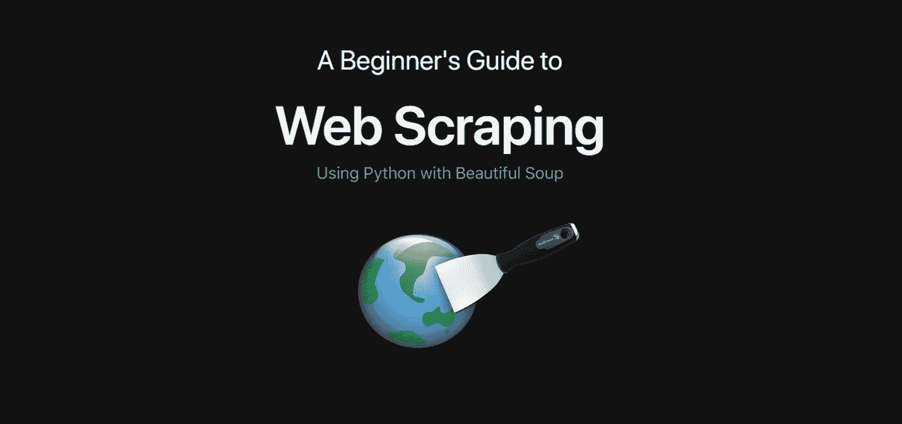

# 创建你自己的网页抓取工具

> 原文：<https://medium.com/analytics-vidhya/creating-your-own-web-scraper-for-beginners-32aa91c2db10?source=collection_archive---------12----------------------->

## 用 Python 创建网页抓取器的初学者指南

## 网页抓取简介

你有没有浏览过一个又一个网页，一段又一段地收集数据？也许你有一个家庭作业，你应该从几个国家收集信息？