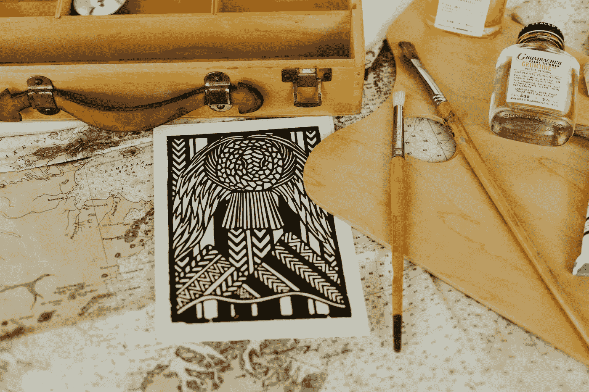
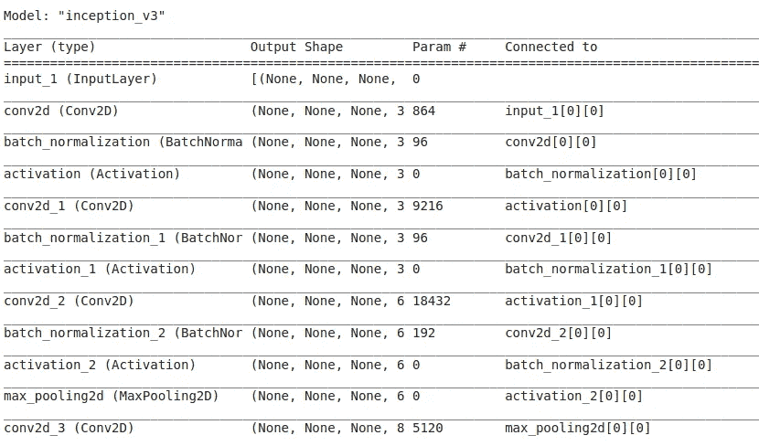
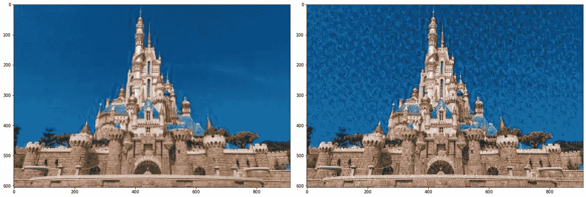

# 创造性人工智能:艺术智能

> 原文：<https://medium.com/analytics-vidhya/creative-ai-the-artistic-intelligence-deea57fdcb03?source=collection_archive---------7----------------------->

## 创造性人工智能 DeepDream 及其实现简介

> 想知道当我们输入图像时，神经网络在隐藏层中看到了什么吗？AI 有能力自己生成电影或创意绘画和图像或游戏吗？人工智能和人类一样有创造力吗？

我们将试图通过这篇博客找到这些问题的答案。:)



[阿丽娜·贝鲁斯](https://unsplash.com/@alinabelous?utm_source=unsplash&utm_medium=referral&utm_content=creditCopyText)在 [Unsplash](https://unsplash.com/s/photos/creative-ai?utm_source=unsplash&utm_medium=referral&utm_content=creditCopyText) 上的照片

## **目录**

*   介绍
*   创造性人工智能的例子
*   DeepDream 模型
*   DeepDream 的实现
*   结论

**简介**

> “创造性人工智能是人工智能的一个分支，人工智能可以像人类一样创造绘画、电影、音乐、游戏和许多其他创造性艺术。”

我们都知道人工智能在技术上发生了巨大的转变，但我们过去常常想知道人工智能是否能取代人类。随着当今机器学习趋势的增长，我们已经达到了人工智能能够自己创造艺术的阶段。

正如人类学习探索和创造事物一样，人工智能也逐渐从输入神经网络的图像中学习。例如，参考下面给出的图像。

**创造性人工智能的例子**

1.  用人工智能创造艺术

在大量数据和各种机器学习算法的帮助下，我们可以创作出令人着迷的动态创意作品。

参考这个 youtube 视频，其中展示了基本上由艺术家 Refik Anadol 创作的创造性艺术。他用创造性的人工智能创造装置和公共艺术。

2.艾首部电影预告片

IBM 的研究人员与 20 世纪福克斯公司合作，为电影《摩根》制作了有史以来第一部认知电影预告片。

3.人工智能艺术家社区

AIArtists.org 是探索人工智能对艺术和社会的影响的大型艺术家社区。

访问[AIArtists.org](https://www.AIArtists.org)获得更多使用人工智能创作的艺术作品。

## DeepDream:深入梦境！

> 什么是 DeepDream？

DeepDream 是一种计算机视觉算法，由谷歌的一名工程师 Alexander Mordvintsev 创建，该算法使用 CNN 通过算法找到并增强图像中的模式，从而创建一种梦幻般的效果。

DeepDream 是一项将神经网络学习的模式可视化的实验。DeepDream 过度解释和增强了它在图像中看到的模式。随着图片上传到网络，更多奇怪的功能将会出现。

记住，当我们还是个孩子的时候，我们习惯于在看各种各样的东西的时候解释某些形状，并试图弄清楚它是什么。同样，DeepDream 也是通过放大给定图像中的模式来做同样的事情，这种放大是基于它在训练期间被训练看到的东西。

> DeepDream 是如何工作的？

*   当你把一幅图像输入一个经过训练的人工神经网络时，神经元就会被激活。
*   深度梦算法的工作原理是试图改变输入图像，让其中一些神经元更加活跃。你可以选择哪一层中的哪一个神经元你想要激发更多，这取决于你想要提取更多的特征。
*   重复该过程，直到完全提取出特定图层所寻找的特征。
*   示例:如果某个特定图层被训练为寻找汽车，深度梦算法将不断尝试以这样一种方式更改输入图像，即无论网络中输入的是什么图像，都会开始在输入图像的基础上创建汽车的特征。这个过程一直持续到 DeepDream 观察到满意的结果。

## DeepDream 的实现

在这里，我们将把 DeepDream 应用到一个城堡的图片上，并观察结果中的图像，以更好地理解 DeepDream。

在这里，我随机拍摄了一座城堡。您也可以使用任何其他图像。

让我们开始实现:)

*   首先，导入我们处理所需的必要库。

```
import tensorflow as tf
import pandas as pd
import numpy as np
import matplotlib.pyplot as plt
from PIL import Image
```

*   这里，我们使用的是 InceptionV3 模型，它是图像数据集上的预训练模型。您可以在图像上使用任何预训练的模型。InceptionV3 与 DeepDream 算法中使用的模型非常相似。
*   预先训练的模型已经有了它们的权重，我们在程序中使用，这就是所谓的迁移学习。

```
# Load trained inceptionNet model.base_model = tf.keras.applications.InceptionV3(include_top = False, weights = 'imagenet')
```

*   查看 base_model 的层。

```
base_model.summary()
```



InceptionV3 模型摘要

如上图，模型有输入层，应用于 Conv2D，批量归一化，激活函数等。

*   加载你想美化的图像！

```
image = Image.open("/CreativeAI/disneyland/img_0.jpg")image.save("img_0.jpg")Image = tf.keras.preprocessing.image.load_img('img_0.jpg')
```

*   将图像转换成 numpy 数组。

```
# Convert to numpy array
Image = tf.keras.preprocessing.image.img_to_array(Image)
```

*   使图像正常化。

```
# Normalize the input imageImage = np.array(Image)/255.0
```

*   现在，我们将选择我们希望激活函数最大化的基本模型的层。

```
# Maximize the activations of these layers
names = ['mixed3', 'mixed5', 'mixed7']layers = [base_model.get_layer(name).output for name in names]# Create the feature extraction model
deepdream_model = tf.keras.Model(inputs = base_model.input, outputs = layers)
```

DeepDream 选择一个或多个层，并最大化其激活，以便更显著地提取该层的特征。在梦化过程中看到的特征取决于所选择的层，即较低层产生边缘或简单的图案，而较深层在图像中给出复杂的特征，甚至整个物体。

*   通过馈入我们的输入图像并查看激活“神经元输出”来运行模型。

```
activations = deepdream_model(Image)activations
```

上面的代码片段将显示层“混合 3”，“混合 5”和“混合 7”的激活。

*   定义一个计算损失的函数。损耗是所选层的激活函数的总和。它的工作原理是通过网络前馈输入图像并产生激活。然后获得这些输出的平均值和总和。

```
def calc_loss(image, model):# Convert into batch format
  img_batch = tf.expand_dims(image, axis=0) layer_activations = model(img_batch) # Run the model print('ACTIVATION VALUES (LAYER OUTPUT) =\n', layer_activations) losses = [] # accumulator to hold all the losses for act in layer_activations:
    loss = tf.math.reduce_mean(act) 
    losses.append(loss) print('LOSSES (FROM MULTIPLE ACTIVATION LAYERS) = ', losses) print('LOSSES SHAPE (FROM MULTIPLE ACTIVATION LAYERS) = ',   np.shape(losses)) print('SUM OF ALL LOSSES (FROM ALL SELECTED LAYERS)= ', tf.reduce_sum(losses)) return  tf.reduce_sum(losses) # Calculate sum
```

一般来说，我们通过梯度下降使损失最小化，但这里我们通过梯度上升使损失最大化。

*   计算输入图像的损失。

```
loss = calc_loss(tf.Variable(Image), deepdream_model)
```

*   现在，我们将计算关于图像的梯度，并将其添加到输入图像，这将增强网络看到的特征。

```
def deepdream(model, image, step_size): with tf.GradientTape() as tape:
    tape.watch(image)
    loss = calc_loss(image, model) '''call the function that                              calculate  the loss'''''' Calculate the gradient of the loss with respect to the pixels of the input image.'''
  gradients = tape.gradient(loss, image) print('GRADIENTS =\n', gradients)
  print('GRADIENTS SHAPE =\n', np.shape(gradients))''' tf.math.reduce_std computes the standard deviation of elements across dimensions of a tensor'''
  gradients /= tf.math.reduce_std(gradients)''' In gradient ascent, the "loss" is maximized so that the input image increasingly "excites" the layers.''' image = image + gradients * step_size
  image = tf.clip_by_value(image, -1, 1) return loss, image
```

*   DeepDream 函数，我们在其中计算损失，并显示相应的图像。

```
def run_deep_dream_simple(model, image, steps = 100, step_size = 0.01): # Convert from uint8 to the range expected by the model.
  image = tf.keras.applications.inception_v3.preprocess_input(image) for step in range(steps):
    loss, image = deepdream(model, image, step_size) if step % 100 == 0:
      plt.figure(figsize=(12,12))
      plt.imshow(deprocess(image))
      plt.show()
      print ("Step {}, loss {}".format(step, loss)) plt.figure(figsize=(12,12))
  plt.imshow(deprocess(image))
  plt.show() return deprocess(image)
```

*   deprocess 函数再次转换为 uint8。

```
def deprocess(image):
  image = 255*(image + 1.0)/2.0
  return tf.cast(image, tf.uint8)
```

*   加载图像，将其转换为 numpy 数组并运行模型。

```
Image = np.array(tf.keras.preprocessing.image.load_img('img_0.jpg'))dream_img = run_deep_dream_simple(model = deepdream_model, image = Image, steps = 500, step_size = 0.01)
```



原始图像和经过 100 步处理后的图像

如上所示，随着模型在不同步骤的处理，越来越多的特征将被增强，并且类似的梦化结果将被生成。

## 让我们用所有的图像制作一个视频来检验深度梦境！！

*   这个辅助函数加载一个图像，并以浮点 numpy 数组的形式返回它。

```
def load_image(filename):
  image = PIL.Image.open(filename)
  return np.float32(image)
```

*   现在，我们运行下面的代码，加载原始图像，并将其保存在一个新的文件夹中。
*   你必须创建一个名为“disneypalace”的新文件夹，并将 img_0 放入其中。
*   检查图像是否已经存在，对其进行预处理，将其应用于 deepdream 并存储结果。这种迭代发生多次，然后我们将有许多图像存储在我们的目录中。

```
import osdream_name = 'disneypalace'for i in range(0, 50):
  if os.path.isfile('/{}/img_{}.jpg'.format(dream_name, i+1)):
    print("{} present already, continue fetching the frames.".format(i+1)) else:
    # Call the load image funtion
    img_result = load_image('/{}/img_{}.jpg'.format(dream_name, i))  # Zoom the image
  x_zoom = 2 
  y_zoom = 1 '''Chop off the edges of the image and resize the image back to the original shape. This gives the visual changes of a zoom''' img_result = img_result[0+x_zoom : y_size-y_zoom, 0+y_zoom : x_size-x_zoom]
  img_result = cv2.resize(img_result, (x_size, y_size)) # Adjust the RGB value of the image
  img_result[:, :, 0] += 2  # red
  img_result[:, :, 1] += 2  # green
  img_result[:, :, 2] += 2  # blue # Deep dream model
  img_result = run_deep_dream_simple(model = deepdream_model, image = img_result, steps = 100, step_size = 0.1) # Clip the image, convert the datatype of the array, and then convert to an actual image.
  img_result = np.clip(img_result, 0.0, 255.0)
  img_result = img_result.astype(np.uint8)
  result = PIL.Image.fromarray(img_result, mode='RGB') # Save all the frames in the dream location
  result.save(r'/{}/img_{}.jpg'.format(dream_name, i+1)) created_count += 1 if created_count > max_count:
    break
```

*   你可以使用任何开源视频制作工具制作视频，我用 https://clideo.com/video-maker 的[制作了一个视频，或者你可以使用给定的代码片段制作一个视频。](https://clideo.com/video-maker)

```
import cv2
import globimg_array = []for filename in glob.glob('disneypalace/*.jpg'):
  img = cv2.imread(filename)
  height, width, layers = img.shape
  size = (width,height)
  img_array.append(img)out = cv2.VideoWriter('disneypalace.avi',cv2.VideoWriter_fourcc(*'DIVX'), 15, (910, 605))for i in range(len(img_array)):
  out.write(img_array[i])out.release()
```

我做了这个视频，从梦化的图像到原始图像，顺序相反！

梦幻般的迪士尼乐园

> 结论:
> 
> 如今，创造性人工智能正在达到新的高度，因为许多研究人员正在探索人工智能来创造各种艺术。如上所述，在创造性人工智能的帮助下，电影预告片已经发布。DeepDream 用于[扶植人民](https://en.wikipedia.org/wiki/Foster_the_People)的音乐视频《为钱而做》。
> 
> 人工智能的这一分支直到今天还没有被广泛使用，但可以广泛用于作曲、视频和其他艺术。因此，创造性人工智能为每个热衷于创造性人工智能的人打开了探索和研究的大门。

**参考文献:**

[1][https://www.tensorflow.org/tutorials/generative/deepdream](https://www.tensorflow.org/tutorials/generative/deepdream)

[https://en.wikipedia.org/wiki/DeepDream](https://en.wikipedia.org/wiki/DeepDream)

## 感谢您的阅读！祝您愉快！:)