# 信用卡欺诈检测

> 原文：<https://medium.com/analytics-vidhya/credit-card-fraud-detection-3a5eb5d5ff32?source=collection_archive---------20----------------------->

在这篇文章中，我会让你知道我们如何检测欺诈交易，无论是被盗的信用卡或其他手段。在开始真正动手之前，让我们先来了解一下什么是信用卡欺诈？

来源:-谷歌

信用卡欺诈是指有人使用你的信用卡信息以你的名义进行未经授权的购买。

如今，网上购物是一个很大的趋势，所以大多数进行网上购物的人都使用信用卡、借记卡或网上银行作为他们的支付方式，而我们不必使用实体卡，必要的是我们只需要卡号和卡的详细信息，而不需要使用实体卡。所以，这就产生了一个风险，如果有人知道你的卡的详细信息，那么他/她就可以使用你的卡进行交易，而你会在交易完成后了解交易情况。

# 目标:-

这个问题包括对过去的信用卡交易进行建模，而这些交易后来被证明是欺诈。该模型用于识别交易是否是欺诈性的。我们的目标是检测 100%的欺诈交易，同时最大限度地减少不正确的欺诈分类。

# 接下来的步骤

1.  从 Kaggle 获取数据集，点击此处。
2.  从数据中识别特征和目标。
3.  必要时进行特征缩放，或者我们可以说，如果不在适当的范围内，则对数据进行归一化。
4.  使用各种机器学习模型，这里我使用了逻辑回归，朴素贝叶斯和隔离森林。
5.  计算准确性分数，以了解我们的模型有多准确。

在整个模型中，我使用了监督机器学习算法，如逻辑回归和朴素贝叶斯，以及无监督学习技术，如隔离森林，来预测我们模型中的欺诈行为。

让我们开始动手操作:-

我用 Jupyter 笔记本作为我的 IDE。所以，让我们从导入所有必要的库和加载数据开始。

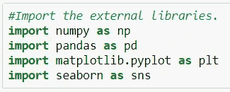

导入所有必需的库。

完成这些之后，让我们将数据集加载到 Jupyter 笔记本环境中。

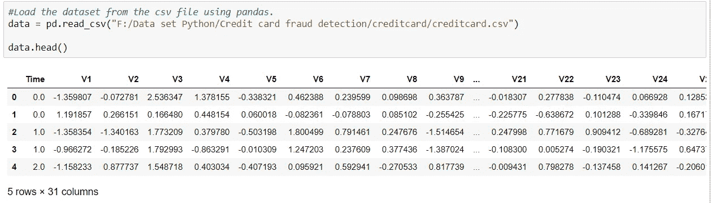

正在加载数据集。

这里 V1 到 V28 是 PCA 降维的结果，以保护用户身份和敏感特征。这里，整个数据帧在此图中不可见，但让我告诉你，我们有 V1 到 V28 列，然后我们有金额，最后我们有类，类的值为 0 和 1，这里 0 是合法交易，1 是欺诈交易。因此，在这个数据集中，我们有很少的欺诈交易，我们只需要预测。

我们已经确定了输入要素和目标变量，因此我们将它们分成两个对象“X”和“y ”,并绘制所有输入要素的直方图，以便一目了然地查看所有数据。

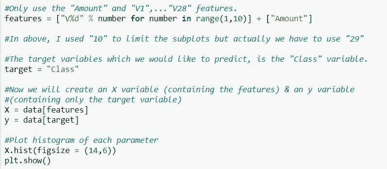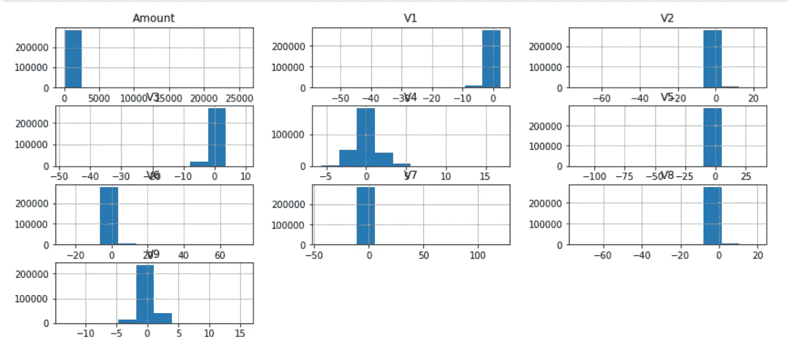

以 X 为特征，y 为目标。

在该数据集中，我们必须预测类值是 0 还是 1，因此我将要素作为 V1 到 V9 来训练数据，以便我可以预测类的值，因此我将 X 作为要素，y 作为目标，并且目标已经在上面分配。在这之后，我们将描述数据。

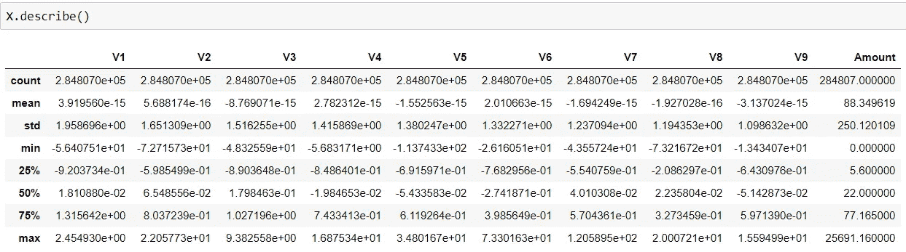

描述数据。

在上图中，你可以注意到所有的变量都不是在相同的尺度和分布上。有些变量的值范围很广(如 Amount 变量)。没有标准的正态分布数据，机器学习算法无法估计正确的输出。我们将使用 scikit-learn 中的 StandardScaler 函数来标准化我们的数据，StandardScaler 所做的是以均值为 0、标准差为 1 的方式转换数据。

# 数据清理:-

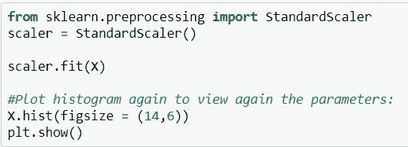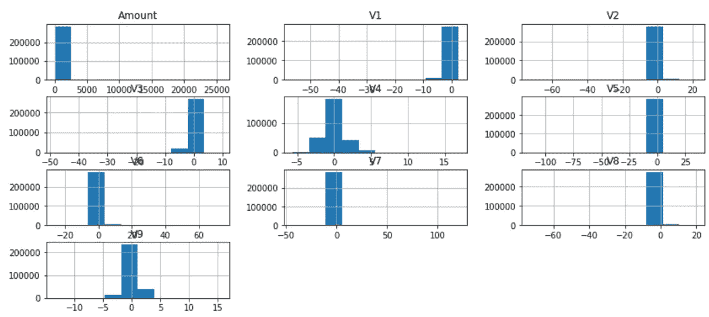

现在，我们的数据经过预处理，我们准备应用机器学习模型。

完成所有这些后，我们的数据现在可以使用模型了，所以我们将首先把数据分成训练和测试数据集。在这里，我将数据分为 70%的训练数据和 30%的测试数据。

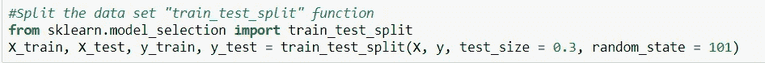

将数据分为训练和测试，训练数据占 70%，测试数据占 30%。

拆分数据后，我会使用逻辑回归模型。当因变量为二分变量(二元变量)时，逻辑回归是进行回归分析的合适方法。逻辑回归用于描述数据，并解释一个因变量与一个或多个名义变量、序数变量、区间变量或比率水平自变量之间的关系。

# 逻辑回归:-

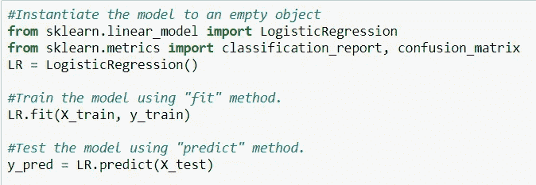

这里我在我们的数据中应用了逻辑回归。

我们将使用拟合方法训练模型并训练我们的数据，之后我们将预测输出并将其存储在变量“y_pred”中。

预测输出后，我们将看到分类报告，还会看到混淆矩阵，最后我们会看到准确性得分，这样我们就可以说我们的模型是如此准确。

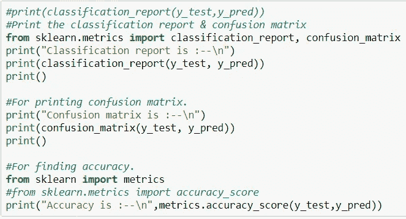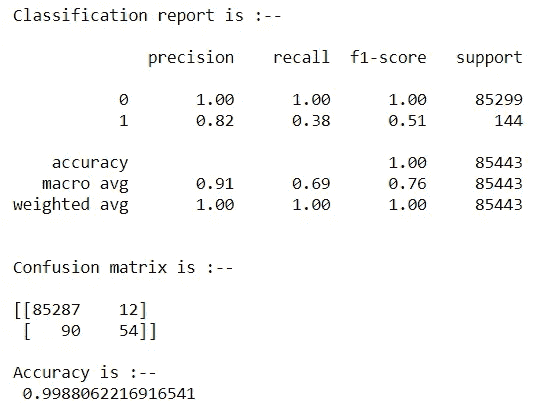

这里我们知道我们的模型有 99.88%的准确率。

正如我已经告诉你的，这个数据集有很少的欺诈交易，所以我们的模型也更容易预测输出，因此我们得到的准确率约为 99.88%。

到目前为止，我们的第一个模型已经实现，并且我们获得了准确性，我试图使事情变得简单，所以到目前为止，我们已经实现了我们的第一个模型，现在让我们继续下一个模型，即。朴素贝叶斯。因为我们已经预处理了数据，所以不需要再做一遍，我们将直接应用模型。

# 朴素贝叶斯:-

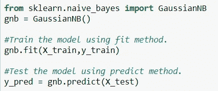

导入高斯 b

因此，到目前为止，我们已经从 sklearn.naive_bayes 导入了 GaussianNB 分类器，之后，我们将它拟合到训练数据中，并尝试预测值，然后将其存储在变量 y_pred 中。完成所有这些后，我们将再次简单地制作分类报告和混淆矩阵，最后我们还将看到该模型的准确度分数。

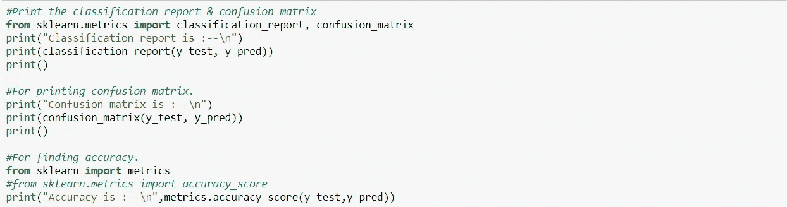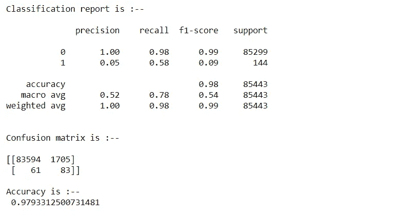

这里我们得到了大约 97.93%的准确率。

因此，从这个朴素贝叶斯我们得到了大约 97.93%的准确性，这也是很好的，但与逻辑回归相比，我们在逻辑回归中得到更准确的结果。所以到目前为止，我们可以说在这种情况下，逻辑回归是我们预测的更好的选择。

让我们看看第三个模型，隔离森林

# 隔离林:-

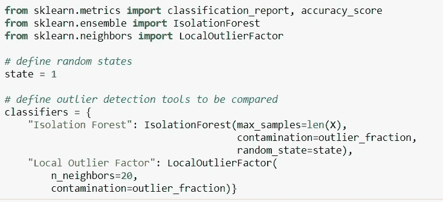

导入隔离林和本地离群因子。

这里，我们已经导入了隔离林和本地异常值因子，现在我们将仅使用这些因子来预测欺诈行为。

让我们简单理解一下本地离群因子(LOF)和隔离森林算法的含义。

# 本地异常因素(LOF)

每个样本的异常得分称为局部异常因子。它测量给定样品相对于其相邻样品密度的局部偏差。它是局部的，因为异常分数取决于对象相对于周围邻居的孤立程度。

# 隔离森林算法

IsolationForest 通过随机选择一个要素，然后随机选择所选要素的最大值和最小值之间的分割值来“隔离”观察值。

由于递归分割可以用树结构表示，分离样本所需的分裂次数等于从根节点到终止节点的路径长度。

这个路径长度，在这样的随机树的森林上平均，是常态的一个测量和我们的决定函数。随机分区为异常产生明显更短的路径。因此，当随机树的森林
共同产生特定样本的较短路径长度时，它们极有可能是异常。

因为我们已经导入了模型，所以让我们将它应用到我们的数据中，并尝试预测欺诈。

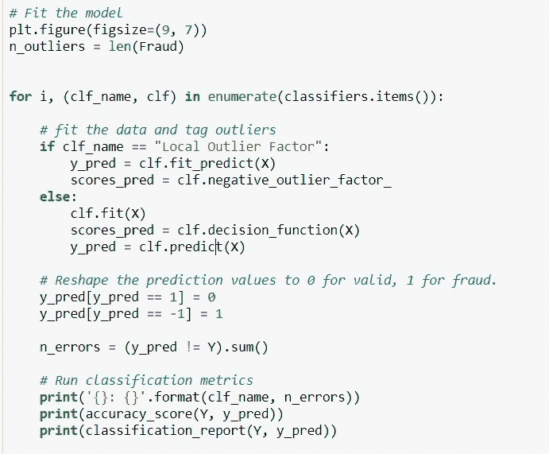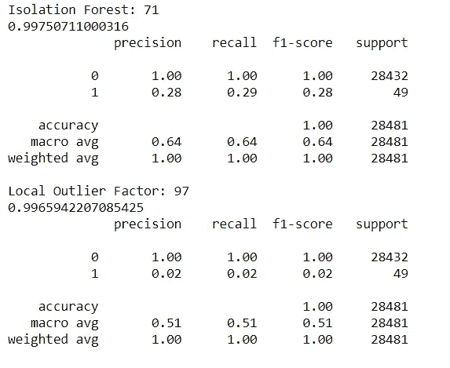

这里，我们在隔离森林中获得了大约 99.75%的准确性，在本地异常值中，我们获得了大约 99.65%的准确性，这非常接近，我们可以自豪地说，现在我们的模型训练得很好，它可以提供接近 100%的准确性。

最后，我们可以通过查看每个模型的准确度分数来得出结论，因此在逻辑回归中，我们获得了大约 99.88%的准确度，这是非常好的，之后我们应用了朴素贝叶斯，从那里我们获得了大约 97.93%的准确度，这也是好的，但与逻辑回归相比不是太好，之后我们使用隔离林获得了大约 99.75%的准确度。因此我们可以得出结论，在这整个过程中，Logistic 回归和隔离林是非常优秀的模型。

# 结束语:-

在这个项目中，我们使用了逻辑回归、朴素贝叶斯和隔离森林来预测欺诈交易。如果你在以上任何一个步骤中遇到任何问题，或者你在这两个步骤之间进退两难，那么请在评论区提问，我一定会仔细考虑你的问题，并且很乐意帮助你。

非常感谢您阅读这篇文章。

你可以从 GitHub 上查看它的源代码，点击这里。