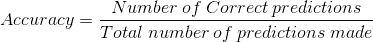

# 信用卡欺诈检测:处理阶层失衡的案例研究

> 原文：<https://medium.com/analytics-vidhya/credit-card-fraud-detection-a-case-study-for-handling-class-imbalance-f81abf997421?source=collection_archive---------6----------------------->

[来源:pixabay](https://pixabay.com/photos/credit-card-master-card-visa-card-1520400/)

我们生活在一个日常交易越来越依赖信用卡而不是现金的时代。随着交易频率的增加，欺诈活动的数量也在增加。在本文中，我们使用[这个](https://www.kaggle.com/mlg-ulb/creditcardfraud) Kaggle 数据集进行信用卡欺诈检测。让我们开始数据分析。根据数据描述，数据有 284807 行，31 列。当我们处理敏感数据时，我们有 28 个变量被 PCA 转换为数值。“时间”和“数量”是剩下的两个特征。每个事务的时间表示特定事务和数据中第一个事务之间经过的秒数。“Class”是有两个可能值的响应变量。欺诈交易的值为 1，真实交易的值为 0。数据中没有任何空值。让我们通过绘制真实交易和欺诈交易的时间和金额来进一步挖掘我们的数据。

我们只有两天的信息。因此，我们无法就欺诈活动发生频率较高的时间做出任何结论。现在，让我们分析我们的响应变量。

绘制真实和欺诈交易的金额

与真实交易相比，欺诈交易的金额非常小。金额也有偏差。让我们把数量标准化。

值得注意的是，与真实案例相比，欺诈案例太少。让我们想象一下真实和欺诈案件的数量。

类的计数图

从图中可以清楚地看出，我们的数据是高度不平衡的。数据中很少有欺诈交易。这种情况导致**阶层失衡问题**。这种情况经常出现在欺诈预测、入侵检测、垃圾邮件检测等领域。让我们更深入地研究一下这个问题。我们有 284315 笔真实交易和 492 笔欺诈交易。如果我们应用分类算法，该算法很好地了解真实情况，因为有许多数据点。由于欺诈案例太少，算法对它们了解不多。因此最终的模型可以完美地对真实案例进行分类。但是，它会将大量欺诈案例预测为真实案例。对于金融机构来说，检测所有欺诈案件非常重要。让我们看看处理不平衡数据的各种选择。

*   **数据采集**

我们知道问题的根本原因是我们没有足够的欺诈案件数据。一个好的选择是改进数据收集方法，以便我们能够获得更高质量的数据。不幸的是，数据收集不会帮助我们发现欺诈，因为我们知道，在现实生活中，欺诈交易只是所有真实交易的一小部分。

*   **绩效指标**

模型的性能通常用精确度来评估。

现在，让我们执行分类并分析模型的性能。

我们对数据进行了分类，并使用准确度和混淆矩阵分析了性能。我们的模型有 99.8%的高准确率。但是，从混淆矩阵中可以清楚地看出，通过正确地预测大量真实交易来获得高准确度。只有 27 个欺诈交易被正确分类。有 69 起欺诈案件被错误地归类为真实案件。这将导致信用卡公司的巨大损失。所以，在处理不平衡数据时，我们不能依赖准确性。这种情况被称为**准确性悖论**。

> *“这是这样一种情况，你的准确性度量告诉你有极好的准确性(如 90%)，但准确性只是反映了底层的类分布。*——[机器学习掌握度](http://machinelearningmastery.com/tactics-to-combat-imbalanced-classes-in-your-machine-learning-dataset/)

让我们看看一些流行的性能评估指标。**混淆矩阵**是一种特定的表格布局，允许算法性能的可视化。混淆矩阵为我们提供了 4 个重要的衡量标准。真阳性，真阴性，假阳性和假阴性。在我们的例子中，假阴性是模型性能的良好指示。假阴性是被错误地预测为真实交易的欺诈性交易。如果我们有大量的假阴性，我们应该优化或改变模型。我们可以从混淆度量中计算出几个其他的度量。让我们来看看精确度、召回率和 F1 分数。 **Precision** 是我们的模型的精确性的度量。精度是真阳性的数量除以真阳性和假阳性的数量。换句话说，它是正面预测的数量除以预测的正面类值的总数。低精度也可能表示大量的误报。

**回忆**定义了我们模型的完整性。召回是真阳性的数量除以真阳性的数量和假阴性的数量。换句话说，它是测试数据中正面预测的数量除以正面类值的数量。低召回率表明有许多假阴性。

**F1 得分**是精确度和召回率的调和平均值。当我们有精确和召回的完美值时，我们得到完美的 F1 值 1。

对于信用卡公司来说，发现所有的欺诈案件是非常重要的。即使算法预测一些真实的案例是欺诈性的，公司也可以使用额外的安全措施来确认交易是真实的。但是，大量的误报会导致顾客满意度下降。因此，我们必须确保我们的模型具有高召回率和相当好的精确度。F1 分数的高值确保了我们在精确度和召回率之间的平衡。

*   **重采样技术**

抽样是处理不平衡数据的好方法。我们以这样的方式改变数据集，使得模型获得平衡的数据作为输入。采样有两种类型——欠采样和过采样。

欠采样的思想是删除过采样类的一些实例，以获得类等价。如果您有一个非常大的数据集，尝试欠采样是一个很好的方法。我们必须确保不会因为采样不足而丢失任何相关信息。

过采样使用未充分代表的类的副本来获得平衡的数据。在我们的例子中，我们添加欺诈类的副本，以便我们得到相同数量的真实和欺诈案例。这个新的数据集作为分类算法的输入给出。如果您正在处理一个小数据集，应用过采样是一个很好的步骤。

**综合少数过采样技术(SMOTE)** 是一种非常流行的过采样技术。SMOTE 技术生成新的合成少数类数据，用于训练模型。它选择在特征空间中接近的少数类数据点，并在所选数据点之间画一条线。在沿着这条线的一点上产生一个新的样本。该程序用于创建所需数量的少数类合成样本。这种方法是有效的，因为来自少数类的新合成样本在特征空间上相对接近现有的少数类数据。这种方法的一个普遍缺点是创建合成样本时没有考虑多数类，如果这些类有很强的重叠，可能会导致不明确的样本。**确保在采样前分割数据。现在，让我们应用 SMOTE 技术并分析性能。**

很明显，采用 SMOTE 技术的 linearSVC 性能更好。假阴性已经下降到 27，这增加了模型的召回。

*   **基于树的算法**

我们可以尝试不同的算法，比较模型的性能。基于树的分类器通常适用于不平衡数据。因为基于树的模型通过从 if/else 语句的层次结构中学习来工作，所以它们从所有的类中学习。随机森林是一种使用多个决策树的集成学习方法。随机森林中的每个决策树执行分类。分类的最终输出由投票决定。各个树是不相关的，并且一个树的错误由其他树通过投票来纠正。现在，让我们应用随机森林分类器并评估性能。

从混淆矩阵中可以注意到，该模型对于这种不平衡的数据工作得很好。我们已经获得了相当好的精确度、召回率和 F1 分数。

**结论**

在本文中，我们讨论了处理不平衡数据集的不同方法。数据收集方法有助于平衡某些领域的数据。我们可以使用 ROC 和 precision recall 曲线等其他指标进行性能评估。SMOTE 和决策树算法在处理不平衡数据时非常有用。取样时，我们也可以尝试 1:1 以外的比率。也有 SMOTE 的变体可以提供更好的性能。我们可以尝试 ADASYN 对数据进行采样。

**参考文献**

*   [https://machine learning mastery . com/tactics-to-combat-unbalanced-classes-in-your-machine-learning-dataset/](https://machinelearningmastery.com/tactics-to-combat-imbalanced-classes-in-your-machine-learning-dataset/)