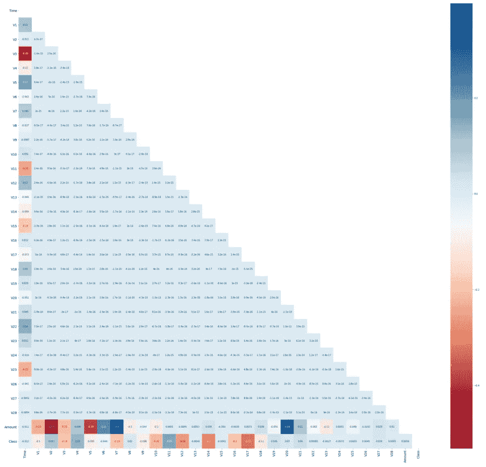
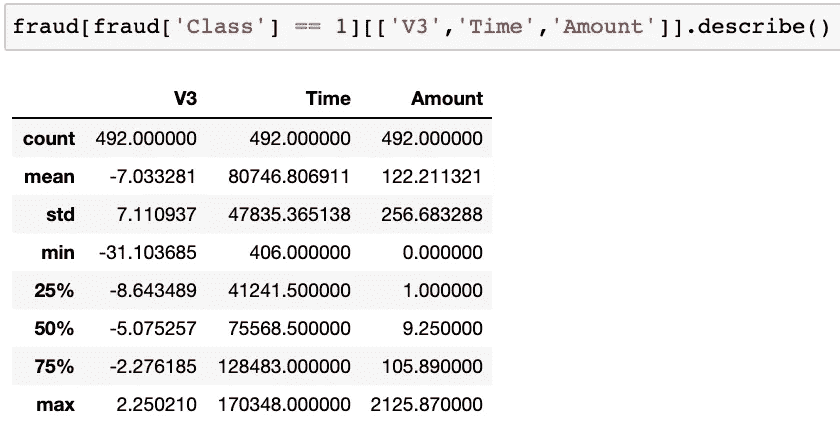
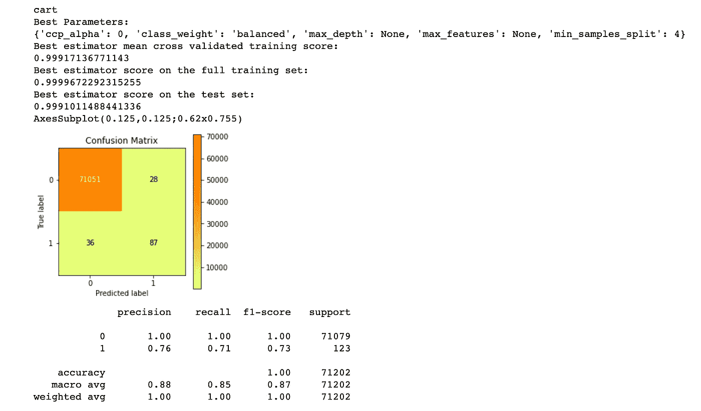
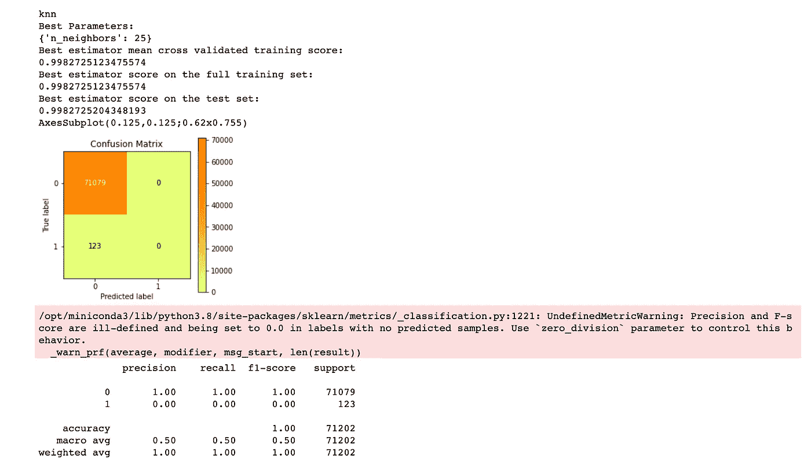
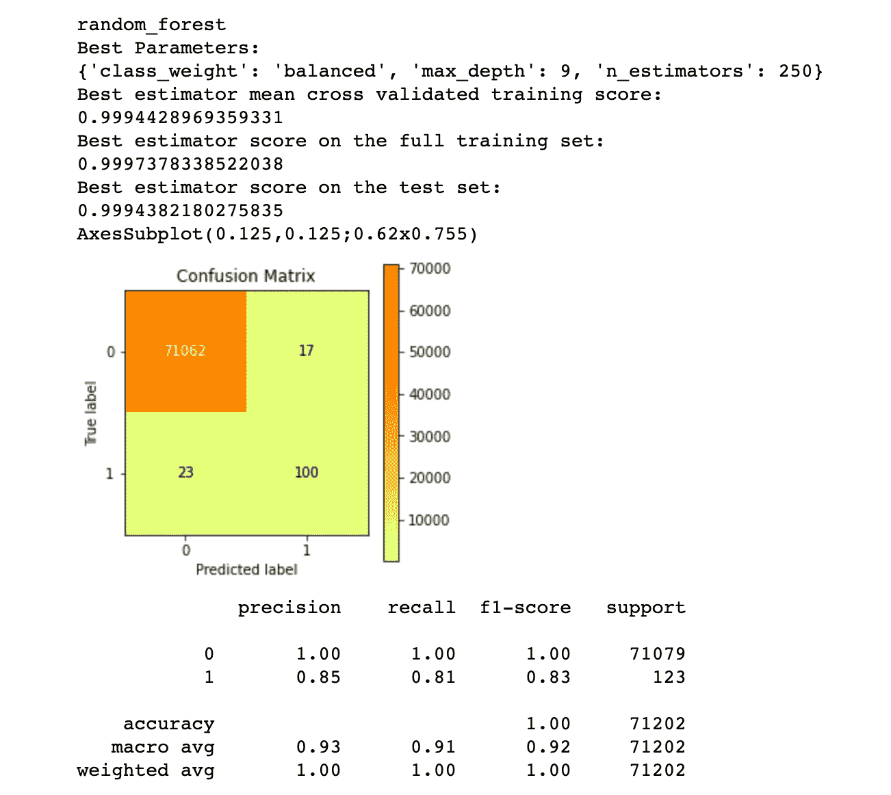
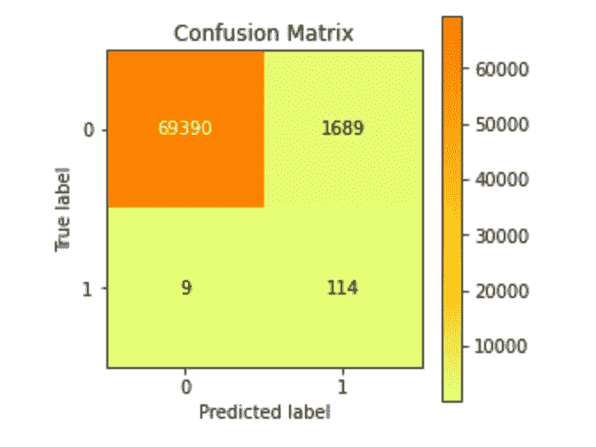

# 信用卡欺诈检测。阶级不平衡的练习。

> 原文：<https://medium.com/analytics-vidhya/credit-card-fraud-detection-an-exercise-in-class-imbalance-c4b8fd5ba603?source=collection_archive---------16----------------------->


> ‘罪犯在社会理解的放纵中茁壮成长’—亨利·杜卡德(拉斯·阿尔·古尔)

这就是我为这个数据科学项目输送的能量。要发现欺诈，你必须首先了解它为什么会出现..

不完全是。那太过分了。真的很过分..

(*清嗓子*)还有许多其他方法可以检测欺诈，我将在本文中深入探讨。检测欺诈的想法是因为我想更深入地了解数据集中的阶级不平衡。类别失衡是指我们数据中的某个类别(在这种情况下是实际欺诈交易)被过度代表。

这很直观。欺诈经常发生，但从整体来看，它只占总交易的一小部分。那么，我们如何创建能够检测欺诈交易的分类模型呢？

# 数据集:

在这个项目中，我将使用 2013 年 9 月信用卡交易的匿名数据集。我们的数据集中有 30 个特征，其中 28 个都是使用主成分分析创建的，以保护个人信息。这意味着我们无法对变量本身做出更多的推断。另外两个变量是“时间”和“数量”


快速浏览一下我们的数据帧的头部。

总之，我们有 284，807 行数据可用，没有空值。这为我们节省了一些清理数据的时间，也意味着我们可以直接投入工作。

# EDA:

由于我们没有太多关于我们的变量是什么以及它们如何直观地与信用卡交易相关联的信息，我们需要看看数据可视化是否可以帮助我们理解某些关系和趋势。

## **关联热图:**



除了在时间和数量上有一些更强的相关性，这里没有真正的发现。

## **分析个人特征:**

我想利用这一部分来发现是否有任何明显的单独的列可以帮助未来的特性工程。



测试 V3，所有欺诈交易的时间和金额。我无法从这个数据框架中得出任何明显的结论。

让我们来看看个别数据点。


测试所有欺诈交易的 V5、时间和金额。有意思的是，1 下有 2 笔交易(分别为 274，382 和 280，143)。

可视化箱线图，以查看各种特性的类别分布差异。


V10 和 V14 对于欺诈交易(类别 1)具有一些可见的分布差异和异常值，而其余的则不那么明显..

## 移除异常值:

我有一个内部辩论，以消除离群值或没有。在阅读了大量关于阶级不平衡问题的文章后，我得出结论，我们不希望信息丢失，因为这会影响我们未来模型的准确性。从标准的第 25 和第 75 百分位范围改变上述箱线图的阈值可以改变我们分析“极端”案例的方式，这可能是发现欺诈交易的关键。

# 建模:

我将目标变量 Class 设置为 y，将其余列设置为我们的模型输入 x。然后，我将其分为训练集和测试集，测试集中有 25%的数据用于训练我们的模型。最后，我标准化了这些特征，因为我相信这是一个很好的实践(关于标准化 PCA 变量的真实后果的研究没有在构建机器学习模型中产生任何明显的问题，所以我继续这个决定)。

接下来，我对我们的数据运行了以下模型:

1-物流回收

2-决策树分类器

3-kneighbors 分类器

4-随机森林

我们数据的基线分数是:

```
0    0.998273 (Normal transactions)
1    0.001727 (Fraudulent transactions)
```

在这一点上应该清楚的是，我们不会根据分数来评估我们的模型的能力，而是专注于回忆和敏感性。

# 召回、敏感度和成本敏感分类:

一个简短的说明。

当处理不平衡的数据时，通常好的做法是降低准确性，而注重回忆(敏感度)。

为什么？

好吧，假设我们的模型有着惊人的 99.8%的准确率，作为一个分数，这绝对是惊人的。然而，这基本上是我们的基线分数。无论如何，我们应该对 99.8273%的目标进行准确分类。这就是我们关注回忆(敏感度)的原因。

召回说明了正确分类的数量除以该类别中值的总数。就这个项目而言，recall 告诉我们有多少欺诈交易被我们正确地识别为欺诈交易。这就是目标。

使用分类模型和不平衡数据集时，另一个重要的关键领域是了解正确或错误分类正类(欺诈)的成本。

我们是宁愿我们的模型错误地预测太多的交易是欺诈性的，还是相反？在这一点上，我可以假设我们中的大部分人都经历过银行打来的电话，询问我们最近的交易是否是欺诈性的。这是因为银行对假阳性比对假阴性宽容得多。直觉上，这很合理，不是吗？如果他们的模型倾向于假阴性而不是假阳性，那么银行在保护用户账户方面将花费更多。对于银行来说，打电话给客户并验证交易是一个简单且相当便宜的过程，而撤销信用卡上的交易并可能向客户发送一张新卡的成本相当高。

# 处理不平衡的数据:

有许多方法可以处理不平衡的数据集。以下是我考虑过的一些策略示例:

1- SMOTE(合成少数过采样技术)

2-过采样少数类

3-欠采样多数类

以上每种采样技术都有许多优点和缺点。SMOTE 最大的问题之一是它没有考虑其他类的邻近例子。过采样可能导致过拟合，因为它复制了少数类，而欠采样可能会消除一些重要信息。

我没有考虑每种方法的利弊，而是决定尝试之前在埃姆斯住宅数据集上尝试过的方法，将每个模型的“class_weight”参数改为“balanced”这实质上是衡量每个类中数据的比例，并相应地重新平衡这些类。

# 结果:

我创建了一个使用时间最长的函数:

为 GridSearch 添加参数:

## 逻辑回归:

逻辑回归在分类问题上的灵活性和表现总是让我吃惊。正如所料，它也产生了一些相当不错的结果。


一个伟大的结果，以尽量减少假阴性，但大量的假阳性。是你巴克利吗？

## 决策树分类器:

在处理假阳性时，决策树比我的逻辑回归略好，但也使我的假阴性结果增加了 300%。



回忆分数低于逻辑回归

## KNeighbors 分类器:

一个似乎只关注准确性而非回忆性的模型。它预测 0 欺诈



## 随机森林:

随机森林似乎有最干净的结果，精度高，更重要的是，召回分数。然而，回忆分数不与逻辑回归竞争。



23 太多的假阴性。比我们最好的模特多 12 个。

作为我第一次迭代结果的结果，我想进一步探索逻辑回归，并尽我所能优化它。这让我扩展了我们网格搜索的参数，看看是否会对结果产生任何显著的变化。

## 逻辑回归(进一步优化后):



整个训练集中现在只有 9 个假阴性。虽然我有大量的误报，也没有真正了解银行评估某些欺诈交易(正确或不正确)的成本，但我的第一印象是，我新优化的逻辑回归模型是前进的方向。

# **结论:**

欺诈检测是数据科学的一个领域，可以深入到您允许的深度，直到您达到几乎完美的检测。我可以使用其他模型，探索 SMOTE、采样技术和进一步的特征工程来改善结果和回忆分数。

这个项目的目的是说明一个人可以处理不平衡数据集的方法，并关注将焦点从准确性转移到回忆的“真实世界”的后果。

简而言之，下次我接到任何一家银行的电话时，我一定会问他们更多的问题，为什么他们会打电话给我，并假设某笔交易是欺诈。我邀请你也这样做。就把这篇文章发给他们吧，我相信他们不会生气的..对吗？

— — —

[GitHub](http://github.com/xzknx) | [LinkedIn](https://www.linkedin.com/in/xazainkhan/)