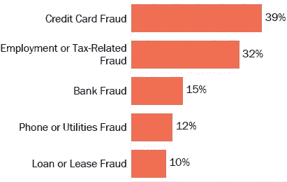

# 信用卡欺诈检测:神经网络与异常检测算法

> 原文：<https://medium.com/analytics-vidhya/credit-card-fraud-detection-c66d1399c0b7?source=collection_archive---------2----------------------->

# **摘要**

在数据挖掘中，异常检测是指搜索或扫描数据集中不匹配或不符合预期模式、趋势或其他数据点的数据点、项目或记录。因此，大多数时候这些数据点或记录被认为是缺陷、异常值、错误或欺诈。各种机器学习异常检测算法提高了检测这些异常值的速度。这些异常检测算法用于在检测异常值的同时检测入侵，并且还可以防止攻击、缺陷、故障等。各种公司、组织或机构采用简单而有效的方法来适应和实现这些算法，以检测和分类这些异常。机器学习算法可以从数据中学习，并根据这些数据进行预测。因为基本的机器学习涉及从数据中学习和预测数据，但是异常检测算法专门学习或处理这些异常值。它提供了一种基于初始大量特征的异常检测和分类的替代方法。异常检测或异常值检测是对不相似的数据、记录或观察结果的识别，这些数据、记录或观察结果通过与大多数数据显著不同而引起怀疑。

# **简介**

信用卡欺诈是一种严重的全球性问题或犯罪，通过使用信用卡或借记卡等支付卡实施欺诈。这些欺诈者的目的是在不付款的情况下获取商品，或者从账户中获取未经授权的资金。信用卡诈骗也会导致身份盗窃。根据一些报告和统计数据，身份盗窃率在 2008 年稳步上升了 21%。然而，信用卡欺诈，这种导致身份盗窃的犯罪，在所有身份盗窃投诉中所占的比例多年来一直在下降。虽然只有 0.1%的持卡人意识到信用卡诈骗。由于欺诈交易是大额交易，这些信用卡欺诈导致了巨大的财务损失。1999 年，120 亿笔交易中有 1000 万笔被证明是欺诈性的。此外，每 10，000 个活跃账户中有 4 个是欺诈性的。当前的欺诈检测系统只能防止 1%的所有交易的 1/12，这仍然会导致数十亿美元的损失。

# **方法论**

这个项目的主要方面是开发一个最适合的算法，以找到异常值或欺诈的情况下，信用卡。我们将实现几种机器学习和深度学习算法并进行比较，选择最佳算法。

我们将实现如下算法:

*   神经网络
*   隔离森林
*   OneClassSVM
*   局部异常因素
*   基于密度的噪声应用空间聚类

为此，我们使用了一个现有的数据集。该数据集包含不同持卡人的交易信息。数据集由大约 300，000 条记录组成，其中只有大约 500 名欺诈者。因此，这表明数据集是高度不平衡的，因为正类或欺诈仅占所有交易的 0.172%。所有特征列都是数字，这是 PCA 变换的结果。因此，它们的值范围从-1 到 1。特征列 V1、V2、V3… V28 是作为 PCA 变换的结果而获得的。时间和金额等列尚未转换。要素类列是包含值 0(正常情况)和 1(欺诈)的分类变量。

对于数据集 [***点击此处***](https://drive.google.com/file/d/1dq3k5Lyc_KaVRXVxWX9cmkUhBAZNlCiP/view)

## **实现**

## **1。人工神经网络:**

ANN 是深度学习的概念，使用 Keras 实现(在这种情况下)。人工神经网络是由神经元组成的。第一层或输入层是输入神经元，由每个客户的交易和金额组成。隐含层由权重、偏置和激活函数组成。我们可以添加尽可能多的隐藏层来调整性能。在这种情况下，我们使用 3 层。输出层是我们得到分类输出的最后一层。输出为 1 或 0，其中 1 表示欺诈情况，0 表示正常情况。

1)数据处理:

用于数据预处理的库:Pandas、NumPy

应用的操作:以缩放、PCA 为特色

删除的列:时间

2)可视化:

用于可视化的库:Matplotlib

类别列的直方图

类别 0: 284315 类别 1: 492

类列的计数图

*   类别和标准化金额列的 Cat 图

类别列散点图

3)模型(神经网络):

用于神经网络的框架:Keras

*   模型参数:

*   模型摘要:

*   模型编译:

4)模型评估:

用于模型评估的库:混淆矩阵、分类报告

准确度得分:

预测病例的准确率为 99%，成本为 0.4%

*   混淆矩阵:

*   分类报告:

5)最终报告:

代码行数:80

源代码存储器:108 kb

耗时:6 分 16 秒 46 (6 分 16 秒 46 纳秒)(在不同的系统中可能会有所不同)

预测正常病例的准确率:99%

预测异常值的准确率:76%

6)源代码:

对于 ipynb 文件， [***点击此处***](https://drive.google.com/file/d/1L_kJ-0Vd-75i2p24z-wAesYbz7xwCANA/view?usp=sharing)

*   将它放在 anaconda 的主目录中，并使用 Jupyter Notebook 运行该文件。

## **2。异常检测算法**

异常检测算法用于检测或识别与预期趋势和行为不同的异常模式。这些情况被称为异常值。它已用于商业领域，从入侵检测(识别网络流量中可能预示黑客入侵的奇怪模式)到系统健康监控，如在 MRI 扫描中检测恶性肿瘤，还有助于信用卡交易中的欺诈检测，以及操作环境中的故障检测。

1)数据处理:

用于数据处理和操作的库:Pandas，Numpy

我们将把数据集分成 3 部分——正常异常值、正常训练、正常测试

2)可视化:

使用的库:Matplotlib

*   金额与交易

3)模型实现:

**a)隔离森林**:隔离森林是一种树算法，它通过随机划分来检测异常，而不是像决策树一样基于信息增益。分区是通过随机选择一个要素，然后在该要素的最大值和最小值之间随机创建一个分割值来创建的。我们继续创建分区，直到我们隔离所有点。在大多数情况下，我们还对树的分区数/高度设置了限制。

*   用于模型构建的库:来自 sklearn.ensemble 的隔离森林
*   使用的超参数及其值:

评估和结论:

*   预测测试用例的准确率:85%
*   预测异常值的准确率:90%
*   编译时间:1 分钟
*   源代码内存:70 kb

**b)局部离群因子:**它是一种异常检测无监督算法，计算给定数据点相对于其邻居的局部密度偏差。它将数据点或记录识别为异常值，这些异常值具有比它们的邻居低得多的密度。当 LOF 用于异常值检测时，它没有预测、决策函数和分数样本方法。所考虑的邻居数量(参数 n_neighbors)通常被设置为 1)大于一个聚类必须包含的样本的最小数量，使得其他样本可以是相对于该聚类的局部异常值，并且小于可能是局部异常值的邻近样本的最大数量。

*   用于实现算法的库:来自 sklearn.neighbors 的 LocalOutlierFactor
*   使用的超参数和值:

评估和结论:

*   预测病例的准确率:89%
*   编译时间:35 分钟
*   源代码内存:70 kb

**c)OneClassSVM:** 一类支持向量机是一种无监督的学习算法，只在一类上训练。这个模块在您有很多“正常”数据而没有很多您试图检测的异常情况的情况下特别有用。SVM 模型基于通过尽可能宽的间隙将训练样本点分成单独的类别，同时惩罚落在间隙错误一侧的训练样本。然后，SVM 模型通过给缺口的一侧或另一侧分配点来进行预测。在单类学习中，我们只在正类数据集上训练模型，并从中做出判断

用于实现算法的库:来自 SVM 的 OneClassSVM

使用的超参数和值:

评估和结论:

预测测试用例的准确率:45%

预测异常值的准确率:91%

耗时:30 分钟

源代码内存:70 kb

源代码:

*   对于 ipynb 文件， [***点击这里***](https://drive.google.com/file/d/1c-rMPVwvgH_luM8Cuh_QSiwKo3m_8E0e/view)
*   将它放在 anaconda 的主目录中，并使用 Jupyter Notebook 运行该文件

**d)DBSCAN:** 对有噪声的应用进行基于密度的空间聚类。DBSCAN 是一种使用聚类的异常检测算法。在这种方法中，我们计算点之间的距离(欧几里德距离或其他距离),并寻找远离其他点的点。DBSCAN 采用自下而上的方法，考虑那些相互接近的数据点。包含少量点的聚类被视为异常值。DBSCAN 以简化的形式检测时间序列上的异常值。我们将每个主机视为 d 维中的一个点，其中 d 是时间序列中元素的数量。在计算数据点之间的距离之后，形成聚类，并且不在最大聚类中的数据点将被认为是异常值。

*   用于实现算法的库:sklearn.cluster 中的 DBSCAN
*   使用的超级参数和值:

评估和结论:

*   混淆矩阵:

*   分类报告:

*   预测所有病例的准确率:99%
*   预测异常值的准确性:0%
*   源代码内存:28 kb
*   耗时:6 分钟

源代码:

*   对于 ipynb 文件， [***点击这里***](https://drive.google.com/file/d/1_IN35KAHLdvUMnonTd2VKmHTsYIOpVvh/view)
*   将它放在 anaconda 的主目录中，并使用 Jupyter Notebook 运行该文件

# **结论**

已经在相同的数据集上实现了几种算法来检测信用卡欺诈。在预测正常情况和异常值或欺诈的基础上，对所有算法的准确性进行了分析和比较。我们实现了一种不同类型的算法，其中包括深度学习的神经网络，异常检测算法，如隔离森林，OneClassSVM，局部离群因子，监督算法，如 DBSCAN。这样做是为了达到这一目的的最佳方法。

通过分析，我们知道三层神经网络和 DBSCAN 可以准确预测正常情况，准确率为 99%，但在预测异常值时，它们不如异常检测算法好。隔离森林和 OneClassSVM 算法在预测异常值时给出了令人印象深刻的 91%的准确度，但是在预测正常情况时，它们与神经网络相比具有较低的准确度。在耗时的情况下，神经网络和隔离，森林算法是非常令人印象深刻的。将来，这种类型的算法可以用于不同的情况。为了获得更好的性能，我们可以改变神经网络层的属性以获得更好的结果。