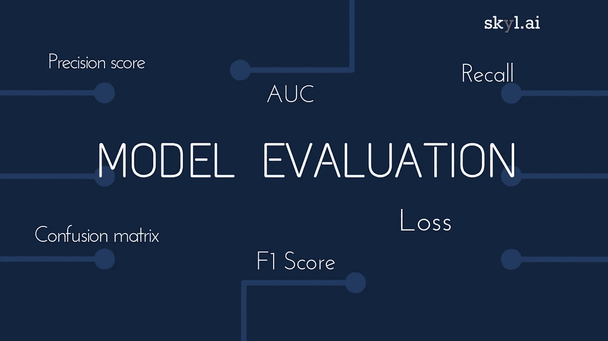

# 信用卡欺诈检测:为模型选择正确的度量标准

> 原文：<https://medium.com/analytics-vidhya/credit-card-fraud-detection-in-depth-study-evaluating-the-classification-model-a3680a5a5897?source=collection_archive---------3----------------------->

构建有效模型的主要部分是评估模型。最常用的衡量标准是“准确性”。高精度并不意味着模型在所有情况下都表现得更好。它并不总是被认为是准确的，因为在某些情况下，如不平衡的类数据集，它有时会产生误导。

skyl.ai