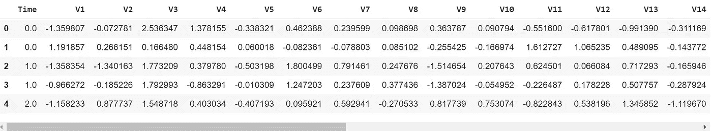
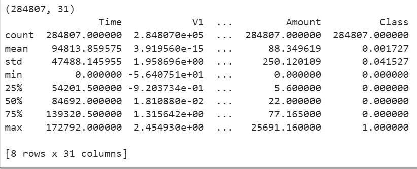
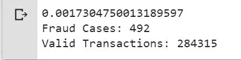
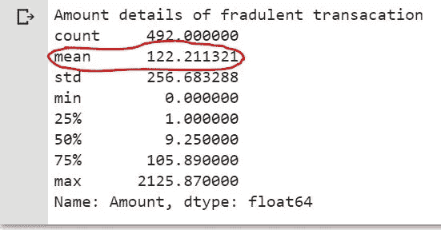
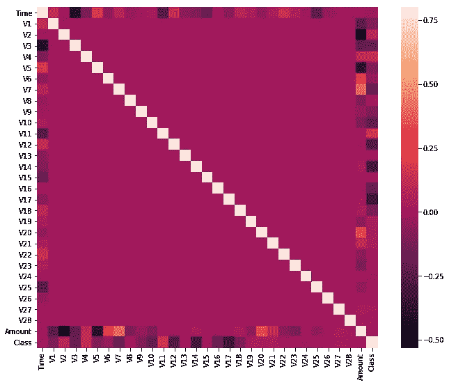
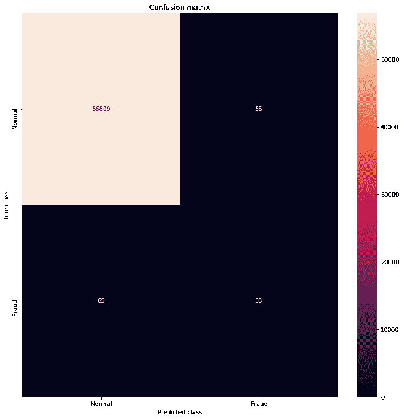
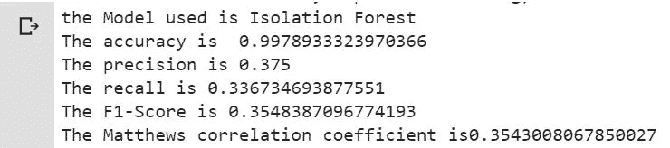
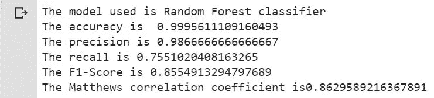
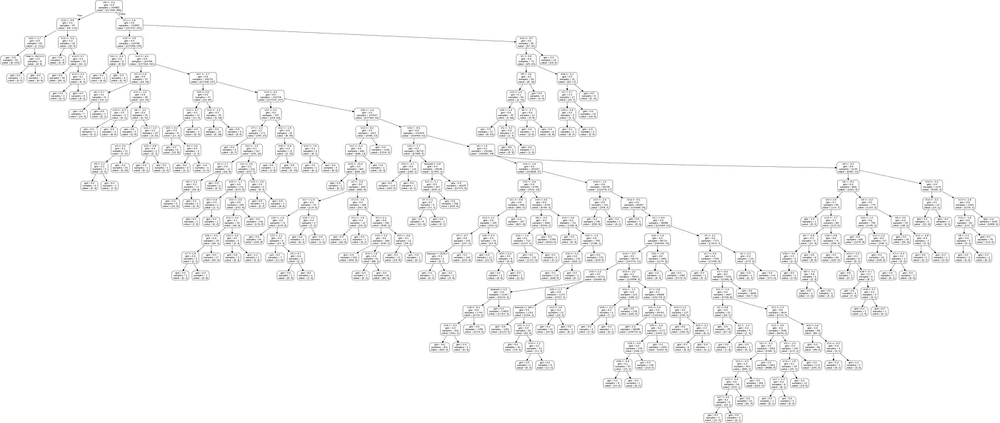
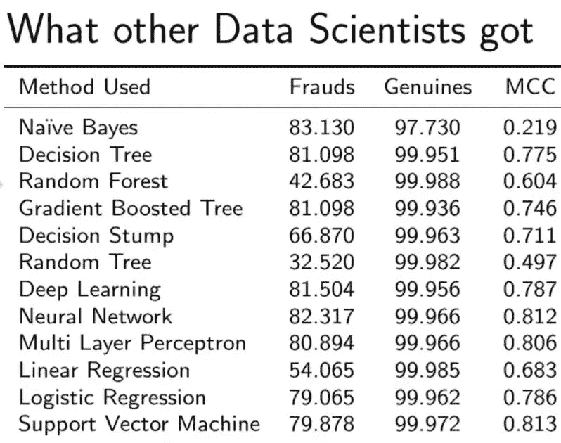

# 使用 Scikit Learn 在 Python 中进行信用卡欺诈检测。

> 原文：<https://medium.com/analytics-vidhya/credit-card-fraud-detection-in-python-using-scikit-learn-f9046a030f50?source=collection_archive---------0----------------------->

# 介绍

【注:“编码者”，来看机器学习算法的可以直接跳转代码】

我已经厌倦了所有我收到的关于我的信用卡被使用的确认信息，如果不是我，我会要求回复。不仅仅是信用卡，任何在线支付媒介，他们总是用他们疯狂的确认信息来烦你。我有时会想，为什么他们不能被说服，在确实有可疑的事情发生的时候给我发信息。我打赌你也是。但信用卡欺诈是政府面临的最大问题之一，涉及的金额通常非常巨大。所以我们来看看这类服务商面临的挑战是什么。我们采取了什么策略来解决这个巨大的问题，为什么你会如此频繁地被这些信息骚扰？


特征图像

## 信用卡诈骗是如何发生的？

一些最常见的可能发生方式是:

*   首先，也是最明显的，当你的**卡的细节**被其他人**监督**时。
*   当你的**卡丢失或被盗**时，拥有它的人知道如何处理事情。
*   **假电话**电话说服你分享细节。
*   最后，也是最不可能的一点是，对银行账户细节的高级黑客攻击。

## 信用卡欺诈检测面临的主要挑战是:

*   **每天都要处理大量数据**，模型构建必须足够快，以便及时应对骗局。
*   **不平衡的数据**即大多数交易(99.8%)不是欺诈性的，这使得检测欺诈性交易变得非常困难
*   **数据可用性**因为数据大多是私有的。
*   **分类错误的数据**可能是另一个主要问题，因为并非所有欺诈交易都会被发现和报告。
*   最后但并非最不重要的一点是，**骗子针对模型使用的适应性技术**。

## 如何应对这些挑战？

*   使用的**模型**必须**足够简单快速**以检测异常情况并尽快将其归类为欺诈交易。
*   可以通过适当地使用一些方法来处理不平衡，我们将在下一段中讨论这些方法
*   为了保护用户的隐私，可以减少数据的维度**。**
*   **至少为了训练模型，必须采用一个更可信的来源来双重检查数据。**
*   **我们可以使模型**简单易懂**，这样当骗子只需稍加调整就能适应它时，我们就可以部署一个新的模型。**

## **处理不平衡**

**我们将在本文的后面部分看到，我们收到的数据是高度不平衡的，即只有 0.17%的信用卡交易是欺诈性的。嗯，类不平衡是现实生活中非常常见的问题，在应用任何算法之前都需要处理。**

**有三种常见的方法来处理数据的不平衡**

*   ****欠采样**-Kubat 和 Matwin 的单边采样(ICML 1997)**
*   ****过采样** - **SMOTE** (合成少数过采样技术)**
*   **综合以上两者。**

**这种不平衡不在本文的讨论范围之内。[这里](https://www.analyticsvidhya.com/blog/2016/03/practical-guide-deal-imbalanced-classification-problems/)是另一篇指导你具体处理这个问题的文章。**

**对于那些想知道欺诈性交易是否如此罕见的人来说，这是另一个事实。欺诈交易涉及的金额高达数十亿美元，通过将特异性提高到 0.1%，我们可以节省数百万美元。而更高的敏感度意味着被骚扰的人更少。**

# **代码**

**你好编码员，如果你直接跳到这一部分，这里是你需要知道的。信用卡欺诈是不好的，我们必须找到一种方法来识别欺诈，使用数据中提供给我们的一些特征，目前您可以完全依赖这些特征。所以不多说了，让我们开始吧。**

**首先选择了一个平台，我更喜欢 Google Colab，但 Kaggle 也很棒。你可以从 GPU 配置的角度来比较[这篇](https://towardsdatascience.com/kaggle-vs-colab-faceoff-which-free-gpu-provider-is-tops-d4f0cd625029)文章中的这两个，因为价格不是一个因素(它们都是免费使用的)。**

**如果你想让我写一篇关于如何使用 Google Colab 或 Kaggle 平台或你的本地机器来构建你的分类器的文章，请在下面的评论中告诉我😉。**

**这里是到笔记本资源库的 [GitHub](https://github.com/amancodeblast/Credit-Card-Fraud-Detection) 链接。您可以派生它，甚至推送来建议存储库中的一些更改。请随意尝试。**

****导入依赖关系****

**下面是导入所有需要的依赖项的代码**

```
# import the necessary packages
import numpy as np
import pandas as pd
import matplotlib.pyplot as plt
import seaborn as sns
from matplotlib import gridspec
```

**如果您还没有安装所有这些依赖项，我推荐您安装 Anaconda 发行版,它包含了您将会遇到的大多数包。你也可以观看这个视频来指导 windows 安装 Anaconda，或者阅读[这篇](https://www.analyticsvidhya.com/blog/2019/08/everything-know-about-setting-up-python-windows-linux-and-mac/)文章，作者是 Analytical Vidya for Mac 或 Linux。**

****加载数据****

**你得先从 [Kaggle 网站](https://www.kaggle.com/mlg-ulb/creditcardfraud/data#)下载数据。单击屏幕中间新笔记本按钮旁边的下载按钮。**

**现在，您可以使用这段代码将数据集加载到您正在使用的 ipython 笔记本中。**

**注意:括号中的路径必须是您在计算机中存储数据集的路径。如果您使用的是 Colab，那么您可以将您的驱动器安装到笔记本上，并将其提供给 Google Drive 的数据集目录路径。**

```
# Load the dataset from the csv file using pandas
data = pd.read_csv(‘/content/drive/My Drive/creditcard.csv’)
```

## **理解数据**

```
Grab a peak at the data
data.head()
```

****

**图 1 可从 Kaggle 获得的数据**

**由于一些保密问题，原来的功能被替换为 V1，V2，… V28 列，这是应用于原来的 PCA 转换的结果。唯一没有被 PCA 转换的特征是“时间”和“数量”。特征“类别”是响应变量，在欺诈的情况下取值 1，否则取值 0。**

****时间****

**此事务与数据集中第一个事务之间经过的秒数。**

****金额****

**交易金额**

****类****

**1 表示欺诈交易，否则为 0**

****知道数字****

**如果您想先处理一个较小的数据集，然后当一切正常时，可以选择取消对第二行的注释，再次注释它并运行所有单元格。**

```
# Print the shape of the data
# data = data.sample(frac=0.1, random_state = 48)
print(data.shape)
print(data.describe())
```

****

**图 2 描述了数据**

**现在，我们将在图表上可视化数据集的所有要素。**

```
# distribution of anomalous features
features = data.iloc[:,0:28].columnsplt.figure(figsize=(12,28*4))
gs = gridspec.GridSpec(28, 1)
for i, c in enumerate(data[features]):
 ax = plt.subplot(gs[i])
 sns.distplot(data[c][data.Class == 1], bins=50)
 sns.distplot(data[c][data.Class == 0], bins=50)
 ax.set_xlabel(‘’)
 ax.set_title(‘histogram of feature: ‘ + str(c))
plt.show()
```

****

**图 3 可视化数据**

**让我们将欺诈案例与真实案例分开，并比较它们在数据集中的出现情况。**

```
# Determine number of fraud cases in datasetFraud = data[data[‘Class’] == 1]
Valid = data[data[‘Class’] == 0]outlier_fraction = len(Fraud)/float(len(Valid))
print(outlier_fraction)print(‘Fraud Cases: {}’.format(len(data[data[‘Class’] == 1])))
print(‘Valid Transactions: {}’.format(len(data[data[‘Class’] == 0])))
```

**欺诈在所有交易中，欺诈交易仅占 0.17%。数据极不平衡。让我们首先应用我们的模型，但不要平衡它，如果我们没有获得很好的准确性，那么我们可以找到一种方法来平衡这个数据集。**

****

**图 5 欺诈案件的百分比**

```
print(“Amount details of fraudulent transaction”)
Fraud.Amount.describe()
```

****

**图 6 欺诈交易的金额明细**

```
print(“details of valid transaction”)
Valid.Amount.describe()
```

****

**图 7 有效交易的金额明细**

**我们可以清楚地注意到，欺诈者的平均金钱交易更多。这使得这个问题的处理至关重要。**

**相关矩阵以图形方式让我们了解特征之间的相互关系，并帮助我们预测与预测最相关的特征。**

```
# Correlation matrix
corrmat = data.corr()
fig = plt.figure(figsize = (12, 9))sns.heatmap(corrmat, vmax = .8, square = True)
plt.show()
```

****

**图 8 相关矩阵**

**在热图中，我们可以清楚地看到大多数功能与其他功能不相关，但有一些功能彼此之间存在正相关或负相关。例如，“V2”和“V5”与称为“数量”的特征高度负相关。我们也看到与“V20”和“量”的一些关联。这让我们对现有数据有了更深入的了解。**

**现在，让我们继续将数据值划分为特性和目标。**

```
#dividing the X and the Y from the dataset
X=data.drop([‘Class’], axis=1)
Y=data[“Class”]
print(X.shape)
print(Y.shape)
#getting just the values for the sake of processing (its a numpy array with no columns)
X_data=X.values
Y_data=Y.values
```

**使用 Skicit learn 将数据分为训练和测试。**

```
# Using Skicit-learn to split data into training and testing sets
from sklearn.model_selection import train_test_split
# Split the data into training and testing sets
X_train, X_test, Y_train, Y_test = train_test_split(X_data, Y_data, test_size = 0.2, random_state = 42)
```

## **构建隔离林模型**

**隔离林一般用于异常检测。如果你想了解这个算法的更多信息，请随意看看这个视频。**

```
#Building another model/classifier ISOLATION FOREST
from sklearn.ensemble import IsolationForest
ifc=IsolationForest(max_samples=len(X_train),
 contamination=outlier_fraction,random_state=1)
ifc.fit(X_train)
scores_pred = ifc.decision_function(X_train)
y_pred = ifc.predict(X_test)
```

## **在测试集上构建评估矩阵**

```
# Reshape the prediction values to 0 for valid, 1 for fraud. 
y_pred[y_pred == 1] = 0
y_pred[y_pred == -1] = 1n_errors = (y_pred != Y_test).sum()
```

****可视化该模型的混淆矩阵。****

```
#printing the confusion matrix
LABELS = [‘Normal’, ‘Fraud’]
conf_matrix = confusion_matrix(Y_test, y_pred)
plt.figure(figsize=(12, 12))
sns.heatmap(conf_matrix, xticklabels=LABELS,
 yticklabels=LABELS, annot=True, fmt=”d”);
plt.title(“Confusion matrix”)
plt.ylabel(‘True class’)
plt.xlabel(‘Predicted class’)
plt.show()
```

****

**图 9 隔离林的混淆矩阵。**

**让我们看看如何评估模型并打印结果。我们将计算准确度、精确度、召回率、F1 分数和马修斯相关系数，以便进行总体分析。**

```
#evaluation of the model
#printing every score of the classifier
#scoring in any thing
from sklearn.metrics import confusion_matrix
n_outliers = len(Fraud)
print(“the Model used is {}”.format(“Isolation Forest”))
acc= accuracy_score(Y_test,y_pred)
print(“The accuracy is {}”.format(acc))
prec= precision_score(Y_test,y_pred)
print(“The precision is {}”.format(prec))
rec= recall_score(Y_test,y_pred)
print(“The recall is {}”.format(rec))
f1= f1_score(Y_test,y_pred)
print(“The F1-Score is {}”.format(f1))
MCC=matthews_corrcoef(Y_test,y_pred)
print(“The Matthews correlation coefficient is{}”.format(MCC))
```

****

**图 10 隔离林模型报告**

**正如你可以清楚地看到，这个模型并不像预期的那样好，所以让我们建立一些其他的模型来获得更好的结果。**

## **构建随机森林模型**

**让我们构建一个随机森林来提高检测器的性能。我想到了使用决策树模型，但正如我们所知的 ***随机森林*** 就像是 ***决策树*** 的军队，那么为什么还要费心尝试和失败。你可以认为随机森林是应用于决策树的集合。[这里的](http://analyticsvidhya.com/blog/2014/06/introduction-random-forest-simplified/)是对随机森林的一个很好很简单的解释。**

**你也可以参考这个视频**

```
# Building the Random Forest Classifier (RANDOM FOREST)
from sklearn.ensemble import RandomForestClassifier
# random forest model creation
rfc = RandomForestClassifier()
rfc.fit(X_train,Y_train)
# predictions
y_pred = rfc.predict(X_test)
```

## **在测试集上构建评估矩阵**

**让我们看看如何评估模型并打印结果。我们将计算准确度、精确度、召回率、F1 分数和马修斯相关系数。**

```
#Evaluating the classifier
#printing every score of the classifier
#scoring in any thing
from sklearn.metrics import classification_report, accuracy_score,precision_score,recall_score,f1_score,matthews_corrcoef
from sklearn.metrics import confusion_matrix
n_outliers = len(Fraud)
n_errors = (y_pred != Y_test).sum()
print(“The model used is Random Forest classifier”)
acc= accuracy_score(Y_test,y_pred)
print(“The accuracy is {}”.format(acc))
prec= precision_score(Y_test,y_pred)
print(“The precision is {}”.format(prec))
rec= recall_score(Y_test,y_pred)
print(“The recall is {}”.format(rec))
f1= f1_score(Y_test,y_pred)
print(“The F1-Score is {}”.format(f1))
MCC=matthews_corrcoef(Y_test,y_pred)
print(“The Matthews correlation coefficient is{}”.format(MCC))
```

****

**图 11 模型报告随机森林。**

****可视化混淆矩阵。****

```
#printing the confusion matrix
LABELS = [‘Normal’, ‘Fraud’]
conf_matrix = confusion_matrix(Y_test, y_pred)
plt.figure(figsize=(12, 12))
sns.heatmap(conf_matrix, xticklabels=LABELS, yticklabels=LABELS, annot=True, fmt=”d”);
plt.title(“Confusion matrix”)
plt.ylabel(‘True class’)
plt.xlabel(‘Predicted class’)
plt.show()
```

****

**图 12 随机森林**

## **想象森林**

**从森林中随机选取一棵树，然后可视化，以便了解算法如何做出决定，如果骗子采取对策，这将有助于轻松改变模型。为此，你必须从 Sklearn 库和 IPython 库中导入一些工具，以便在笔记本中显示。**

```
#visualizing the random tree 
feature_list = list(X.columns)
# Import tools needed for visualization
from IPython.display import Image
from sklearn.tree import export_graphviz
import pydot#pulling out one tree from the forest
tree = rfc.estimators_[5]
export_graphviz(tree, out_file = ‘tree.dot’, feature_names = feature_list, rounded = True, precision = 1)
# Use dot file to create a graph
(graph, ) = pydot.graph_from_dot_file(‘tree.dot’)
# Write graph to a png file
display(Image(graph.create_png()))
```

****

**图 13 可视化决策树**

# **结论**

****

**图 14 比较的其他模型**

****

**图 16 随机森林报告**

**我们的**随机森林**结果在大多数情况下超过了之前报道的结果，其**马修斯相关系数**为 **0.8629。**其他性能特征也令人满意，因此现在我们不需要对此应用其他模型。**

**正如你可以清楚地看到，我们的模型或任何模型，一般来说，有一个低召回值，这正是你在交易后被*那么多确认信息*骚扰的原因。但随着机器学习模型越来越多的进步，我们正在缓慢但稳步地处理这个问题，而不会危及你的帐户的安全。**

**让我们看看在这篇文章中我们实现了多少目标:**

**模型是**快速**，它绝对是**简单**，最重要的是**易于解释**，如决策树图所示。用户的隐私仍然完好无损，因为所使用的数据在开始时已经降低了维度。嗯，我们仍然没有设法处理数据的不平衡，但我认为我们没有它也做得很好。这实际上是我们所有人的一个重要里程碑。还有很长的路要走，但这对我来说是一个好的开始。希望你喜欢读这篇文章，就像我喜欢写它一样。老实说，一开始我对此有点怀疑，特别是当隔离森林没有产生好的结果时，但现在看到了随机森林的结果，在完成这种结果后，我感到非常满意。**

**该领域需要更多的研究，这是特异性增加 0.1%将节省数百万美元(如果不是数十亿美元)的主题之一。**

**如果你对这个话题有任何困难或疑问，欢迎在下面评论。非常感谢你的支持，这将激励我为你写更多这样有用的文章。**

**下一篇文章再见。在那之前，继续编码👩‍💻！！**