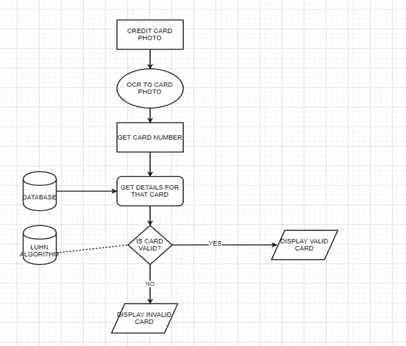

# 使用 Keras 中的 OCR 和自动编码器进行信用卡欺诈检测。

> 原文：<https://medium.com/analytics-vidhya/credit-card-fraud-detection-using-ocr-autoencoders-in-keras-fa2058e299f9?source=collection_archive---------9----------------------->

更精确的临时模型。

合著者:Tejas Shenoy

在当今世界，我们每个人都很容易受到信用卡欺诈的伤害。一天之内，全世界有数百万笔交易被执行。很有可能这个人并没有进行交易，但是他/她的账户中的信用已经完成。

有多种方法可以检测交易是否为欺诈。

在我们的项目中，我们根据事务的行为来检测事务。

银行公司和其他货币交易应用程序可以使用欺诈交易检测来通知他们的客户欺诈交易是否发生，然后可以采取严格的措施。

也可以认为是为了避免欺诈交易而采取的一种安全措施。

如果发生欺诈交易，公司可以立即通知其客户并向他们核实。

我们基本上将使用 2 种不同的模型来优化我们的输出，从而保持我们的高精度。

**我们系统的架构**。

**概要**

模块 1:

OCR-一种字体，一种专为辅助光学字符识别算法而创建的字体。然后，我们将设计一种计算机视觉和图像处理算法，它可以定位信用卡上的四组四位数字，提取这四组中的每一组，然后分别分割十六个数字中的每一个，通过使用模板匹配和 OCR- a 字体来识别十六个信用卡数字中的每一个。

所以这就是**模块 1** 的工作方式:
1。拍摄参考图像并提取数字。

2.将数字模板存储在字典中。

3.本地化四个信用卡号码组，每个组包含四个数字(总共 16 个数字)。

4.提取要“匹配”的数字。

5.对每个数字执行模板匹配，将每个 ROI 与每个数字模板 0–9 进行比较，同时存储每个尝试匹配的分数。

6.查找每个候选数字的最高分，并构建一个名为 output 的列表，其中包含信用卡号。

7.将信用卡号和信用卡类型输出到我们的终端，并在屏幕上显示输出图像和数据库细节。

8.通过与 Luhn 算法的比较，判断卡片是有效的还是无效的。

通过光学字符识别技术从数据库中检索客户详细信息。

检索卡的详细信息。

这将有助于我们了解这些卡片是否在我们的数据库中。

如果卡通过验证，我们将进入模块 2。

模块 1 的流程

**模块 2:**

首先，我们从提供数据集的数据分析网站 ka ggle([https://www.kaggle.com/mlg-ulb/creditcardfraud](https://www.kaggle.com/mlg-ulb/creditcardfraud))获得数据集。在这个数据集中，有 31 列，其中 28 列被命名为 v1-v28，以保护敏感数据。其他列代表时间、数量和类别。●时间显示第一笔交易和下一笔交易之间的时间差。

●金额是交易的金额。

●0 级代表有效交易，1 级代表欺诈交易。

检查完这个数据集后，我们为每一列绘制一个直方图。这样做是为了获得数据集的图形表示，可以用它来验证数据集中没有丢失任何值。这样做是为了确保我们不需要任何缺失值插补，并且机器学习算法可以顺利处理数据集。

在此分析之后，我们绘制一个热图，以获得数据的彩色表示，并研究我们的预测变量和类别变量之间的相关性。

**使用的算法:**

局部异常因素。

隔离森林算法。

模块 2 的流程

我们有一个非常不稳定的数据集，让我们来看看:

初步比较

欺诈交易在某段时间是否更频繁发生？

现在让我们利用时间限制来分析我们的数据集。

似乎交易时间并不重要。

现在让我们看看为什么使用自动编码器:

自动编码器**是一种人工神经网络，用于以无监督的方式学习高效的数据编码。**自动编码器**的目的是通过训练网络忽略信号“噪声”,学习一组数据的表示(编码),通常用于降维。**

自动编码器如何工作

# 重建误差

我们优化了自动编码器模型的参数，使得一种特殊的误差——重构误差最小化。

无欺诈的重建错误。

无欺诈的重建错误。

训练我们的自动编码器会和我们习惯的有点不同。假设您手头有一个包含大量非欺诈交易的数据集。您希望检测新交易中的任何异常。我们将通过仅在正常交易上训练我们的模型来创建这种情况。在测试集上保留正确的类将为我们提供一种评估模型性能的方法。

我们的自动编码器使用 4 个完全连接的层，分别具有 14、7、7 和 29 个神经元。前两层用于编码器，后两层用于解码器。

# 精确度与召回率

精确度和召回率定义如下:

最后，我们构建一个图，该图具有所有类的重构:

我们的输出是混乱矩阵的形式

我们的模型似乎抓住了很多欺诈案件。被归类为欺诈的正常交易数量确实很高。这真的是个问题吗？大概是吧。根据问题的不同，您可能希望增加或减少阈值的值。这取决于你。

**结论:**

信用卡诈骗是一种犯罪行为，也是一种失信行为。在这个项目中，我们找到了通过分析交易或检查信用卡来阻止欺诈的某些方法/途径。

在第一个模块中，我们使用 OCR 技术来找出信用卡号码，这对于真实图像来说准确性较低，但是如果图像被正确扫描，则准确性较高；从而告诉我们这张卡的独创性。

在第二个模块中，我们使用机器学习算法来分析由不同人在不同时间进行的各种交易组成的数据集。该算法达到了 99.6%的准确率，但准确率仍然很低，只有 28%。由于有效和无效交易数据集中的不平衡，我们获得了很高的准确性。

**未来范围:**

虽然我们无法实现 100%准确检测欺诈的目标，但我们最终创建了一个系统，只要有足够的时间和数据，就可以非常接近这一目标。与任何此类项目一样，这里也有一些改进的空间。

这个项目的本质允许将多种算法作为模块集成在一起，并且可以将它们的结果组合起来以提高最终结果的准确性。随着更多算法的加入，这个模型可以进一步改进。然而，这些算法的输出需要与其他算法的格式相同。

**参考文献:**

1.  非常感谢[维尼林·瓦尔科夫](https://medium.com/u/102e34a0beb1?source=post_page-----3d5d8ed29c9e----------------------)

2.Tom Fawcett(纽约州)，Foster Provost(纽约州)，“结合数据挖掘和机器学习进行有效的欺诈检测”，AAAI 技术报告 WS-97–07。

3.国际计算机与通信工程高级研究杂志。3，第 5 期，2014 年 5 月-使用 HiddenMarkov 模型检测信用卡欺诈的调查。