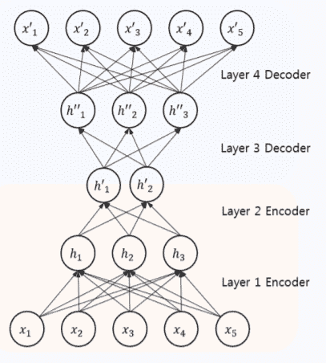
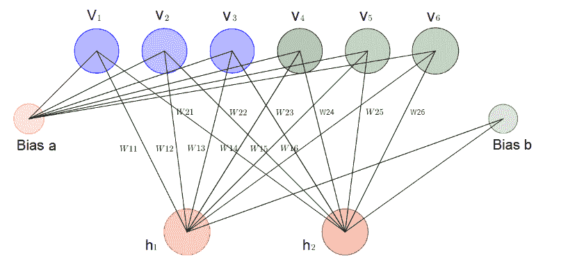
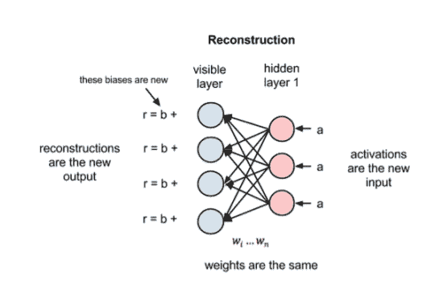

# 使用受限波尔兹曼机器检测信用卡欺诈(RBM)

> 原文：<https://medium.com/analytics-vidhya/credit-card-fraud-detection-using-restricted-boltzmann-machines-rbm-5e2c32f3c346?source=collection_archive---------4----------------------->

# 信用卡欺诈检测

2016 年，美国的信用卡欺诈(信用卡、债务等)造成了 90 亿美元的损失(由支付行业最值得信赖的全球新闻和统计来源之一[尼尔森](https://nilsonreport.com/)报道)，预计到 2020 年将增加到【2020 亿美元这一数字与 PayPal 和万事达卡的收入相当，后者在 2017 年的收入仅为 108 亿美元。依靠旧的基于规则的专家系统来捕捉欺诈，已经证明它无法检测欺诈。欺诈者了解新技术，使他们能够通过在线交易实施欺诈。欺诈者假定消费者的常规行为，并且欺诈模式变化很快。

欺诈没有固定的模式。他们总是改变自己的行为。异常检测系统使正常交易受到训练，并使用技术来确定新的欺诈行为。

【https://miro.medium.com/max/1000/0*_6WEDnZubsQfTMlY.png 

因此，我们需要使用无监督学习，因为一些欺诈者通过在线媒介实施一次欺诈，然后转向其他技术，该模型从数据而不是标签中学习。

自动编码器和 RBM 是两种使用正常交易实时检测欺诈的深度学习。然而，成果管理制的优势在于:

*   RBM 擅长处理未标记数据，并从输入中提取重要特征。
*   Autoencoder 学习捕获尽可能多的信息，而不是尽可能多的相关信息。

# 自动编码器和 RBM

## 自动编码器

自动编码器是神经网络，旨在将其输入复制到其输出。它们的工作原理是将输入压缩成一个潜在空间表示，然后从这个表示中重建输出。网络由编码器和解码器组成。自动编码器由输入层、隐藏层和输出层组成。

自动编码器的输入等于隐藏层的输出。它使用反向传播来重建误差，反向传播计算“误差信号”，然后通过网络反向传播误差，网络从输出单元开始，使用误差形成实际输出值和期望输出值之间的差的条件。

[https://thesai . org/Downloads/volume 9 no 1/Paper _ 3-Credit _ Card _ Fraud _ Detection _ Using _ Deep _ learning . pdf](https://thesai.org/Downloads/Volume9No1/Paper_3-Credit_Card_Fraud_Detection_Using_Deep_Learning.pdf)

基于自动编码器，收单银行传输输入(金额、日期和时间、互联网使用位置和其他信息)，然后自动编码器首先使用过去的行为进行训练，然后使用新的交易作为交易的验证测试。Autoencoders 不使用标记的事务进行训练，因为它是无监督的学习。

## 局部骨质量

受限玻尔兹曼机(RBM)是一种特殊类型的玻尔兹曼机，属于基于能量的模型范畴。它是一个生成随机模型，由两层可见层和隐藏层组成，它们通过对称的[二部图](https://en.wikipedia.org/wiki/Bipartite_graph)连接(二部图是一个图，其顶点可以分成两个不相交且独立的集合，使得每条边将一个顶点 in 连接到一个 in)。“受限”这个名称来自于这样一个事实，即没有层内连接，可见层中的每个节点都连接到隐藏层中的每个节点，但是同一层中没有两个节点相互连接。

[https://towards data science . com/deep-learning-meets-physics-restricted-Boltzmann-machines-part-I-6 df F5 c 4918 c 15](https://towardsdatascience.com/deep-learning-meets-physics-restricted-boltzmann-machines-part-i-6df5c4918c15)

RBMs 的设计不同于其他深度学习，因为没有输出层。如图所示，RBM 的输出将重建回输入

RBM 的重点是他们自学数据重建的方式

RBM 使用从收单银行传输的所有交易作为可见输入，然后传输到隐藏节点，在计算激活函数后，RBM 通过将新输入从激活函数传输回输出或可见函数来重建模型。

## RBM 的缺点

RBM 有一些与模型能量中的配分函数相关的缺点，这使得计算模型下的对数似然性变得困难，因此我们甚至无法跟踪我们关心的损失。相比之下，在自动编码器中，至少可以跟踪交叉熵，交叉熵是通过模型的学习算法最小化的——误差反向传播。

# RBM 的训练

RBM 模型是隐藏变量和可观察输入之间的联合分布的参数模型。为了训练模型，我们需要找到使能量最小化的参数值=(W，b，c)。

由于 RBM 是基于能量的模型，它可以通过对训练数据的负对数似然性执行随机梯度下降来学习。然而，很难解析地计算梯度，因为它涉及对输入的所有可能配置的期望，可以使用一种称为对比散度(CD) Hinton (2002)的方法来估计梯度。CD 用在有限数量的 Gibbs 采样步骤上获得的样本来代替期望(Gibbs 采样是马尔可夫链蒙特卡罗(MCMC)算法，它用于在直接采样困难时获得一系列观察值)。

为了加速采样过程，对比散度(CD)从用训练样本(来自预期接近期望的分布)初始化马尔可夫链开始，

它不会等待链收敛。仅在 k 步吉布斯采样之后获得样本。

# 其他应用

自从 RBM 在网飞竞赛中的出色表现并获奖后，它开始受到人们的欢迎。Netflix 奖是一项公开竞赛，旨在根据之前的评分，在没有任何其他用户或电影信息的情况下，预测用户对电影的评分的最佳协作过滤算法。RBMs 的表现优于精心调整的 SVD 模型，其错误率比网飞自己的系统高出 6%以上。

RBM 在降维、特征提取、协同过滤、分类和主题建模方面有很多应用。此外，他们可以根据任务接受有监督或无监督的技术培训。

# 参考

1.  单位 Fiore 等人，使用受限玻尔兹曼机器进行网络异常检测，神经计算(2013)，[http://dx.doi.org/10.1016/j.neucom.2012.11.050i](http://dx.doi.org/10.1016/j.neucom.2012.11.050i)
2.  http://deeplearning.net/tutorial/rbm.html#equation-energy2
3.  [https://towards data science . com/deep-learning-meets-physics-restricted-Boltzmann-machines-part-I-6 df F5 c 4918 c 15](https://towardsdatascience.com/deep-learning-meets-physics-restricted-boltzmann-machines-part-i-6df5c4918c15)
4.  [https://www.cs.toronto.edu/~rsalakhu/papers/rbmcf.pdf](https://www.cs.toronto.edu/~rsalakhu/papers/rbmcf.pdf)
5.  [https://medium . com/datadriveninvestor/deep-learning-restricted-Boltzmann-machine-b 76241 af 7a 92](/datadriveninvestor/deep-learning-restricted-boltzmann-machine-b76241af7a92)
6.  [https://en.wikipedia.org/wiki/Restricted_Boltzmann_machine](https://en.wikipedia.org/wiki/Restricted_Boltzmann_machine)
7.  [https://www.youtube.com/watch?v=FsAvo0E5Pmw](https://www.youtube.com/watch?v=FsAvo0E5Pmw)
8.  阿帕潘·普姆西里拉特和柳岩，“利用基于自动编码器和受限玻尔兹曼机器的深度学习进行信用卡欺诈检测”，国际高级计算机科学与应用杂志(IJACSA)，9(1)，2018 年。http://dx.doi.org/10.14569/IJACSA.2018.090103
9.  [https://www . data science . com/blog/fraud-detection-with-tensor flow](https://www.datascience.com/blog/fraud-detection-with-tensorflow)