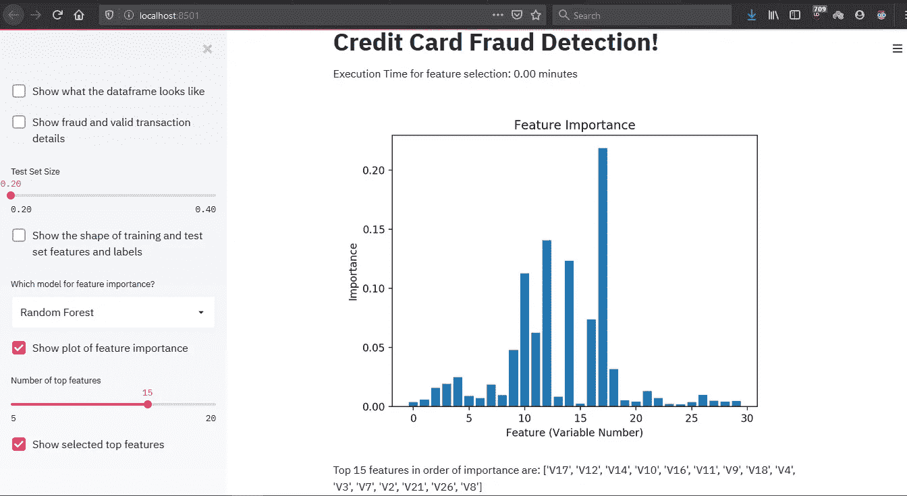
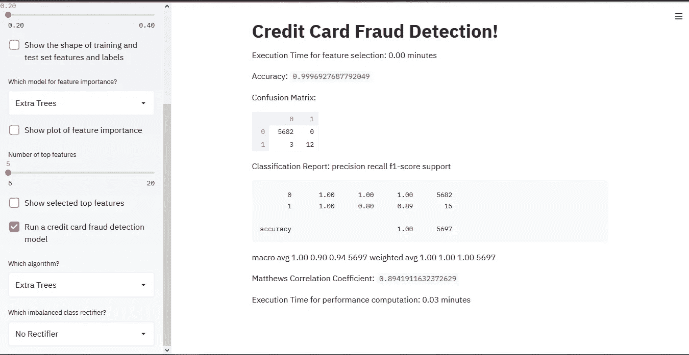

# 使用 Streamlit 的信用卡欺诈检测 Web 应用程序

> 原文：<https://medium.com/analytics-vidhya/credit-card-fraud-detection-web-app-using-streamlit-d653b63909c1?source=collection_archive---------6----------------------->

零 web 开发经验，构建漂亮的交互式 web 应用程序！


对于数据分析师来说，可视化和展示他们努力工作的 ML 项目至少和他们项目的分析部分一样重要。长期以来，分析师们对此一直有一种不足的感觉，但现在不是了！

Streamlit 是一个开源的 Python 库，可以很容易地为机器学习和数据科学构建漂亮的定制 web 应用。它让您的应用程序在您编辑和保存文件时实时更新。您所需要的只是您最喜欢的编辑器(我更喜欢包含在 Anaconda 中的 Spyder。访问 https://www.spyder-ide.org/来看看这个神奇的编辑器)和一个浏览器。

我们将从头构建一个欺诈检测模型，并查看使用 streamlit 部署该模型的步骤。

**注意:** **如果你想查看代码，你可以使用下面的链接直接跳转到它:**

[](https://github.com/jatinkataria94/Creditcard-Fraud-Detection) [## jatinkataria 94/信用卡欺诈检测

### 通过在 GitHub 上创建一个帐户，为 jatinkataria 94/信用卡欺诈检测开发做出贡献。

github.com](https://github.com/jatinkataria94/Creditcard-Fraud-Detection) 

# **先决条件**

在我们继续下一步之前，必须安装几个包(比如 numpy、pandas、sklearn、matplotlib 等)。您必须安装包含大部分软件包的 Anaconda 发行版。你可以阅读这篇文章来获得安装 Anaconda 的指南。

**Streamlit** 和 **imblearn** 需要按照以下步骤分别安装:

*   确保你已经安装了 [Python 3.6](https://www.python.org/downloads/) 或更高版本。
*   在命令提示符或 Anaconda 提示符下使用 [PIP](https://pip.pypa.io/en/stable/installing/) 命令安装 Streamlit 和 imblearn:

```
$ pip install streamlit$ pip install imblearn
```

事不宜迟，让我们构建我们的第一个欺诈检测 web 应用程序！

# **导入包**

```
# import the necessary packages
import numpy as np
import pandas as pd
import matplotlib.pyplot as plt
import timeit
import warnings
warnings.filterwarnings("ignore")
import streamlit as st
```

您需要为您的 web 应用程序指定一个标题，这可以使用以下命令来完成:

```
st.title('Credit Card Fraud Detection!')
```

streamlit 最棒的一点是，你可以运行 streamlit 应用程序，它会在你编辑和保存文件时实时更新。

在终端上( **Anaconda 提示**)将目录更改为。使用 **cd 命令**保存 py 文件


在 anaconda 提示符终端中编写下面的命令( **streamlit run filename.py** )。py 文件将会运行，浏览器中将会为该 python 脚本的 web 应用程序打开一个新选项卡。(使用 **ctrl+C** 结束终端会话)


这是您的 web 应用程序在浏览器中的打开方式。您应该能够在您的浏览器 localhost:8501 中看到一个简单的应用程序

# **加载数据**

你必须首先从 Kaggle 网站下载数据，然后用 pandas 加载。

每当一个值改变时，我们就一遍又一遍地读取熊猫数据帧。虽然它适用于我们拥有的小数据，但它不适用于大数据，或者当我们必须对数据进行大量处理时。让我们使用 streamlit 中的 **st.cache** decorator 函数来使用缓存，如下所示。

```
# Load the dataset from the csv file using pandas
df=st.cache(pd.read_csv)('creditcard.csv')
df = df.sample(frac=0.1, random_state = 48)
```

**注意:**我们使用 **df.sample()** 只使用了一小部分数据，因为它是一个巨大的数据集。一旦你的模型工作了，你可以把这条线静音，使用整个大数据集。

# **查看数据**

**st.checkbox()** 用于显示/隐藏应用中的特定部分。它接受一个参数，即小部件标签。在这个应用程序中，复选框用于切换条件语句。 **st.write()** 相当于 **print()** 命令。它可以写图表、数据帧和简单的文本。为了根据您的偏好获得更整洁的外观，您可能希望将您的小部件移动到侧边栏中。这很简单。只需在小部件的命令中添加 **st.sidebar** 。

```
# Print shape and description of the data
if st.sidebar.checkbox('Show what the dataframe looks like'):
    st.write(df.head(100))
    st.write('Shape of the dataframe: ',df.shape)
    st.write('Data decription: \n',df.describe())# Print valid and fraud transactions
fraud=df[df.Class==1]
valid=df[df.Class==0]
outlier_percentage=(df.Class.value_counts()[1]/df.Class.value_counts()[0])*100if st.sidebar.checkbox('Show fraud and valid transaction details'):
    st.write('Fraudulent transactions are: %.3f%%'%outlier_percentage)
    st.write('Fraud Cases: ',len(fraud))
    st.write('Valid Cases: ',len(valid))
```

当您编辑 pyhton 脚本并保存编辑后的文件时，更改会自动反映在 web 应用程序中。它显示源文件已被更改，并为您提供重新运行 web 应用程序的选项。


当您按下重新运行按钮，它再次运行脚本，然后您可以看到更新的 web 应用程序


我们可以看到，欺诈性交易在数据集中的比例相当低。因此，数据是高度不平衡的，我们可能不得不使用 SMOTE 和 Near Miss 等类别不平衡整流器。(参考本文-[https://medium . com/@ saeedAR/smote-and-near-miss-in-python-machine-learning-in-unbalanced-datasets-b 7976d 9 a 7 a 79](/@saeedAR/smote-and-near-miss-in-python-machine-learning-in-imbalanced-datasets-b7976d9a7a79))

# **训练和测试数据拆分**

**st.slider()** widget 可以滑动改变 web app 的输出。

```
#Obtaining X (features) and y (labels)
X=df.drop(['Class'], axis=1)
y=df.Class#Split the data into training and testing sets
from sklearn.model_selection import train_test_split
size = st.sidebar.slider('Test Set Size', min_value=0.2, max_value=0.4)
X_train, X_test, y_train, y_test = train_test_split(X, y, test_size = size, random_state = 42)#Print shape of train and test sets
if st.sidebar.checkbox('Show the shape of training and test set features and labels'):
    st.write('X_train: ',X_train.shape)
    st.write('y_train: ',y_train.shape)
    st.write('X_test: ',X_test.shape)
    st.write('y_test: ',y_test.shape)
```


# **建立模型**

```
#Import classification models and metrics
from sklearn.linear_model import LogisticRegression
from sklearn.neighbors import KNeighborsClassifier
from sklearn.svm import SVC
from sklearn.ensemble import RandomForestClassifier,ExtraTreesClassifier
from sklearn.model_selection import cross_val_scorelogreg=LogisticRegression()
svm=SVC()
knn=KNeighborsClassifier()
etree=ExtraTreesClassifier(random_state=42)
rforest=RandomForestClassifier(random_state=42)
```

**功能选择**

我们将使用特征重要性方法来选择顶级特征来训练我们的模型。

对于只需要运行一次的复杂且耗时的函数，我们用 streamlit 的 cache decorator **@st.cache** 来标记函数，无论何时调用函数，Streamlit 都会检查调用函数时使用的输入参数。如果这是 streamlit 第一次看到这些参数，它将运行该函数并将结果存储在本地缓存中。下次调用该函数时，如果这些参数没有改变，streamlit 知道它可以完全跳过执行该函数。它只是使用缓存中的结果。

我们可以使用 **st.selectbox()** 从一个系列或者一个列表中进行选择。通常情况下，用例是将其用作简单的下拉菜单，从列表中选择值。我们还可以使用 **st.pyplot()** 来显示一个 matplotlib 图形。

```
#Feature selection through feature importance
@st.cache
def feature_sort(model,X_train,y_train):
    #feature selection
    mod=model
    # fit the model
    mod.fit(X_train, y_train)
    # get importance
    imp = mod.feature_importances_
    return imp#Classifiers for feature importance
clf=['Extra Trees','Random Forest']
mod_feature = st.sidebar.selectbox('Which model for feature importance?', clf)start_time = timeit.default_timer()
if mod_feature=='Extra Trees':
    model=etree
    importance=feature_sort(model,X_train,y_train)
elif mod_feature=='Random Forest':
    model=rforest
    importance=feature_sort(model,X_train,y_train)
elapsed = timeit.default_timer() - start_time
st.write('Execution Time for feature selection: %.2f minutes'%(elapsed/60))#Plot of feature importance
if st.sidebar.checkbox('Show plot of feature importance'):
    plt.bar([x for x in range(len(importance))], importance)
    plt.title('Feature Importance')
    plt.xlabel('Feature (Variable Number)')
    plt.ylabel('Importance')
    st.pyplot()
```



# **模特训练和表演**

我们将使用不同的分类模型和不平衡分类整流器来训练我们的模型。我们将计算模型评估的**准确度、精确度、召回率、F1 分数和马修斯相关系数**。由于我们的数据高度不平衡，准确性可能会误导，因此我们将计算其他提到的性能指标。

我们的目标是建立一个召回率高的模型，因为这意味着它对欺诈检测很敏感。这并不意味着它应该有一个非常低的精度，因为这将导致大量的垃圾邮件，因为许多有效的交易被错误地分类为欺诈。因此，该模型应该在某种程度上是平衡的，为此，我们看 F1 分数和马修斯相关系数。

```
#Import performance metrics, imbalanced rectifiers
from sklearn.metrics import  confusion_matrix,classification_report,matthews_corrcoef
from imblearn.over_sampling import SMOTE
from imblearn.under_sampling import NearMiss
np.random.seed(42) #for reproducibility since SMOTE and Near Miss use randomizationssmt = SMOTE()
nr = NearMiss()def compute_performance(model, X_train, y_train,X_test,y_test):
    start_time = timeit.default_timer()
    scores = cross_val_score(model, X_train, y_train, cv=3, scoring='accuracy').mean()
    'Accuracy: ',scores
    model.fit(X_train,y_train)
    y_pred = model.predict(X_test)
    cm=confusion_matrix(y_test,y_pred)
    'Confusion Matrix: ',cm  
    cr=classification_report(y_test, y_pred)
    'Classification Report: ',cr
    mcc= matthews_corrcoef(y_test, y_pred)
    'Matthews Correlation Coefficient: ',mcc
    elapsed = timeit.default_timer() - start_time
    'Execution Time for performance computation: %.2f minutes'%(elapsed/60)#Run different classification models with rectifiers
if st.sidebar.checkbox('Run a credit card fraud detection model'):

    alg=['Extra Trees','Random Forest','k Nearest Neighbor','Support Vector Machine','Logistic Regression']
    classifier = st.sidebar.selectbox('Which algorithm?', alg)
    rectifier=['SMOTE','Near Miss','No Rectifier']
    imb_rect = st.sidebar.selectbox('Which imbalanced class rectifier?', rectifier) 

    if classifier == 'Extra Trees':
        model=etree
        if imb_rect=='No Rectifier':
            compute_performance(model, X_train_sfs_scaled, y_train,X_test_sfs_scaled,y_test)
```



我们可以在运行整流器的同时运行不同的算法，改变所用特性的数量，然后根据性能指标和计算成本(由执行时间决定)选择最佳组合。

请随意使用 streamlit 构建您自己的 web 应用程序。有关更多信息，请查看 streamlit([https://docs.streamlit.io/en/stable/#](https://docs.streamlit.io/en/stable/#))的文档。如果你对这个话题有任何困难或疑问，请在下面评论。非常感谢你的支持，这将激励我写更多的文章。